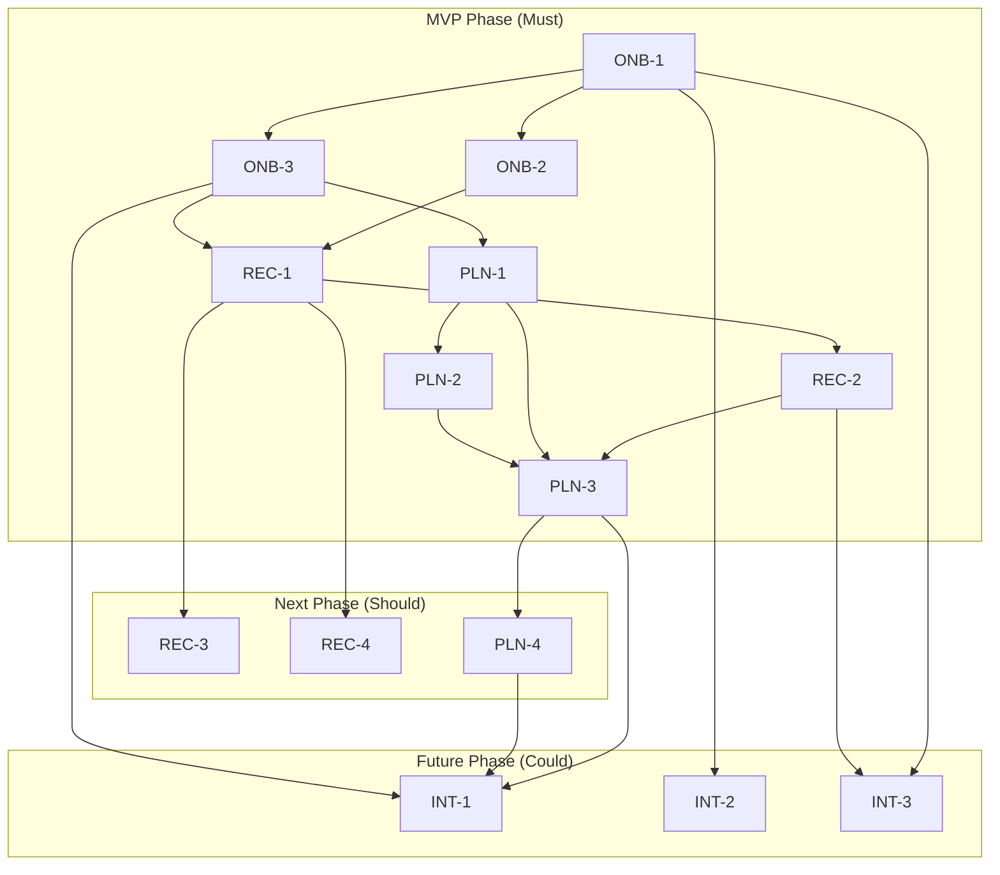

# Release Plan — smartFit_daily

- **ประเภทเอกสาร:** Release Plan — Phase/Milestone Breakdown
- **สถานะเอกสาร:** Draft
- **วันที่สร้าง:** 2026-08-28
- **สร้างโดย:** skill `plan-task-builder`
- **อ้างอิงจาก:** [Product Backlog](../backlog.md), [Requirement ทั้ง 4 epic + NFR](../01-spec/index.md),
  [User Journeys](../../02-design/01-prototypes/user-journeys.md),
  [High Level Architecture](../../02-design/02-technical/high-level-architecture.md)

## 1. ขอบเขตและหลักการ (Scope & Principles)

เอกสารนี้แบ่ง Product Backlog (13 Feature ID ในทั้ง 4 Epic) เป็น phase/release โดยใช้กลยุทธ์ **Hybrid
MoSCoW + Dependency-aware** (ยืนยันจากผู้ใช้ 2026-08-28): ใช้ MoSCoW priority (`backlog.md`) เป็นโครงหลัก
ในการแบ่ง phase (Must → Should → Could) แต่ตรวจสอบก่อนว่ามี feature ระดับ Must ตัวใดต้องพึ่งพา feature
ระดับ Should/Could จริงหรือไม่ (ถ้ามี ต้องดึง feature นั้นขึ้นมาข้าม phase) — **ตรวจสอบแล้วว่าไม่มีกรณีนี้
เกิดขึ้นเลยในโปรเจกต์นี้** (ดูหัวข้อ 4) ผลลัพธ์คือ MoSCoW ล้วนๆ ให้ผลการแบ่ง phase เดียวกับ hybrid พอดี

Dependency ทุกจุดที่อ้างในเอกสารนี้ **ต้อง trace กลับไปยังกติกาธุรกิจใน `01-spec/*.md` หรือความสัมพันธ์
"คุยกับ" ระหว่าง Conceptual Component ใน [high-level-architecture.md](../../02-design/02-technical/high-level-architecture.md)
§3 เท่านั้น** — ไม่มีการเดา dependency เอง

**เอกสารนี้ไม่มีตัวเลขเวลา/estimate ใดๆ** (ยืนยันจากผู้ใช้ 2026-08-28) เพราะโปรเจกต์นี้ยังไม่มีทีมพัฒนาจริง
หรือข้อมูล velocity ให้อ้างอิง — ใช้การ**เรียงลำดับ (sequencing)** ระหว่าง phase และภายใน phase เท่านั้น
ถ้าในอนาคตมีข้อมูล timeline จริง ให้เพิ่มเป็นส่วนเสริมตอน re-run ไม่ใช่แต่งขึ้นตอนนี้

## 2. ภาพรวม Phase/Release

| Phase | Feature ID | เป้าหมาย (Objective) | เหตุผลการจัดกลุ่ม |
|---|---|---|---|
| **MVP Phase** | ONB-1, ONB-2, ONB-3, REC-1, REC-2, PLN-1, PLN-2, PLN-3 | Core loop รายวันใช้งานได้ครบวงจร: onboarding คำนวณเป้าหมายแคลอรี่ → แนะนำ/บันทึกการออกกำลังกาย → วางแผนรายสัปดาห์ + Cheat/Rest Day → บันทึกผล all-or-nothing | ทุก feature เป็น MoSCoW = Must — ไม่มี feature ใดใน phase นี้ต้องพึ่งพา Should/Could |
| **Next Phase** | REC-3, REC-4, PLN-4 | เพิ่ม streak tracking และ UX เสริมของการแนะนำวิดีโอ ต่อยอดจาก core loop ที่ทำงานแล้วใน MVP Phase | MoSCoW = Should ทั้งหมด — ทุกตัวพึ่งพา component เดียวกับ feature ใน MVP Phase (ดูหัวข้อ 4) |
| **Future Phase** | INT-1, INT-2, INT-3 | การเชื่อมต่ออุปกรณ์ภายนอก (ตาชั่งอัจฉริยะ, wearable) และพยากรณ์วันถึงเป้าหมายน้ำหนัก | MoSCoW = Could ทั้งหมด — เป็น optional ตาม NFR-07 (core loop ต้องไม่ผูกกับความพร้อมของ Epic นี้) |

## 3. รายละเอียดต่อ Phase

### 3.1 MVP Phase

- **Objective**: ผู้ใช้ทำ onboarding ได้ครบ (TDEE, อุปกรณ์, เป้าหมายแคลอรี่) → เห็นวิดีโอแนะนำตรงเป้าแคลอรี่
  รายวัน → ออกกำลังกายแล้วระบบคำนวณแคลอรี่เผาผลาญจริง → วางแผนรายสัปดาห์/ตั้ง Cheat-Rest Day ได้ → บันทึกผล
  รายวันแบบ all-or-nothing ได้ถูกต้อง
- **Feature ID**: ONB-1 (REQ-01), ONB-2 (REQ-03), ONB-3 (REQ-02), REC-1 (REQ-04), REC-2 (REQ-05),
  PLN-1 (REQ-08), PLN-2 (REQ-09), PLN-3 (REQ-10) — ทั้งหมด MoSCoW = Must
- **Dependency Notes** (แหล่งที่มา: HLA §3 "คุยกับ" + กติกาธุรกิจใน `01-spec/`):
  - ONB-1 (TDEE) → ONB-3 ("อ่านค่า TDEE ปัจจุบันจาก user_profile" ตาม algorithm ของ ONB-3 ใน
    [detailed-design/onboarding-personalization.md](../../02-design/02-technical/detailed-design/onboarding-personalization.md))
    และ → REC-1/REC-2 (HLA §3.1 "Personalization & Profile คุยกับ Content Recommendation: ส่งโปรไฟล์
    อุปกรณ์ + เป้าหมายแคลอรี่รายวัน" และ "คุยกับ Exertion & Calorie Calculation: ส่งน้ำหนักตัว")
  - ONB-2 (อุปกรณ์) → REC-1 (HLA §3.1 เดียวกัน — ส่งโปรไฟล์อุปกรณ์เป็น filter)
  - REC-1 → REC-2 (HLA §3.3 "Exertion & Calorie Calculation คุยกับ Content Recommendation: อ่าน
    metadata วิดีโอ + เวลาที่ใช้จริง")
  - ONB-3, PLN-1, PLN-2 → PLN-3 (HLA §3.5 "Logging & Streak คุยกับ Exertion & Calorie Calculation:
    อ่านแคลอรี่ที่เผาผลาญจริง, Personalization & Profile: อ่านเป้าหมายแคลอรี่รายวัน, Planner &
    Day-Status: อ่าน/รับสถานะครบเป้าหมายที่บังคับจาก Cheat/Rest Day")
- **Entry Criteria**: Requirement/Backlog/User Journey ของ ONB-1/2/3, REC-1/2, PLN-1/2/3 ผ่านการ audit
  ของ `feature-list-journey` แล้วไม่มี contradiction ค้างอยู่ (ตรวจแล้วในตอนเขียนแผนนี้ — ไม่พบ) —
  [acceptance-criteria.md](../acceptance-criteria.md) ของทั้ง 8 Feature ID ต้องมีอยู่แล้ว (มีอยู่แล้ว)
- **Exit Criteria**: mirror จาก [test-plan.md §5](../../03-testing/01-test-plan/test-plan.md) ข้อ 1 —
  test case ของทุก Feature ID ระดับ Must ถูก execute ครบและไม่มี defect ระดับ Critical/High ค้างอยู่โดยไม่
  มีแผนแก้ไข

### 3.2 Next Phase

- **Objective**: เพิ่มความสามารถเปลี่ยนวิดีโอ (คงเป้าหมายเดิม), วอร์มอัพ-คูลดาวน์อัตโนมัติสำหรับวิดีโอความ
  เข้มข้นสูง, และแสดง streak ต่อเนื่องเพื่อสร้างแรงจูงใจ
- **Feature ID**: REC-3 (REQ-06), REC-4 (REQ-07), PLN-4 (REQ-09, REQ-10) — ทั้งหมด MoSCoW = Should
- **Dependency Notes**:
  - REC-3, REC-4 → REC-1 (MVP Phase) — ทั้งคู่อยู่ component เดียวกัน "Content Recommendation" ตาม HLA
    §3.2 ("รับผิดชอบ: REC-1, REC-3, REC-4") จึงต้องมี REC-1 ทำงานอยู่ก่อน
  - PLN-4 → PLN-3 (MVP Phase) — HLA §3.5 "Logging & Streak" รับผิดชอบทั้ง PLN-3 และ PLN-4 โดย PLN-4's
    algorithm (ดู [detailed-design/planner-logging.md](../../02-design/02-technical/detailed-design/planner-logging.md))
    ไล่ประวัติ `daily_log` ที่ PLN-3 เป็นผู้สร้างย้อนหลัง
- **Entry Criteria**: MVP Phase ผ่าน Exit Criteria แล้ว
- **Exit Criteria**: mirror จาก [test-plan.md §5](../../03-testing/01-test-plan/test-plan.md) ข้อ 2 —
  test case ของ REC-3/REC-4/PLN-4 ถูก execute ครบ (defect ที่ไม่ใช่ Critical/High ไม่ block การ exit)

### 3.3 Future Phase

- **Objective**: ซิงค์น้ำหนักจากตาชั่งอัจฉริยะและข้อมูลจาก wearable เข้าโปรไฟล์ พร้อมพยากรณ์วันที่คาดว่าจะ
  ถึงเป้าหมายน้ำหนัก — ทั้งหมดเป็น optional ไม่ผูกกับ core loop รายวัน (NFR-07)
- **Feature ID**: INT-1 (REQ-11), INT-2 (REQ-12), INT-3 (REQ-13) — ทั้งหมด MoSCoW = Could
- **Dependency Notes**:
  - INT-1 → PLN-3, PLN-4 (MVP Phase/Next Phase — HLA §3.6 "Insights & Forecast คุยกับ Logging &
    Streak: อ่านประวัติ log") และ → ONB-3 (MVP Phase — "Personalization & Profile: อ่านน้ำหนักเป้าหมาย")
  - INT-2, INT-3 → ONB-1 (MVP Phase — HLA §3.7 "Integration Gateway คุยกับ Personalization & Profile:
    เขียนน้ำหนัก/องค์ประกอบร่างกายที่ซิงค์มา" เพื่อคำนวณ TDEE ใหม่) และ INT-3 → REC-2 (MVP Phase —
    "คุยกับ Exertion & Calorie Calculation: เขียนค่าแทนที่จาก wearable")
- **Entry Criteria**: MVP Phase และ Next Phase ผ่าน Exit Criteria แล้ว — พฤติกรรม fallback ของ NFR-07 (core loop
  ทำงานได้แม้ไม่มี Epic 4) ต้องยืนยันแล้วว่าใช้งานได้จริง
- **Exit Criteria**: mirror จาก [test-plan.md §5](../../03-testing/01-test-plan/test-plan.md) ข้อ 3 —
  ปัจจุบัน Epic 4 อยู่นอกขอบเขตการ execute ของรอบทดสอบปัจจุบัน (test case เตรียมไว้ล่วงหน้าแล้ว) — Exit
  Criteria ของ phase นี้จะเกิดขึ้นเมื่อทีมตัดสินใจหยิบ Epic 4 ขึ้นมา implement จริง

## 4. Dependency Map

ไม่มีลูกศรใดพุ่งจาก Next Phase/Future Phase ย้อนกลับเข้า MVP Phase — ยืนยันว่าไม่มี Must feature ตัวใด
พึ่งพา Should/Could จริง (ตามที่ตรวจสอบในหัวข้อ 1)

## 5. จุดที่ยังไม่ได้ระบุ / ควรยืนยันเพิ่มเติม

- **Timeline จริง**: เอกสารนี้จงใจไม่มีตัวเลขเวลา/estimate (ดูหัวข้อ 1) — เมื่อมีทีมพัฒนาจริงและข้อมูล
  velocity ควรกลับมาเพิ่มเป็นส่วนเสริม
- **ลำดับภายใน MVP Phase**: dependency ที่ระบุในหัวข้อ 4 แสดงทิศทางความสัมพันธ์ (ใครต้องมาก่อนใคร) แต่ไม่ได้
  ฟันธงว่าต้องพัฒนาทีละ feature เรียงตามนี้เป๊ะๆ — ทีมพัฒนาจริงอาจขนาน (parallelize) งานบางส่วนได้ตาม
  ทรัพยากรที่มี
- **จุดที่ยังไม่ได้ระบุเดิมของ conceptual docs** (REC-1 tolerance, REC-4 warmup/cooldown นับ target หรือไม่,
  INT-1 min log days, INT-2/INT-3 conflict resolution ฯลฯ) ยังไม่ resolve — ไม่กระทบการแบ่ง phase/task
  ระดับนี้ แต่กระทบรายละเอียดการ implement จริงเมื่อถึง phase นั้น

## 6. ความสัมพันธ์กับเอกสารอื่น

- [Product Backlog](../backlog.md) — แหล่งที่มาของ Feature ID/MoSCoW/REQ ที่ใช้แบ่ง phase ทั้งหมด
- [Requirement 4 epic + NFR](../01-spec/index.md) — แหล่งที่มาของกติกาธุรกิจที่ใช้อ้างเป็น dependency
- [User Journeys](../../02-design/01-prototypes/user-journeys.md) — ยืนยันลำดับ step ของแต่ละ feature
- [High Level Architecture](../../02-design/02-technical/high-level-architecture.md) §3 — แหล่งที่มาหลัก
  ของความสัมพันธ์ "คุยกับ" ระหว่าง component ที่ใช้ derive dependency ในหัวข้อ 3/4
- [Test Plan](../../03-testing/01-test-plan/test-plan.md) — แหล่งที่มาของรูปแบบ Entry/Exit Criteria ที่
  mirror มาใช้ต่อ phase
- Task Breakdown ต่อ phase: [phase-1-mvp-core-loop.md](../03-task/phase-1-mvp-core-loop.md),
  [phase-2-motivation-recommendation-ux.md](../03-task/phase-2-motivation-recommendation-ux.md),
  [phase-3-smart-integrations.md](../03-task/phase-3-smart-integrations.md)
