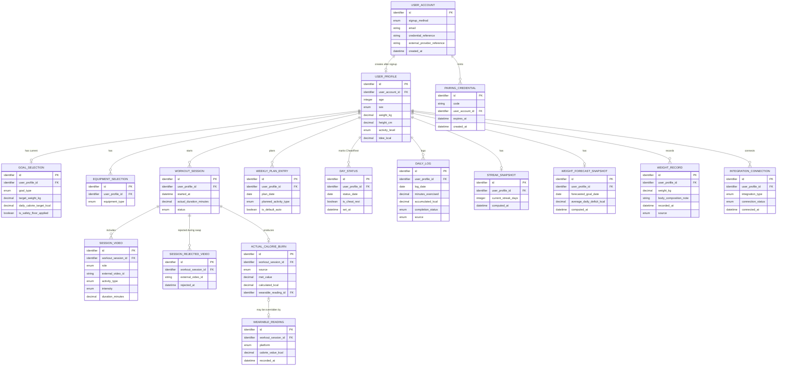

# Database Schema (Conceptual / Logical Data Model) — smartFit_daily

- **ประเภทเอกสาร:** Database Schema — Conceptual/Logical Data Model (ไม่ผูก DBMS จริง)
- **สถานะเอกสาร:** Draft
- **วันที่สร้าง:** 2026-08-28
- **อัปเดตล่าสุด:** 2026-08-31 (รอบ 7) — เพิ่ม bullet ใหม่ในหัวข้อ 5 (Query/Access Pattern
  Considerations) ยืนยัน `weight_record` ค้นหาตาม `user_profile_id` + ช่วง `recorded_at` เป็น pattern
  ที่ INT-1 ใช้จริง — คู่กับ operation ใหม่ `GET /insights/weight-records` ที่เพิ่งเพิ่มใน `api-spec.md`
  § 3.7 (ไม่มีทางอ่านประวัติ `weight_record` กลับมาได้เลยมาก่อน) — **ไม่แตะตาราง `weight_record` เอง**
  (หัวข้อ 3.14) เพราะ column ที่มีอยู่ครบพอสำหรับ operation นี้แล้ว ไม่ใช่การ re-model ตาราง — ดู [log
  2026-08-31](../../05-log/20260831-log.md)
- **อัปเดตก่อนหน้า:** 2026-08-30 (รอบ 6) — Citation-only fix: `feature-journey-writer` formalize กลไก
  pairing-code เป็น Feature ID **INT-0** พร้อม business rule **REQ-18** ใหม่ (ดู `backlog.md` § INT-0
  และ `20260823-04-smart-integrations.md` § REQ-18) แทนที่การอ้างว่าเป็น "precondition ทางเทคนิค
  implicit ของ INT-2/INT-3 (REQ-12/REQ-13)" เดิม — แก้บรรทัด Feature ของตาราง `pairing_credential`
  (หัวข้อ 3.17) จาก "INT-2, INT-3 (implicit...)" เป็น "INT-0/REQ-18" และ resolve จุดที่ยังไม่ได้ระบุข้อ 9
  ในหัวข้อ 6 (เดิมบอกว่า "ยังไม่มี REQ number formal") ว่า resolve แล้ว — ไม่แตะ column/relationship/
  constraint อื่นใดของตารางนี้ (no re-modeling) — ไม่พบ citation อื่นต่อ REQ-12/REQ-13 ที่ต้องแก้ใน
  เอกสารนี้ (`integration_connection` หัวข้อ 3.16 ยังคงอ้าง INT-2/INT-3-REQ-12/REQ-13 ถูกต้องอยู่แล้ว
  เพราะเป็นตารางคนละเรื่อง — consent/connection state ไม่ใช่ pairing-code) (ดู [log
  2026-08-30](../../05-log/20260830-log.md))
- **อัปเดตก่อนหน้า:** 2026-08-30 (รอบ 5) — Reconcile ตาม `tech-stack.md`/โค้ดจริง (`apps/web/server/routes/pairing/index.ts`
  ที่ `tech-stack-writer` อ่านตรงยืนยันแล้ว): (1) แก้ตาราง `pairing_credential` (หัวข้อ 3.17) — **ลบ column
  `is_used` boolean ออก** เพราะ implementation จริงบังคับ single-use ด้วยการ**ลบ document ทิ้งทันทีหลัง
  redeem สำเร็จ (delete-on-redeem)** แทนการตั้ง flag ที่ยังคงเก็บแถวไว้ ปรับ ER Diagram (หัวข้อ 2) และกติกา
  ธุรกิจข้อ 8 ในหัวข้อ 4 ให้ตรงกันแล้ว — นี่คือการแก้เอกสารให้ตรงกับพฤติกรรมที่ shipped ไปแล้วจริง ไม่ใช่การ
  ตัดสินใจ business rule ใหม่ (`expires_at`/field อื่นยังคงชื่อเดิม — เอกสารนี้เป็น logical model ใช้
  snake_case ตามธรรมเนียมของทุกตารางในไฟล์นี้อยู่แล้ว ไม่ใช่ camelCase ของ Firestore จริงที่อยู่ในภาคผนวก
  หัวข้อ 8 เท่านั้น) (2) mechanical re-sync หัวข้อ 8 (ภาคผนวก: Stack Mapping) ทั้งหมดให้ตรงกับ `tech-stack.md`
  §6.1/§6.2/§6.3 ฉบับล่าสุด (Express.js บน Google Cloud Run แทนที่ Firebase Cloud Functions เดิม, เพิ่มแถว
  `pairing_credential` ใน §8.2/§8.3 ที่ยังไม่มีมาก่อน) — audit หัวข้อ 1, 3.1-3.16, 5-7 แล้วไม่พบ drift อื่น
  (ดู [log 2026-08-30](../../05-log/20260830-log.md))
- **อัปเดตก่อนหน้า:** 2026-08-30 (รอบ 4) — audit พบว่า `high-level-architecture.md` เพิ่งเพิ่มกลไกใหม่
  **Identity Handoff — Pairing-Code Mechanism** (§4.5, component interaction ระหว่าง Account & Session
  Management ↔ Integration Gateway) พร้อม conceptual data entity ใหม่ **Pairing Credential** (§5) — เพิ่ม
  ตาราง **`pairing_credential`** (หัวข้อ 3.17 ใหม่ท้ายตาราง — ตรงกับตำแหน่งสุดท้ายของ entity นี้ใน HLA §5)
  พร้อม entity/relationship ใหม่ในหัวข้อ 2 (ER Diagram: `USER_ACCOUNT ||--o{ PAIRING_CREDENTIAL`), เพิ่ม
  กติกา business rule ใหม่ 2 ข้อในหัวข้อ 4 (single-use + short-lived enforcement ที่เจ้าของคือ Account &
  Session Management, และหมายเหตุว่าตารางนี้**ไม่ได้อยู่ใต้ per-user isolation path เหมือนตารางอื่นทั้งหมด**
  — query หลักคือค้นด้วย `code` ไม่ใช่ `user_profile_id`/`user_account_id` จนกว่าจะ redeem สำเร็จ ตรงกับที่
  `api-spec.md` §2 ประกาศให้ `POST /auth/pairing-codes/redeem` เป็น operation เดียวที่ไม่ต้องยืนยันตัวตน
  ก่อนเรียก — เป็นข้อเท็จจริงเชิงออกแบบที่ตั้งใจ ไม่ใช่ช่องโหว่), เพิ่มหมายเหตุเดียวกันในหัวข้อ 5
  (Query/Access Pattern), และเพิ่มจุดที่ยังไม่ได้ระบุใหม่ 3 ข้อในหัวข้อ 6 (ดูข้อ 9-11) — **ไม่แตะหัวข้อ 8
  (ภาคผนวก: Stack Mapping)** ตามที่ผู้ใช้ยืนยันชัดเจนว่า `tech-stack.md` ยังไม่ reconcile จาก
  Firebase/Firestore เดิมมาเป็น stack จริงตามโค้ด (Express + web-first) — ตาราง `pairing_credential` ใหม่
  จึงยังไม่มี mapping ใน §8.1/§8.2/§8.3 เลย รอรวมกับงาน reconcile อื่นทั้งหมดในรอบ `tech-stack-builder`
  ถัดไป — audit หัวข้อ 1, 3.1-3.16, 7 แล้วไม่พบ drift อื่น (ดู
  [log 2026-08-30](../../05-log/20260830-log.md))
- **อัปเดตก่อนหน้า:** 2026-08-29 (รอบ 3) — sync หัวข้อ 8.2 (ภาคผนวก: Stack Mapping — แถว `user_account`) ให้
  ตรงกับ `tech-stack.md` §6.1 ฉบับสมบูรณ์ (mechanical re-sync ล้วน ไม่ใช่การตัดสินใจใหม่ — ไม่แตะเนื้อหาหลัก
  หัวข้อ 1-7): resolve ⚠️ placeholder เดิมของรอบ 2 — `user_account` ไม่ต้องมี Firestore document แยก
  เพราะ field ทั้งหมด map ตรงกับ Firebase Auth's `UserRecord` เองครบถ้วน
- **อัปเดตก่อนหน้า:** 2026-08-29 (รอบ 2) — audit พบว่า `high-level-architecture.md` เพิ่ง add Conceptual
  Component ใหม่ "Account & Session Management" (§3.1) ครอบคลุม ONB-0 (REQ-14–17) พร้อม entity ใหม่
  **User Account** (§5) แต่เอกสารนี้ยังไม่มีตารางรองรับเลย (เอกสารล้าหลัง ไม่ใช่ข้อขัดแย้ง) — เพิ่มตาราง
  **`user_account`** (หัวข้อ 3.1 ใหม่ — แบบ "thin identity anchor" ยืนยันจากผู้ใช้ 2026-08-29: เก็บเฉพาะ
  วิธีสมัคร/อีเมล/credential reference/เวลาสร้างบัญชี **ไม่เก็บ session status เป็น column** เพราะเป็นข้อมูล
  ephemeral ที่ external identity boundary จัดการเอง) แล้ว renumber ตารางเดิม 3.1–3.15 → 3.2–3.16, เพิ่ม
  FK `user_profile.user_account_id` (1:1) ในหัวข้อ 3.2 (เดิม 3.1) และในหัวข้อ 2 (ER Diagram), เพิ่มกติกา
  app-layer ใหม่ในหัวข้อ 4 (signup-method-conditional required fields), เพิ่มจุดที่ยังไม่ได้ระบุใหม่ 3 ข้อ
  ในหัวข้อ 6 (data retention ของ `user_account`, การ merge บัญชีข้ามวิธีสมัคร), และขยายหัวข้อ 8 (ภาคผนวก:
  Stack Mapping) ให้ระบุว่า `user_account` ยังไม่มี mapping ทางการใน `tech-stack.md` §6.1 (ตรงกับ open
  point เดียวกันที่ HLA §10 ทิ้งไว้) — audit หัวข้อ 1, 5, 7 แล้วไม่พบ drift อื่น (ดู
  [log 2026-08-29](../../05-log/20260829-log.md))
- **สร้างโดย:** skill `api-db-spec-builder`
- **อ้างอิงจาก:** [High Level Architecture](high-level-architecture.md),
  [Product Backlog](../../01-requirements/backlog.md),
  [Requirement ทั้ง 4 epic + NFR](../../01-requirements/01-spec/index.md)

## 1. ขอบเขตและหลักการ (Scope & Principles)

เอกสารนี้เป็น**โมเดลข้อมูลเชิงตรรกะ (logical data model)** — ใช้ **logical/abstract data type** เท่านั้น
(`string`, `integer`, `decimal`, `boolean`, `date`, `datetime`, `enum`, `identifier`) **ห้ามมี**
DBMS-specific type/syntax (เช่น `VARCHAR(255)`, `SERIAL`, `ObjectId`, `JSONB`), ห้ามระบุ index syntax
จริงหรือ storage engine

โมเดลนี้เลือกใช้แนวคิดแบบ **relational/table-based + ER Diagram** ตามที่ผู้ใช้ต้องการโดยตรง — **ไม่ใช่การ
ตัดสินใจแทนว่า production จะใช้ relational database จริง** เป็นเพียงโมเดลเชิงตรรกะที่ทำให้เห็นความสัมพันธ์
ของข้อมูลชัดเจนที่สุด ทีมสามารถ implement ด้วย storage แบบใดก็ได้ในภายหลัง

ทุกตารางในเอกสารนี้ derive จาก **Conceptual Data Entity** ของ [High Level Architecture](high-level-architecture.md)
(หัวข้อ 5) — ส่วนใหญ่เป็น 1:1 ยกเว้นที่ระบุเหตุผลไว้ชัดเจนในหัวข้อ 4 (Table Details)

## 2. ER Diagram

## 3. Table Details

### 3.1 `user_account` ← User Account

ข้อมูลบัญชีผู้ใช้และวิธีที่ใช้ยืนยันตัวตน — เป็น identity anchor ที่มีอยู่ตั้งแต่ผู้ใช้สมัครสมาชิกสำเร็จ
ก่อนที่ `user_profile` จะถูกสร้าง — Feature: ONB-0/REQ-14, REQ-15, REQ-16, REQ-17

| Column | Logical Type | Required | Key | คำอธิบาย |
|---|---|---|---|---|
| `id` | `identifier` | ใช่ | PK | ค่าเดียวกับ `userId` ที่ HLA อ้างถึงตลอดทั้งเอกสาร |
| `signup_method` | `enum` | ใช่ | — | `email_password` / `google` / `apple` — กำหนดตอนสมัครและไม่เปลี่ยนภายหลัง (ยังไม่มี requirement รองรับการเปลี่ยนวิธีสมัครทีหลัง) |
| `email` | `string` | ใช่ | — | อีเมลที่ใช้สมัคร — กรอกเองสำหรับ `email_password` หรือได้รับจากผู้ให้บริการยืนยันตัวตนภายนอกสำหรับ `google`/`apple` (ตาม HLA §6.4) |
| `credential_reference` | `string` | บังคับเมื่อ `signup_method = email_password`, ไม่บังคับอื่น | — | ข้อมูลอ้างอิงที่ใช้ตรวจสอบตัวตนเชิงตรรกะเท่านั้น — **ไม่ใช่รหัสผ่านจริงและไม่ระบุวิธีจัดเก็บ/เข้ารหัส** (ตาม HLA §5) |
| `external_provider_reference` | `string` | บังคับเมื่อ `signup_method = google หรือ apple`, ไม่บังคับอื่น | — | ข้อมูลอ้างอิงไปยังบัญชีที่ผู้ให้บริการยืนยันตัวตนภายนอกออกให้ (ตาม HLA §6.4) |
| `created_at` | `datetime` | ใช่ | — | เวลาที่สร้างบัญชี — ใช้ประกอบ consent record-keeping ตาม NFR-11 |

> หมายเหตุ: **"สถานะเข้าสู่ระบบปัจจุบัน (session)"** ที่ HLA §5 ระบุไว้เป็นส่วนหนึ่งของ entity นี้
> **ไม่ persist เป็น column** ในตารางนี้ — เป็นข้อมูล ephemeral ที่ผันผวนตลอดเวลา (คล้ายกับ flag read-only
> ของ `weekly_plan_entry` ในหัวข้อ 3.10 ที่ก็ไม่ persist เป็น column เช่นกัน — ดูหัวข้อ 5) และเป็นหน้าที่ของ
> กลไก session ที่ external identity boundary/session mechanism จัดการเอง (ดู HLA §6.4) ไม่ใช่ state
> ระดับ schema

### 3.2 `user_profile` ← User Profile

ข้อมูลร่างกาย/ประชากรศาสตร์พื้นฐานของผู้ใช้ — Feature: ONB-1/REQ-01

| Column | Logical Type | Required | Key | คำอธิบาย |
|---|---|---|---|---|
| `id` | `identifier` | ใช่ | PK | — |
| `user_account_id` | `identifier` | ใช่ | FK → `user_account.id`, Unique (1:1) | สร้างขึ้นหลังผู้ใช้ผ่าน ONB-0 (มี User Account จริงแล้ว) และกรอกข้อมูล ONB-1 ครบเสมอ — ก่อนหน้านั้นแถวนี้ยังไม่มีอยู่ (ตรงกับ `GET /profile` ที่คืน `404` ใน `api-spec.md` §3.2 ถ้ายังไม่เคยทำ ONB-1) |
| `age` | `integer` | ใช่ | — | อายุ ณ ตอนกรอก |
| `sex` | `enum` | ใช่ | — | หญิง/ชาย (ตามสูตร Mifflin-St Jeor ที่มี 2 branch) |
| `weight_kg` | `decimal` | ใช่ | — | อัปเดตได้จาก manual entry หรือ INT-2 sync |
| `height_cm` | `decimal` | ใช่ | — | — |
| `activity_level` | `enum` | ใช่ | — | ใช้เป็น Activity Factor ในการคำนวณ TDEE |
| `tdee_kcal` | `decimal` | ใช่ | — | คำนวณจาก BMR (Mifflin-St Jeor) × Activity Factor — คำนวณใหม่ทุกครั้งที่ `weight_kg`/`height_cm`/`age`/`activity_level` เปลี่ยน |

### 3.3 `goal_selection` ← Goal Selection & Daily Calorie Target

เป้าหมายหลักปัจจุบันของผู้ใช้ — Feature: ONB-3/REQ-02

| Column | Logical Type | Required | Key | คำอธิบาย |
|---|---|---|---|---|
| `id` | `identifier` | ใช่ | PK | — |
| `user_profile_id` | `identifier` | ใช่ | FK → `user_profile.id` | ความสัมพันธ์ 1:1 (เฉพาะเป้าหมาย**ปัจจุบัน** — ประวัติเป้าหมายเก่าไม่ persist ตาม HLA) |
| `goal_type` | `enum` | ใช่ | — | ลดน้ำหนัก / กระชับสัดส่วน / เพิ่มความอึด |
| `target_weight_kg` | `decimal` | บังคับเมื่อ `goal_type = ลดน้ำหนัก`, ไม่บังคับอื่น | — | ตาม decision ที่ resolve แล้ว 2026-08-28 |
| `daily_calorie_target_kcal` | `decimal` | ใช่ | — | TDEE ± ค่าคงที่ตามเป้าหมาย ปรับด้วย safety floor แล้ว |
| `is_safety_floor_applied` | `boolean` | ใช่ | — | true ถ้าค่าที่คำนวณได้ต่ำกว่า 1,200–1,500 kcal และถูกปรับขึ้น |

### 3.4 `equipment_selection` ← Equipment Profile

อุปกรณ์ที่ผู้ใช้มี (multi-select) — Feature: ONB-2/REQ-03

| Column | Logical Type | Required | Key | คำอธิบาย |
|---|---|---|---|---|
| `id` | `identifier` | ใช่ | PK | — |
| `user_profile_id` | `identifier` | ใช่ | FK → `user_profile.id` | 1 profile มีได้หลายแถว (multi-select) |
| `equipment_type` | `enum` | ใช่ | — | ไม่มีอุปกรณ์ / ดัมเบล / ยิมครบชุด — เลือก "ไม่มีอุปกรณ์" ต้อง mutual-exclusive กับตัวอื่น (บังคับใช้ที่ application layer ดูหัวข้อ 5) |

### 3.5 `workout_session` ← Workout Session

การประกอบวิดีโอ 1 ครั้งออกกำลังกาย — Feature: REC-1, REC-4/REQ-04, REQ-07

| Column | Logical Type | Required | Key | คำอธิบาย |
|---|---|---|---|---|
| `id` | `identifier` | ใช่ | PK | — |
| `user_profile_id` | `identifier` | ใช่ | FK → `user_profile.id` | — |
| `started_at` | `datetime` | ใช่ | — | — |
| `actual_duration_minutes` | `decimal` | ไม่บังคับจนกว่าจะจบเซสชัน | — | อัปเดตตอน complete — ยังไม่ชัดว่ารวมเวลา warmup/cooldown หรือไม่ (ดูหัวข้อ 6) |
| `status` | `enum` | ใช่ | — | กำลังดำเนินการ / จบแล้ว / หยุดกลางคัน |

### 3.6 `session_video` ← Video/Workout Content (ที่ใช้ในเซสชันหนึ่งๆ)

วิดีโอที่ประกอบเป็นเซสชัน (หลัก + warmup/cooldown ถ้ามี) — Feature: REC-1, REC-4/REQ-04, REQ-07

| Column | Logical Type | Required | Key | คำอธิบาย |
|---|---|---|---|---|
| `id` | `identifier` | ใช่ | PK | — |
| `workout_session_id` | `identifier` | ใช่ | FK → `workout_session.id` | 1 session มีได้ 1-3 แถว (หลักเสมอ, warmup/cooldown ถ้าความเข้มข้นสูง) |
| `role` | `enum` | ใช่ | — | หลัก / วอร์มอัพ / คูลดาวน์ |
| `external_video_id` | `string` | ใช่ | — | อ้างอิงวิดีโอจริงจาก YouTube (external boundary — ดู HLA หัวข้อ 6.1) |
| `activity_type` | `enum` | ใช่ | — | คาร์ดิโอ/เวทเทรนนิ่ง/HIIT — ใช้เป็น input ของสูตร MET |
| `intensity` | `enum` | ใช่ | — | ต่ำ/กลาง/สูง — ตัดสินว่าต้องมี warmup/cooldown (role อื่น) หรือไม่ |
| `duration_minutes` | `decimal` | ใช่ | — | ระยะเวลาตามที่วิดีโอระบุ (ไม่ใช่เวลาที่ใช้จริง) |

### 3.7 `session_rejected_video` ← Workout Session (ส่วนขยาย: รายการที่ถูกปฏิเสธระหว่างสลับ)

Feature: REC-3/REQ-06 — เก็บแยกจาก `workout_session` เพื่อ normalize (แทนที่จะเป็น list ใน 1 column)

| Column | Logical Type | Required | Key | คำอธิบาย |
|---|---|---|---|---|
| `id` | `identifier` | ใช่ | PK | — |
| `workout_session_id` | `identifier` | ใช่ | FK → `workout_session.id` | — |
| `external_video_id` | `string` | ใช่ | — | วิดีโอที่ถูกปฏิเสธ — ใช้กันไม่ให้ REC-3 แนะนำซ้ำในเซสชันเดียวกัน |
| `rejected_at` | `datetime` | ใช่ | — | — |

### 3.8 `actual_calorie_burn` ← Actual Calorie Burn

Feature: REC-2/REQ-05

| Column | Logical Type | Required | Key | คำอธิบาย |
|---|---|---|---|---|
| `id` | `identifier` | ใช่ | PK | — |
| `workout_session_id` | `identifier` | ใช่ | FK → `workout_session.id`, 1:1 | — |
| `source` | `enum` | ใช่ | — | สูตร MET / ค่าจาก wearable |
| `met_value` | `decimal` | บังคับเมื่อ `source = สูตร MET` | — | ค้นจาก MET lookup table ตามประเภทกิจกรรม×ความเข้มข้น (ค่าจริงยังไม่ resolve เป็นทางการ — ดู log 2026-08-27) |
| `calculated_kcal` | `decimal` | ใช่ | — | ค่าสุดท้ายที่ใช้จริง (MET × น้ำหนัก × เวลา หรือค่าจาก wearable) |
| `wearable_reading_id` | `identifier` | บังคับเมื่อ `source = ค่าจาก wearable` | FK → `wearable_reading.id` | — |

### 3.9 `wearable_reading` ← Wearable Reading

Feature: INT-3/REQ-13

| Column | Logical Type | Required | Key | คำอธิบาย |
|---|---|---|---|---|
| `id` | `identifier` | ใช่ | PK | — |
| `workout_session_id` | `identifier` | ใช่ | FK → `workout_session.id` | — |
| `platform` | `enum` | ใช่ | — | Apple Health / Google Health Connect |
| `calorie_value_kcal` | `decimal` | ใช่ | — | — |
| `recorded_at` | `datetime` | ใช่ | — | — |

### 3.10 `weekly_plan_entry` ← Weekly Plan / Calendar Entry

Feature: PLN-1/REQ-08

| Column | Logical Type | Required | Key | คำอธิบาย |
|---|---|---|---|---|
| `id` | `identifier` | ใช่ | PK | — |
| `user_profile_id` | `identifier` | ใช่ | FK → `user_profile.id` | — |
| `plan_date` | `date` | ใช่ | Unique ร่วมกับ `user_profile_id` | อยู่ใน fixed calendar week จันทร์-อาทิตย์ |
| `planned_activity_type` | `enum` | ไม่บังคับ | — | ปล่อยว่าง = ใช้ default (แนะนำอัตโนมัติจาก REC-1) |
| `is_default_auto` | `boolean` | ใช่ | — | true ถ้าไม่ได้กำหนดเอง |

> หมายเหตุ: flag "read-only" ของ PLN-1 **ไม่ persist เป็น column** — เป็นค่าที่คำนวณจาก
> `plan_date < วันนี้ AND มี daily_log ของวันเดียวกัน` เสมอ (ดูหัวข้อ 5)

### 3.11 `day_status` ← Day Status (Cheat/Rest Day marker)

Feature: PLN-2/REQ-09

| Column | Logical Type | Required | Key | คำอธิบาย |
|---|---|---|---|---|
| `id` | `identifier` | ใช่ | PK | — |
| `user_profile_id` | `identifier` | ใช่ | FK → `user_profile.id` | — |
| `status_date` | `date` | ใช่ | Unique ร่วมกับ `user_profile_id` | ทับ log ที่มีอยู่แล้วได้เฉพาะเมื่อ `status_date = วันนี้` (บังคับใช้ที่ application layer) |
| `is_cheat_rest` | `boolean` | ใช่ | — | — |
| `set_at` | `datetime` | ใช่ | — | ใช้ตรวจว่ายกเลิกได้ไหม (ต้องก่อนสิ้นวันของ `status_date`) |

### 3.12 `daily_log` ← Daily Log

Feature: PLN-3/REQ-10

| Column | Logical Type | Required | Key | คำอธิบาย |
|---|---|---|---|---|
| `id` | `identifier` | ใช่ | PK | — |
| `user_profile_id` | `identifier` | ใช่ | FK → `user_profile.id` | — |
| `log_date` | `date` | ใช่ | Unique ร่วมกับ `user_profile_id` | — |
| `minutes_exercised` | `decimal` | ใช่ | — | — |
| `accumulated_kcal` | `decimal` | ใช่ | — | จาก `actual_calorie_burn` ของเซสชันวันนั้น (ถ้ามี) |
| `completion_status` | `enum` | ใช่ | — | ครบเป้าหมาย / ไม่ครบเป้าหมาย — all-or-nothing เข้มงวด ไม่มีค่ากลาง (บังคับใช้ที่ application layer) |
| `source` | `enum` | ใช่ | — | จากเซสชันจริง (REC-2) / จาก Cheat-Rest override (PLN-2, "completed ชนะเสมอ") |

### 3.13 `streak_snapshot` ← Streak

Feature: PLN-4/REQ-09, REQ-10 — เก็บเป็น cache แยก (ตัดสินใจแล้ว 2026-08-28) แทนการคำนวณ on-demand ทุกครั้ง

| Column | Logical Type | Required | Key | คำอธิบาย |
|---|---|---|---|---|
| `id` | `identifier` | ใช่ | PK | — |
| `user_profile_id` | `identifier` | ใช่ | FK → `user_profile.id`, 1:1 | — |
| `current_streak_days` | `integer` | ใช่ | — | จำนวนวันต่อเนื่องปัจจุบัน |
| `computed_at` | `datetime` | ใช่ | — | ต้อง sync ใหม่ทุกครั้งที่ `daily_log`/`day_status` ของผู้ใช้เปลี่ยน (บังคับใช้ที่ application layer — ดูหัวข้อ 5) |

### 3.14 `weight_record` ← Weight Record

Feature: INT-2/REQ-12

| Column | Logical Type | Required | Key | คำอธิบาย |
|---|---|---|---|---|
| `id` | `identifier` | ใช่ | PK | — |
| `user_profile_id` | `identifier` | ใช่ | FK → `user_profile.id` | — |
| `weight_kg` | `decimal` | ใช่ | — | — |
| `body_composition_note` | `string` | ไม่บังคับ | — | ข้อมูลองค์ประกอบร่างกายเพิ่มเติมจากตาชั่ง (ถ้ามี) |
| `recorded_at` | `datetime` | ใช่ | — | — |
| `source` | `enum` | ใช่ | — | กรอกเอง / ซิงค์จากตาชั่งอัจฉริยะ |

### 3.15 `weight_forecast_snapshot` ← Weight Goal / Forecast

Feature: INT-1/REQ-11 — เก็บเป็น cache แยก (ตัดสินใจแล้ว 2026-08-28), น้ำหนักเป้าหมายเก็บที่ `goal_selection`
อยู่แล้ว ตารางนี้เก็บเฉพาะผลการคำนวณ

| Column | Logical Type | Required | Key | คำอธิบาย |
|---|---|---|---|---|
| `id` | `identifier` | ใช่ | PK | — |
| `user_profile_id` | `identifier` | ใช่ | FK → `user_profile.id`, 1:1 | — |
| `forecasted_goal_date` | `date` | ใช่ | — | — |
| `average_daily_deficit_kcal` | `decimal` | ใช่ | — | คำนวณจากประวัติ `daily_log` จริง (ไม่ใช่ค่าประมาณตอน onboarding) |
| `computed_at` | `datetime` | ใช่ | — | ควร recompute เมื่อมี `daily_log`/`weight_record` ใหม่ (ความถี่ที่แน่นอนยังไม่ระบุ — ดูหัวข้อ 6) |

### 3.16 `integration_connection` ← Integration Consent/Connection State

Feature: INT-2, INT-3/REQ-12, REQ-13

| Column | Logical Type | Required | Key | คำอธิบาย |
|---|---|---|---|---|
| `id` | `identifier` | ใช่ | PK | — |
| `user_profile_id` | `identifier` | ใช่ | FK → `user_profile.id` | — |
| `integration_type` | `enum` | ใช่ | — | ตาชั่งอัจฉริยะ / wearable |
| `connection_status` | `enum` | ใช่ | — | ยังไม่เชื่อมต่อ / เชื่อมต่อแล้ว / ถอน consent แล้ว |
| `connected_at` | `datetime` | ไม่บังคับ | — | — |

### 3.17 `pairing_credential` ← Pairing Credential (ใหม่ 2026-08-30)

รหัสจับคู่อุปกรณ์ชั่วคราวที่ **Account & Session Management** (HLA §3.1) ออกให้ทำ identity handoff ไปยัง
**Integration Gateway** (HLA §3.8) ก่อนเริ่มกระบวนการจับคู่อุปกรณ์จริงของ INT-2/INT-3 (ดู HLA §4.5) —
Feature: INT-0/REQ-18 (precondition ทางเทคนิคร่วมของ INT-2/INT-3 — formalize เป็น Feature ID/REQ ของ
ตัวเองแล้ว 2026-08-30 รอบ 6 โดย `feature-journey-writer` แทนที่การอ้างอิงแบบ implicit precondition ของ
REQ-12/REQ-13 เดิม — ดู `backlog.md` § INT-0 และ `20260823-04-smart-integrations.md` § REQ-18)

| Column | Logical Type | Required | Key | คำอธิบาย |
|---|---|---|---|---|
| `id` | `identifier` | ใช่ | PK | — |
| `code` | `string` | ใช่ | Unique เฉพาะช่วงที่ยังไม่หมดอายุ/ยังไม่ถูกใช้ (บังคับใช้ที่ application layer — ดูหัวข้อ 4) | รหัสจับคู่อุปกรณ์ 6 หลักที่แสดงบนหน้าเว็บให้ผู้ใช้กรอกบนไคลเอนต์ที่ไม่มีหน้าจอ auth ของตัวเอง (ตาม HLA §4.5) |
| `user_account_id` | `identifier` | ใช่ | FK → `user_account.id` | User Account เจ้าของรหัส (ผู้ที่ล็อกอินอยู่บนเว็บไคลเอนต์ตอนร้องขอ) |
| `expires_at` | `datetime` | ใช่ | — | เวลาหมดอายุ = เวลาที่ออกรหัส + 5 นาที (ตาม HLA §4.5/§5) |
| `created_at` | `datetime` | ใช่ | — | เวลาที่ออกรหัส |

> หมายเหตุ (แก้ไข 2026-08-30 รอบ 5 — reconcile กับโค้ดจริง): single-use enforcement ของตารางนี้**ไม่ใช้
> boolean flag แบบ `is_used`** — ออกแบบให้เป็น **delete-on-redeem**: แถวนี้ถูกลบทิ้งทันทีที่ redeem สำเร็จ
> 1 ครั้ง (ดูหัวข้อ 4 ข้อ 8) ตรงกับเจตนารมณ์ของ HLA §5 ("1 รายการต่อการร้องขอ 1 ครั้ง ... ใช้ครั้งเดียวแล้ว
> invalidate/หมดอายุอัตโนมัติ ไม่ persist ระยะยาว") พอดี — ผลข้างเคียงที่ตั้งใจยอมรับ: operation ที่ query
> ด้วย `code` หลัง redeem ไปแล้วจะพบว่า "ไม่มีแถวนี้อยู่" เหมือนกับรหัสที่ไม่เคยมีอยู่จริงเลย แยกความแตกต่างไม่
> ได้ (ดู `api-spec.md` §3.1 error case ของ `POST /auth/pairing-codes/redeem`) — เอกสารนี้ยังคงประกาศเป็น
> ตารางเชิงตรรกะตามปกติเพื่อความครบถ้วนของ ER model แต่ data retention/cleanup ของแถวที่หมดอายุแล้วแต่ไม่เคย
> ถูก redeem เลยยังเป็นจุดที่ยังไม่ได้ระบุ (ดูหัวข้อ 6 ข้อ 9-11)

## 4. Relationships & Constraints (เชิงแนวคิด)

- **1 `user_account` → 1 `user_profile`** — `user_profile` ถูกสร้างขึ้น**หลัง** `user_account` เสมอ (หลัง
  ผ่าน ONB-0 แล้วกรอกข้อมูล ONB-1 เสร็จสมบูรณ์) ไม่ใช่พร้อมกัน — ระหว่างที่ผู้ใช้มีบัญชีแล้วแต่ยังไม่เคยทำ
  ONB-1 ให้เสร็จ จะมีแถว `user_account` อยู่โดยไม่มีแถว `user_profile` คู่กัน (สถานะนี้ปกติ ไม่ใช่ข้อผิดพลาด)
- **1 `user_profile` → หลาย `workout_session`/`weekly_plan_entry`/`day_status`/`daily_log`/
  `weight_record`/`integration_connection`** — ทุก entity หลักผูกกับผู้ใช้ 1 คนเสมอ
- **1 `user_profile` → 1 `goal_selection` (ปัจจุบัน), 1 `streak_snapshot`, 1 `weight_forecast_snapshot`**
  — เก็บเฉพาะค่าล่าสุด/ปัจจุบัน ไม่ persist ประวัติเป้าหมายเก่าหรือ snapshot ย้อนหลัง
- **`weekly_plan_entry`, `day_status`, `daily_log` ผูกกันด้วย `(user_profile_id, date)` ร่วมกัน** — ไม่ใช่
  FK ตรงถึงกัน (คนละ entity เชิงแนวคิด) แต่ระบบต้องอ่านทั้ง 3 ตารางประกอบกันเพื่อตัดสินสถานะของ 1 วันจริง
  (เช่น ตัดสิน read-only ของ `weekly_plan_entry`)
- **1 `user_account` → หลาย `pairing_credential` (ตามเวลา ไม่ใช่พร้อมกันเสมอไป, ใหม่ 2026-08-30)** — แต่ละ
  แถวใช้ได้ครั้งเดียว (single-use) และมีอายุจำกัด 5 นาที เจ้าของกติกานี้คือ **Account & Session Management**
  (HLA หัวข้อ 3.1)
- **`pairing_credential` ไม่ได้อยู่ใต้ per-user isolation path แบบเดียวกับตารางอื่นทั้งหมดข้างต้น (ใหม่
  2026-08-30)** — ตารางอื่นทุกตัวถูกค้นหา/เข้าถึงผ่าน `user_profile_id` (หรือ `user_account_id` สำหรับ
  `user_account` เอง) เป็นหลักเสมอ แต่ `pairing_credential` ต้องถูกค้นหาด้วย `code` เป็นหลักตอน redeem
  (ก่อนที่จะรู้ด้วยซ้ำว่าเป็นของผู้ใช้คนไหน) — เป็นข้อเท็จจริงเชิงออกแบบที่ตั้งใจ (ตรงกับที่ `api-spec.md`
  §2 ประกาศให้ `POST /auth/pairing-codes/redeem` เป็น operation เดียวในเอกสารคู่กันที่ไม่ต้องยืนยันตัวตน
  ก่อนเรียก) ไม่ใช่ช่องโหว่ด้าน security model
- **กติกาที่ enforce ไม่ได้ที่ระดับ schema — เป็นหน้าที่ของ application/service layer เท่านั้น**:
  1. **Equipment mutual exclusion** (`equipment_selection`) — เลือก "ไม่มีอุปกรณ์" ต้อง deselect ตัวอื่น
     — เจ้าของ: **Personalization & Profile** component (HLA หัวข้อ 3.2)
  2. **Safety floor** (`goal_selection.daily_calorie_target_kcal` ต้องไม่ต่ำกว่า 1,200–1,500) —
     เจ้าของ: **Personalization & Profile**
  3. **All-or-nothing** (`daily_log.completion_status` ต้อง ≥100% เท่านั้นถึงเป็น "ครบเป้าหมาย" ไม่มีค่า
     กลาง) — เจ้าของ: **Logging & Streak**
  4. **PLN-1 read-only** (`weekly_plan_entry`/`day_status` ของวันในอดีตที่มี `daily_log` แล้ว ห้ามแก้ไข) —
     เจ้าของ: **Planner & Day-Status**
  5. **PLN-2 "วันนี้เท่านั้น"** (`day_status` ทับ `daily_log` ที่มีอยู่แล้วได้เฉพาะ `status_date = วันนี้`) —
     เจ้าของ: **Planner & Day-Status**
  6. **Streak/Forecast snapshot ต้อง sync ใหม่ทุกครั้งที่ต้นทางเปลี่ยน** (`streak_snapshot` เมื่อ
     `daily_log`/`day_status` เปลี่ยน, `weight_forecast_snapshot` เมื่อ `daily_log`/`weight_record`
     เปลี่ยน) — เจ้าของ: **Logging & Streak** และ **Insights & Forecast** ตามลำดับ — ไม่มีกลไก DB-level
     (เช่น trigger) ที่ระบุในเอกสารนี้ เพราะเป็นการผูก stack
  7. **Signup-method-conditional required fields** (`user_account.credential_reference` บังคับเฉพาะ
     `signup_method = email_password`, `user_account.external_provider_reference` บังคับเฉพาะ
     `signup_method = google/apple`) — เจ้าของ: **Account & Session Management** (HLA หัวข้อ 3.1)
  8. **Pairing code single-use + short-lived (ใหม่ 2026-08-30, แก้ไข implementation 2026-08-30 รอบ 5)**
     (แถว `pairing_credential` ต้องถูก**ลบทิ้งทันที**หลังแลกสำเร็จ 1 ครั้ง — delete-on-redeem แทนการตั้ง
     boolean flag เดิม, และแถวที่ `expires_at` ผ่านไปแล้วต้องปฏิเสธการแลกเสมอแม้ยังไม่เคยถูกลบ) — เจ้าของ:
     **Account & Session Management** (HLA หัวข้อ 3.1) — ยังไม่มี NFR ที่ระบุครอบคลุมกลไกนี้ตรงๆ (ดู HLA §8
     ข้อ 7)

## 5. Query/Access Pattern Considerations (เชิงแนวคิด)

- **`daily_log` ค้นหาตาม `user_profile_id` + ช่วง `log_date`** เป็น pattern หลักที่ใช้ทั้งใน PLN-4
  (คำนวณ streak), INT-1 (คำนวณ deficit เฉลี่ย), และหน้า Log History — ควรออกแบบให้ค้นช่วงวันที่ได้เร็ว
- **`weekly_plan_entry`/`day_status` ค้นหาตาม `user_profile_id` + `plan_date`/`status_date` เดียว**
  เป็น pattern ที่เกิดทุกครั้งที่เปิดปฏิทิน — ต้องรองรับการรวม 3 ตาราง (`weekly_plan_entry`, `day_status`,
  `daily_log`) ของวันเดียวกันได้เร็ว เพราะ Daily Dashboard/Weekly Planner ต้องแสดงผลไม่หน่วง (NFR-01)
- **`session_video`/`session_rejected_video` ค้นหาตาม `workout_session_id`** เป็น pattern ที่เกิดตอน
  REC-3 (สลับวิดีโอ) เท่านั้น ความถี่ต่ำกว่า pattern ข้างต้น
- **`pairing_credential` ค้นหาตาม `code` (ใหม่ 2026-08-30)** — ไม่ใช่ `user_profile_id`/`user_account_id`
  เหมือนตารางอื่นทั้งหมดข้างต้น เป็น pattern เดียวที่เกิดตอน redeem — เกิดไม่บ่อยและมี TTL สั้น (5 นาที) จึง
  ไม่จำเป็นต้อง optimize เท่า pattern อื่นข้างต้น
- **`weight_record` ค้นหาตาม `user_profile_id` + ช่วง `recorded_at` (ยืนยัน 2026-08-31)** — pattern ที่
  INT-1 ใช้ทั้งดึง "น้ำหนักปัจจุบัน" (ล่าสุดรายการเดียว) และดึงประวัติทั้งหมดสำหรับกราฟแนวโน้มน้ำหนักบนหน้า
  Progress (`api-spec.md` § 3.7 `GET /insights/weight-records`) — ควรออกแบบให้ค้นช่วงเวลา/เรียงตามเวลาได้เร็ว
  เหมือน `daily_log` ข้างต้น

## 6. จุดที่ยังไม่ได้ระบุ / ควรยืนยันเพิ่มเติม

1. **`actual_calorie_burn.met_value`**: ค่า MET จริงต่อประเภทกิจกรรม×ความเข้มข้นยังไม่ resolve เป็นทางการ
   ใน `01-spec/` (ใช้ค่ามาตรฐานทั่วไปเป็นตัวอย่างใน test data เท่านั้น ตาม log 2026-08-27)
2. **`workout_session.actual_duration_minutes`**: ยังไม่ระบุว่ารวมเวลา warmup/cooldown หรือไม่ (REC-4
   open question) — กระทบว่า column นี้ควรแยกเป็น `main_duration_minutes` กับ
   `total_duration_minutes` หรือพอแค่ค่าเดียว
3. **`weight_forecast_snapshot.computed_at`**: ความถี่ที่ควร recompute (ทุกครั้งที่มี log ใหม่ / ทุกวัน /
   เมื่อผู้ใช้เปิดหน้า Insights) ยังไม่ระบุ
4. **`integration_connection`/`weight_record`**: ลำดับความสำคัญเมื่อข้อมูลชนกัน (ชั่งน้ำหนักหลายครั้งต่อวัน
   ควรเก็บทุกครั้งหรือ resolve เป็นค่าเดียว, wearable ต่างจาก MET มากควร flag อย่างไร) ยังไม่ระบุ
5. **Data retention**: ยังไม่ระบุว่าจะเก็บ `daily_log`/`weight_record` ประวัติย้อนหลังนานแค่ไหน (ผูกกับ
   NFR-06 data deletion)
6. **`user_account` data retention**: ยังไม่ระบุว่าเมื่อผู้ใช้ขอลบบัญชี (NFR-06) ต้องลบแถว `user_account`
   ทันทีหรือ retain ไว้ระยะหนึ่งเพื่อวัตถุประสงค์ audit/PDPA (NFR-11) — เกี่ยวโยงกับจุดที่ 5 ข้างต้น
7. **`user_account.credential_reference`**: รูปแบบ/วิธีตรวจสอบเชิงตรรกะยังไม่ระบุลึกกว่านี้โดยตั้งใจ (เป็น
   หน้าที่ของ auth provider ที่เลือกจริงตาม `tech-stack.md` ไม่ใช่การตัดสินใจของเอกสารนี้)
8. **บัญชี Google/Apple ที่อีเมลตรงกับบัญชีที่มีอยู่แล้วด้วยวิธีอื่น**: ยังไม่ระบุว่าควร merge เป็น
   `user_account` เดียวกันหรือปฏิเสธการสมัครซ้ำ (ตรงกับ open point เดียวกันใน `api-spec.md` §4 ข้อ 11)
9. ~~**`pairing_credential`**: ยังไม่มี REQ number formal สำหรับกลไกนี้~~ — **resolved 2026-08-30 รอบ
   6**: formalize เป็น Feature ID **INT-0** พร้อม business rule **REQ-18** แล้ว (ดู หัวข้อ 3.17 ด้านบน,
   `backlog.md` § INT-0 และ `20260823-04-smart-integrations.md` § REQ-18) — ไม่ใช่ open point อีกต่อไป
10. **`pairing_credential.code`**: ยังไม่ระบุว่าเก็บค่ารหัสจริง (plaintext) หรือค่า hash — เป็นหน้าที่ของ
    auth provider ที่เลือกจริงตาม `tech-stack.md` เช่นเดียวกับที่ข้อ 7 ข้างต้น (`user_account.credential_
    reference`) ระบุไว้แล้ว ไม่ใช่การตัดสินใจของเอกสารนี้
11. **`pairing_credential`**: ยังไม่ระบุว่าอนุญาตให้มีแถว unused ที่ยังไม่หมดอายุมากกว่า 1 แถวต่อ
    `user_account_id` เดียวกันพร้อมกันหรือไม่ (เช่น กดขอรหัสซ้ำก่อนรหัสเดิมหมดอายุ) — กระทบว่าควร
    invalidate รหัสเดิมทันทีหรือปล่อยให้ใช้ได้ทั้งคู่ (ตรงกับ open point เดียวกันใน `api-spec.md` §4 ข้อ 13)

## 7. ความสัมพันธ์กับเอกสารอื่น

- [High Level Architecture](high-level-architecture.md) — ทุกตาราง derive จาก Conceptual Data Entity
  (หัวข้อ 5) โดยตรง ยกเว้นที่ระบุเหตุผลไว้ในหัวข้อ 3
- [Product Backlog](../../01-requirements/backlog.md), [Requirement 4 epic + NFR](../../01-requirements/01-spec/index.md) —
  แหล่งที่มาของกติกาธุรกิจที่ผูกกับแต่ละตาราง
- [api-spec.md](api-spec.md) — operation ที่อ่าน/เขียนแต่ละตารางเหล่านี้ (คู่กัน)

## 8. ภาคผนวก: Stack Mapping

> **หัวข้อนี้เป็นข้อยกเว้นเดียวในเอกสารนี้ (นอกเหนือจาก logical data type) ที่มีชื่อเทคโนโลยีจริง**
> แหล่งที่มาและสิทธิ์แก้ไขจริงอยู่ที่ [tech-stack.md](tech-stack.md) เสมอ — หัวข้อ 1-7 ข้างต้นยังคง
> conceptual/logical ตามกติกาเดิมทุกประการ**ไม่เปลี่ยนแปลง** ถ้าทีมเปลี่ยน stack ในอนาคต ให้รัน
> `tech-stack-builder` ก่อน แล้วภาคผนวกนี้จะถูก sync ตามในการรัน `api-db-spec-builder` ครั้งถัดไป

> **อัปเดต 2026-08-29 (แนวทาง Hybrid — ยืนยันจากผู้ใช้)**: เนื่องจาก `tech-stack.md` เปลี่ยนจาก
> PostgreSQL/Supabase เป็น **Cloud Firestore** (NoSQL document database) ซึ่งไม่มี native FK/referential
> integrity เหมือน relational DB — ภาคผนวกนี้จึงขยายเกินกว่าการ mirror ตาราง type ธรรมดา (หัวข้อ 8.1)
> เพิ่มอีก 2 หัวข้อย่อยคือ **8.2 Table → Firestore Collection/Document Mapping** และ **8.3 FK/Constraint
> Enforcement Migration** เพื่อให้เป็นคำตอบที่ actionable ตามที่ `tech-stack.md` §7 ข้อ 1 ร้องขอ โดย
> **ไม่แตะเนื้อหาหลักหัวข้อ 1-7** (ER Diagram/ตาราง/logical type ยังคงเป็น relational model เดิมทุก
> ประการ เพื่อให้เอกสารนี้ยังใช้ซ้ำได้ถ้าทีมเปลี่ยน stack อีกในอนาคต) — เนื้อหา 8.2/8.3 เป็นการออกแบบเพิ่มเติม
> โดย `api-db-spec-builder` เอง (ไม่ใช่การ mirror ข้อความที่มีอยู่แล้วใน `tech-stack.md` แบบตรงๆ เหมือน 8.1
> เพราะ `tech-stack.md` §6.1 ยังเป็นแค่แนวทางเบื้องต้นระดับ component ไม่ได้ลงรายละเอียดระดับตาราง) —
> `tech-stack.md` ควรอัปเดต §6 ให้สอดคล้องกับรายละเอียดนี้ในการรัน `tech-stack-builder` ครั้งถัดไป (ไม่ใช่
> หน้าที่ของ skill นี้ที่จะแก้ `tech-stack.md` เอง)
>
> **อัปเดต 2026-08-29 (รอบ 3 — resolve mapping ของตาราง `user_account`)**: `tech-stack.md` §6.1 ขยาย
> mapping ของ Component "Account & Session Management" เสร็จสมบูรณ์แล้ว — sync มาไว้ที่หัวข้อ 8.2 ด้านล่าง
> (mechanical re-sync ล้วน ไม่ใช่การตัดสินใจใหม่) resolve ⚠️ placeholder เดิมของรอบ 2 ได้: `user_account`
> **ไม่ต้องมี Firestore document แยก** เพราะ field ทั้งหมดของมัน map ตรงกับ Firebase Auth's `UserRecord`
> เองครบถ้วน

> **อัปเดต 2026-08-30 (รอบ 5 — reconcile ตาม CLAUDE.md § "Docs/code drift")**: mechanical re-sync ทั้งหัวข้อ
> 8.1/8.2/8.3 ด้านล่างให้ตรงกับ `tech-stack.md` §6.1/§6.2/§6.3 ฉบับล่าสุด — ทุกจุดที่เคยเขียนว่า
> "Cloud Function" เปลี่ยนเป็น **"Express route handler"** (compute layer เปลี่ยนจาก Firebase Cloud
> Functions ไป Express.js บน **Google Cloud Run** ตั้งแต่ 2026-08-29 ในโค้ดจริง) และเพิ่มแถวใหม่สำหรับตาราง
> `pairing_credential` (หัวข้อ 3.17) ในหัวข้อ 8.2/8.3 ที่ยังไม่เคยมี mapping มาก่อนเลย — Database (Cloud
> Firestore เอง) **ไม่เปลี่ยนแปลง** เพราะยังเข้าถึงผ่าน Firebase Admin SDK ตัวเดียวกัน เพียงแค่เรียกจาก
> Express process แทน Cloud Functions runtime เท่านั้น ทั้งหมดนี้เป็น mechanical re-sync ล้วน (ข้อเท็จจริง
> ที่ตัดสินใจแล้วใน `tech-stack.md`) ไม่ใช่การตัดสินใจใหม่ในเอกสารนี้

### 8.1 Logical Type → Firestore Field Type

มิเรอร์จาก [tech-stack.md § 6.2](tech-stack.md#62-database-schemamds-logical-type--firestore-field-type)
(อัปเดต 2026-08-30 — Database ไม่เปลี่ยน มีเพียงคอลัมน์ขวาที่เปลี่ยนคำจาก "Cloud Function" เป็น "Express
route" เพราะ compute layer เปลี่ยน):

| Logical Type | Firestore Field Type |
|---|---|
| `identifier` | auto-generated document ID (string) หรือ string field ที่เก็บ reference ไปยัง document อื่น (Firestore ไม่มี FK จริง — ต้อง validate ความถูกต้องที่ Express route) |
| `string` | `string` |
| `integer` | `number` (Firestore เก็บเป็น number เดียว ไม่แยก int/float — ต้อง validate ขอบเขต/ทศนิยมที่ Express route) |
| `decimal` | `number` |
| `boolean` | `boolean` |
| `date` | `Timestamp` (ตั้งเวลาเป็นเที่ยงคืนของวันนั้น) หรือ `string` รูปแบบ ISO-8601 |
| `datetime` | `Timestamp` |
| `enum` | `string` ที่ validate ค่าที่อนุญาตไว้ใน Express route (Firestore ไม่มี native enum/check constraint เหมือน PostgreSQL) |

### 8.2 Table → Firestore Collection/Document Mapping

เกณฑ์ที่ใช้ตัดสินระหว่าง **embedded field** (ฝังในเอกสารแม่) กับ **subcollection แยก**: ข้อมูลที่ (ก)
มีขอบเขตจำนวนจำกัดชัดเจน (bounded), (ข) มี relationship 1:1 หรือ multi-select เล็กๆ กับผู้ใช้/เซสชันเดียว,
และ (ค) แทบไม่มี pattern การ query อิสระแยกจากเอกสารแม่ → **embed**; ข้อมูลที่ (ก) เพิ่มจำนวนไม่มีขอบเขต
(unbounded, สะสมทุกวัน/ทุกเซสชัน) หรือ (ข) ต้องการ query/pagination อิสระ (เช่น ค้นตามช่วงวันที่) →
**subcollection แยก** (ป้องกัน document โตเกินขีดจำกัดขนาดของ Firestore ด้วย)

| ตารางเดิม (Logical) | Firestore Representation | เหตุผล |
|---|---|---|
| `user_account` | **ไม่มี Firestore collection/document แยก — Firebase Authentication จัดการ credential/session ทั้งหมดเอง** ทุก column ของตารางนี้ map ตรงกับ Firebase Auth's `UserRecord` ครบทุก field: `id` = Firebase Auth UID (`uid`) — ค่าเดียวกับที่ `users/{userId}` ของ `user_profile` (แถวถัดไป) ใช้เป็น document ID อยู่แล้ว จึงไม่ต้องเก็บ FK `user_profile.user_account_id` เป็น field แยกใน Firestore เลย (identity เดียวกันคือ key เดียวกัน); `signup_method` derive จาก `UserRecord.providerData[0].providerId` (`password`/`google.com`/`apple.com`) ไม่ persist ซ้ำที่ไหน; `email` = `UserRecord.email`; `credential_reference` ไม่มี field ให้เข้าถึงแม้ผ่าน Admin SDK เพราะ Firebase Auth เก็บ password hash ไว้ภายในเองทั้งหมด (ตรงกับเจตนา "ไม่ระบุวิธีจัดเก็บ/เข้ารหัส" ของหัวข้อ 3.1 พอดี); `external_provider_reference` = `UserRecord.providerData[0].uid`; `created_at` = `UserRecord.metadata.creationTime`; "สถานะเข้าสู่ระบบปัจจุบัน (session)" = Firebase Auth ID Token/Refresh Token ที่เก็บ persistence เองฝั่ง client — ไม่มี server-side session store ให้ query | field ทั้งหมดอ่านได้จาก Express route ผ่าน Firebase Admin SDK (`admin.auth().getUser(uid)`) เท่านั้น (client SDK เข้าถึงได้เฉพาะ `auth.currentUser` ของตัวเอง) — resolve แล้วตาม `tech-stack.md` §6.1 (2026-08-29, compute layer อัปเดตเป็น Express.js 2026-08-30) ไม่มีงานค้างส่วนนี้อีก |
| `user_profile` | Top-level collection `users`, document ID = Firebase Auth UID (`users/{userId}`) — field `age`/`sex`/`weightKg`/`heightCm`/`activityLevel`/`tdeeKcal` อยู่ในตัว document โดยตรง | เอกสารเดียวต่อผู้ใช้ 1 คน อ่านพร้อมกันบ่อยที่สุด (แทบทุกหน้าจอ) เป็น root ที่ subcollection อื่นผูกสิทธิ์ผ่าน Firestore Security Rule ได้ตรงไปตรงมาที่สุด |
| `goal_selection` | Embedded map field `goalSelection` ภายใน `users/{userId}` | 1:1 กับ user, เก็บเฉพาะค่าปัจจุบัน (ไม่มีประวัติ ตาม HLA §5) อ่านพร้อมโปรไฟล์แทบทุกครั้ง (Dashboard/Planner) — embed ลดจำนวน read ต่อครั้ง |
| `equipment_selection` | Embedded array field `equipmentTypes: string[]` ภายใน `users/{userId}` | multi-select แต่ bounded ชัดเจน (สูงสุด 3 ค่าตาม ONB-2) ไม่มี pattern query แยกจากโปรไฟล์ |
| `workout_session` | Subcollection `users/{userId}/workoutSessions/{sessionId}` | จำนวนไม่จำกัด เพิ่มทุกครั้งที่ออกกำลังกาย ต้อง query อิสระ (ประวัติ session) — embed ในเอกสาร user จะทำให้เอกสารโตไม่มีขอบเขตและเสี่ยงชนขีดจำกัดขนาด document |
| `session_video` | Embedded array field `sessionVideos: []` ภายใน document `workoutSessions/{sessionId}` เดียวกัน | 1 session มีแค่ 1-3 แถว (หลัก+วอร์มอัพ/คูลดาวน์) เขียนครั้งเดียวตอนสร้าง session ไม่มี pattern query แยก |
| `session_rejected_video` | Embedded array field `rejectedVideoIds: []` (แต่ละรายการเป็น map `{externalVideoId, rejectedAt}`) ภายใน document เดียวกัน | ใช้เฉพาะระหว่าง REC-3 ของ session เดียวกันเท่านั้น ไม่มี pattern query ข้าม session |
| `actual_calorie_burn` | Embedded map field `actualCalorieBurn` ภายใน document เดียวกัน (เขียนครั้งเดียวตอนจบ/หยุดเซสชันโดย Express route `sessionComplete` handler) | ความสัมพันธ์ 1:1 กับ session ไม่มี pattern query อิสระ อ่านพร้อม session เสมอ |
| `wearable_reading` | Embedded map field `wearableReading` ภายใน document เดียวกัน (เขียนได้ทั้งก่อน/หลัง `sessionComplete` ตามลำดับที่ INT-3 มาถึงจริง) | 1:1 กับ session — ถ้ามาถึงก่อน complete ให้เขียน field นี้ก่อน แล้ว `sessionComplete` อ่านมาใช้แทนค่าประมาณ MET ตามที่ HLA Flow 2/5 ระบุ |
| `weekly_plan_entry` | Subcollection `users/{userId}/weeklyPlanEntries/{date}` (document ID = ISO date เช่น `2026-08-31`) | จำนวนไม่จำกัด (สะสมทุกสัปดาห์) — ใช้ document ID = date ให้ดึงด้วย `get()` ตรงได้เร็วโดยไม่ต้อง query แยก |
| `day_status` | Subcollection `users/{userId}/dayStatus/{date}` (document ID = ISO date) | ผูกกับวันที่เดียวกับ `weekly_plan_entry`/`daily_log` — ใช้ document ID ตรงกันเพื่อให้ Express route อ่าน 3 เอกสารของวันเดียวกันพร้อมกันได้ง่าย (ตามที่หัวข้อ 4/5 เดิมระบุว่าต้องอ่านทั้ง 3 ตารางประกอบกัน) |
| `daily_log` | Subcollection `users/{userId}/dailyLogs/{date}` (document ID = ISO date) | จำนวนไม่จำกัด ต้อง query ช่วงวันที่บ่อยที่สุด (streak, forecast, log history ตามหัวข้อ 5 เดิม) — document ID = date ทำให้ query แบบ range ตรงไปตรงมา |
| `streak_snapshot` | Embedded map field `streakSnapshot` ภายใน `users/{userId}` | 1:1 กับ user เก็บค่าล่าสุดค่าเดียว อ่านพร้อม Dashboard ทุกครั้งตาม NFR-01 — embed ลด read เพิ่ม |
| `weight_record` | Subcollection `users/{userId}/weightRecords/{recordId}` | จำนวนไม่จำกัด (ทุกครั้งที่ชั่ง/กรอกเอง) ต้อง query ช่วงเวลา (คำนวณ TDEE ใหม่ + forecast) |
| `weight_forecast_snapshot` | Embedded map field `weightForecastSnapshot` ภายใน `users/{userId}` | 1:1 กับ user เก็บค่าล่าสุดค่าเดียว อ่านพร้อมหน้า Insights |
| `integration_connection` | Embedded map field `integrationConnections: { smartScale: {...}, wearable: {...} }` ภายใน `users/{userId}` | ชุดข้อมูลเล็ก bounded ชัดเจน (2 ประเภทตายตัวตาม INT-2/INT-3 ของ backlog ปัจจุบัน) อ่านพร้อมโปรไฟล์เพื่อตัดสิน UI ปุ่มเชื่อมต่อ/ตัดการเชื่อมต่อ |
| `pairing_credential` (ใหม่ 2026-08-30 รอบ 5) | **Top-level collection `pairingCodes/{code}`** (document ID = ตัวรหัส 6 หลักเอง — **ไม่ใช่** subcollection ใต้ `users/{userId}` เหมือนตารางอื่นทั้งหมดข้างต้น) เก็บ field `uid` (= `user_account_id`), `createdAt`, `expiresAt` เท่านั้น — **ไม่มี field เทียบเท่า `is_used`** | query หลักคือค้นด้วย `code` ก่อนรู้ด้วยซ้ำว่าเป็นของผู้ใช้คนไหน (ตรงกับหัวข้อ 4/5 เดิม) จึงต้องเป็น top-level collection แยก ไม่ใช่ subcollection ของ user ใดคนหนึ่ง; single-use enforce ด้วย **delete-on-redeem** (`ref.delete()` ทันทีหลัง redeem สำเร็จ) แทนการตั้ง boolean flag — ผลคือไม่มี field ให้ persist สถานะ "ใช้แล้ว" เลย เพราะแถวหายไปพร้อมกับการ redeem สำเร็จ (ดูหัวข้อ 8.3 แถวสุดท้ายสำหรับ enforcement เต็มรูปแบบ) |

⚠️ ตารางนี้เป็นการออกแบบที่ละเอียดกว่า `tech-stack.md` §6.1 ปัจจุบัน (ซึ่งระบุแค่ชื่อ collection ระดับ
component คร่าวๆ) — ยึดชื่อ collection ที่ `tech-stack.md` §6.1 ตั้งไว้แล้วเป็นหลัก (`workoutSessions`
เทียบเท่า, `weeklyPlanEntries`/`dayStatus`/`dailyLogs`/`weightForecastSnapshot`/`pairingCodes` ตรงชื่อเดิม)
แล้วเพิ่มรายละเอียดว่า nest อยู่ใต้ `users/{userId}` (ยกเว้น `pairingCodes` ที่เป็น top-level ตามที่ระบุ
ข้างต้น) และตารางไหนควร embed แทน — ควรนำกลับไปปรับ `tech-stack.md` §6.1 ให้ตรงกันในการรัน
`tech-stack-builder` ครั้งถัดไป

### 8.3 FK / Constraint Enforcement Migration (ย้ายจาก schema-level ไป Express Route)

> **อัปเดต 2026-08-30 (รอบ 5)**: หัวข้อนี้ทั้งหมด mechanical re-sync จาก "Cloud Function" เป็น **"Express
> route handler"** (compute layer เปลี่ยนจาก Firebase Cloud Functions ไป Express.js บน Google Cloud Run
> ตั้งแต่ 2026-08-29 ในโค้ดจริง — ดู `tech-stack.md` §6) และเพิ่มแถวใหม่สำหรับการ enforce single-use ของ
> `pairing_credential` (แถวสุดท้าย) ที่ยังไม่เคยมีมาก่อน

Firestore ไม่มี FK/CHECK constraint ใดๆ เลย — ต่างจาก relational DB ที่อย่างน้อยยังมี FK บังคับการมีอยู่
ของ parent row ให้ฟรี ตารางด้านล่างขยายจากหัวข้อ 4 (Relationships & Constraints) เดิม โดยระบุว่ากติกาแต่ละ
ข้อควรถูก enforce ที่ Express route ตัวไหน (อ้างชื่อ/path จาก `tech-stack.md` §6.1/§6.3 ที่มีอยู่แล้วเมื่อมี
ชื่อทางการ — ไม่มีให้อ้างอิง operation จาก `api-spec.md` แทนโดยไม่เดาชื่อ route เอง):

| กติกาเดิม (จากหัวข้อ 4) | สถานะใน Firestore | Express Route ที่ต้อง enforce | Component เจ้าของ (HLA §3) |
|---|---|---|---|
| Equipment mutual exclusion (`equipment_selection`) | เก็บเป็น `equipmentTypes` array embedded — Firestore ไม่มี constraint ใดบังคับความสัมพันธ์ระหว่างค่าในกลุ่ม | Express route `PUT /api/profile/equipment` (`apps/web/server/routes/personalization-profile/index.ts` ตาม tech-stack.md §6.1) | Personalization & Profile |
| Safety floor (`goal_selection.daily_calorie_target_kcal` ≥ 1,200–1,500) | เก็บใน `goalSelection` embedded map — ไม่มี CHECK constraint | Express route `PUT /api/profile/goal` (route handler แยกในไฟล์เดียวกันข้างต้น `apps/web/server/routes/personalization-profile/index.ts`) | Personalization & Profile |
| All-or-nothing (`daily_log.completion_status` ≥100% เท่านั้น ไม่มีค่ากลาง) | เขียนลง `dailyLogs/{date}` โดยตรง ไม่มี CHECK constraint ใดๆ | Express route ที่เขียน `dailyLogs` (`apps/web/server/routes/exertion-calorie/index.ts`'s `POST /api/workouts/sessions/{sessionId}/complete` และ `apps/web/server/routes/planner-day-status/index.ts`'s cheat-rest handler ตาม tech-stack.md §6.1 "Logging & Streak" — **ไม่มี Firestore trigger อัตโนมัติแล้ว** ต้องเรียก validate ตรงในแต่ละ route ที่เขียน) | Logging & Streak |
| PLN-1 read-only (วันในอดีตที่มี `daily_log` แล้ว ห้ามแก้ `weekly_plan_entry`) | ต้องอ่าน `dailyLogs/{date}` ก่อนอนุญาตเขียน `weeklyPlanEntries/{date}` เอง — ไม่มีกลไกอัตโนมัติใดๆ (แม้ตอนเป็น relational ก็ต้อง enforce ที่ application layer อยู่แล้วตามหัวข้อ 4 เดิม ไม่ใช่เรื่องใหม่จาก Firestore) | Express route `PUT /api/planner/days/{date}` (`apps/web/server/routes/planner-day-status/index.ts` ตาม tech-stack.md §6.1 "Planner & Day-Status") | Planner & Day-Status |
| PLN-2 "วันนี้เท่านั้น" (ทับ `daily_log` ที่มีอยู่แล้วได้เฉพาะ `status_date` = วันนี้) | ต้องอ่าน `dailyLogs/{date}` ก่อนเขียน `dayStatus/{date}` | Express route `POST /api/planner/days/{date}/cheat-rest` (ไฟล์เดียวกันข้างต้น `apps/web/server/routes/planner-day-status/index.ts`) | Planner & Day-Status |
| Streak/Forecast snapshot ต้อง sync ใหม่ทุกครั้งที่ต้นทางเปลี่ยน | `streakSnapshot`/`weightForecastSnapshot` เป็น embedded field ใน `users/{userId}` — ไม่มี materialized view/trigger ของ DB ให้ใช้ฟรีเหมือนที่หัวข้อ 4 เดิมตั้งข้อสังเกตไว้แล้วว่าไม่มีแม้ตอนเป็น relational | **เปลี่ยนสำคัญ (2026-08-30)**: ไม่มี Firestore `onWrite` trigger อัตโนมัติอีกต่อไป (Express ไม่มี event-driven infrastructure แบบ Cloud Functions ให้ใช้ฟรี) — เปลี่ยนเป็นฟังก์ชันธรรมดา `recomputeStreak(userId)` (`apps/web/server/routes/logging-streak/recomputeStreak.ts`) ที่ทุก route ซึ่งเขียน `dailyLogs`/`dayStatus` (`exertion-calorie`, `planner-day-status`) ต้อง `import` แล้วเรียกเองโดยตรงหลังเขียนเสร็จ; forecast recompute ผ่าน Express route `GET /api/insights/forecast` (`apps/web/server/routes/insights-forecast/index.ts`) | Logging & Streak / Insights & Forecast |
| **(ใหม่ — เกิดจาก Firestore ไม่มี FK เลย ไม่ใช่แค่ constraint ทางธุรกิจ)** Referential existence validation: ทุก field ที่เคยเป็น FK ในหัวข้อ 3 (เช่น `workout_session_id` ที่ wearable reading เดิมอ้างถึง) ต้องมีการตรวจสอบว่า document ปลายทางมีอยู่จริงและเป็นของผู้ใช้คนเดียวกัน ก่อนเขียนเสมอ | ส่วนใหญ่ถูกกำจัดไปแล้วด้วยการ embed (8.2) — ที่เหลือคือทุกครั้งที่ client ส่ง id ของ document อื่นมาใน request (เช่น `sessionId` ใน `POST /integrations/wearable/readings`) | Helper กลาง `assertDocExists()`/`NotFoundError` (`apps/web/server/assertDocExists.ts`) ที่ทุก Express route ที่รับ id อ้างอิงจาก client เรียกใช้ซ้ำ (แทนที่แนวคิดเดิมที่ให้แต่ละ Cloud Function `get()` เองแยกกัน — ดู tech-stack.md §6.1 สำหรับรายละเอียด) | เจ้าของแต่ละ Express route ตาม operation นั้น (แปรผันตาม component) |
| **(ใหม่ 2026-08-29)** Signup-method-conditional required fields (`user_account.credential_reference`/`external_provider_reference` ต้องกรอกตาม `signup_method`) | ไม่มี Firestore representation เลย (resolve แล้วในหัวข้อ 8.2 — `user_account` ไม่มี document แยก) — Firebase Authentication เองบังคับความสัมพันธ์นี้โดยธรรมชาติของแต่ละ client SDK call: `createUserWithEmailAndPassword`/`signInWithEmailAndPassword` เท่านั้นที่ต้องมีรหัสผ่าน (→ มี `providerData` แบบ `password`) ส่วน `signInWithCredential` (Google/Apple) กำหนด `providerData[0].uid` ให้อัตโนมัติเสมอ ไม่มีทางเรียกผิดชนิดได้จาก client SDK — ไม่มี CHECK constraint แบบ schema-level ให้ใช้ฟรีเหมือนเดิม แต่ก็ไม่ต้องมี Express route มาบังคับเพิ่มเช่นกัน | ไม่ต้องมี Express route (client SDK แต่ละตัวบังคับเอง — ดู `tech-stack.md` §6.3.1) — ยกเว้น `POST /api/auth/forgot-password` ที่มี Express route แยกต่างหาก (`apps/web/server/routes/account-session/forgotPassword.ts`) เพื่อ enforce เงื่อนไขอื่น (ดูหัวข้อ 3.1/`api-spec.md` §3.1) | Account & Session Management |
| **(ใหม่ 2026-08-30 รอบ 5)** Pairing code single-use + short-lived (`pairing_credential` ต้องถูกลบทิ้งทันทีหลัง redeem สำเร็จ, ปฏิเสธการแลกถ้า `expires_at` ผ่านไปแล้ว) | Top-level document `pairingCodes/{code}` (ดูหัวข้อ 8.2) — Firestore ไม่มี TTL/CHECK constraint อัตโนมัติที่ผูกกับ business logic นี้ | Express route `POST /api/pairing/redeem` (`apps/web/server/routes/pairing/index.ts`, **ไม่มี** `authenticate` middleware) — อ่าน document, เทียบ `expiresAt < now()` แล้วคืน `410 Gone` ถ้าไม่พบ/หมดอายุ, ถ้าสำเร็จเรียก `ref.delete()` ก่อนออก custom token เสมอ (delete-on-redeem แทน `is_used` flag — ดูหัวข้อ 3.17/4 ข้อ 8) | Account & Session Management |

ดู [tech-stack.md](tech-stack.md) สำหรับ mapping ที่เหลือ (HLA Component → implementation, REST
convention → Express.js routing บน Google Cloud Run) และเหตุผลการเลือก stack
