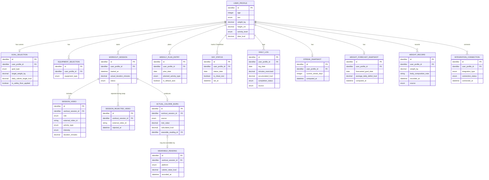

# Database Schema (Conceptual / Logical Data Model) — smartFit_daily

- **ประเภทเอกสาร:** Database Schema — Conceptual/Logical Data Model (ไม่ผูก DBMS จริง)
- **สถานะเอกสาร:** Draft
- **วันที่สร้าง:** 2026-08-28
- **อัปเดตล่าสุด:** 2026-08-29 — ขยายหัวข้อ 8 (ภาคผนวก: Stack Mapping) ให้ครอบคลุม per-table Firestore
  collection/document mapping และการย้าย FK/constraint enforcement ไป Cloud Function ตามการยืนยันของ
  ผู้ใช้ (เลือกแนวทาง Hybrid — ดูรายละเอียดในภาคผนวก) — **เนื้อหาหลักหัวข้อ 1-7 ไม่เปลี่ยนแปลง** ยังคงเป็น
  logical/relational model + ER Diagram เดิมทั้งหมด เพราะ HLA §5 (Conceptual Data Entities) ไม่เปลี่ยน
- **สร้างโดย:** skill `api-db-spec-builder`
- **อ้างอิงจาก:** [High Level Architecture](high-level-architecture.md),
  [Product Backlog](../../01-requirements/backlog.md),
  [Requirement ทั้ง 4 epic + NFR](../../01-requirements/01-spec/index.md)

## 1. ขอบเขตและหลักการ (Scope & Principles)

เอกสารนี้เป็น**โมเดลข้อมูลเชิงตรรกะ (logical data model)** — ใช้ **logical/abstract data type** เท่านั้น
(`string`, `integer`, `decimal`, `boolean`, `date`, `datetime`, `enum`, `identifier`) **ห้ามมี**
DBMS-specific type/syntax (เช่น `VARCHAR(255)`, `SERIAL`, `ObjectId`, `JSONB`), ห้ามระบุ index syntax
จริงหรือ storage engine

โมเดลนี้เลือกใช้แนวคิดแบบ **relational/table-based + ER Diagram** ตามที่ผู้ใช้ต้องการโดยตรง — **ไม่ใช่การ
ตัดสินใจแทนว่า production จะใช้ relational database จริง** เป็นเพียงโมเดลเชิงตรรกะที่ทำให้เห็นความสัมพันธ์
ของข้อมูลชัดเจนที่สุด ทีมสามารถ implement ด้วย storage แบบใดก็ได้ในภายหลัง

ทุกตารางในเอกสารนี้ derive จาก **Conceptual Data Entity** ของ [High Level Architecture](high-level-architecture.md)
(หัวข้อ 5) — ส่วนใหญ่เป็น 1:1 ยกเว้นที่ระบุเหตุผลไว้ชัดเจนในหัวข้อ 4 (Table Details)

## 2. ER Diagram

## 3. Table Details

### 3.1 `user_profile` ← User Profile

ข้อมูลร่างกาย/ประชากรศาสตร์พื้นฐานของผู้ใช้ — Feature: ONB-1/REQ-01

| Column | Logical Type | Required | Key | คำอธิบาย |
|---|---|---|---|---|
| `id` | `identifier` | ใช่ | PK | — |
| `age` | `integer` | ใช่ | — | อายุ ณ ตอนกรอก |
| `sex` | `enum` | ใช่ | — | หญิง/ชาย (ตามสูตร Mifflin-St Jeor ที่มี 2 branch) |
| `weight_kg` | `decimal` | ใช่ | — | อัปเดตได้จาก manual entry หรือ INT-2 sync |
| `height_cm` | `decimal` | ใช่ | — | — |
| `activity_level` | `enum` | ใช่ | — | ใช้เป็น Activity Factor ในการคำนวณ TDEE |
| `tdee_kcal` | `decimal` | ใช่ | — | คำนวณจาก BMR (Mifflin-St Jeor) × Activity Factor — คำนวณใหม่ทุกครั้งที่ `weight_kg`/`height_cm`/`age`/`activity_level` เปลี่ยน |

### 3.2 `goal_selection` ← Goal Selection & Daily Calorie Target

เป้าหมายหลักปัจจุบันของผู้ใช้ — Feature: ONB-3/REQ-02

| Column | Logical Type | Required | Key | คำอธิบาย |
|---|---|---|---|---|
| `id` | `identifier` | ใช่ | PK | — |
| `user_profile_id` | `identifier` | ใช่ | FK → `user_profile.id` | ความสัมพันธ์ 1:1 (เฉพาะเป้าหมาย**ปัจจุบัน** — ประวัติเป้าหมายเก่าไม่ persist ตาม HLA) |
| `goal_type` | `enum` | ใช่ | — | ลดน้ำหนัก / กระชับสัดส่วน / เพิ่มความอึด |
| `target_weight_kg` | `decimal` | บังคับเมื่อ `goal_type = ลดน้ำหนัก`, ไม่บังคับอื่น | — | ตาม decision ที่ resolve แล้ว 2026-08-28 |
| `daily_calorie_target_kcal` | `decimal` | ใช่ | — | TDEE ± ค่าคงที่ตามเป้าหมาย ปรับด้วย safety floor แล้ว |
| `is_safety_floor_applied` | `boolean` | ใช่ | — | true ถ้าค่าที่คำนวณได้ต่ำกว่า 1,200–1,500 kcal และถูกปรับขึ้น |

### 3.3 `equipment_selection` ← Equipment Profile

อุปกรณ์ที่ผู้ใช้มี (multi-select) — Feature: ONB-2/REQ-03

| Column | Logical Type | Required | Key | คำอธิบาย |
|---|---|---|---|---|
| `id` | `identifier` | ใช่ | PK | — |
| `user_profile_id` | `identifier` | ใช่ | FK → `user_profile.id` | 1 profile มีได้หลายแถว (multi-select) |
| `equipment_type` | `enum` | ใช่ | — | ไม่มีอุปกรณ์ / ดัมเบล / ยิมครบชุด — เลือก "ไม่มีอุปกรณ์" ต้อง mutual-exclusive กับตัวอื่น (บังคับใช้ที่ application layer ดูหัวข้อ 5) |

### 3.4 `workout_session` ← Workout Session

การประกอบวิดีโอ 1 ครั้งออกกำลังกาย — Feature: REC-1, REC-4/REQ-04, REQ-07

| Column | Logical Type | Required | Key | คำอธิบาย |
|---|---|---|---|---|
| `id` | `identifier` | ใช่ | PK | — |
| `user_profile_id` | `identifier` | ใช่ | FK → `user_profile.id` | — |
| `started_at` | `datetime` | ใช่ | — | — |
| `actual_duration_minutes` | `decimal` | ไม่บังคับจนกว่าจะจบเซสชัน | — | อัปเดตตอน complete — ยังไม่ชัดว่ารวมเวลา warmup/cooldown หรือไม่ (ดูหัวข้อ 6) |
| `status` | `enum` | ใช่ | — | กำลังดำเนินการ / จบแล้ว / หยุดกลางคัน |

### 3.5 `session_video` ← Video/Workout Content (ที่ใช้ในเซสชันหนึ่งๆ)

วิดีโอที่ประกอบเป็นเซสชัน (หลัก + warmup/cooldown ถ้ามี) — Feature: REC-1, REC-4/REQ-04, REQ-07

| Column | Logical Type | Required | Key | คำอธิบาย |
|---|---|---|---|---|
| `id` | `identifier` | ใช่ | PK | — |
| `workout_session_id` | `identifier` | ใช่ | FK → `workout_session.id` | 1 session มีได้ 1-3 แถว (หลักเสมอ, warmup/cooldown ถ้าความเข้มข้นสูง) |
| `role` | `enum` | ใช่ | — | หลัก / วอร์มอัพ / คูลดาวน์ |
| `external_video_id` | `string` | ใช่ | — | อ้างอิงวิดีโอจริงจาก YouTube (external boundary — ดู HLA หัวข้อ 6.1) |
| `activity_type` | `enum` | ใช่ | — | คาร์ดิโอ/เวทเทรนนิ่ง/HIIT — ใช้เป็น input ของสูตร MET |
| `intensity` | `enum` | ใช่ | — | ต่ำ/กลาง/สูง — ตัดสินว่าต้องมี warmup/cooldown (role อื่น) หรือไม่ |
| `duration_minutes` | `decimal` | ใช่ | — | ระยะเวลาตามที่วิดีโอระบุ (ไม่ใช่เวลาที่ใช้จริง) |

### 3.6 `session_rejected_video` ← Workout Session (ส่วนขยาย: รายการที่ถูกปฏิเสธระหว่างสลับ)

Feature: REC-3/REQ-06 — เก็บแยกจาก `workout_session` เพื่อ normalize (แทนที่จะเป็น list ใน 1 column)

| Column | Logical Type | Required | Key | คำอธิบาย |
|---|---|---|---|---|
| `id` | `identifier` | ใช่ | PK | — |
| `workout_session_id` | `identifier` | ใช่ | FK → `workout_session.id` | — |
| `external_video_id` | `string` | ใช่ | — | วิดีโอที่ถูกปฏิเสธ — ใช้กันไม่ให้ REC-3 แนะนำซ้ำในเซสชันเดียวกัน |
| `rejected_at` | `datetime` | ใช่ | — | — |

### 3.7 `actual_calorie_burn` ← Actual Calorie Burn

Feature: REC-2/REQ-05

| Column | Logical Type | Required | Key | คำอธิบาย |
|---|---|---|---|---|
| `id` | `identifier` | ใช่ | PK | — |
| `workout_session_id` | `identifier` | ใช่ | FK → `workout_session.id`, 1:1 | — |
| `source` | `enum` | ใช่ | — | สูตร MET / ค่าจาก wearable |
| `met_value` | `decimal` | บังคับเมื่อ `source = สูตร MET` | — | ค้นจาก MET lookup table ตามประเภทกิจกรรม×ความเข้มข้น (ค่าจริงยังไม่ resolve เป็นทางการ — ดู log 2026-08-27) |
| `calculated_kcal` | `decimal` | ใช่ | — | ค่าสุดท้ายที่ใช้จริง (MET × น้ำหนัก × เวลา หรือค่าจาก wearable) |
| `wearable_reading_id` | `identifier` | บังคับเมื่อ `source = ค่าจาก wearable` | FK → `wearable_reading.id` | — |

### 3.8 `wearable_reading` ← Wearable Reading

Feature: INT-3/REQ-13

| Column | Logical Type | Required | Key | คำอธิบาย |
|---|---|---|---|---|
| `id` | `identifier` | ใช่ | PK | — |
| `workout_session_id` | `identifier` | ใช่ | FK → `workout_session.id` | — |
| `platform` | `enum` | ใช่ | — | Apple Health / Google Health Connect |
| `calorie_value_kcal` | `decimal` | ใช่ | — | — |
| `recorded_at` | `datetime` | ใช่ | — | — |

### 3.9 `weekly_plan_entry` ← Weekly Plan / Calendar Entry

Feature: PLN-1/REQ-08

| Column | Logical Type | Required | Key | คำอธิบาย |
|---|---|---|---|---|
| `id` | `identifier` | ใช่ | PK | — |
| `user_profile_id` | `identifier` | ใช่ | FK → `user_profile.id` | — |
| `plan_date` | `date` | ใช่ | Unique ร่วมกับ `user_profile_id` | อยู่ใน fixed calendar week จันทร์-อาทิตย์ |
| `planned_activity_type` | `enum` | ไม่บังคับ | — | ปล่อยว่าง = ใช้ default (แนะนำอัตโนมัติจาก REC-1) |
| `is_default_auto` | `boolean` | ใช่ | — | true ถ้าไม่ได้กำหนดเอง |

> หมายเหตุ: flag "read-only" ของ PLN-1 **ไม่ persist เป็น column** — เป็นค่าที่คำนวณจาก
> `plan_date < วันนี้ AND มี daily_log ของวันเดียวกัน` เสมอ (ดูหัวข้อ 5)

### 3.10 `day_status` ← Day Status (Cheat/Rest Day marker)

Feature: PLN-2/REQ-09

| Column | Logical Type | Required | Key | คำอธิบาย |
|---|---|---|---|---|
| `id` | `identifier` | ใช่ | PK | — |
| `user_profile_id` | `identifier` | ใช่ | FK → `user_profile.id` | — |
| `status_date` | `date` | ใช่ | Unique ร่วมกับ `user_profile_id` | ทับ log ที่มีอยู่แล้วได้เฉพาะเมื่อ `status_date = วันนี้` (บังคับใช้ที่ application layer) |
| `is_cheat_rest` | `boolean` | ใช่ | — | — |
| `set_at` | `datetime` | ใช่ | — | ใช้ตรวจว่ายกเลิกได้ไหม (ต้องก่อนสิ้นวันของ `status_date`) |

### 3.11 `daily_log` ← Daily Log

Feature: PLN-3/REQ-10

| Column | Logical Type | Required | Key | คำอธิบาย |
|---|---|---|---|---|
| `id` | `identifier` | ใช่ | PK | — |
| `user_profile_id` | `identifier` | ใช่ | FK → `user_profile.id` | — |
| `log_date` | `date` | ใช่ | Unique ร่วมกับ `user_profile_id` | — |
| `minutes_exercised` | `decimal` | ใช่ | — | — |
| `accumulated_kcal` | `decimal` | ใช่ | — | จาก `actual_calorie_burn` ของเซสชันวันนั้น (ถ้ามี) |
| `completion_status` | `enum` | ใช่ | — | ครบเป้าหมาย / ไม่ครบเป้าหมาย — all-or-nothing เข้มงวด ไม่มีค่ากลาง (บังคับใช้ที่ application layer) |
| `source` | `enum` | ใช่ | — | จากเซสชันจริง (REC-2) / จาก Cheat-Rest override (PLN-2, "completed ชนะเสมอ") |

### 3.12 `streak_snapshot` ← Streak

Feature: PLN-4/REQ-09, REQ-10 — เก็บเป็น cache แยก (ตัดสินใจแล้ว 2026-08-28) แทนการคำนวณ on-demand ทุกครั้ง

| Column | Logical Type | Required | Key | คำอธิบาย |
|---|---|---|---|---|
| `id` | `identifier` | ใช่ | PK | — |
| `user_profile_id` | `identifier` | ใช่ | FK → `user_profile.id`, 1:1 | — |
| `current_streak_days` | `integer` | ใช่ | — | จำนวนวันต่อเนื่องปัจจุบัน |
| `computed_at` | `datetime` | ใช่ | — | ต้อง sync ใหม่ทุกครั้งที่ `daily_log`/`day_status` ของผู้ใช้เปลี่ยน (บังคับใช้ที่ application layer — ดูหัวข้อ 5) |

### 3.13 `weight_record` ← Weight Record

Feature: INT-2/REQ-12

| Column | Logical Type | Required | Key | คำอธิบาย |
|---|---|---|---|---|
| `id` | `identifier` | ใช่ | PK | — |
| `user_profile_id` | `identifier` | ใช่ | FK → `user_profile.id` | — |
| `weight_kg` | `decimal` | ใช่ | — | — |
| `body_composition_note` | `string` | ไม่บังคับ | — | ข้อมูลองค์ประกอบร่างกายเพิ่มเติมจากตาชั่ง (ถ้ามี) |
| `recorded_at` | `datetime` | ใช่ | — | — |
| `source` | `enum` | ใช่ | — | กรอกเอง / ซิงค์จากตาชั่งอัจฉริยะ |

### 3.14 `weight_forecast_snapshot` ← Weight Goal / Forecast

Feature: INT-1/REQ-11 — เก็บเป็น cache แยก (ตัดสินใจแล้ว 2026-08-28), น้ำหนักเป้าหมายเก็บที่ `goal_selection`
อยู่แล้ว ตารางนี้เก็บเฉพาะผลการคำนวณ

| Column | Logical Type | Required | Key | คำอธิบาย |
|---|---|---|---|---|
| `id` | `identifier` | ใช่ | PK | — |
| `user_profile_id` | `identifier` | ใช่ | FK → `user_profile.id`, 1:1 | — |
| `forecasted_goal_date` | `date` | ใช่ | — | — |
| `average_daily_deficit_kcal` | `decimal` | ใช่ | — | คำนวณจากประวัติ `daily_log` จริง (ไม่ใช่ค่าประมาณตอน onboarding) |
| `computed_at` | `datetime` | ใช่ | — | ควร recompute เมื่อมี `daily_log`/`weight_record` ใหม่ (ความถี่ที่แน่นอนยังไม่ระบุ — ดูหัวข้อ 6) |

### 3.15 `integration_connection` ← Integration Consent/Connection State

Feature: INT-2, INT-3/REQ-12, REQ-13

| Column | Logical Type | Required | Key | คำอธิบาย |
|---|---|---|---|---|
| `id` | `identifier` | ใช่ | PK | — |
| `user_profile_id` | `identifier` | ใช่ | FK → `user_profile.id` | — |
| `integration_type` | `enum` | ใช่ | — | ตาชั่งอัจฉริยะ / wearable |
| `connection_status` | `enum` | ใช่ | — | ยังไม่เชื่อมต่อ / เชื่อมต่อแล้ว / ถอน consent แล้ว |
| `connected_at` | `datetime` | ไม่บังคับ | — | — |

## 4. Relationships & Constraints (เชิงแนวคิด)

- **1 `user_profile` → หลาย `workout_session`/`weekly_plan_entry`/`day_status`/`daily_log`/
  `weight_record`/`integration_connection`** — ทุก entity หลักผูกกับผู้ใช้ 1 คนเสมอ
- **1 `user_profile` → 1 `goal_selection` (ปัจจุบัน), 1 `streak_snapshot`, 1 `weight_forecast_snapshot`**
  — เก็บเฉพาะค่าล่าสุด/ปัจจุบัน ไม่ persist ประวัติเป้าหมายเก่าหรือ snapshot ย้อนหลัง
- **`weekly_plan_entry`, `day_status`, `daily_log` ผูกกันด้วย `(user_profile_id, date)` ร่วมกัน** — ไม่ใช่
  FK ตรงถึงกัน (คนละ entity เชิงแนวคิด) แต่ระบบต้องอ่านทั้ง 3 ตารางประกอบกันเพื่อตัดสินสถานะของ 1 วันจริง
  (เช่น ตัดสิน read-only ของ `weekly_plan_entry`)
- **กติกาที่ enforce ไม่ได้ที่ระดับ schema — เป็นหน้าที่ของ application/service layer เท่านั้น**:
  1. **Equipment mutual exclusion** (`equipment_selection`) — เลือก "ไม่มีอุปกรณ์" ต้อง deselect ตัวอื่น
     — เจ้าของ: **Personalization & Profile** component (HLA หัวข้อ 3.1)
  2. **Safety floor** (`goal_selection.daily_calorie_target_kcal` ต้องไม่ต่ำกว่า 1,200–1,500) —
     เจ้าของ: **Personalization & Profile**
  3. **All-or-nothing** (`daily_log.completion_status` ต้อง ≥100% เท่านั้นถึงเป็น "ครบเป้าหมาย" ไม่มีค่า
     กลาง) — เจ้าของ: **Logging & Streak**
  4. **PLN-1 read-only** (`weekly_plan_entry`/`day_status` ของวันในอดีตที่มี `daily_log` แล้ว ห้ามแก้ไข) —
     เจ้าของ: **Planner & Day-Status**
  5. **PLN-2 "วันนี้เท่านั้น"** (`day_status` ทับ `daily_log` ที่มีอยู่แล้วได้เฉพาะ `status_date = วันนี้`) —
     เจ้าของ: **Planner & Day-Status**
  6. **Streak/Forecast snapshot ต้อง sync ใหม่ทุกครั้งที่ต้นทางเปลี่ยน** (`streak_snapshot` เมื่อ
     `daily_log`/`day_status` เปลี่ยน, `weight_forecast_snapshot` เมื่อ `daily_log`/`weight_record`
     เปลี่ยน) — เจ้าของ: **Logging & Streak** และ **Insights & Forecast** ตามลำดับ — ไม่มีกลไก DB-level
     (เช่น trigger) ที่ระบุในเอกสารนี้ เพราะเป็นการผูก stack

## 5. Query/Access Pattern Considerations (เชิงแนวคิด)

- **`daily_log` ค้นหาตาม `user_profile_id` + ช่วง `log_date`** เป็น pattern หลักที่ใช้ทั้งใน PLN-4
  (คำนวณ streak), INT-1 (คำนวณ deficit เฉลี่ย), และหน้า Log History — ควรออกแบบให้ค้นช่วงวันที่ได้เร็ว
- **`weekly_plan_entry`/`day_status` ค้นหาตาม `user_profile_id` + `plan_date`/`status_date` เดียว**
  เป็น pattern ที่เกิดทุกครั้งที่เปิดปฏิทิน — ต้องรองรับการรวม 3 ตาราง (`weekly_plan_entry`, `day_status`,
  `daily_log`) ของวันเดียวกันได้เร็ว เพราะ Daily Dashboard/Weekly Planner ต้องแสดงผลไม่หน่วง (NFR-01)
- **`session_video`/`session_rejected_video` ค้นหาตาม `workout_session_id`** เป็น pattern ที่เกิดตอน
  REC-3 (สลับวิดีโอ) เท่านั้น ความถี่ต่ำกว่า pattern ข้างต้น

## 6. จุดที่ยังไม่ได้ระบุ / ควรยืนยันเพิ่มเติม

1. **`actual_calorie_burn.met_value`**: ค่า MET จริงต่อประเภทกิจกรรม×ความเข้มข้นยังไม่ resolve เป็นทางการ
   ใน `01-spec/` (ใช้ค่ามาตรฐานทั่วไปเป็นตัวอย่างใน test data เท่านั้น ตาม log 2026-08-27)
2. **`workout_session.actual_duration_minutes`**: ยังไม่ระบุว่ารวมเวลา warmup/cooldown หรือไม่ (REC-4
   open question) — กระทบว่า column นี้ควรแยกเป็น `main_duration_minutes` กับ
   `total_duration_minutes` หรือพอแค่ค่าเดียว
3. **`weight_forecast_snapshot.computed_at`**: ความถี่ที่ควร recompute (ทุกครั้งที่มี log ใหม่ / ทุกวัน /
   เมื่อผู้ใช้เปิดหน้า Insights) ยังไม่ระบุ
4. **`integration_connection`/`weight_record`**: ลำดับความสำคัญเมื่อข้อมูลชนกัน (ชั่งน้ำหนักหลายครั้งต่อวัน
   ควรเก็บทุกครั้งหรือ resolve เป็นค่าเดียว, wearable ต่างจาก MET มากควร flag อย่างไร) ยังไม่ระบุ
5. **Data retention**: ยังไม่ระบุว่าจะเก็บ `daily_log`/`weight_record` ประวัติย้อนหลังนานแค่ไหน (ผูกกับ
   NFR-06 data deletion)

## 7. ความสัมพันธ์กับเอกสารอื่น

- [High Level Architecture](high-level-architecture.md) — ทุกตาราง derive จาก Conceptual Data Entity
  (หัวข้อ 5) โดยตรง ยกเว้นที่ระบุเหตุผลไว้ในหัวข้อ 3
- [Product Backlog](../../01-requirements/backlog.md), [Requirement 4 epic + NFR](../../01-requirements/01-spec/index.md) —
  แหล่งที่มาของกติกาธุรกิจที่ผูกกับแต่ละตาราง
- [api-spec.md](api-spec.md) — operation ที่อ่าน/เขียนแต่ละตารางเหล่านี้ (คู่กัน)

## 8. ภาคผนวก: Stack Mapping

> **หัวข้อนี้เป็นข้อยกเว้นเดียวในเอกสารนี้ (นอกเหนือจาก logical data type) ที่มีชื่อเทคโนโลยีจริง**
> แหล่งที่มาและสิทธิ์แก้ไขจริงอยู่ที่ [tech-stack.md](tech-stack.md) เสมอ — หัวข้อ 1-7 ข้างต้นยังคง
> conceptual/logical ตามกติกาเดิมทุกประการ**ไม่เปลี่ยนแปลง** ถ้าทีมเปลี่ยน stack ในอนาคต ให้รัน
> `tech-stack-builder` ก่อน แล้วภาคผนวกนี้จะถูก sync ตามในการรัน `api-db-spec-builder` ครั้งถัดไป

> **อัปเดต 2026-08-29 (แนวทาง Hybrid — ยืนยันจากผู้ใช้)**: เนื่องจาก `tech-stack.md` เปลี่ยนจาก
> PostgreSQL/Supabase เป็น **Cloud Firestore** (NoSQL document database) ซึ่งไม่มี native FK/referential
> integrity เหมือน relational DB — ภาคผนวกนี้จึงขยายเกินกว่าการ mirror ตาราง type ธรรมดา (หัวข้อ 8.1)
> เพิ่มอีก 2 หัวข้อย่อยคือ **8.2 Table → Firestore Collection/Document Mapping** และ **8.3 FK/Constraint
> Enforcement Migration** เพื่อให้เป็นคำตอบที่ actionable ตามที่ `tech-stack.md` §7 ข้อ 1 ร้องขอ โดย
> **ไม่แตะเนื้อหาหลักหัวข้อ 1-7** (ER Diagram/ตาราง/logical type ยังคงเป็น relational model เดิมทุก
> ประการ เพื่อให้เอกสารนี้ยังใช้ซ้ำได้ถ้าทีมเปลี่ยน stack อีกในอนาคต) — เนื้อหา 8.2/8.3 เป็นการออกแบบเพิ่มเติม
> โดย `api-db-spec-builder` เอง (ไม่ใช่การ mirror ข้อความที่มีอยู่แล้วใน `tech-stack.md` แบบตรงๆ เหมือน 8.1
> เพราะ `tech-stack.md` §6.1 ยังเป็นแค่แนวทางเบื้องต้นระดับ component ไม่ได้ลงรายละเอียดระดับตาราง) —
> `tech-stack.md` ควรอัปเดต §6 ให้สอดคล้องกับรายละเอียดนี้ในการรัน `tech-stack-builder` ครั้งถัดไป (ไม่ใช่
> หน้าที่ของ skill นี้ที่จะแก้ `tech-stack.md` เอง)

### 8.1 Logical Type → Firestore Field Type

มิเรอร์จาก [tech-stack.md § 6.2](tech-stack.md#62-database-schemamds-logical-type--firestore-field-type)
(อัปเดต 2026-08-29):

| Logical Type | Firestore Field Type |
|---|---|
| `identifier` | auto-generated document ID (string) หรือ string field ที่เก็บ reference ไปยัง document อื่น (Firestore ไม่มี FK จริง — ต้อง validate ความถูกต้องที่ Cloud Function) |
| `string` | `string` |
| `integer` | `number` (Firestore เก็บเป็น number เดียว ไม่แยก int/float — ต้อง validate ขอบเขต/ทศนิยมที่ Cloud Function) |
| `decimal` | `number` |
| `boolean` | `boolean` |
| `date` | `Timestamp` (ตั้งเวลาเป็นเที่ยงคืนของวันนั้น) หรือ `string` รูปแบบ ISO-8601 |
| `datetime` | `Timestamp` |
| `enum` | `string` ที่ validate ค่าที่อนุญาตไว้ใน Cloud Function (Firestore ไม่มี native enum/check constraint เหมือน PostgreSQL) |

### 8.2 Table → Firestore Collection/Document Mapping

เกณฑ์ที่ใช้ตัดสินระหว่าง **embedded field** (ฝังในเอกสารแม่) กับ **subcollection แยก**: ข้อมูลที่ (ก)
มีขอบเขตจำนวนจำกัดชัดเจน (bounded), (ข) มี relationship 1:1 หรือ multi-select เล็กๆ กับผู้ใช้/เซสชันเดียว,
และ (ค) แทบไม่มี pattern การ query อิสระแยกจากเอกสารแม่ → **embed**; ข้อมูลที่ (ก) เพิ่มจำนวนไม่มีขอบเขต
(unbounded, สะสมทุกวัน/ทุกเซสชัน) หรือ (ข) ต้องการ query/pagination อิสระ (เช่น ค้นตามช่วงวันที่) →
**subcollection แยก** (ป้องกัน document โตเกินขีดจำกัดขนาดของ Firestore ด้วย)

| ตารางเดิม (Logical) | Firestore Representation | เหตุผล |
|---|---|---|
| `user_profile` | Top-level collection `users`, document ID = Firebase Auth UID (`users/{userId}`) — field `age`/`sex`/`weightKg`/`heightCm`/`activityLevel`/`tdeeKcal` อยู่ในตัว document โดยตรง | เอกสารเดียวต่อผู้ใช้ 1 คน อ่านพร้อมกันบ่อยที่สุด (แทบทุกหน้าจอ) เป็น root ที่ subcollection อื่นผูกสิทธิ์ผ่าน Firestore Security Rule ได้ตรงไปตรงมาที่สุด |
| `goal_selection` | Embedded map field `goalSelection` ภายใน `users/{userId}` | 1:1 กับ user, เก็บเฉพาะค่าปัจจุบัน (ไม่มีประวัติ ตาม HLA §5) อ่านพร้อมโปรไฟล์แทบทุกครั้ง (Dashboard/Planner) — embed ลดจำนวน read ต่อครั้ง |
| `equipment_selection` | Embedded array field `equipmentTypes: string[]` ภายใน `users/{userId}` | multi-select แต่ bounded ชัดเจน (สูงสุด 3 ค่าตาม ONB-2) ไม่มี pattern query แยกจากโปรไฟล์ |
| `workout_session` | Subcollection `users/{userId}/workoutSessions/{sessionId}` | จำนวนไม่จำกัด เพิ่มทุกครั้งที่ออกกำลังกาย ต้อง query อิสระ (ประวัติ session) — embed ในเอกสาร user จะทำให้เอกสารโตไม่มีขอบเขตและเสี่ยงชนขีดจำกัดขนาด document |
| `session_video` | Embedded array field `sessionVideos: []` ภายใน document `workoutSessions/{sessionId}` เดียวกัน | 1 session มีแค่ 1-3 แถว (หลัก+วอร์มอัพ/คูลดาวน์) เขียนครั้งเดียวตอนสร้าง session ไม่มี pattern query แยก |
| `session_rejected_video` | Embedded array field `rejectedVideoIds: []` (แต่ละรายการเป็น map `{externalVideoId, rejectedAt}`) ภายใน document เดียวกัน | ใช้เฉพาะระหว่าง REC-3 ของ session เดียวกันเท่านั้น ไม่มี pattern query ข้าม session |
| `actual_calorie_burn` | Embedded map field `actualCalorieBurn` ภายใน document เดียวกัน (เขียนครั้งเดียวตอนจบ/หยุดเซสชันโดย Cloud Function `sessionComplete`) | ความสัมพันธ์ 1:1 กับ session ไม่มี pattern query อิสระ อ่านพร้อม session เสมอ |
| `wearable_reading` | Embedded map field `wearableReading` ภายใน document เดียวกัน (เขียนได้ทั้งก่อน/หลัง `sessionComplete` ตามลำดับที่ INT-3 มาถึงจริง) | 1:1 กับ session — ถ้ามาถึงก่อน complete ให้เขียน field นี้ก่อน แล้ว `sessionComplete` อ่านมาใช้แทนค่าประมาณ MET ตามที่ HLA Flow 2/5 ระบุ |
| `weekly_plan_entry` | Subcollection `users/{userId}/weeklyPlanEntries/{date}` (document ID = ISO date เช่น `2026-08-31`) | จำนวนไม่จำกัด (สะสมทุกสัปดาห์) — ใช้ document ID = date ให้ดึงด้วย `get()` ตรงได้เร็วโดยไม่ต้อง query แยก |
| `day_status` | Subcollection `users/{userId}/dayStatus/{date}` (document ID = ISO date) | ผูกกับวันที่เดียวกับ `weekly_plan_entry`/`daily_log` — ใช้ document ID ตรงกันเพื่อให้ Cloud Function อ่าน 3 เอกสารของวันเดียวกันพร้อมกันได้ง่าย (ตามที่หัวข้อ 4/5 เดิมระบุว่าต้องอ่านทั้ง 3 ตารางประกอบกัน) |
| `daily_log` | Subcollection `users/{userId}/dailyLogs/{date}` (document ID = ISO date) | จำนวนไม่จำกัด ต้อง query ช่วงวันที่บ่อยที่สุด (streak, forecast, log history ตามหัวข้อ 5 เดิม) — document ID = date ทำให้ query แบบ range ตรงไปตรงมา |
| `streak_snapshot` | Embedded map field `streakSnapshot` ภายใน `users/{userId}` | 1:1 กับ user เก็บค่าล่าสุดค่าเดียว อ่านพร้อม Dashboard ทุกครั้งตาม NFR-01 — embed ลด read เพิ่ม |
| `weight_record` | Subcollection `users/{userId}/weightRecords/{recordId}` | จำนวนไม่จำกัด (ทุกครั้งที่ชั่ง/กรอกเอง) ต้อง query ช่วงเวลา (คำนวณ TDEE ใหม่ + forecast) |
| `weight_forecast_snapshot` | Embedded map field `weightForecastSnapshot` ภายใน `users/{userId}` | 1:1 กับ user เก็บค่าล่าสุดค่าเดียว อ่านพร้อมหน้า Insights |
| `integration_connection` | Embedded map field `integrationConnections: { smartScale: {...}, wearable: {...} }` ภายใน `users/{userId}` | ชุดข้อมูลเล็ก bounded ชัดเจน (2 ประเภทตายตัวตาม INT-2/INT-3 ของ backlog ปัจจุบัน) อ่านพร้อมโปรไฟล์เพื่อตัดสิน UI ปุ่มเชื่อมต่อ/ตัดการเชื่อมต่อ |

⚠️ ตารางนี้เป็นการออกแบบที่ละเอียดกว่า `tech-stack.md` §6.1 ปัจจุบัน (ซึ่งระบุแค่ชื่อ collection ระดับ
component คร่าวๆ) — ยึดชื่อ collection ที่ `tech-stack.md` §6.1 ตั้งไว้แล้วเป็นหลัก (`workoutSessions`
เทียบเท่า, `weeklyPlanEntries`/`dayStatus`/`dailyLogs`/`weightForecastSnapshot` ตรงชื่อเดิม) แล้วเพิ่ม
รายละเอียดว่า nest อยู่ใต้ `users/{userId}` และตารางไหนควร embed แทน — ควรนำกลับไปปรับ `tech-stack.md` §6.1
ให้ตรงกันในการรัน `tech-stack-builder` ครั้งถัดไป

### 8.3 FK / Constraint Enforcement Migration (ย้ายจาก schema-level ไป Cloud Function)

Firestore ไม่มี FK/CHECK constraint ใดๆ เลย — ต่างจาก relational DB ที่อย่างน้อยยังมี FK บังคับการมีอยู่
ของ parent row ให้ฟรี ตารางด้านล่างขยายจากหัวข้อ 4 (Relationships & Constraints) เดิม โดยระบุว่ากติกาแต่ละ
ข้อควรถูก enforce ที่ Cloud Function ตัวไหน (อ้างชื่อจาก `tech-stack.md` §6.1/§6.3 ที่มีอยู่แล้วเมื่อมีชื่อ
ทางการ — ไม่มีให้อ้างอิง operation จาก `api-spec.md` แทนโดยไม่เดาชื่อ function เอง):

| กติกาเดิม (จากหัวข้อ 4) | สถานะใน Firestore | Cloud Function ที่ต้อง enforce | Component เจ้าของ (HLA §3) |
|---|---|---|---|
| Equipment mutual exclusion (`equipment_selection`) | เก็บเป็น `equipmentTypes` array embedded — Firestore ไม่มี constraint ใดบังคับความสัมพันธ์ระหว่างค่าในกลุ่ม | Cloud Function `profileUpdate` (ชื่อทางการตาม tech-stack.md §6.1) | Personalization & Profile |
| Safety floor (`goal_selection.daily_calorie_target_kcal` ≥ 1,200–1,500) | เก็บใน `goalSelection` embedded map — ไม่มี CHECK constraint | Cloud Function ที่รับ operation `PUT /profile/goal` (ตาม api-spec.md §3.1 — ยังไม่มีชื่อทางการแยกจาก `profileUpdate` ใน tech-stack.md §6.1 ปัจจุบัน ควรยืนยันในการรัน `tech-stack-builder` ครั้งถัดไปว่าเป็นฟังก์ชันเดียวกันหรือแยก) | Personalization & Profile |
| All-or-nothing (`daily_log.completion_status` ≥100% เท่านั้น ไม่มีค่ากลาง) | เขียนลง `dailyLogs/{date}` โดยตรง ไม่มี CHECK constraint ใดๆ | Cloud Function ที่เขียน `dailyLogs` ต่อจาก `sessionComplete`/`cheatRest` (ตาม tech-stack.md §6.1 "Logging & Streak" — trigger จาก Firestore `onWrite`) | Logging & Streak |
| PLN-1 read-only (วันในอดีตที่มี `daily_log` แล้ว ห้ามแก้ `weekly_plan_entry`) | ต้องอ่าน `dailyLogs/{date}` ก่อนอนุญาตเขียน `weeklyPlanEntries/{date}` เอง — ไม่มีกลไกอัตโนมัติใดๆ (แม้ตอนเป็น relational ก็ต้อง enforce ที่ application layer อยู่แล้วตามหัวข้อ 4 เดิม ไม่ใช่เรื่องใหม่จาก Firestore) | Cloud Function ที่รับ `PUT /planner/days/{date}` (tech-stack.md §6.1 "Planner & Day-Status" — "Cloud Function คำนวณ read-only flag") | Planner & Day-Status |
| PLN-2 "วันนี้เท่านั้น" (ทับ `daily_log` ที่มีอยู่แล้วได้เฉพาะ `status_date` = วันนี้) | ต้องอ่าน `dailyLogs/{date}` ก่อนเขียน `dayStatus/{date}` | Cloud Function `cheatRest` (ชื่อทางการตาม tech-stack.md §6.1) | Planner & Day-Status |
| Streak/Forecast snapshot ต้อง sync ใหม่ทุกครั้งที่ต้นทางเปลี่ยน | `streakSnapshot`/`weightForecastSnapshot` เป็น embedded field ใน `users/{userId}` — ไม่มี materialized view/trigger ของ DB ให้ใช้ฟรีเหมือนที่หัวข้อ 4 เดิมตั้งข้อสังเกตไว้แล้วว่าไม่มีแม้ตอนเป็น relational | Cloud Function ที่ trigger จาก Firestore `onWrite` ของ `dailyLogs`/`dayStatus` (Logging & Streak) และ Cloud Function `forecast` (Insights & Forecast) — ทั้งสองชื่อทางการตาม tech-stack.md §6.1 | Logging & Streak / Insights & Forecast |
| **(ใหม่ — เกิดจาก Firestore ไม่มี FK เลย ไม่ใช่แค่ constraint ทางธุรกิจ)** Referential existence validation: ทุก field ที่เคยเป็น FK ในหัวข้อ 3 (เช่น `workout_session_id` ที่ wearable reading เดิมอ้างถึง) ต้องมีการตรวจสอบว่า document ปลายทางมีอยู่จริงและเป็นของผู้ใช้คนเดียวกัน ก่อนเขียนเสมอ | ส่วนใหญ่ถูกกำจัดไปแล้วด้วยการ embed (8.2) — ที่เหลือคือทุกครั้งที่ client ส่ง id ของ document อื่นมาใน request (เช่น `sessionId` ใน `POST /integrations/wearable/readings`) | ทุก Cloud Function ที่รับ id อ้างอิงจาก client ต้อง `get()` ยืนยันก่อนเขียนเสมอ (ดู tech-stack.md §6.3 สำหรับ mapping operation → Cloud Function แต่ละตัว) | เจ้าของแต่ละ Cloud Function ตาม operation นั้น (แปรผันตาม component) |

ดู [tech-stack.md](tech-stack.md) สำหรับ mapping ที่เหลือ (HLA Component → implementation, REST
convention → Firebase Cloud Functions routing) และเหตุผลการเลือก stack
