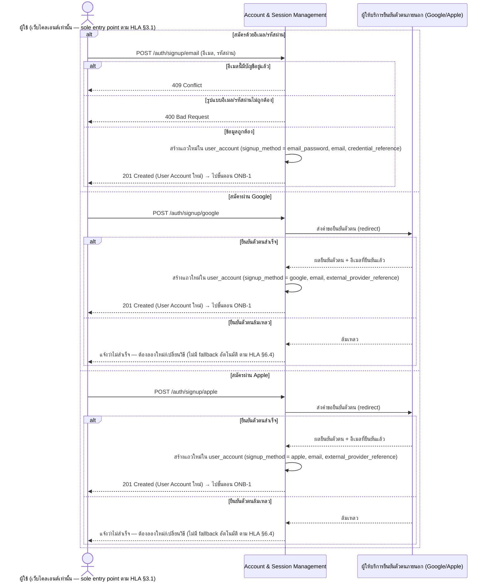
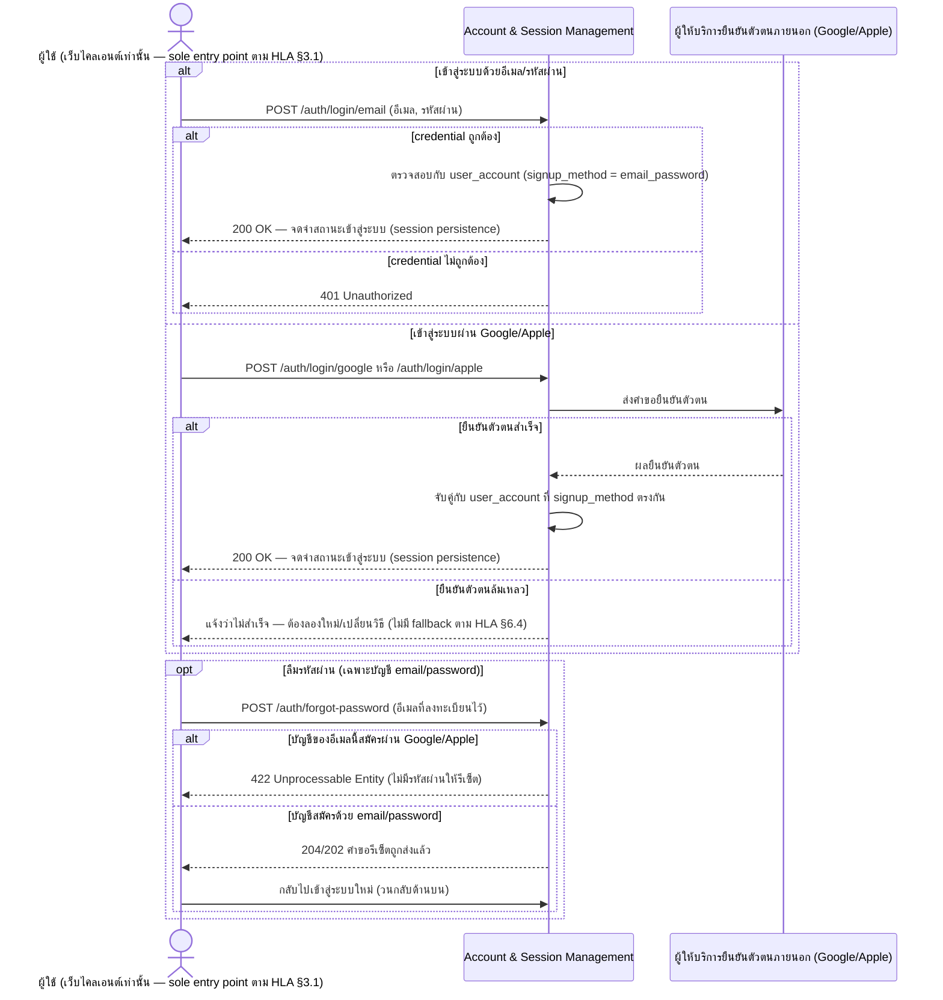
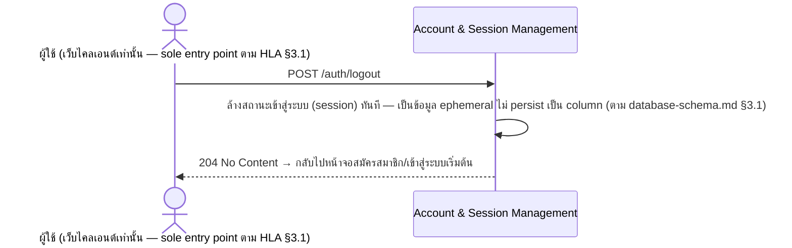
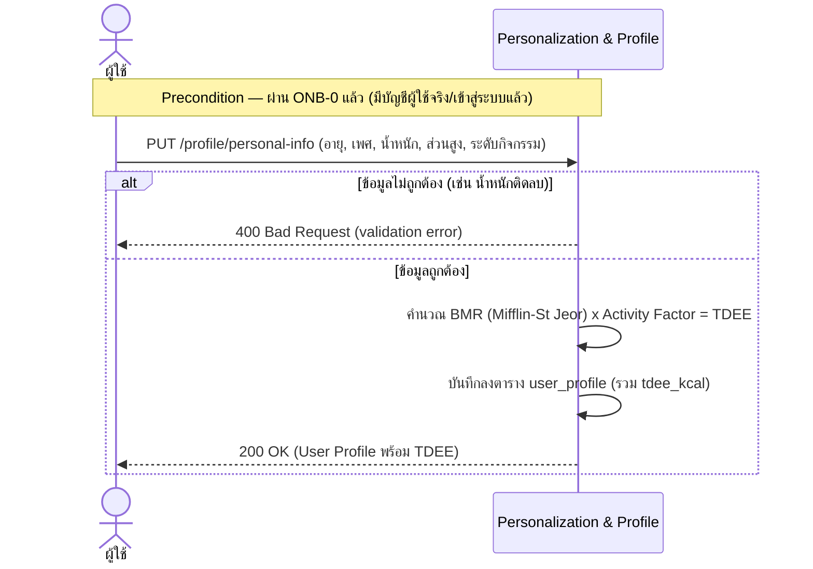
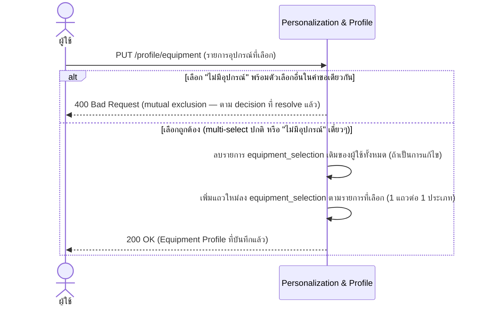
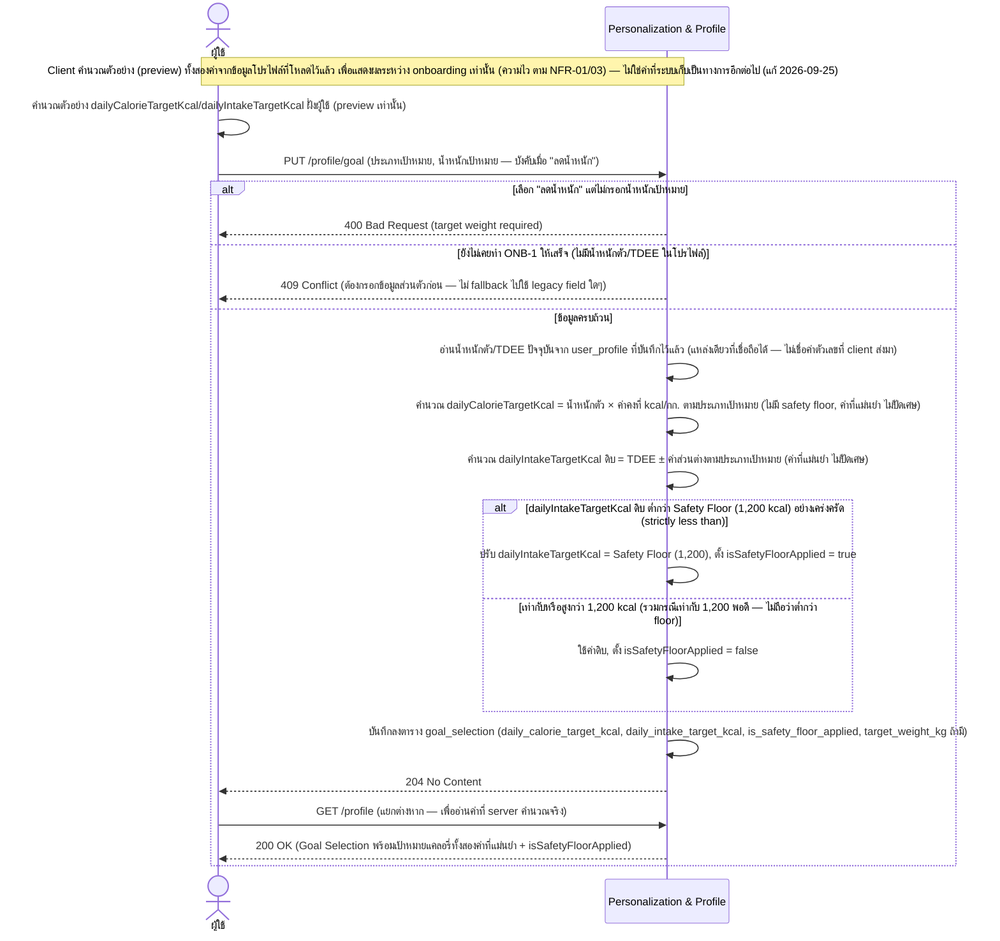

# Detailed Design — Onboarding & Personalization (Conceptual)

- **ประเภทเอกสาร:** Detailed Design — Conceptual (ไม่ผูก technical stack)
- **สถานะเอกสาร:** Draft
- **วันที่สร้าง:** 2026-08-28
- **อัปเดตล่าสุด:** 2026-09-25 (รอบ 7) — `feature-list-journey`/`api-db-spec-writer` เพิ่งยืนยันว่า `PUT
  /profile/goal` (ONB-3/REQ-02) เป็น **server-authoritative** แล้ว (คำนวณ `dailyCalorieTargetKcal`/
  `dailyIntakeTargetKcal`/`isSafetyFloorApplied` เองทั้งหมดจากน้ำหนักตัว/TDEE ที่บันทึกไว้แล้วในโปรไฟล์ ไม่
  เชื่อค่าตัวเลขที่ client ส่งมาโดยตรงอีกต่อไป — ค่าที่ client เคยคำนวณส่งมากลายเป็น legacy field ที่ยอมรับได้
  เพื่อ backward compatibility แต่ถูกละเว้นเสมอ) แทนที่โมเดลเดิม "client คำนวณแล้วส่งมาให้ server ตรวจสอบซ้ำ
  (validate)" — audit พบว่าเนื้อหาหลักของ ONB-3 ในไฟล์นี้ล้าหลังจาก upstream ทั้ง 3 ชั้นจริง (ไม่ใช่ข้อขัดแย้ง)
  แก้ไขดังนี้: (1) **sequence diagram เขียนใหม่**: ตัด `par` block เดิมที่ client คำนวณทั้งสองค่าแล้วส่งมา
  ให้ server ตรวจสอบซ้ำออก — client เหลือแค่คำนวณตัวอย่าง (preview) เพื่อแสดงผลระหว่าง onboarding เท่านั้น
  (ค่านี้ไม่ถูกส่งไปเป็น input ที่เชื่อถือได้อีกต่อไป), request เหลือแค่ประเภทเป้าหมาย+น้ำหนักเป้าหมาย, เพิ่ม
  `alt` ใหม่ `409 Conflict` เมื่อยังไม่เคยทำ ONB-1 (ไม่มีน้ำหนักตัว/TDEE ให้คำนวณ), server อ่าน
  น้ำหนักตัว/TDEE จากโปรไฟล์เองแล้วคำนวณทั้งสองค่า+safety floor เองทั้งหมด, response เปลี่ยนจาก Goal
  Selection object เป็น `204 No Content` (ต้องเรียก `GET /profile` แยกต่างหากถึงจะอ่านค่าที่คำนวณจริงได้)
  (2) **อัลกอริทึมเขียนใหม่**: ย้ายจากมุมมอง "client คำนวณ + server re-derive ซ้ำ" เป็น "server คำนวณเป็น
  ทางการทั้งหมด" พร้อมย้ำกติกา **exact value ไม่ปัดเศษ** และ **safety floor เข้มงวดที่ค่าดิบต่ำกว่า 1,200
  kcal อย่างเคร่งครัด (strictly less than) เท่านั้น** — เท่ากับ 1,200 พอดี**ไม่ถูกปรับ** (สอง decision นี้
  ยืนยันกับผู้ใช้งานแล้ว 2026-09-25 ในเอกสาร spec แม้ `acceptance-criteria.md`/test case จะยึดพฤติกรรมนี้
  อยู่แล้วก่อนหน้านี้) (3) sync "จุดที่ยังไม่ได้ระบุ" ข้อ safety floor ให้ระบุว่า boundary rule (≥1,200 ไม่ถูก
  ปรับ) resolve แล้ว — ตัวเลขที่แน่นอนภายในช่วง 1,200–1,500 เองยังคงเป็น open point เดิม (4) **ภาคผนวก Stack
  Mapping**: `tech-stack.md` §6.1 (อัปเดตล่าสุด 2026-08-31) ยังพูดถึงโมเดลเดิม "client คำนวณแล้ว server
  re-derive `isSafetyFloorApplied` ซ้ำเป็นชั้นตรวจสอบที่สอง" — ยังไม่ sync กับการเปลี่ยนเป็น
  server-authoritative นี้เลย — เพิ่มหมายเหตุ flag ว่า `tech-stack.md` ล้าหลังจากจุดนี้ (ไม่ใช่ blocker)
  แนะนำให้รัน `tech-stack-builder` ต่อ ไม่ได้แก้ตาราง mapping เอง เพราะยังคง mirror เนื้อหาปัจจุบันของ
  `tech-stack.md` ตรงตัวอยู่ — audit ส่วนที่เหลือของไฟล์ (ONB-0, ONB-1, ONB-2, State Diagram) แล้วไม่พบ
  drift อื่น (ดู [log 2026-09-25](../../../05-log/20260925-log.md))
- **อัปเดตก่อนหน้า:** 2026-08-31 (รอบ 6) — `feature-journey-writer`/`api-db-spec-writer` formalize การแยก
  เป้าหมายแคลอรี่ของ **ONB-3/REQ-02 เป็น 2 ค่าคู่ขนาน** (ยืนยันจากโค้ดจริงที่ deploy แล้ว —
  `GoalConfirmScreen.tsx`): เดิม sequence diagram/algorithm ของ ONB-3 มีค่าเดียว (TDEE ± ค่าคงที่ + safety
  floor) ผิดพลาดและอ้างว่าเป็น input ของ REC-1/PLN-3/INT-1 — แก้เป็น **2 การคำนวณคู่ขนาน**:
  `dailyCalorieTargetKcal` (น้ำหนักตัว × ค่าคงที่ kcal/กก. ต่อเป้าหมาย — ลดน้ำหนัก 4.5/กระชับสัดส่วน
  3.0/เพิ่มความอึด 5.5, ไม่มี safety floor, เป็น input จริงของ REC-1/PLN-3/INT-1) และ
  `dailyIntakeTargetKcal` (TDEE ± ค่าส่วนต่างตามเป้าหมาย มี safety floor ที่ `SAFETY_FLOOR_MIN_KCAL` =
  1,200 kcal พร้อม `isSafetyFloorApplied` — reinstated, ยังไม่มี component ใดใช้จริง เตรียมไว้สำหรับฟีเจอร์
  บันทึกอาหารในอนาคต) — sequence diagram เพิ่ม `par` block แสดง 2 การคำนวณคู่ขนานฝั่งผู้ใช้ก่อนส่งรวมใน
  `PUT /profile/goal` เดียว, ปรับ "จุดที่ยังไม่ได้ระบุ" ข้อ safety floor range ให้ระบุว่าปัจจุบัน implement
  เป็นค่าคงที่ 1,200 kcal เดียว (ไม่แยกตามเพศ/อายุ) แต่**ยังไม่ resolve เป็นทางการ** — เป็นแค่ placeholder
  ตาม comment ในโค้ดเอง ไม่ใช่การตัดสินใจใหม่ (ยังคง open point เดิมไว้), แก้ภาคผนวก Stack Mapping (แถว Personalization & Profile และ
  "Execution ของ algorithm section") ให้ระบุว่าทั้งสองค่าคำนวณ client-side พร้อมกันแล้วส่งรวมคำขอเดียว —
  ตรงกับ `database-schema.md` §3.3 และ `api-spec.md` §3.2 ฉบับล่าสุด (ดู
  [log 2026-08-31](../../../05-log/20260831-log.md))
- **อัปเดตก่อนหน้า:** 2026-08-30 (รอบ 5) — mechanical re-sync หัวข้อ "ภาคผนวก: Stack Mapping" ทั้งหมดให้ตรงกับ
  `tech-stack.md` §6.1/§6.3.1 ฉบับล่าสุด (Express.js บน **Google Cloud Run** แทนที่ Firebase Cloud Functions
  เดิม, จำนวน operation ของ Account & Session Management แก้จาก 8 เป็น **10** ให้ตรงกับ `api-spec.md` §3.1)
  — เนื้อหาหลัก (sequence diagram ทั้ง 3, algorithm ของ ONB-1/ONB-3) ไม่เปลี่ยนแปลงเพราะยัง conceptual ล้วน —
  audit แล้วไม่พบ main-body stack-name violation ใหม่ (ดู [log 2026-08-30](../../../05-log/20260830-log.md))
- **อัปเดตก่อนหน้า:** 2026-08-30 (รอบ 4) — audit พบว่า `high-level-architecture.md` เพิ่มกลไกใหม่ **Identity
  Handoff — Pairing-Code Mechanism** (§4.5, §3.1) ซึ่งเกี่ยวข้องกับ Account & Session Management
  (component ของไฟล์นี้เอง สำหรับ ONB-0) — sequence diagram จริงของกลไกนี้อยู่ที่
  `04-smart-integrations.md` แทน (เป็น precondition ของ INT-2/INT-3 ไม่ใช่ของ 4 REQ ของ ONB-0 เอง) แต่ไฟล์นี้
  มี 2 จุดที่ต้องแก้เพื่อไม่ให้เกิดความคลุมเครือ: (1) **ระบุ actor ให้ชัดว่าเป็นเว็บไคลเอนต์เท่านั้น** ในทั้ง 3
  sequence diagram ของ ONB-0 (เดิมใช้ `actor U as ผู้ใช้` เฉยๆ ซึ่งอาจอ่านกำกวมว่าเป็นไคลเอนต์ใดก็ได้ — แก้เป็น
  `ผู้ใช้ (เว็บไคลเอนต์เท่านั้น — sole entry point ตาม HLA §3.1)` ทั้ง 3 diagram) (2) **เพิ่มหมายเหตุ
  cross-reference** ในส่วนนำของ ONB-0 ชี้ไปยัง `04-smart-integrations.md` สำหรับกลไก pairing-code — **ไม่มี
  main-body stack-name violation ในไฟล์นี้**: ตรวจ "Firebase Cloud Function `profileUpdate`" ที่ปรากฏใน
  เนื้อหาแล้วยืนยันว่าอยู่ใน "## ภาคผนวก: Stack Mapping" เท่านั้น (ไม่ใช่ในเนื้อหาหลัก) — **ไม่แตะหัวข้อ
  ภาคผนวก Stack Mapping** ตามที่ผู้ใช้ยืนยันว่า `tech-stack.md` ยังไม่ reconcile จาก Firebase เดิมมาเป็น stack
  จริงตามโค้ด — audit ONB-1/2/3 ส่วนอื่นแล้วไม่พบ drift (ดู [log 2026-08-30](../../../05-log/20260830-log.md))
- **อัปเดตก่อนหน้า:** 2026-08-29 (รอบ 3) — `tech-stack.md` ขยาย mapping ของ Component "Account & Session
  Management" เสร็จสมบูรณ์แล้ว (§6.1 per-field mapping + §6.3.1 ใหม่ mapping ระดับ operation ทั้ง 8 ตัว) —
  sync แถวเดิมในภาคผนวก Stack Mapping ที่เคยเป็น placeholder ⚠️ (รอบ 2) ให้ตรงกับเนื้อหาสมบูรณ์นี้ เป็น
  mechanical re-sync ล้วนๆ ไม่ใช่การตัดสินใจใหม่ — พิจารณาแล้วว่า **ไม่จำเป็นต้องเพิ่มหมายเหตุ client SDK vs
  Cloud Function ลงใน sequence diagram ทั้ง 3 ไดอะแกรมของ ONB-0** เพราะไม่กระทบความถูกต้องเชิง conceptual
  (ดูเหตุผลในภาคผนวก Stack Mapping) — ไม่แตะเนื้อหาหลักอื่นใดของไฟล์นี้
- **อัปเดตก่อนหน้า:** 2026-08-29 (รอบ 2) — audit พบว่า `high-level-architecture.md` เพิ่ม Conceptual Component
  ใหม่ **"Account & Session Management" (§3.1, เดิม Personalization & Profile renumber เป็น §3.2)**,
  `api-spec.md` เพิ่มหัวข้อ 3.1 (8 operations: signup/login แยก 3 วิธี + forgot-password + logout), และ
  `database-schema.md` เพิ่มตาราง `user_account` เพื่อรองรับ **ONB-0** (REQ-14–17 — สมัครสมาชิก/เข้าสู่ระบบ/
  ลืมรหัสผ่าน/ออกจากระบบ) ที่เพิ่งถูกเพิ่มเข้า backlog วันเดียวกันนี้ แต่ไฟล์นี้ยังไม่มีเนื้อหารองรับเลย
  (เอกสารล้าหลัง ไม่ใช่ข้อขัดแย้ง) — เพิ่ม **section ใหม่ "ONB-0"** (ก่อน ONB-1) พร้อม 3 sequence diagram
  แยกตามที่ผู้ใช้ยืนยัน 2026-08-29 (สมัครสมาชิก / เข้าสู่ระบบ+ลืมรหัสผ่าน / ออกจากระบบ) — **ไม่มี state
  diagram** (session เป็นข้อมูล ephemeral ไม่ persist เป็น column ตาม `database-schema.md` §3.1 — ไม่ใช่
  state transition ที่มี `enum` รองรับ, ยืนยันกับผู้ใช้แล้ว) และ**ไม่มี algorithm section** (ไม่ใช่ feature
  เชิงคำนวณ) — เพิ่ม `Note` บอก precondition ของ ONB-0 ในไดอะแกรมเดิมของ ONB-1 (ไม่แก้โครงสร้างเดิม), เพิ่ม
  จุดที่ยังไม่ได้ระบุใหม่ 6 ข้อ, แก้เลขหัวข้อ HLA/API Spec ที่ renumber แล้วในหัวข้อ "ความสัมพันธ์กับเอกสาร
  อื่น" (Personalization & Profile §3.1→§3.2 ที่ค้างจากรอบก่อน), และเพิ่มแถว "Account & Session Management"
  ในภาคผนวก Stack Mapping (พร้อม ⚠️ เพราะ `tech-stack.md` §6.1 ยังไม่มี mapping ระดับ operation ให้มิเรอร์ —
  ตรงกับ gap เดียวกันที่ HLA §10/api-spec.md §6 ทิ้งไว้แล้ว ไม่ใช่การตัดสินใจใหม่) — audit เนื้อหาเดิมของ
  ONB-1/2/3 แล้วไม่พบ drift อื่นนอกจากเลขหัวข้อที่ค้าง (ดู [log 2026-08-29](../../../05-log/20260829-log.md))
- **อัปเดตก่อนหน้านั้น:** 2026-08-29 (รอบ 1) — sync ภาคผนวก Stack Mapping ให้ตรงกับ `tech-stack.md` ฉบับ
  Firebase ใหม่ (audit เนื้อหาหลัก sequence diagram/algorithm ของ ONB-1/2/3 แล้วไม่พบ drift)
- **สร้างโดย:** skill `detailed-design-builder`
- **อ้างอิงจาก:** [High Level Architecture](../high-level-architecture.md), [API Spec](../api-spec.md),
  [Database Schema](../database-schema.md), [Product Backlog](../../../01-requirements/backlog.md),
  [Requirement](../../../01-requirements/01-spec/20260823-01-onboarding-personalization.md)

## ขอบเขตและหลักการ

เอกสารนี้เจาะจงกว่า API Spec/Database Schema อีกหนึ่งระดับ — **ยังคง conceptual ไม่ผูก technical stack**
sequence diagram ใช้ participant เป็น Conceptual Component จาก HLA หรือ actor ทั่วไปเท่านั้น (ไม่มีชื่อ
framework/service เฉพาะเจาะจง) อัลกอริทึมเขียนเป็นขั้นตอนภาษาธรรมชาติ/pseudocode เชิงแนวคิด ไม่ใช่โค้ดจริง

## ONB-0 — สมัครสมาชิก / เข้าสู่ระบบ / ลืมรหัสผ่าน / ออกจากระบบ (REQ-14, REQ-15, REQ-16, REQ-17)

แยกเป็น 3 sequence diagram ตามที่ผู้ใช้ยืนยัน 2026-08-29 — เพราะ ONB-0 ครอบคลุม 4 REQ ที่มีลักษณะต่างกัน
(ไม่เหมือน ONB-1/2/3 ที่แต่ละ Feature ID มี operation เดียว): สมัครสมาชิก, เข้าสู่ระบบ+ลืมรหัสผ่าน (รวมกัน
เพราะ `user-journeys.md#onb-0` ระบุว่าลืมรหัสผ่านวนกลับเข้า login flow เดิม — Step 9), และออกจากระบบ

> **หมายเหตุ (เพิ่ม 2026-08-30)**: ทั้ง 3 diagram ด้านล่างใช้ actor "ผู้ใช้" ที่ระบุชัดว่าเป็น**เว็บไคลเอนต์
> เท่านั้น** ตาม HLA §3.1 ("เว็บไคลเอนต์เป็นทางเข้าเดียวสำหรับการยืนยันตัวตนด้วย credential ทุกวิธี") — ไม่มี
> ไคลเอนต์อื่นในระบบมีหน้าจอ auth ของตัวเองเลย นอกจาก 4 REQ ข้างต้น Account & Session Management ยังทำหน้าที่
> mint/redeem รหัสจับคู่อุปกรณ์ชั่วคราว (identity handoff) ให้ไคลเอนต์ที่ไม่มีหน้าจอ auth ของตัวเอง (companion
> app ของ INT-2/INT-3) — เป็น operation คนละชุดกับ 4 REQ นี้ (ยังไม่มี REQ number formal ของตัวเอง ดู HLA §8
> ข้อ 7) จึงมี sequence diagram แยกต่างหากอยู่ที่
> [`04-smart-integrations.md` § Identity Handoff — Pairing-Code Mechanism](04-smart-integrations.md#identity-handoff--pairing-code-mechanism-precondition-ของ-int-2-int-3--เพิ่ม-2026-08-30)
> แทนที่จะซ้ำไว้ในไฟล์นี้ (เพราะเป็น precondition ทางเทคนิคของ Epic 4 ไม่ใช่ของ ONB-0 เอง)

### Sequence Diagram 1 — สมัครสมาชิก (REQ-14)

Edge case ที่แสดง: อีเมลซ้ำ (`409`, ตรงกับ `api-spec.md` §3.1) และ "ยืนยันตัวตนภายนอกล้มเหลวแล้วไม่มี
fallback" (ตรงกับ HLA §6.4 — ต่างจาก INT-2/INT-3 ที่มี fallback เป็นกรอกเอง เพราะ ONB-0 เป็น Must-priority
ที่ต้องมีบัญชีจริงก่อนทำอะไรต่อได้)

### Sequence Diagram 2 — เข้าสู่ระบบ + ลืมรหัสผ่าน (REQ-15, REQ-16)

Edge case ที่แสดง: **"สมัครด้วย Google/Apple แล้วขอรีเซ็ตรหัสผ่านไม่ได้" (`422`)** — ตรงกับ Alt/Edge Case
จริงใน `user-journeys.md#onb-0`

### Sequence Diagram 3 — ออกจากระบบ (REQ-17)

### State Diagram

**ไม่ทำ State Diagram สำหรับ User Account** (ยืนยันกับผู้ใช้แล้ว 2026-08-29) — เหตุผล: `database-schema.md`
§3.1 ระบุไว้ชัดว่า "สถานะเข้าสู่ระบบปัจจุบัน (session)" ที่ HLA §5 กล่าวถึงในเชิงแนวคิด **ไม่ persist เป็น
column** ในตาราง `user_account` เพราะเป็นข้อมูล ephemeral (เทียบเคียงกับ flag read-only ของ
`weekly_plan_entry` ที่ก็ไม่ persist เป็น column เช่นกัน และไม่มี state diagram ในเอกสารนี้เหมือนกัน) ส่วน
`enum` เดียวที่มีอยู่จริงในตาราง (`signup_method`) ถูกกำหนดครั้งเดียวตอนสมัครสมาชิกและ "ไม่เปลี่ยนภายหลัง"
ตาม schema — จึงไม่ใช่ state transition ที่มีความหมายตามกติกาที่ต้องอิงกับ `enum` จริงในตาราง

### อัลกอริทึม

ไม่มีอัลกอริทึมแยก — REQ-14–17 ไม่ใช่ feature เชิงคำนวณ ตรรกะทั้งหมดครอบคลุมอยู่ใน sequence diagram ข้างต้น
แล้ว

## ONB-1 — กรอกข้อมูลส่วนตัวเพื่อคำนวณเป้าหมายแคลอรี่ (REQ-01)

### Sequence Diagram

### อัลกอริทึม — คำนวณ BMR/TDEE

1. รับ input: อายุ, เพศ, น้ำหนัก (kg), ส่วนสูง (cm), ระดับกิจกรรม
2. ตรวจสอบ validation — ถ้าค่าใดติดลบหรือเกินช่วงที่สมเหตุสมผล ให้คืน error (`400`) และหยุดกระบวนการ
3. คำนวณ BMR ตามเพศ (สูตร Mifflin-St Jeor ตาม REQ-01):
   - เพศชาย: `BMR = 10×น้ำหนัก + 6.25×ส่วนสูง − 5×อายุ + 5`
   - เพศหญิง: `BMR = 10×น้ำหนัก + 6.25×ส่วนสูง − 5×อายุ − 161`
4. คูณ BMR ด้วย Activity Factor ตามระดับกิจกรรมที่เลือก ได้ TDEE (ค่า Activity Factor จริงต่อระดับยังไม่
   resolve เป็นทางการใน `01-spec/` — ดู "จุดที่ยังไม่ได้ระบุ")
5. บันทึก TDEE ลง `user_profile.tdee_kcal`
6. ส่งคืนโปรไฟล์ที่อัปเดตแล้วให้ผู้ใช้ — ค่านี้เป็น input ตั้งต้นของ ONB-3, REC-2, และ INT-2

## ONB-2 — เลือกอุปกรณ์ที่มี (REQ-03)

### Sequence Diagram

ไม่มีอัลกอริทึมแยก — ตรรกะเป็นการตรวจ mutual-exclusion อย่างเดียว ครอบคลุมอยู่ใน sequence diagram แล้ว

## ONB-3 — ตั้งเป้าหมายหลัก (REQ-02)

> **หมายเหตุ (แก้ 2026-09-25)**: `PUT /profile/goal` เปลี่ยนจาก "client คำนวณแล้ว server ตรวจสอบซ้ำ
> (validate)" เป็น **server-authoritative เต็มรูปแบบ** — server เป็นผู้คำนวณ `dailyCalorieTargetKcal`/
> `dailyIntakeTargetKcal`/`isSafetyFloorApplied` เองทั้งหมดจากน้ำหนักตัว/TDEE ที่บันทึกไว้แล้วในโปรไฟล์
> (ไม่เชื่อค่าตัวเลขที่ client ส่งมาโดยตรงอีกต่อไป — legacy field ที่ยอมรับได้เพื่อ backward compatibility
> แต่ถูกละเว้นเสมอ), คืน `409` ถ้ายังไม่เคยทำ ONB-1 (ไม่มีน้ำหนักตัว/TDEE ให้คำนวณ — ไม่ fallback ไปใช้
> legacy field), และตอบกลับ `204 No Content` แทน Goal Selection object เดิม — client ยังคงคำนวณตัวอย่าง
> (preview) ไว้แสดงผลระหว่าง onboarding เท่านั้น ไม่ใช่ input ที่เชื่อถือได้อีกต่อไป — สองกติกาเพิ่มเติมที่
> formalize พร้อมกัน: (1) ทั้งสองค่าเป็น**ค่าที่แม่นยำ ไม่ปัดเศษ** (การปัดเศษเป็นเรื่องการแสดงผลเท่านั้น) (2)
> safety floor มีผลเฉพาะเมื่อค่าดิบ**ต่ำกว่า** 1,200 kcal **อย่างเคร่งครัด** — เท่ากับ 1,200 พอดีไม่ถูกปรับ
> (ดู [decision ของ Onboarding spec](../../../01-requirements/01-spec/20260823-01-onboarding-personalization.md#ข้อสมมติฐานการตัดสินใจที่ยืนยันแล้ว))

> **หมายเหตุก่อนหน้า (แก้ 2026-08-31)**: `feature-journey-writer`/`api-db-spec-writer` formalize การแยกเป้าหมาย
> แคลอรี่ของ REQ-02 เป็น **2 ค่าคำนวณคู่ขนานกัน** (ยืนยันจากโค้ดจริงที่ deploy แล้ว) — เดิมหัวข้อนี้เคย
> อธิบายเป็นค่าเดียว (TDEE ± ค่าคงที่ + safety floor) ผิดพลาด ตอนนี้แก้ให้ตรงกับ `database-schema.md` §3.3
> (`goal_selection.daily_calorie_target_kcal` / `.daily_intake_target_kcal`) และ `api-spec.md` §3.2
> (`PUT /profile/goal`) แล้ว:
> 1. **`dailyCalorieTargetKcal`** (เป้าหมายเผาผลาญจากการออกกำลังกาย) = น้ำหนักตัว (kg) × ค่าคงที่ kcal/กก.
>    ต่อเป้าหมาย — **ไม่มี safety floor** — เป็นค่าที่ REC-1/PLN-3/INT-1 ใช้จริงในแอปวันนี้
> 2. **`dailyIntakeTargetKcal`** (เป้าหมายที่ควรได้รับต่อวัน, reinstated) = TDEE ± ค่าส่วนต่างตามเป้าหมาย
>    มี safety floor — **ยังไม่มี component ใดใช้คำนวณจริง ณ ปัจจุบัน** เตรียมไว้สำหรับฟีเจอร์บันทึกอาหารใน
>    อนาคต

### Sequence Diagram

Edge case ที่แสดง: `400` ขาดน้ำหนักเป้าหมายตอนเลือก "ลดน้ำหนัก" (ตรงกับ `user-journeys.md#onb-3`) และ `409`
ใหม่ (เพิ่ม 2026-09-25) เมื่อยังไม่เคยทำ ONB-1 — ทั้งคู่ตรงกับ `api-spec.md` §3.2 ฉบับล่าสุด

### อัลกอริทึม — คำนวณเป้าหมายแคลอรี่รายวัน (2 ค่าคู่ขนาน) + Safety Floor (Server-Authoritative, แก้ 2026-09-25)

> **แก้ไข 2026-09-25**: เดิม client เป็นผู้คำนวณทั้งสองค่าแล้วส่งมาให้ server ตรวจสอบซ้ำ (validate) เท่านั้น
> — ตอนนี้ server เป็นผู้คำนวณทั้งสองค่าเองทั้งหมด (authoritative) จากข้อมูลโปรไฟล์ (น้ำหนักตัว/TDEE) ที่
> บันทึกไว้แล้วเท่านั้น ไม่เชื่อค่าตัวเลขที่ client ส่งมาโดยตรงอีกต่อไป (ค่าที่ client เคยคำนวณส่งมา กลายเป็น
> legacy field ที่ระบบรับได้เพื่อ backward compatibility แต่ละเว้นเสมอ) — ค่าที่ client คำนวณเอง
> (`GoalConfirmScreen.tsx`) ยังมีไว้เพื่อแสดงตัวอย่าง (preview) ระหว่าง onboarding เท่านั้น

รับ input: ประเภทเป้าหมาย (ลดน้ำหนัก/กระชับสัดส่วน/เพิ่มความอึด), น้ำหนักเป้าหมาย (บังคับเมื่อเลือก
"ลดน้ำหนัก" ตาม decision ที่ resolve แล้ว 2026-08-28)

1. ถ้าเลือก "ลดน้ำหนัก" แต่ไม่มีน้ำหนักเป้าหมาย → คืน error (`400`) และหยุดกระบวนการ
2. ถ้าผู้ใช้ยังไม่เคยทำ ONB-1 ให้เสร็จ (ไม่มีน้ำหนักตัว/TDEE ในโปรไฟล์) → คืน error (`409`) และหยุดกระบวนการ
   (ไม่ fallback ไปใช้ legacy field ที่ client อาจส่งมา)
3. อ่านน้ำหนักตัว (kg) และ TDEE ปัจจุบันจาก `user_profile` ที่บันทึกไว้แล้ว (แหล่งเดียวที่เชื่อถือได้)

จากนั้นคำนวณ 2 ค่าคู่ขนานกัน (ทั้งคู่เป็น**ค่าที่แม่นยำ ไม่ปัดเศษ** — การปัดเศษเป็นเรื่องของการแสดงผล
(display-only) ที่แต่ละหน้าจอทำเองเท่านั้น การคำนวณ/เปรียบเทียบอื่นที่ใช้ค่านี้ต่อ เช่น PLN-3 all-or-nothing
completion หรือ REC-1 คำนวณแคลอรี่ที่เหลือ ต้องใช้ค่าที่แม่นยำเสมอ):

**(ก) เป้าหมายเผาผลาญจากการออกกำลังกาย — `dailyCalorieTargetKcal` (ไม่มี safety floor)**

4. `dailyCalorieTargetKcal` = น้ำหนักตัว × ค่าคงที่ kcal/กก. ตามประเภทเป้าหมาย (ค่าคงที่ตาม REQ-02):
   - ลดน้ำหนัก: `น้ำหนักตัว × 4.5`
   - กระชับสัดส่วน: `น้ำหนักตัว × 3.0`
   - เพิ่มความอึด: `น้ำหนักตัว × 5.5`
5. ไม่มีขั้นตอน safety floor สำหรับค่านี้ (ไม่ใช่ตัวเลขเชิง diet) — ค่านี้คือ input จริงของ REC-1 (จับคู่
   วิดีโอ), PLN-3 (ประเมิน all-or-nothing), และ INT-1 (พยากรณ์วันที่ถึงเป้าหมาย) ในแอปวันนี้

**(ข) เป้าหมายแคลอรี่ที่ควรได้รับต่อวัน — `dailyIntakeTargetKcal` (มี safety floor, forward-looking)**

6. คำนวณค่าดิบตามประเภทเป้าหมาย (ค่าคงที่ตาม REQ-02): ลดน้ำหนัก = `TDEE − 500`, กระชับสัดส่วน =
   `TDEE + 0` (maintenance), เพิ่มความอึด = `TDEE + 300`
7. ตรวจสอบ safety floor: ถ้าค่าดิบ**ต่ำกว่า** `SAFETY_FLOOR_MIN_KCAL` (implement เป็น **1,200 kcal**)
   **อย่างเคร่งครัด (strictly less than)** → ปรับ `dailyIntakeTargetKcal = SAFETY_FLOOR_MIN_KCAL` และตั้ง
   `isSafetyFloorApplied = true`; มิฉะนั้น (รวมกรณีค่าดิบเท่ากับ 1,200 kcal พอดี — **ไม่ถือว่าต่ำกว่า floor**
   จึงไม่ถูกปรับ, ยืนยันกับผู้ใช้งานแล้ว 2026-09-25) ใช้ค่าดิบ และตั้ง `isSafetyFloorApplied = false`
8. ค่านี้**ยังไม่มี component ใดใช้คำนวณจริง ณ ปัจจุบัน** — เก็บไว้เตรียมสำหรับฟีเจอร์บันทึกอาหารในอนาคต

**(ค) บันทึกและตอบกลับ**

9. บันทึกทั้งสองค่า + `isSafetyFloorApplied` + `target_weight_kg` (ถ้ามี) ลง `goal_selection`
10. ตอบกลับ `204 No Content` (ไม่แนบผลลัพธ์ในการตอบกลับนี้อีกต่อไป — แก้ 2026-09-25) — client ต้องเรียก
    `GET /profile` แยกต่างหากถ้าต้องการอ่านค่าที่ server คำนวณจริง

## จุดที่ยังไม่ได้ระบุ / ควรยืนยันเพิ่มเติม

1. **ONB-1**: ค่า Activity Factor จริงต่อแต่ละระดับกิจกรรม (5 ระดับ) ยังไม่ resolve เป็นทางการใน
   `01-spec/` — algorithm ข้างต้นอ้างถึงแนวคิด "Activity Factor" แต่ไม่ได้ระบุตัวเลขจริง
2. **ONB-3**: ตัวเลขที่แน่นอนของ safety floor ภายในช่วง 1,200–1,500 kcal ยังไม่ resolve เป็นทางการ (ยังคงเป็น
   open point เดิม — ยังไม่มีการตัดสินใจใหม่) — โค้ดจริงปัจจุบัน implement `SAFETY_FLOOR_MIN_KCAL` เป็นค่าคงที่
   **1,200 kcal** เดียว (ไม่แยกตามเพศ/อายุ) แต่ comment ในโค้ดเอง (`// exact value tied to sex/age band`)
   ระบุชัดว่านี่เป็นเพียงค่า placeholder ระหว่างรอ decision จริง ไม่ใช่การ resolve อย่างเป็นทางการ — ใช้กับ
   `dailyIntakeTargetKcal` เท่านั้น (เปลี่ยนจากเดิมที่เคยผูกกับ field เดียวที่ถูกลบไปแล้ว) — **สิ่งที่ resolve
   แล้ว 2026-09-25 คือกติกาที่ขอบเขต (boundary) ของค่า 1,200 นี้เท่านั้น**: floor มีผลเฉพาะเมื่อค่าดิบต่ำกว่า
   1,200 kcal อย่างเคร่งครัด (strictly less than) — เท่ากับ 1,200 พอดีไม่ถูกปรับ — ไม่ใช่การปักหมุดตัวเลข
   สุดท้ายภายในช่วง 1,200–1,500 ที่ open point นี้พูดถึง
3. **ONB-3**: กรณีผู้ใช้เลือก "กระชับสัดส่วน"/"เพิ่มความอึด" แล้วข้ามช่องน้ำหนักเป้าหมาย (ไม่บังคับ) — ช่อง
   ทางแจ้งเตือนให้กรอกภายหลังยังไม่ระบุ (ผูกกับ INT-1 ที่ต้องใช้ค่านี้)
4. **ONB-0**: ยังไม่ระบุว่าต้องมีขั้นตอนยืนยันอีเมล (email verification) ก่อนใช้งานได้จริงหรือไม่ — กระทบว่า
   `POST /auth/signup/email` ควรพาผู้ใช้ไปต่อ ONB-1 ทันทีหรือต้องรอยืนยันอีเมลก่อน (ตรงกับ `api-spec.md`
   §4 ข้อ 6)
5. **ONB-0**: ยังไม่ระบุกติกาความซับซ้อนของรหัสผ่าน (password policy) สำหรับ email/password (ตรงกับ
   `api-spec.md` §4 ข้อ 7)
6. **ONB-0**: ยังไม่ระบุระยะเวลาหมดอายุของ session (session timeout) ที่แน่นอน (ตรงกับ `api-spec.md` §4
   ข้อ 8)
7. **ONB-0/NFR-05**: ยังไม่ชัดว่า NFR-05 (ต้องขอ consent ชัดเจนก่อนเชื่อมต่อระบบภายนอก) ครอบคลุมการสมัคร/
   เข้าสู่ระบบผ่านผู้ให้บริการยืนยันตัวตนภายนอก (Google/Apple) ด้วยหรือไม่ (ตรงกับ HLA §8 ข้อ 6, `api-spec.md`
   §4 ข้อ 9)
8. **ONB-0**: พฤติกรรมของ `POST /auth/login/email` และ `POST /auth/forgot-password` เมื่ออีเมลไม่มีอยู่ใน
   ระบบเลย (ไม่ใช่แค่รหัสผ่านผิด) ยังไม่ระบุ — เกี่ยวข้องกับนโยบาย account enumeration ที่ upstream ยังไม่ได้
   ตัดสินใจ (ตรงกับ `api-spec.md` §4 ข้อ 10)
9. **ONB-0**: พฤติกรรมเมื่ออีเมลจากผู้ให้บริการยืนยันตัวตนภายนอกตรงกับบัญชีที่มีอยู่แล้วด้วยวิธีอื่น (เช่น เคย
   สมัครด้วย email/password มาก่อน) ยังไม่ระบุ — ควร merge เข้าบัญชีเดียวกันหรือปฏิเสธการสมัครซ้ำ (ตรงกับ
   `api-spec.md` §4 ข้อ 11)

## ความสัมพันธ์กับเอกสารอื่น

- [High Level Architecture](../high-level-architecture.md) — component "Account & Session Management"
  (หัวข้อ 3.1, สำหรับ ONB-0 และกลไก Identity Handoff — Pairing-Code Mechanism ที่เป็น precondition ของ
  Epic 4 แทน — ดู `04-smart-integrations.md`), "Personalization & Profile" (หัวข้อ 3.2, สำหรับ ONB-1/2/3
  — เดิม 3.1 ก่อน renumber), external integration boundary "ผู้ให้บริการยืนยันตัวตนภายนอก — Google/Apple"
  (หัวข้อ 6.4), entity "User Account" (หัวข้อ 5), Flow 1 Onboarding Flow (หัวข้อ 4.1)
- [API Spec](../api-spec.md) — section 3.1 Account & Session Management (ONB-0 — 8 operation แรก;
  operation ที่ 9-10 ของหัวข้อเดียวกัน `POST /auth/pairing-codes`/`.../redeem` แสดง sequence diagram อยู่ที่
  `04-smart-integrations.md` แทน), section 3.2 Personalization & Profile (ONB-1/2/3 — เดิม 3.1 ก่อน
  renumber — `PUT /profile/goal` แก้เป็น server-authoritative + `409`/`204` ใหม่ 2026-09-25)
- [Database Schema](../database-schema.md) — ตาราง `user_account` (ONB-0), `user_profile`,
  `goal_selection`, `equipment_selection`
- [Product Backlog](../../../01-requirements/backlog.md), [Requirement](../../../01-requirements/01-spec/20260823-01-onboarding-personalization.md) —
  ONB-0/ONB-1/ONB-2/ONB-3, REQ-14–17/REQ-01/REQ-02/REQ-03
- [User Journeys](../../01-prototypes/user-journeys.md) — ลำดับ step ของ ONB-0/ONB-1/ONB-2/ONB-3

## ภาคผนวก: Stack Mapping

> **หัวข้อนี้เป็นข้อยกเว้นเดียวในไฟล์นี้ที่มีชื่อเทคโนโลยีจริง** แหล่งที่มาและสิทธิ์แก้ไขจริงอยู่ที่
> [tech-stack.md](../tech-stack.md) เสมอ — หัวข้อข้างต้นยังคง conceptual ตามกติกาเดิมทุกประการ ถ้าทีม
> เปลี่ยน stack ในอนาคต ให้รัน `tech-stack-builder` ก่อน แล้วภาคผนวกนี้จะถูก sync ตามในการรัน
> `detailed-design-builder` ครั้งถัดไป

> **อัปเดต 2026-08-29 (รอบ 1)**: มิเรอร์ใหม่จาก Supabase/PostgreSQL เป็น Firebase ตามการเปลี่ยน stack ใน
> `tech-stack.md` §2/§5 — เนื้อหาหลักข้างต้น (sequence diagram/algorithm ของ ONB-1/ONB-2/ONB-3)
> **ไม่เปลี่ยนแปลง** เพราะยัง conceptual ล้วน ไม่ผูกกับ backend จริง

> **อัปเดต 2026-08-29 (รอบ 2)**: เพิ่มแถว "Account & Session Management" (สำหรับ ONB-0 ที่เพิ่งเพิ่มเข้า
> ไฟล์นี้) — ตรวจสอบ `tech-stack.md` §6.1 โดยตรงแล้วพบว่า**ยังไม่มีแถวนี้อยู่เลย** (มีแค่ 7 component เดิม
> ก่อน ONB-0) ตรงกับ ⚠️ ที่ [`high-level-architecture.md` §10](../high-level-architecture.md) และ
> [`api-spec.md` §6](../api-spec.md) ทิ้งไว้แล้วเมื่อวันเดียวกัน — จึงมิเรอร์ด้วย placeholder เดียวกัน
> (ไม่ใช่การตัดสินใจเนื้อหาใหม่) รอ `tech-stack-builder` ขยายรายละเอียดในการรันครั้งถัดไป

> **อัปเดต 2026-08-29 (รอบ 3)**: `tech-stack.md` ขยาย mapping ของ "Account & Session Management" เสร็จ
> สมบูรณ์แล้วทั้ง §6.1 (per-field mapping กับ Firebase Auth's `UserRecord`) และ §6.3.1 ใหม่ (mapping ระดับ
> operation ทั้ง 8 ตัว) — sync แถวด้านล่างให้ตรงกันแบบ mechanical (resolve ⚠️ เดิมในรอบ 2) ไม่ใช่การตัดสินใจ
> เนื้อหาใหม่ — **พิจารณาแล้วว่าไม่จำเป็นต้องเพิ่มหมายเหตุ "client SDK ตรง vs Cloud Function" ลงใน sequence
> diagram ทั้ง 3 ไดอะแกรมข้างต้น** เพราะ diagram หลักใช้ participant "Account & Session Management" เป็น
> Conceptual Component เดียวที่ทำหน้าที่เดียวกันไม่ว่าฝั่ง implementation จะแบ่งงานภายในอย่างไร (ตรงกับ pattern
> เดิมของไฟล์นี้เองที่ผลักรายละเอียด client-side/Edge Function split ของ ONB-1/ONB-3 ไปไว้ที่ภาคผนวกนี้เท่านั้น
> ไม่ใช่ในตัว diagram หลัก) — ความถูกต้องเชิง conceptual ของ diagram ไม่กระทบ

> **อัปเดต 2026-08-30 (รอบ 4)**: mechanical re-sync ทั้งหมดจาก Firebase Cloud Functions เป็น **Express.js
> บน Google Cloud Run** ตามการเปลี่ยน stack ใน `tech-stack.md` §2/§3/§6 (ยืนยันจากโค้ดจริง
> `apps/web/server/routes/*`) — เพิ่ม mapping ของ 2 operation ใหม่ (`POST /auth/pairing-codes`,
> `.../redeem`) ทำให้จำนวน operation ของ Account & Session Management เพิ่มจาก 8 เป็น **10** (2 operation
> ใหม่นี้ทำหน้าที่ precondition ของ Epic 4 เท่านั้น — mapping รายละเอียด sequence-diagram-level อยู่ที่
> `04-smart-integrations.md` ภาคผนวกแทน ที่นี่มิเรอร์แค่ระดับ operation ให้ตัวเลขตรงกัน) — เปลี่ยน execution
> ของ TDEE/Safety Floor (ONB-1/ONB-3) จาก **React Native client** เป็น **React+Vite web client** เพราะ
> ONB-* ทั้งหมดย้ายเข้า `apps/web` แล้วหลังตัดขอบเขต `apps/mobile` เหลือเฉพาะ INT-2/INT-3 (ตาม
> `tech-stack.md` §7 ข้อ 5) — เนื้อหาหลัก (sequence diagram/algorithm) **ไม่เปลี่ยนแปลง** เพราะยัง
> conceptual ล้วน

> **อัปเดต 2026-08-31 (รอบ 5)**: `feature-journey-writer`/`api-db-spec-writer` formalize การแยกเป้าหมาย
> แคลอรี่ของ ONB-3/REQ-02 เป็น 2 ค่าคู่ขนาน (`dailyCalorieTargetKcal` ไม่มี floor, `dailyIntakeTargetKcal`
> มี floor) — แก้แถว "Personalization & Profile" และหัวข้อ "Execution ของ algorithm section" ให้ระบุว่าทั้ง
> สองค่าคำนวณฝั่ง client พร้อมกันแล้วส่งรวมในคำขอ `PUT /api/profile/goal` เดียวกัน และ server re-derive
> safety floor ซ้ำเฉพาะ `dailyIntakeTargetKcal` เท่านั้น — เป็น mechanical re-sync ตามข้อเท็จจริงที่ยืนยัน
> แล้วจากโค้ดจริง ไม่ใช่การตัดสินใจ stack ใหม่ (ดู [log 2026-08-31](../../../05-log/20260831-log.md))

มิเรอร์จาก [tech-stack.md § 6.1](../tech-stack.md#61-hlas-conceptual-component--expressjs--cloud-firestore-implementation)
และ [§ 6.3.1](../tech-stack.md#631-account--session-management-onb-0--identity-handoff--ข้อยกเว้นของกติกาข้างต้น)
(อัปเดต 2026-08-30) เฉพาะ Component ที่ปรากฏในไฟล์นี้:

| Conceptual Component | Concrete Implementation |
|---|---|
| Account & Session Management | **Firebase Authentication จัดการ credential/session ทั้งหมดเอง — ไม่มี Firestore collection แยก** เพราะ `user_account` (thin identity anchor) map ตรงกับ Firebase Auth's `UserRecord` ครบทุก field: `id` = Firebase Auth UID (ค่าเดียวกับ document ID ของ `users/{userId}` ที่ Personalization & Profile ใช้ — ไม่มี FK lookup จริงให้ทำ), `signup_method` derive จาก `providerData[0].providerId`, `email` = `UserRecord.email`, `credential_reference` ไม่มี field ให้เข้าถึงเลยเพราะ Firebase เก็บ password hash ไว้ภายในเอง, `external_provider_reference` = `providerData[0].uid`, `created_at` = `UserRecord.metadata.creationTime`; "สถานะเข้าสู่ระบบ (session)" (ephemeral) = ID Token/Refresh Token ที่ client SDK เก็บ persistence เอง ไม่มี server-side session store ให้ query — **operation-level mapping (10 operation รวม pairing-code แล้ว)**: 7 ใน 10 operation (`signup/email`, `signup/google`, `signup/apple`, `login/email`, `login/google`, `login/apple`, `logout`) เป็น **client SDK call ตรง จาก `apps/web/client/src/services/authService.ts`** (Google/Apple signup กับ login เป็น SDK call เดียวกันจริง แยกด้วย field `isNewUser` ที่ SDK คืนมาแทนการแยก route) — `POST /auth/forgot-password` เป็น **Express route** `POST /api/auth/forgot-password` (`apps/web/server/routes/account-session/forgotPassword.ts`, ไม่ผ่าน `authenticate` middleware, แทนที่ Cloud Function `forgotPassword` เดิม) เพราะต้อง enforce เงื่อนไข `422` (บัญชี Google/Apple ไม่มีรหัสผ่านให้รีเซ็ต) ที่ client SDK เพียงอย่างเดียวไม่รองรับการแยกกรณีนี้ — อีก 2 operation ใหม่ (`POST /auth/pairing-codes`, `.../redeem`, precondition ของ Epic 4) เป็น **Express route** เช่นกัน (`apps/web/server/routes/pairing/index.ts` — รายละเอียดเต็มอยู่ที่ `04-smart-integrations.md` ภาคผนวก) |
| Personalization & Profile | Top-level collection `users`, document ID = Firebase Auth UID (`users/{userId}`) เก็บ `profile`/`goalSelection`/`equipmentSelection` เป็น field/embedded map ในตัว document เดียวกัน + Firestore Security Rule จำกัดสิทธิ์ต่อผู้ใช้ (ยังไม่ได้เขียนจริง) + **Express route** `GET /api/profile`, `PUT /api/profile/personal-info`, `PUT /api/profile/equipment`, `PUT /api/profile/goal` (แทนที่ Cloud Function `profileUpdate` เดิม — 3 route handler แยกในไฟล์เดียว `apps/web/server/routes/personalization-profile/index.ts`) enforce equipment mutual exclusion และ re-derive safety floor ของ `dailyIntakeTargetKcal` ซ้ำ (แก้ 2026-08-31 — `dailyCalorieTargetKcal` ไม่มี safety floor) — คำนวณ TDEE (ONB-1) และทั้งสองเป้าหมายแคลอรี่ (ONB-3) ที่ฝั่ง client ก่อนส่งเหมือนเดิม |

**Execution ของ algorithm section**: ตาม [tech-stack.md § 4](../tech-stack.md#4-เหตุผลการเลือก-rationale)
(NFR-01/NFR-03 — client-side calculation) การคำนวณ **TDEE (ONB-1)** และ**ทั้งสองเป้าหมายแคลอรี่ของ ONB-3**
(`dailyCalorieTargetKcal` เป้าหมายเผาผลาญ ไม่มี floor, และ `dailyIntakeTargetKcal` เป้าหมายรับพลังงาน มี
safety floor — แก้ไข 2026-08-31 ให้ตรงกับการแยกเป็น 2 ค่าคู่ขนาน) เกิดขึ้นฝั่ง **React+Vite web client
โดยตรง** (`apps/web/client/src/pages/onboarding/GoalConfirmScreen.tsx` — เปลี่ยนจาก React Native client
เดิมเพราะ ONB-* ทั้งหมดย้ายเข้า `apps/web` แล้วหลังตัดขอบเขต `apps/mobile` เหลือเฉพาะ INT-2/INT-3, ดู
`tech-stack.md` §7 ข้อ 5) เพื่อไม่มี network latency — ทั้งสองค่าคำนวณเสร็จพร้อมกันฝั่ง client ก่อน แล้วส่ง
**รวมในคำขอ `PUT /api/profile/*` เดียวกัน** (ไม่ใช่ 2 คำขอแยก) ไปบันทึกผ่าน **Express route** (แทนที่
Firebase Cloud Function `profileUpdate` เดิม — ไม่ใช่เขียนตรงเข้า Firestore document `users/{userId}` จาก
client เอง) เพื่อให้ route นั้น validate/บังคับกติกาธุรกิจ (เช่น re-derive safety floor ของ
`dailyIntakeTargetKcal` ซ้ำ, equipment mutual exclusion) เป็นเกราะป้องกันชั้นที่สองฝั่ง server เช่นเดิม —
**ONB-0 ไม่มี algorithm section จึงไม่มี client-side/server-side split ให้ระบุเพิ่ม** (REQ-14–17 ไม่ใช่
feature เชิงคำนวณ)

> **อัปเดต 2026-09-25 — audit freshness เทียบกับ `tech-stack.md` §6.1 ปัจจุบัน (ยังเป็นฉบับ 2026-08-31)**:
> เนื้อหาหลักของ ONB-3 เพิ่งเปลี่ยนจาก "client คำนวณแล้ว server ตรวจสอบซ้ำ (re-derive safety floor)" เป็น
> **server-authoritative เต็มรูปแบบ** (server คำนวณทั้ง `dailyCalorieTargetKcal`/`dailyIntakeTargetKcal`/
> `isSafetyFloorApplied` เองจากโปรไฟล์ที่บันทึกไว้ ไม่เชื่อค่าที่ client ส่งมาอีกต่อไป, เพิ่ม `409`/เปลี่ยน
> response เป็น `204`) — แถว "Personalization & Profile" และย่อหน้า "Execution ของ algorithm section"
> ด้านบนยังคงอธิบายโมเดลเดิม (client คำนวณ + server re-derive ซ้ำ) เพราะเป็นการ mirror เนื้อหาปัจจุบันของ
> `tech-stack.md` §6.1 ตรงตัว (ซึ่งยังไม่ได้ sync กับการเปลี่ยนนี้เลย) — **ไม่ได้แก้ตาราง/ย่อหน้าข้างต้นเอง**
> เพราะไม่ใช่มิเรอร์ที่ผิดพลาด เป็นข้อเท็จจริงที่ยังไม่เคยถูกบันทึกไว้ที่ `tech-stack.md` เท่านั้น — แนะนำให้
> รัน `tech-stack-builder` ต่อเพื่ออัปเดตแหล่งที่มาจริงให้ตรงกับ server-authoritative model ใหม่นี้ (ดู
> [log 2026-09-25](../../../05-log/20260925-log.md))
