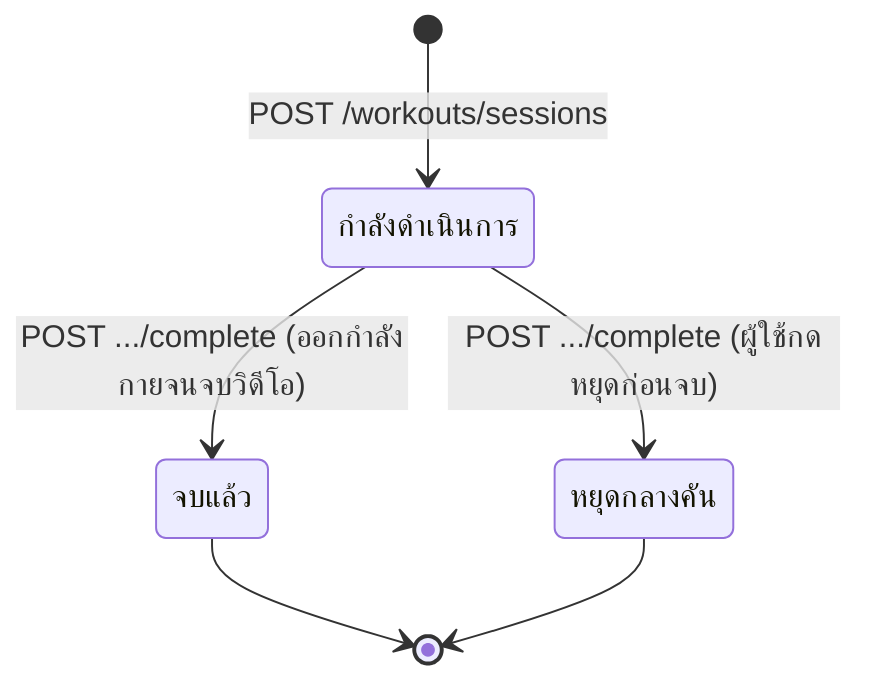
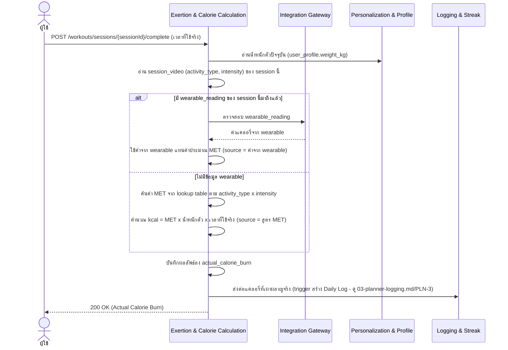
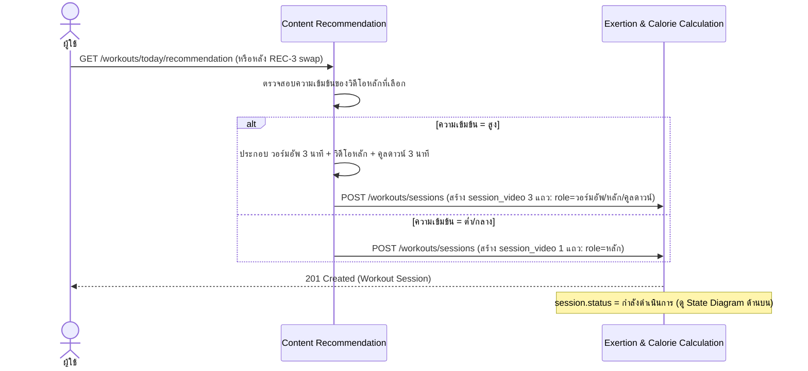

# Detailed Design — Daily YouTube Recommendation (Conceptual)

- **ประเภทเอกสาร:** Detailed Design — Conceptual (ไม่ผูก technical stack)
- **สถานะเอกสาร:** Draft
- **วันที่สร้าง:** 2026-08-28
- **อัปเดตล่าสุด:** 2026-08-31 — audit เทียบกับโค้ดจริงที่เพิ่ง ship (commit `b463436`,
  `apps/web/server/services/youtube.ts` + `videoRecommender.ts`) พบว่า**เนื้อหาหลักของ REC-1 ขัดกับ
  implementation จริง** — เอกสารเดิมอธิบายเป็น loop "ค้นหา → ไม่พบที่ตรงพอ → ขยายเกณฑ์ tolerance ตัวเลข →
  ค้นหาซ้ำ → จนถึงขีดจำกัด" แต่โค้ดจริงเป็น **single-pass**: ค้นหา YouTube ครั้งเดียว (สูงสุด 15 candidate,
  ระยะเวลาปานกลาง, safe search, ไม่รวมวิดีโอที่เคยแสดงแล้ว) → กรอง candidate ที่ embed ไม่ได้ออก → ส่งเข้า
  **ขั้นตอนจับคู่/ประเมินด้วย AI ครั้งเดียว** ที่เลือก candidate ที่ดีที่สุด 1 รายการแบบ best-effort (ไม่มี
  tolerance ตัวเลข ไม่มีการขยายเกณฑ์ ไม่มีการค้นหาซ้ำเลย) — คืน error เฉพาะเมื่อไม่มี candidate เหลือเลย
  หรือขั้นตอนจับคู่ไม่ได้ผลลัพธ์ที่ใช้งานได้ — **แก้ sequence diagram + อัลกอริทึมของ REC-1 (และปรับ REC-3 ให้
  อ้างชื่ออัลกอริทึมใหม่ตรงกัน) ให้ตรงกับพฤติกรรมจริง** และ**resolve จุดที่ยังไม่ได้ระบุ #1 เดิม** (ตัวเลข
  tolerance/ขีดจำกัดขยายเกณฑ์) เพราะคำตอบจริงคือ "ไม่มีตัวเลข tolerance — ใช้ขั้นตอนประเมินด้วย AI แบบ
  best-effort แทน" — mechanical re-sync หัวข้อ "ภาคผนวก: Stack Mapping" (แก้ข้อความ "Content Recommendation
  ปัจจุบันเป็น stub คืน `501`" ที่ล้าหลังไปแล้ว เป็นคำอธิบาย implementation จริงที่ ship แล้ว พร้อมระบุชื่อ
  บริการ AI ที่ใช้จริง — ข้อยกเว้นเดียวที่อนุญาตชื่อ stack จริง) — ไม่พบ drift อื่นใน REC-2/REC-4/State
  Diagram (ดู [log 2026-08-31](../../../05-log/20260831-log.md))
- **อัปเดตก่อนหน้า:** 2026-08-30 (รอบ 2) — mechanical re-sync หัวข้อ "ภาคผนวก: Stack Mapping" ให้ตรงกับ
  `tech-stack.md` §6.1 ฉบับล่าสุด (Express.js บน **Google Cloud Run** แทนที่ Firebase Cloud Functions เดิม
  — ยืนยันจากโค้ดจริง `apps/web/server/routes/*`) — เนื้อหาหลัก (sequence/state diagram/algorithm ของ
  REC-1/2/3/4) ไม่เปลี่ยนแปลงเพราะยัง conceptual ล้วน — ไม่กระทบจาก pairing-code mechanism เหมือนรอบก่อน (ดู
  [log 2026-08-30](../../../05-log/20260830-log.md))
- **อัปเดตก่อนหน้า:** 2026-08-30 (รอบ 1) — audit ตามการเปลี่ยนแปลงใน `high-level-architecture.md`/
  `api-spec.md`/`database-schema.md` (Identity Handoff — Pairing-Code Mechanism, entity/ตาราง
  `pairing_credential`) แล้วพบว่า**ไม่กระทบไฟล์นี้เลย** (กลไกนี้เป็น precondition เฉพาะของ INT-2/INT-3 ใน
  `04-smart-integrations.md` เท่านั้น ไม่เกี่ยวกับ REC-1/2/3/4) — ตรวจ "Firebase Cloud Function
  `sessionComplete`" ที่ปรากฏในเนื้อหาแล้วยืนยันว่าอยู่ใน "## ภาคผนวก: Stack Mapping" เท่านั้น (ไม่ใช่ในเนื้อหา
  หลัก — ไม่พบ main-body stack-name violation) — ไม่แตะภาคผนวก Stack Mapping ตามที่ผู้ใช้ยืนยันว่า
  `tech-stack.md` ยังไม่ reconcile จาก Firebase เดิมมาเป็น stack จริงตามโค้ด (**แก้ไขแล้วในรอบ 2 ด้านบน**)
- **อัปเดตก่อนหน้านั้น:** 2026-08-29 — sync ภาคผนวก Stack Mapping ให้ตรงกับ `tech-stack.md` ฉบับ Firebase ใหม่
  (audit เนื้อหาหลัก sequence/state diagram/algorithm ของ REC-1/2/3/4 แล้วไม่พบ drift)
- **สร้างโดย:** skill `detailed-design-builder`
- **อ้างอิงจาก:** [High Level Architecture](../high-level-architecture.md), [API Spec](../api-spec.md),
  [Database Schema](../database-schema.md), [Product Backlog](../../../01-requirements/backlog.md),
  [Requirement](../../../01-requirements/01-spec/20260823-02-daily-youtube-recommendation.md)

## ขอบเขตและหลักการ

เอกสารนี้เจาะจงกว่า API Spec/Database Schema อีกหนึ่งระดับ — **ยังคง conceptual ไม่ผูก technical stack**
sequence diagram ใช้ participant เป็น Conceptual Component จาก HLA หรือ actor ทั่วไปเท่านั้น (ไม่มีชื่อ
framework/service เฉพาะเจาะจง) อัลกอริทึมเขียนเป็นขั้นตอนภาษาธรรมชาติ/pseudocode เชิงแนวคิด ไม่ใช่โค้ดจริง

## State Diagram — Workout Session

`workout_session.status` มี state transition ที่มีความหมายพอสำหรับ REC-2/REC-4 (ผูกกับ Feature ที่ใช้
entity นี้ทั้งหมดในหน้านี้):



ทั้ง "จบแล้ว" และ "หยุดกลางคัน" ไป trigger `POST .../complete` เหมือนกัน — REC-2's algorithm (ด้านล่าง)
ใช้ "เวลาที่ใช้จริง" เป็น input เดียวกันในทั้งสองกรณี ไม่แยกสูตรคำนวณ (แค่ค่าที่ได้ต่างกันตามเวลาจริง)

## REC-1 — แนะนำวิดีโอตรงเป้าแคลอรี่รายวัน (REQ-04)

### Sequence Diagram

```mermaid
sequenceDiagram
    actor U as ผู้ใช้
    participant CR as Content Recommendation
    participant PP as Personalization & Profile
    participant PD as Planner & Day-Status
    participant YT as YouTube
    U->>CR: GET /workouts/today/recommendation
    CR->>PD: ตรวจสอบสถานะวันนี้ (day_status)
    alt วันนี้เป็น Cheat/Rest Day
        CR-->>U: 204 No Content (ไม่มีวิดีโอแนะนำ)
    else วันนี้เป็นวันปกติ
        CR->>PP: อ่าน equipment_selection + goal_selection.daily_calorie_target_kcal (หักด้วยแคลอรี่ที่
            เผาผลาญไปแล้ววันนี้ = เป้าหมายที่เหลือ)
        CR->>YT: ค้นหาวิดีโอครั้งเดียว (ระยะเวลาปานกลาง, safe search, ไม่รวมวิดีโอที่เคยแสดงแล้ววันนี้)
        YT-->>CR: รายการวิดีโอผู้สมัคร (candidate) สูงสุด 15 รายการ พร้อม metadata (ชื่อ/คำอธิบาย/ระยะเวลา)
        CR->>CR: กรอง candidate ที่เจ้าของปิดการฝัง (embed) ออก
        alt ไม่มี candidate เหลือเลย
            CR-->>U: 409 Conflict (ไม่พบวิดีโอที่ใช้ได้)
        else มี candidate อย่างน้อย 1 รายการ
            CR->>CR: ขั้นตอนจับคู่/ประเมินด้วย AI ครั้งเดียว — เลือก candidate ที่เหมาะสมที่สุด 1 รายการ
                พร้อมประเมินความเข้มข้น/แคลอรี่โดยประมาณจากชื่อ+คำอธิบาย+ระยะเวลา เทียบกับอุปกรณ์ที่มีและ
                เป้าหมายแคลอรี่ที่เหลือ (best-effort ไม่ใช่ hard tolerance)
            alt ขั้นตอนจับคู่ไม่ได้ผลลัพธ์ที่ใช้งานได้ (เช่น parse ไม่ผ่าน หรือ id ที่เลือกไม่ตรงกับ candidate จริง)
                CR-->>U: 409 Conflict (ไม่พบวิดีโอที่ตรงพอ)
            else จับคู่สำเร็จ
                CR-->>U: 200 OK (Video/Workout Content ที่จับคู่ + ความเข้มข้น/แคลอรี่โดยประมาณ)
            end
        end
    end
```

### อัลกอริทึม — ค้นหาวิดีโอครั้งเดียว + จับคู่ด้วย AI (single-pass, ไม่มี tolerance ตัวเลข)

> **ยืนยันแล้ว (แก้จากเดิม 2026-08-31 ตามพฤติกรรมจริงที่ ship แล้ว)**: ไม่มีตัวเลข tolerance การจับคู่
> วิดีโอ-แคลอรี่ และไม่มีการขยายเกณฑ์ค้นหาซ้ำแต่อย่างใด — ระบบค้นหาเพียงครั้งเดียวแล้วให้ขั้นตอนจับคู่ด้วย AI
> ประเมิน/เลือกแบบ best-effort จากผลลัพธ์ที่ได้ในรอบเดียว (แก้ "จุดที่ยังไม่ได้ระบุ" เดิมข้อ 1 ให้เป็นข้อเท็จ
> จริงนี้แทน)

1. อ่านเป้าหมายแคลอรี่รายวันที่เหลือ (เป้าหมายรายวัน ปรับตาม Cheat/Rest Day แล้วถ้ามี ลบด้วยแคลอรี่ที่
   เผาผลาญไปแล้ววันนี้) และโปรไฟล์อุปกรณ์ของผู้ใช้
2. ค้นหาวิดีโอจากภายนอก (YouTube) **ครั้งเดียว** จำกัดผลลัพธ์ไม่เกิน 15 รายการ ระยะเวลาปานกลาง เปิด safe
   search และไม่รวมวิดีโอที่เคยแสดงให้ผู้ใช้คนนี้ไปแล้วในวันนี้ (ทั้งวิดีโอที่กำลังแสดงอยู่และวิดีโอที่เคยถูก
   ปฏิเสธไปแล้วผ่าน REC-3)
3. กรอง candidate ที่เจ้าของวิดีโอปิดการฝัง (embed) ออกจากรายการ — ถ้าไม่มี candidate เหลือเลย → คืน error
   ว่าไม่พบวิดีโอที่ใช้ได้ **ทันที ไม่มีการค้นหาซ้ำหรือขยายเกณฑ์ใดๆ**
4. ส่ง candidate ที่เหลือทั้งหมดเข้าสู่ขั้นตอนจับคู่/ประเมินด้วย AI ครั้งเดียว โดยให้บริบทเป็นอุปกรณ์ที่มี
   และเป้าหมายแคลอรี่ที่เหลือของผู้ใช้ ขั้นตอนนี้ประเมินจากชื่อ คำอธิบาย และระยะเวลาของวิดีโอเท่านั้น (ไม่มี
   ข้อมูล view/like count ให้ใช้) แบบ best-effort แล้วเลือก candidate **หนึ่งรายการ**ที่เหมาะสมที่สุด พร้อม
   ประเมินประเภทกิจกรรม ความเข้มข้น และแคลอรี่โดยประมาณของวิดีโอนั้น
5. ถ้าขั้นตอนจับคู่ไม่สามารถสรุปผลลัพธ์ที่ใช้ได้ (ไม่ได้คำตอบกลับมา, ผลลัพธ์ไม่ผ่านการตรวจรูปแบบ, หรือ id
   ที่เลือกไม่ตรงกับ candidate จริง) → คืน error ว่าไม่พบวิดีโอที่ตรงพอ (ไม่มีการลองใหม่)
6. เมื่อจับคู่สำเร็จ → ส่งต่อวิดีโอที่เลือกพร้อมความเข้มข้นที่ประเมินได้ให้ REC-4 ตรวจสอบว่าต้องประกอบ
   warmup/cooldown เพิ่มหรือไม่ ก่อนส่งคืนผู้ใช้

## REC-2 — คำนวณแคลอรี่เผาผลาญจริง (REQ-05)

### Sequence Diagram



### อัลกอริทึม — คำนวณแคลอรี่เผาผลาญ (MET + wearable override)

1. รับเวลาที่ใช้จริงจากผู้ใช้ (วินาที/นาที) — ยังไม่ระบุว่ารวมเวลา warmup/cooldown ของ REC-4 หรือไม่ (ดู
   "จุดที่ยังไม่ได้ระบุ")
2. ตรวจสอบว่ามีข้อมูล wearable (`wearable_reading`) ของ session นี้มาถึงแล้วหรือยัง
3. ถ้ามี → ใช้ค่าแคลอรี่จาก wearable โดยตรง เก็บ `actual_calorie_burn.source = ค่าจาก wearable`
4. ถ้าไม่มี → ค้นค่า MET จาก lookup table ตามประเภทกิจกรรม×ความเข้มข้นของวิดีโอหลัก (ค่า MET จริงต่อ
   ประเภทยังไม่ resolve เป็นทางการ — ดู "จุดที่ยังไม่ได้ระบุ") แล้วคำนวณ
   `kcal = MET × น้ำหนักตัว(kg) × เวลาที่ใช้จริง(ชม.)`
5. บันทึกผลลัพธ์สุดท้ายลง `actual_calorie_burn`
6. ส่งต่อค่านี้ให้ Logging & Streak เพื่อประเมิน Daily Log (ดู `03-planner-logging.md` § PLN-3)

## REC-3 — เปลี่ยนวิดีโอโดยคงเป้าแคลอรี่เดิม (REQ-06)

### Sequence Diagram

```mermaid
sequenceDiagram
    actor U as ผู้ใช้
    participant CR as Content Recommendation
    participant YT as YouTube
    U->>CR: POST /workouts/today/recommendation/swap (id วิดีโอที่ปฏิเสธสะสม)
    CR->>CR: คงเป้าหมายแคลอรี่เดิมไว้ (ไม่ดึงเป้าหมายใหม่)
    CR->>YT: ค้นหาวิดีโอใหม่ครั้งเดียว (filter อุปกรณ์เดิม + เป้าหมายเดิม, ไม่รวมวิดีโอปัจจุบันและวิดีโอที่
        ถูกปฏิเสธไปก่อนหน้านี้ทั้งหมด)
    alt ไม่พบวิดีโอใหม่ที่ใช้ได้เลย หรือขั้นตอนจับคู่ด้วย AI ไม่ได้ผลลัพธ์ที่ใช้งานได้ (ใช้อัลกอริทึมค้นหา+
        จับคู่เดียวกับ REC-1 — single-pass ไม่มีการขยายเกณฑ์)
        CR-->>U: 409 Conflict (ไม่พบวิดีโอที่ตรงพอ)
    else พบวิดีโอใหม่
        CR->>CR: บันทึกวิดีโอที่เพิ่งถูกปฏิเสธลง session_rejected_video
        CR-->>U: 200 OK (Video/Workout Content ใหม่)
    end
```

ไม่มีอัลกอริทึมแยก — ใช้อัลกอริทึม "ค้นหาวิดีโอครั้งเดียว + จับคู่ด้วย AI (single-pass, ไม่มี tolerance
ตัวเลข)" เดียวกับ REC-1 เพียงเพิ่มเงื่อนไขไม่รวมวิดีโอใน `session_rejected_video` (และวิดีโอปัจจุบัน) เข้าไป
ในการค้นหา

## REC-4 — วอร์มอัพ-คูลดาวน์อัตโนมัติ (REQ-07)

### Sequence Diagram



ไม่มีอัลกอริทึมแยก — เป็นเงื่อนไขเดียว (ความเข้มข้น = สูง หรือไม่) ครอบคลุมอยู่ใน sequence diagram แล้ว

## จุดที่ยังไม่ได้ระบุ / ควรยืนยันเพิ่มเติม

1. **REC-2/REC-4**: เวลา/แคลอรี่ของวอร์มอัพ-คูลดาวน์นับรวมเข้ากับเป้าหมายรายวัน (ที่ PLN-3 ใช้ประเมิน)
   หรือไม่ยังไม่ระบุ — กระทบว่า "เวลาที่ใช้จริง" ใน REC-2's algorithm ควรรวมหรือไม่รวมช่วงนี้
2. **REC-2**: ค่า MET จริงต่อประเภทกิจกรรม×ความเข้มข้นยังไม่ resolve เป็นทางการใน `01-spec/`

> **แก้ไขแล้ว (เดิมเป็นข้อ 1)**: "REC-1/REC-3: ตัวเลข tolerance การจับคู่วิดีโอ-แคลอรี่ และขีดจำกัดของการขยาย
> เกณฑ์ค้นหายังไม่ระบุ" — **resolve แล้วเมื่อ 2026-08-31** จากการ audit เทียบกับโค้ดจริงที่ ship แล้ว: คำตอบ
> จริงคือ**ไม่มีตัวเลข tolerance และไม่มีการขยายเกณฑ์ค้นหาซ้ำเลย** ระบบค้นหาครั้งเดียวแล้วให้ขั้นตอนจับคู่ด้วย
> AI ประเมิน/เลือกแบบ best-effort แทน (ดูอัลกอริทึมของ REC-1 ด้านบน) — `api-spec.md` §4 ข้อ 1 ยังอ้างอิงคำ
> ว่า "tolerance ตัวเลขยังไม่ระบุ" อยู่ ซึ่งตอนนี้ล้าหลังไปแล้วเช่นกัน แนะนำให้รัน `api-db-spec-builder` เพื่อ
> อัปเดตข้อความนั้นให้ตรงกับข้อเท็จจริงนี้ด้วย

## ความสัมพันธ์กับเอกสารอื่น

- [High Level Architecture](../high-level-architecture.md) — component "Content Recommendation"
  (3.2), "Exertion & Calorie Calculation" (3.3), Flow 2 Daily Recommendation & Exercise Session Flow
  (4.2)
- [API Spec](../api-spec.md) — section 3.2 Content Recommendation, 3.3 Exertion & Calorie Calculation
- [Database Schema](../database-schema.md) — ตาราง `workout_session`, `session_video`,
  `session_rejected_video`, `actual_calorie_burn`, `wearable_reading`
- [Product Backlog](../../../01-requirements/backlog.md), [Requirement](../../../01-requirements/01-spec/20260823-02-daily-youtube-recommendation.md) —
  REC-1/2/3/4, REQ-04/05/06/07
- [User Journeys](../../01-prototypes/user-journeys.md) — ลำดับ step ของ REC-1/2/3/4

## ภาคผนวก: Stack Mapping

> **หัวข้อนี้เป็นข้อยกเว้นเดียวในไฟล์นี้ที่มีชื่อเทคโนโลยีจริง** แหล่งที่มาและสิทธิ์แก้ไขจริงอยู่ที่
> [tech-stack.md](../tech-stack.md) เสมอ — หัวข้อข้างต้นยังคง conceptual ตามกติกาเดิมทุกประการ ถ้าทีม
> เปลี่ยน stack ในอนาคต ให้รัน `tech-stack-builder` ก่อน แล้วภาคผนวกนี้จะถูก sync ตามในการรัน
> `detailed-design-builder` ครั้งถัดไป

> **อัปเดต 2026-08-29**: มิเรอร์ใหม่จาก Supabase/PostgreSQL เป็น Firebase ตามการเปลี่ยน stack ใน
> `tech-stack.md` §2/§5 — เนื้อหาหลักข้างต้น (sequence/state diagram/algorithm ของ REC-1/2/3/4)
> **ไม่เปลี่ยนแปลง** เพราะยัง conceptual ล้วน ไม่ผูกกับ backend จริง

> **อัปเดต 2026-08-30 (รอบ 2)**: mechanical re-sync ทั้งหมดจาก Firebase Cloud Functions เป็น **Express.js
> บน Google Cloud Run** ตามการเปลี่ยน stack ใน `tech-stack.md` §2/§3/§6 (ยืนยันจากโค้ดจริง
> `apps/web/server/routes/*`) — เปลี่ยน execution ของ MET + wearable override (REC-2) จาก **React Native
> client** เป็น **React+Vite web client** เพราะ REC-* ทั้งหมดอยู่ใน `apps/web` (ไม่เคยย้าย ไม่ใช่ native-only
> capability) — เนื้อหาหลัก (sequence/state diagram/algorithm) **ไม่เปลี่ยนแปลง** เพราะยัง conceptual ล้วน

> **อัปเดต 2026-08-31**: แก้แถว **Content Recommendation** — เดิมระบุว่า "ปัจจุบันเป็น stub คืน `501` รอเรียก
> YouTube Data API v3 จริง" ซึ่งล้าหลังไปแล้วหลัง commit `b463436` — ตอนนี้ implement จริงและ ship แล้วเต็ม
> รูปแบบ (เรียก YouTube Data API v3 จริง + **Gemini** ทำการจับคู่/ประเมิน) จึงแก้ข้อความให้ตรงกับพฤติกรรมจริง
> พร้อมระบุชื่อ Gemini ในหัวข้อนี้ (ข้อยกเว้นเดียวที่อนุญาตชื่อ stack จริง) — สอดคล้องกับการแก้เนื้อหาหลัก
> REC-1 ด้านบนที่ resolve จุดที่ยังไม่ได้ระบุเดิมเรื่อง tolerance ไปพร้อมกัน — `tech-stack.md` §6.1 เอง (ไฟล์
> ต้นทางของภาคผนวกนี้) ยังใช้ถ้อยคำเดิมที่ล้าหลังเช่นกัน แนะนำให้รัน `tech-stack-builder` เพื่ออัปเดตแหล่งที่มา
> จริงด้วย (ดู [log 2026-08-31](../../../05-log/20260831-log.md))

มิเรอร์จาก [tech-stack.md § 6.1](../tech-stack.md#61-hlas-conceptual-component--expressjs--cloud-firestore-implementation)
(อัปเดต 2026-08-30) เฉพาะ Component ที่ปรากฏในไฟล์นี้:

| Conceptual Component | Concrete Implementation |
|---|---|
| Content Recommendation | **Express route** `GET /api/workouts/today/recommendation`, `POST /api/workouts/today/recommendation/swap`, `POST /api/workouts/sessions` (แทนที่ Cloud Function `recommendation` เดิม — `apps/web/server/routes/content-recommendation/index.ts`) เรียก YouTube Data API v3 จริง (`search.list` + `videos.list`, สูงสุด 15 candidate ต่อครั้ง — `apps/web/server/services/youtube.ts`) แล้วส่ง candidate ให้ **Gemini** (`@google/genai`, โมเดล `gemini-3.6-flash`) ทำขั้นตอนจับคู่/ประเมินความเข้มข้น-แคลอรี่แบบ best-effort ครั้งเดียว (`apps/web/server/services/videoRecommender.ts` — ไม่มี tolerance ตัวเลขหรือ retry loop ใดๆ, ยืนยันจากโค้ดจริง 2026-08-31) เก็บผลลัพธ์ที่เลือกและ `rejectedVideoIds` เป็น embedded field `todaysRecommendation` ใน document `users/{userId}` |
| Exertion & Calorie Calculation | คำนวณ MET ที่ client (React+Vite) ตาม NFR-01/03 → **Express route** `POST /api/workouts/sessions/:sessionId/complete` (แทนที่ Cloud Function `sessionComplete` เดิม — `apps/web/server/routes/exertion-calorie/index.ts`) validate + เขียน embedded map field `actualCalorieBurn` ลง document เดียวกัน; ค่าจาก wearable (INT-3) เขียนผ่าน **Express route** `POST /api/integrations/wearable/readings` เป็น embedded map field `wearableReading` — referential existence validation ผ่าน helper กลาง `apps/web/server/assertDocExists.ts` (แทนที่แนวคิดเดิมที่ให้แต่ละ Cloud Function `get()` เองแยกกัน) |

**Execution ของ algorithm**: ตาม [tech-stack.md § 4](../tech-stack.md#4-เหตุผลการเลือก-rationale)
(NFR-01/NFR-03 — client-side calculation) การคำนวณ **MET + wearable override (REC-2)** เกิดขึ้นฝั่ง
**React+Vite web client โดยตรง** (`apps/web/client`) เพื่อไม่มี network latency แล้วส่งผลลัพธ์ที่คำนวณแล้ว
ไปบันทึกผ่าน **Express route `POST /api/workouts/sessions/:sessionId/complete`** (แทนที่ Firebase Cloud
Function `sessionComplete` เดิม — ไม่ใช่เขียนตรงเข้า embedded field `actualCalorieBurn` ภายใน document
`workoutSessions/{sessionId}` จาก client เอง) เพื่อให้ route นั้น validate เป็นเกราะป้องกันชั้นที่สองฝั่ง
server เช่นเดิม รันบน **Google Cloud Run**
