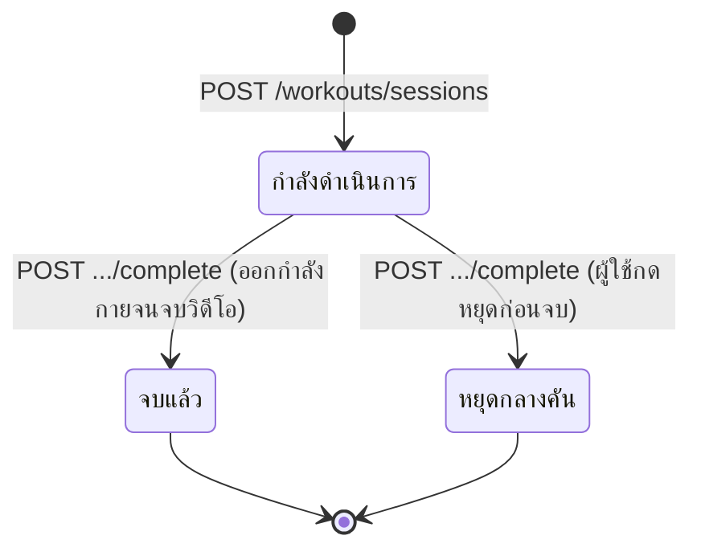
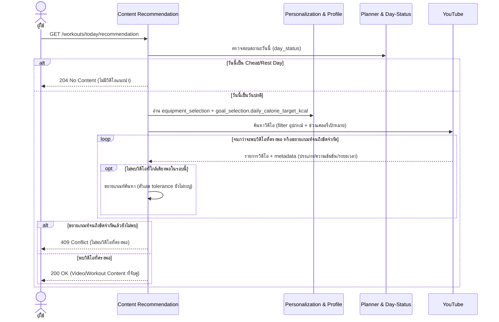
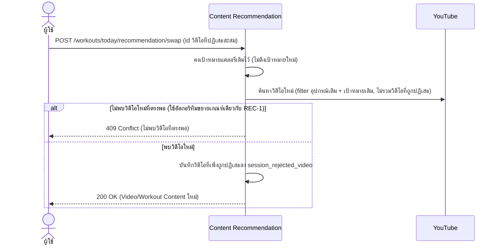
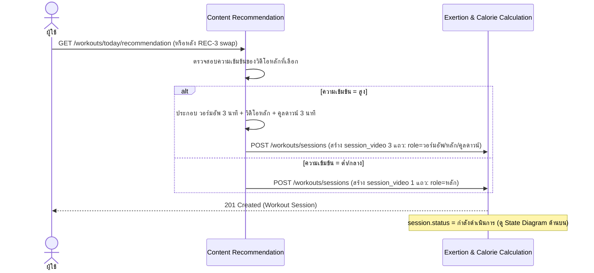

# Detailed Design — Daily YouTube Recommendation (Conceptual)

- **ประเภทเอกสาร:** Detailed Design — Conceptual (ไม่ผูก technical stack)
- **สถานะเอกสาร:** Draft
- **วันที่สร้าง:** 2026-08-28
- **สร้างโดย:** skill `detailed-design-builder`
- **อ้างอิงจาก:** [High Level Architecture](../high-level-architecture.md), [API Spec](../api-spec.md),
  [Database Schema](../database-schema.md), [Product Backlog](../../../01-requirements/backlog.md),
  [Requirement](../../../01-requirements/01-spec/20260823-02-daily-youtube-recommendation.md)

## ขอบเขตและหลักการ

เอกสารนี้เจาะจงกว่า API Spec/Database Schema อีกหนึ่งระดับ — **ยังคง conceptual ไม่ผูก technical stack**
sequence diagram ใช้ participant เป็น Conceptual Component จาก HLA หรือ actor ทั่วไปเท่านั้น (ไม่มีชื่อ
framework/service เฉพาะเจาะจง) อัลกอริทึมเขียนเป็นขั้นตอนภาษาธรรมชาติ/pseudocode เชิงแนวคิด ไม่ใช่โค้ดจริง

## State Diagram — Workout Session

`workout_session.status` มี state transition ที่มีความหมายพอสำหรับ REC-2/REC-4 (ผูกกับ Feature ที่ใช้
entity นี้ทั้งหมดในหน้านี้):

ทั้ง "จบแล้ว" และ "หยุดกลางคัน" ไป trigger `POST .../complete` เหมือนกัน — REC-2's algorithm (ด้านล่าง)
ใช้ "เวลาที่ใช้จริง" เป็น input เดียวกันในทั้งสองกรณี ไม่แยกสูตรคำนวณ (แค่ค่าที่ได้ต่างกันตามเวลาจริง)

## REC-1 — แนะนำวิดีโอตรงเป้าแคลอรี่รายวัน (REQ-04)

### Sequence Diagram

### อัลกอริทึม — จับคู่วิดีโอ + ขยายเกณฑ์ค้นหา

1. อ่านเป้าหมายแคลอรี่รายวันปัจจุบัน (ปรับตาม Cheat/Rest Day แล้วถ้ามี) และโปรไฟล์อุปกรณ์
2. filter คลังวิดีโอด้วยอุปกรณ์ที่มี (ตัดวิดีโอที่ต้องใช้อุปกรณ์ซึ่งผู้ใช้ไม่มีออก)
3. ค้นหาวิดีโอที่แคลอรี่ประมาณใกล้เคียงเป้าหมายที่สุดภายใน tolerance ที่กำหนด (ค่า tolerance ตัวเลขจริง
   ยังไม่ resolve เป็นทางการ — ดู "จุดที่ยังไม่ได้ระบุ")
4. ถ้าไม่พบวิดีโอที่อยู่ใน tolerance → ขยายเกณฑ์ค้นหา (เช่น เพิ่มช่วงที่ยอมรับได้) แล้วค้นหาซ้ำ
5. ถ้าขยายเกณฑ์จนถึงขีดจำกัดแล้วยังไม่พบ (ขีดจำกัดยังไม่ระบุ) → คืน error ว่าไม่พบวิดีโอที่ตรงพอ
6. เมื่อพบวิดีโอที่ตรงพอ → ส่งต่อให้ REC-4 ตรวจสอบความเข้มข้นก่อนส่งคืนผู้ใช้

## REC-2 — คำนวณแคลอรี่เผาผลาญจริง (REQ-05)

### Sequence Diagram

### อัลกอริทึม — คำนวณแคลอรี่เผาผลาญ (MET + wearable override)

1. รับเวลาที่ใช้จริงจากผู้ใช้ (วินาที/นาที) — ยังไม่ระบุว่ารวมเวลา warmup/cooldown ของ REC-4 หรือไม่ (ดู
   "จุดที่ยังไม่ได้ระบุ")
2. ตรวจสอบว่ามีข้อมูล wearable (`wearable_reading`) ของ session นี้มาถึงแล้วหรือยัง
3. ถ้ามี → ใช้ค่าแคลอรี่จาก wearable โดยตรง เก็บ `actual_calorie_burn.source = ค่าจาก wearable`
4. ถ้าไม่มี → ค้นค่า MET จาก lookup table ตามประเภทกิจกรรม×ความเข้มข้นของวิดีโอหลัก (ค่า MET จริงต่อ
   ประเภทยังไม่ resolve เป็นทางการ — ดู "จุดที่ยังไม่ได้ระบุ") แล้วคำนวณ
   `kcal = MET × น้ำหนักตัว(kg) × เวลาที่ใช้จริง(ชม.)`
5. บันทึกผลลัพธ์สุดท้ายลง `actual_calorie_burn`
6. ส่งต่อค่านี้ให้ Logging & Streak เพื่อประเมิน Daily Log (ดู `planner-logging.md` § PLN-3)

## REC-3 — เปลี่ยนวิดีโอโดยคงเป้าแคลอรี่เดิม (REQ-06)

### Sequence Diagram

ไม่มีอัลกอริทึมแยก — ใช้อัลกอริทึม "จับคู่วิดีโอ + ขยายเกณฑ์ค้นหา" เดียวกับ REC-1 เพียงเพิ่มเงื่อนไขไม่รวม
วิดีโอใน `session_rejected_video` เข้าไปในการค้นหา

## REC-4 — วอร์มอัพ-คูลดาวน์อัตโนมัติ (REQ-07)

### Sequence Diagram

ไม่มีอัลกอริทึมแยก — เป็นเงื่อนไขเดียว (ความเข้มข้น = สูง หรือไม่) ครอบคลุมอยู่ใน sequence diagram แล้ว

## จุดที่ยังไม่ได้ระบุ / ควรยืนยันเพิ่มเติม

1. **REC-1/REC-3**: ตัวเลข tolerance การจับคู่วิดีโอ-แคลอรี่ และขีดจำกัดของการขยายเกณฑ์ค้นหายังไม่ระบุ
2. **REC-2/REC-4**: เวลา/แคลอรี่ของวอร์มอัพ-คูลดาวน์นับรวมเข้ากับเป้าหมายรายวัน (ที่ PLN-3 ใช้ประเมิน)
   หรือไม่ยังไม่ระบุ — กระทบว่า "เวลาที่ใช้จริง" ใน REC-2's algorithm ควรรวมหรือไม่รวมช่วงนี้
3. **REC-2**: ค่า MET จริงต่อประเภทกิจกรรม×ความเข้มข้นยังไม่ resolve เป็นทางการใน `01-spec/`

## ความสัมพันธ์กับเอกสารอื่น

- [High Level Architecture](../high-level-architecture.md) — component "Content Recommendation"
  (3.2), "Exertion & Calorie Calculation" (3.3), Flow 2 Daily Recommendation & Exercise Session Flow
  (4.2)
- [API Spec](../api-spec.md) — section 3.2 Content Recommendation, 3.3 Exertion & Calorie Calculation
- [Database Schema](../database-schema.md) — ตาราง `workout_session`, `session_video`,
  `session_rejected_video`, `actual_calorie_burn`, `wearable_reading`
- [Product Backlog](../../../01-requirements/backlog.md), [Requirement](../../../01-requirements/01-spec/20260823-02-daily-youtube-recommendation.md) —
  REC-1/2/3/4, REQ-04/05/06/07
- [User Journeys](../../01-prototypes/user-journeys.md) — ลำดับ step ของ REC-1/2/3/4

## ภาคผนวก: Stack Mapping

> **หัวข้อนี้เป็นข้อยกเว้นเดียวในไฟล์นี้ที่มีชื่อเทคโนโลยีจริง** แหล่งที่มาและสิทธิ์แก้ไขจริงอยู่ที่
> [tech-stack.md](../tech-stack.md) เสมอ — หัวข้อข้างต้นยังคง conceptual ตามกติกาเดิมทุกประการ ถ้าทีม
> เปลี่ยน stack ในอนาคต ให้รัน `tech-stack-builder` ก่อน แล้วภาคผนวกนี้จะถูก sync ตามในการรัน
> `detailed-design-builder` ครั้งถัดไป

มิเรอร์จาก [tech-stack.md § 6.1](../tech-stack.md#61-hlas-conceptual-component--supabase-implementation)
(2026-08-28) เฉพาะ Component ที่ปรากฏในไฟล์นี้:

| Conceptual Component | Concrete Implementation |
|---|---|
| Content Recommendation | Edge Function `recommendation` เรียก YouTube Data API v3 + ตรรกะ matching/widen-retry |
| Exertion & Calorie Calculation | คำนวณ MET ที่ client (React Native) ตาม NFR-01/03 → Edge Function `session-complete` validate + เขียน `actual_calorie_burn` |

**Execution ของ algorithm**: ตาม [tech-stack.md § 4](../tech-stack.md#4-เหตุผลการเลือก-rationale)
(NFR-01/NFR-03 — client-side calculation) การคำนวณ **MET + wearable override (REC-2)** เกิดขึ้นฝั่ง
**React Native client โดยตรง** เพื่อไม่มี network latency แล้วส่งผลลัพธ์ที่คำนวณแล้วไปบันทึกผ่าน
**Supabase Edge Function `session-complete`** (ไม่ใช่เขียนตรงเข้าตาราง `actual_calorie_burn` ผ่าน
PostgREST) เพื่อให้ Edge Function validate เป็นเกราะป้องกันชั้นที่สองฝั่ง server
