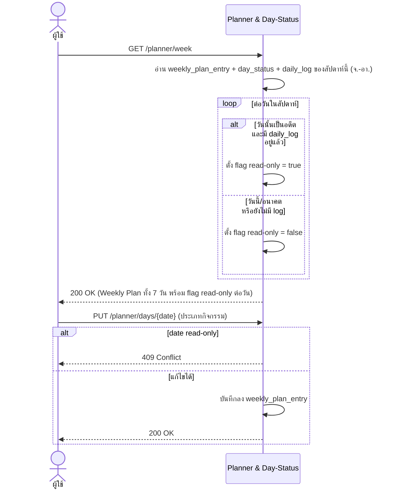
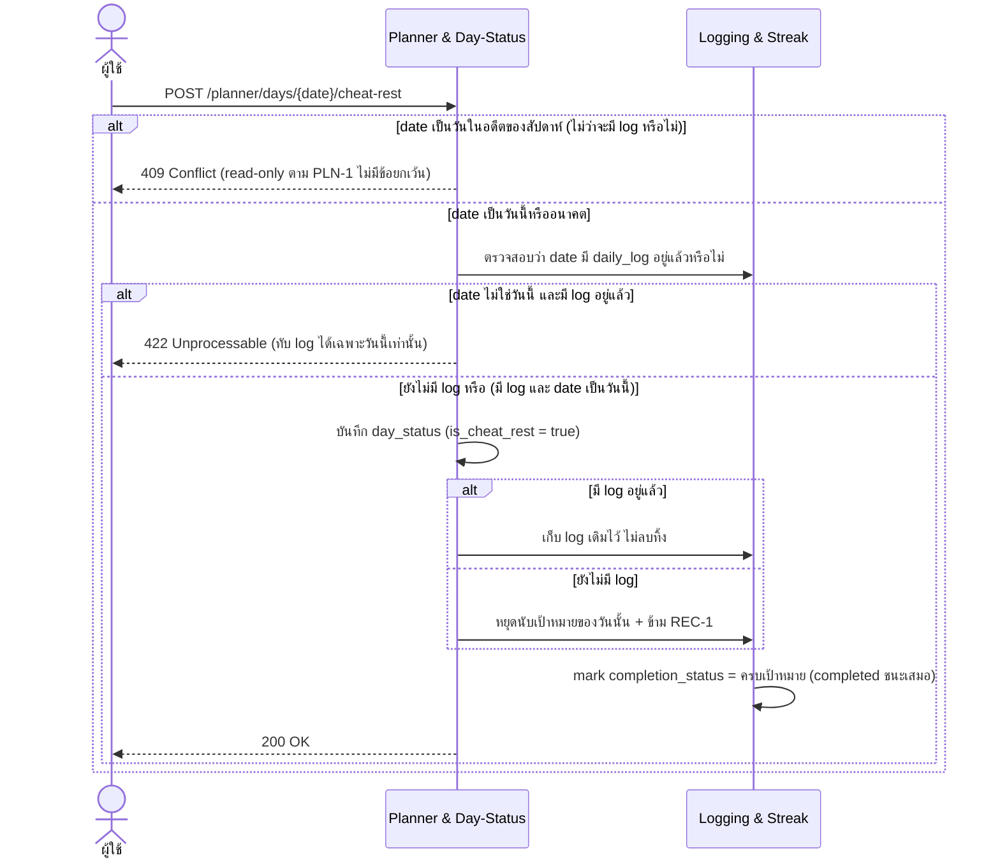
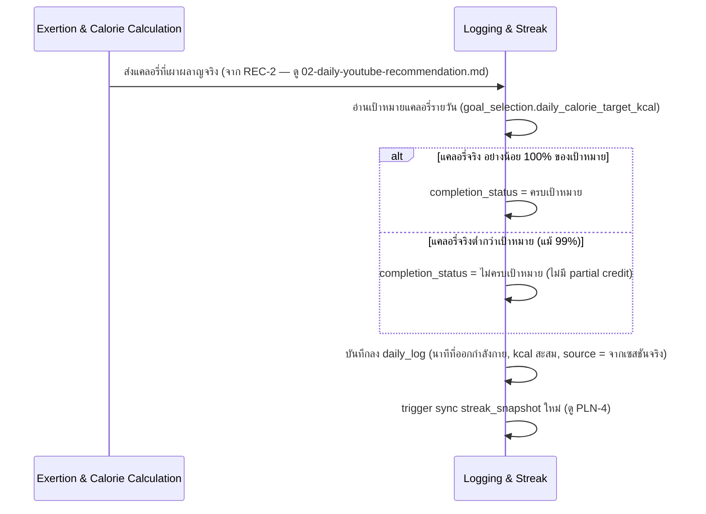
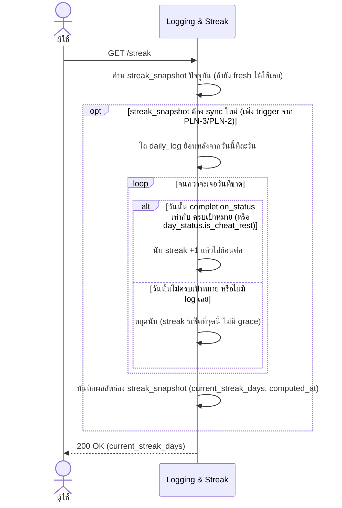

# Detailed Design — Planner & Logging (Conceptual)

- **ประเภทเอกสาร:** Detailed Design — Conceptual (ไม่ผูก technical stack)
- **สถานะเอกสาร:** Draft
- **วันที่สร้าง:** 2026-08-28
- **สร้างโดย:** skill `detailed-design-builder`
- **อ้างอิงจาก:** [High Level Architecture](../high-level-architecture.md), [API Spec](../api-spec.md),
  [Database Schema](../database-schema.md), [Product Backlog](../../../01-requirements/backlog.md),
  [Requirement](../../../01-requirements/01-spec/20260823-03-planner-logging.md)

## ขอบเขตและหลักการ

เอกสารนี้เจาะจงกว่า API Spec/Database Schema อีกหนึ่งระดับ — **ยังคง conceptual ไม่ผูก technical stack**
sequence diagram ใช้ participant เป็น Conceptual Component จาก HLA หรือ actor ทั่วไปเท่านั้น อัลกอริทึม
เขียนเป็นขั้นตอนภาษาธรรมชาติ/pseudocode เชิงแนวคิด ไม่ใช่โค้ดจริง

## PLN-1 — ปฏิทินวางแผนรายสัปดาห์ (REQ-08)

### Sequence Diagram

ไม่มีอัลกอริทึมแยก — การตัดสิน read-only เป็นเงื่อนไขเดียว (`plan_date < วันนี้ AND มี daily_log`)
ครอบคลุมอยู่ใน sequence diagram แล้ว

## PLN-2 — โหมด Cheat Day / Rest Day (REQ-09)

### Sequence Diagram

### อัลกอริทึม — ตัดสินสถานะ Cheat/Rest Day (nested check)

1. ตรวจสอบก่อน: `date` เป็นวันในอดีตของสัปดาห์ปัจจุบันหรือไม่ → ถ้าใช่ ปฏิเสธทันที (`409`, read-only ตาม
   PLN-1 ไม่มีข้อยกเว้นสำหรับ PLN-2)
2. ถ้า `date` เป็นวันนี้หรืออนาคต: ตรวจสอบว่ามี `daily_log` ของวันนั้นอยู่แล้วหรือไม่
3. ถ้ามี log อยู่แล้ว และ `date` ไม่ใช่วันนี้ → ปฏิเสธ (`422`, ทับ log ได้เฉพาะวันนี้เท่านั้น ตาม decision
   ที่ resolve แล้ว 2026-08-28)
4. ถ้ายังไม่มี log (ผ่านเงื่อนไขข้อ 1-3 มาแล้ว) → หยุดนับเป้าหมายแคลอรี่ของวันนั้น ข้าม REC-1
5. ถ้ามี log อยู่แล้ว และ `date` เป็นวันนี้ → เก็บ log เดิมไว้ทั้งหมด ไม่ลบทิ้ง
6. ไม่ว่ากรณีใด (ข้อ 4 หรือ 5) → mark สถานะวันนั้นเป็น "ครบเป้าหมาย" เสมอ ("completed ชนะเสมอ")
7. Streak ไม่ขาด ต่อเนื่องในวันถัดไปที่ออกกำลังกายจริง (ดู PLN-4)

## PLN-3 — บันทึกผลรายวันเมื่อครบเป้าหมาย (REQ-10)

### Sequence Diagram

### อัลกอริทึม — ประเมิน All-or-Nothing

1. รับแคลอรี่ที่เผาผลาญจริงจาก Exertion & Calorie Calculation (REC-2) หรือสถานะบังคับจาก Planner &
   Day-Status (PLN-2)
2. อ่านเป้าหมายแคลอรี่รายวันปัจจุบันของผู้ใช้
3. เปรียบเทียบ: ถ้าแคลอรี่จริง ≥ 100% ของเป้าหมาย → `completion_status = "ครบเป้าหมาย"`; มิฉะนั้น (แม้ต่ำ
   กว่าเพียง 1%) → `"ไม่ครบเป้าหมาย"` — **ไม่มีค่ากลาง ไม่มี partial credit ไม่ว่ากรณีใด**
4. สร้าง/อัปเดต `daily_log` ของวันนั้น (นาทีที่ออกกำลังกาย, kcal สะสม, สถานะ, source)
5. Trigger การ sync `streak_snapshot` ใหม่ (ดู PLN-4)

## PLN-4 — ติดตาม Streak ต่อเนื่อง (REQ-09, REQ-10)

### Sequence Diagram

### อัลกอริทึม — คำนวณ Streak (walk-back)

1. เริ่มจากวันนี้ ไล่ย้อนหลังทีละวันใน `daily_log` (ร่วมกับ `day_status`)
2. ต่อแต่ละวัน: ถ้าสถานะ = "ครบเป้าหมาย" (จาก log จริงหรือจาก Cheat/Rest Day override) → นับ streak +1
   แล้วไปวันก่อนหน้าต่อ
3. ถ้าเจอวันที่ "ไม่ครบเป้าหมาย" หรือไม่มี log เลย → หยุดทันที **ไม่มี grace period หรือ partial credit**
4. ค่า streak สุดท้าย = จำนวนวันต่อเนื่องที่นับได้ก่อนเจอจุดขาด
5. บันทึกผลลัพธ์ลง `streak_snapshot` พร้อม timestamp การคำนวณ

## จุดที่ยังไม่ได้ระบุ / ควรยืนยันเพิ่มเติม

1. **PLN-1**: ยังไม่มี requirement ระบุ pagination/ขอบเขตของการดู plan ย้อนหลังก่อนสัปดาห์ปัจจุบัน (นอก
   scope ของ fixed calendar week เดียว)

## ความสัมพันธ์กับเอกสารอื่น

- [High Level Architecture](../high-level-architecture.md) — component "Planner & Day-Status" (3.4),
  "Logging & Streak" (3.5), Flow 3 Weekly Planning & Day-Status Flow (4.3), Flow 4 Daily Logging &
  Streak Flow (4.4)
- [API Spec](../api-spec.md) — section 3.4 Planner & Day-Status, 3.5 Logging & Streak
- [Database Schema](../database-schema.md) — ตาราง `weekly_plan_entry`, `day_status`, `daily_log`,
  `streak_snapshot`
- [Product Backlog](../../../01-requirements/backlog.md), [Requirement](../../../01-requirements/01-spec/20260823-03-planner-logging.md) —
  PLN-1/2/3/4, REQ-08/09/10
- [User Journeys](../../01-prototypes/user-journeys.md) — ลำดับ step ของ PLN-1/2/3/4

## ภาคผนวก: Stack Mapping

> **หัวข้อนี้เป็นข้อยกเว้นเดียวในไฟล์นี้ที่มีชื่อเทคโนโลยีจริง** แหล่งที่มาและสิทธิ์แก้ไขจริงอยู่ที่
> [tech-stack.md](../tech-stack.md) เสมอ — หัวข้อข้างต้นยังคง conceptual ตามกติกาเดิมทุกประการ ถ้าทีม
> เปลี่ยน stack ในอนาคต ให้รัน `tech-stack-builder` ก่อน แล้วภาคผนวกนี้จะถูก sync ตามในการรัน
> `detailed-design-builder` ครั้งถัดไป

มิเรอร์จาก [tech-stack.md § 6.1](../tech-stack.md#61-hlas-conceptual-component--supabase-implementation)
(2026-08-28) เฉพาะ Component ที่ปรากฏในไฟล์นี้:

| Conceptual Component | Concrete Implementation |
|---|---|
| Planner & Day-Status | ตาราง `weekly_plan_entry`/`day_status` + Postgres view คำนวณ read-only flag + Edge Function `cheat-rest` (nested check ตาม Detailed Design) |
| Logging & Streak | ตาราง `daily_log`/`streak_snapshot` + Postgres function หรือ Edge Function สำหรับ recompute streak หลังทุกครั้งที่ log เปลี่ยน |

**Execution ของ algorithm**: ตาม [tech-stack.md § 4](../tech-stack.md#4-เหตุผลการเลือก-rationale)
(NFR-01/NFR-03 — client-side calculation) การคำนวณ **Streak walk-back (PLN-4)** เกิดขึ้นฝั่ง **React
Native client โดยตรง** เพื่อไม่มี network latency แล้วส่งผลลัพธ์ที่คำนวณแล้วไปบันทึกผ่าน server-side —
ตาม § 6.1 ด้านบน server-side ส่วนนี้อาจ implement เป็น Postgres function หรือ Supabase Edge Function
(`tech-stack.md` ยังไม่ได้ฟันธงระหว่างสองแบบนี้ — คำว่า "หรือ" ปรากฏตรงตัวใน § 6.1) เพื่อ recompute/
validate streak เป็นเกราะป้องกันชั้นที่สองฝั่ง server เช่นเดียวกับ ONB-1/REC-2
