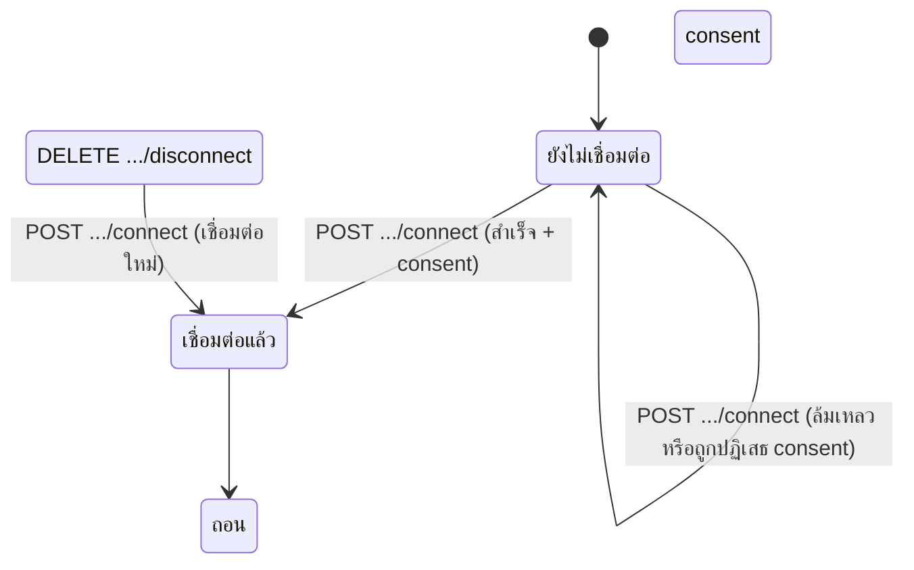
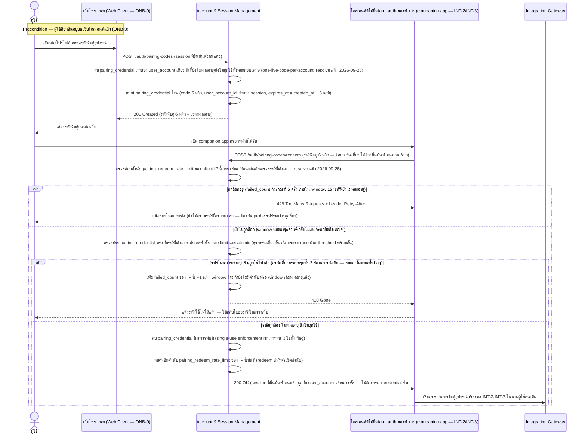
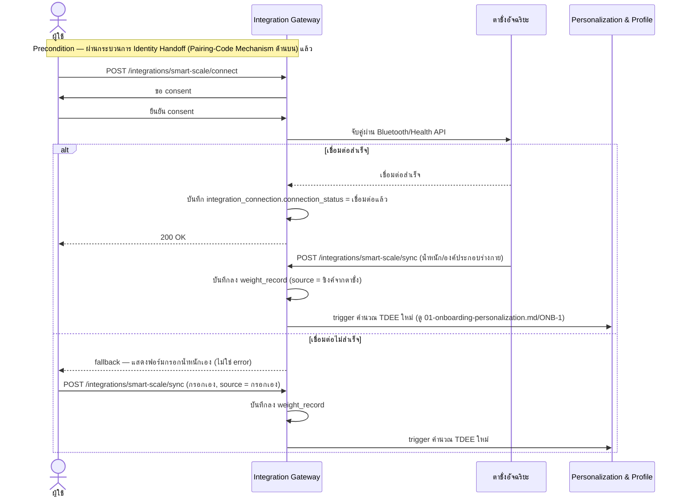
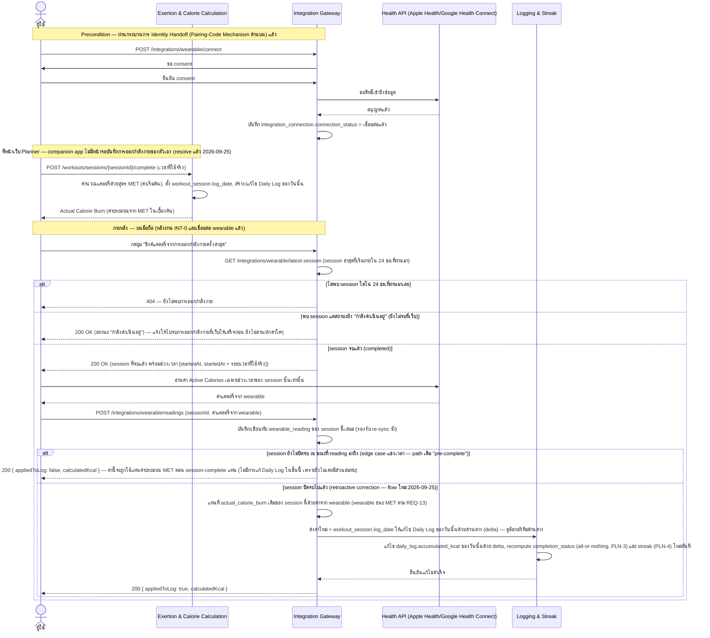

# Detailed Design — Smart Integrations (Conceptual)

- **ประเภทเอกสาร:** Detailed Design — Conceptual (ไม่ผูก technical stack)
- **สถานะเอกสาร:** Draft
- **วันที่สร้าง:** 2026-08-28
- **อัปเดตล่าสุด:** 2026-09-25 — `feature-list-journey`/`api-db-spec-writer` เพิ่งเติม 2 กติกาธุรกิจใหม่เข้า
  **INT-0/REQ-18** (rate limit เมื่อกรอกรหัสจับคู่ผิดซ้ำ + one-live-code-per-account) และ 1 กติกาใหม่เข้า
  **INT-3/REQ-13** (retroactive wearable sync ด้วย delta สำหรับ session ที่ปิดจบไปแล้ว) พร้อม operation ใหม่
  `GET /integrations/wearable/latest-session` — audit แล้วพบว่าเนื้อหาหลักของทั้ง 2 Feature ID ในไฟล์นี้
  ล้าหลังจาก upstream ทั้ง 3 ชั้น (Requirement/API Spec/Database Schema) จริง ไม่ใช่ข้อขัดแย้ง — แก้ไขดังนี้:
  (1) **INT-0 sequence diagram**: เพิ่มขั้นตอนตรวจสอบตัวนับ rate-limit (`pairing_redeem_rate_limit`,
  `database-schema.md` §3.20 ใหม่) **ก่อน**แม้แต่จะตรวจรหัสที่ส่งมา พร้อม `alt` block ใหม่ `429`+
  `Retry-After` เมื่อถูกล็อก, เพิ่มขั้นตอน invalidate รหัสเก่าทั้งหมดของบัญชีเดียวกันตอน mint รหัสใหม่
  (one-live-code-per-account), และทำให้ชัดว่า lookup+delete ของรหัส/ตัวนับ rate-limit เกิดขึ้นแบบ atomic
  (ธุรกรรมเดียวกัน) — เพิ่ม**อัลกอริทึมใหม่ "ตรวจสอบ Rate Limit การแลกรหัสจับคู่"** (ไม่เคยมีมาก่อน เพราะเดิม
  INT-0 เป็น lookup ตรงไปตรงมาไม่มี state ของตัวเอง) — resolve หมายเหตุเดิมที่เคยทิ้งไว้ว่ากติกา rate limit
  ยังไม่ resolve (ดู `01-spec/20260823-04-smart-integrations.md` § REQ-18 decision 2026-09-25) (2) **INT-3
  sequence diagram เขียนใหม่ทั้งหมด**: flow เดิมเข้าใจผิดว่า wearable reading มาถึง "ระหว่าง/หลังออกกำลังกาย"
  ก่อน session จะจบ (auto-sync) — flow จริงที่ resolve แล้ว 2026-09-25 คือผู้ใช้จบ session ที่เว็บ Planner
  ก่อนเสมอ (companion app ไม่มีหน้าจอบันทึกการออกกำลังกายของตัวเอง) แล้วมือถือกด "ซิงค์" เรียก
  `GET /integrations/wearable/latest-session` หา session ล่าสุดใน 24 ชม. ก่อนอ่าน/ส่งค่า — ถ้า session
  **ปิดจบไปแล้ว** ต้องแก้ไข `daily_log` ของวันที่ `workout_session.log_date` ระบุด้วย**ส่วนต่าง (delta)**
  เท่านั้น (retroactive correction, กัน double-count เมื่อ re-sync) แล้ว recompute completion/streak ทันที
  — คงเส้นทาง pre-complete เดิมไว้ด้วย (reading มาถึงก่อน complete → session-complete เลือกใช้ค่านั้นแทน MET
  ตามปกติ) — เพิ่ม**อัลกอริทึมใหม่ "แก้ไข Daily Log ย้อนหลังด้วยส่วนต่าง (Delta) เมื่อซิงค์ Wearable หลัง
  Session ปิดจบแล้ว"** (เดิมไม่มี เพราะ INT-3 เคยเป็น fallback flow ตรงไปตรงมา) (3) sync
  "ความสัมพันธ์กับเอกสารอื่น" ให้รวมตารางใหม่ `pairing_redeem_rate_limit` (§3.20) และ operation ใหม่
  `GET /integrations/wearable/latest-session` (4) **ภาคผนวก Stack Mapping**: `tech-stack.md` §6.1/§6.3.1
  (อัปเดตล่าสุด 2026-08-31) **ยังไม่ได้ sync กับ 3 กติกาใหม่นี้เลย** (ไม่มี mapping ของ
  `pairing_redeem_rate_limit`, การ invalidate รหัสเก่า, หรือ `GET .../latest-session`) — เพิ่มหมายเหตุ
  flag ว่า `tech-stack.md` เองล้าหลังจากจุดนี้ (ไม่ใช่ blocker ของรอบนี้) แนะนำให้รัน `tech-stack-builder`
  ต่อ ไม่ได้แก้ตาราง mapping เอง เพราะยังคง mirror เนื้อหาปัจจุบันของ `tech-stack.md` ตรงตัวอยู่ — audit ส่วน
  ที่เหลือของไฟล์ (State Diagram Integration Connection, INT-1, INT-2) แล้วไม่พบ drift อื่น (ดู
  [log 2026-09-25](../../../05-log/20260925-log.md))
- **อัปเดตก่อนหน้า:** 2026-08-31 — audit เทียบกับโค้ดจริงที่เพิ่ง ship (commit `b463436`,
  `apps/web/server/routes/insights-forecast/index.ts`) พบ 2 จุดที่ INT-1 เนื้อหาหลักขัดกับ implementation
  จริง: (1) **step 4 ของอัลกอริทึม "คำนวณวันพยากรณ์ถึงเป้าหมายน้ำหนัก" เขียนสูตรผิด** — เอกสารเดิมเขียนว่า
  "อัตราขาดดุลเฉลี่ยต่อวัน = ผลรวมส่วนต่าง (เป้าหมาย − แคลอรี่จริง) หารด้วยจำนวนวัน" ซึ่งกลับทิศความสัมพันธ์
  (ออกกำลังกายน้อยลงจะพยากรณ์ว่าน้ำหนักเปลี่ยนเร็วขึ้น ผิดหลักการ) — สูตรที่ถูกต้องและ ship จริง (ยืนยันจาก
  code comment ในไฟล์ข้างต้น ซึ่งระบุว่าผู้ใช้ยืนยันการแก้นี้แล้วเมื่อ 2026-08-31 ในอีก session หนึ่ง) คือ
  **ค่าเฉลี่ยของแคลอรี่ที่เผาผลาญจริงต่อวัน (accumulatedKcal ต่อวัน)** ตรงๆ ไม่ใช่ผลต่างจากเป้าหมาย — เพราะแอปนี้
  ติดตามเฉพาะแคลอรี่ที่เผาผลาญจากการออกกำลังกาย ไม่มีการบันทึกแคลอรี่จากอาหาร แก้ทั้ง step 4 ของอัลกอริทึมและ
  label ที่เกี่ยวข้องใน sequence diagram ให้ตรงกัน (2) **หัวข้อ "Execution ของ algorithm" และแถว "Insights &
  Forecast" ในภาคผนวก Stack Mapping อ้างผิดว่า INT-1 คำนวณฝั่ง client แล้วส่งผลลัพธ์มาบันทึก** — จริงๆ
  `GET /api/insights/forecast` เป็น bodyless GET request ที่ **server คำนวณทั้งหมดเอง** (อ่านเป้าหมายน้ำหนัก/
  ประวัติ log/น้ำหนักล่าสุด คำนวณอัตราขาดดุล-อัตราเปลี่ยนแปลงน้ำหนัก-วันที่คาดถึงเป้าหมาย แล้วบันทึกผลเอง)
  แก้ข้อความให้ตรงกับ execution จริงฝั่ง server (การอ้าง NFR-01/03 สำหรับ INT-1 เป็นการเข้าใจเกินจริงจากตอนที่
  เขียน section นี้ครั้งแรกโดย generalize จาก REC-2's MET calculation ซึ่งมีเหตุผล latency ระหว่างออกกำลังกาย
  จริง — INT-1 เป็นการพยากรณ์ "อีกกี่วันถึงเป้าหมาย" ที่ไม่มีความจำเป็นด้าน sub-250ms feedback แบบเดียวกัน) —
  แก้แถว "Insights & Forecast" ที่ระบุว่า "ปัจจุบันคืนค่า snapshot ที่มีอยู่ตรงๆ รอ implement การคำนวณจริง" ซึ่ง
  ล้าหลังไปแล้วเช่นกัน (implement จริงและ ship แล้วเต็มรูปแบบ) — ตรวจ `MIN_LOG_DAYS_FOR_FORECAST = 3` ในโค้ด
  แล้วยืนยันว่า**ยังไม่ใช่ decision ที่ resolve เป็นทางการ** (code comment ระบุว่าเป็นค่า placeholder เชิง
  ปฏิบัติ) — คงจุดที่ยังไม่ได้ระบุ #1 (จำนวนวัน log ขั้นต่ำ) ไว้เหมือนเดิม เพิ่มหมายเหตุอ้างอิงค่า placeholder
  นี้ประกอบ — ไม่พบ drift อื่นใน INT-0/2/3/State Diagram (ดู [log 2026-08-31](../../../05-log/20260831-log.md))
- **อัปเดตก่อนหน้า:** 2026-08-30 (รอบ 3) — Citation/grouping-only fix: `feature-journey-writer` เพิ่งตั้งกลไก
  pairing-code เป็นบทบัญญัติทางการ **REQ-18** พร้อม Feature ID ของตัวเอง **INT-0** (แทนที่การอ้างเป็น
  implicit precondition ของ REQ-12/REQ-13 เดิม) — แก้หัวข้อ "Identity Handoff — Pairing-Code Mechanism"
  ให้เป็นหัวข้อกลุ่ม Feature ID **`## INT-0 — ... (REQ-18)`** ตรงรูปแบบเดียวกับ INT-1/2/3 อื่น และแก้ list
  "ความสัมพันธ์กับเอกสารอื่น" ให้รวม INT-0/REQ-18 — ไม่แก้ตัว sequence diagram หรือเนื้อหาของ INT-2/INT-3
  เอง
- **อัปเดตก่อนหน้า:** 2026-08-30 (รอบ 2) — Reconcile 2 จุดตาม `tech-stack.md`/`api-spec.md`/`database-schema.md`
  ฉบับล่าสุดที่ยืนยันจากโค้ดจริง (`apps/web/server/routes/pairing/index.ts`): (1) **แก้ `alt` block ของ
  sequence diagram "Identity Handoff — Pairing-Code Mechanism"** จากเดิม 3 กรณีแยก
  (`404` ไม่พบ/`409` ถูกใช้แล้ว/`422` หมดอายุ) เป็น **`410 Gone` กรณีเดียวครอบคลุมทั้งสามสถานการณ์**
  (ไม่พบรหัสเลย/หมดอายุแล้ว/ถูกใช้ไปแล้ว) ให้ตรงกับ `api-spec.md` §3.1 ฉบับล่าสุดเป๊ะ (โค้ดจริงลบ document
  ทิ้งทันทีหลัง redeem สำเร็จ — delete-on-redeem — แทนการตั้ง flag `is_used` ทำให้ 3 สถานการณ์เดิมแยกออกจาก
  กันไม่ได้อีกต่อไปในทางปฏิบัติ) — แก้ step มินต์ให้ตรงกับ `database-schema.md` §3.17 ฉบับล่าสุดที่**ลบ column
  `is_used` ออกแล้ว**เช่นกัน (ไม่มี `is_used = false` ในขั้นตอน mint อีกต่อไป, ขั้นตอน redeem สำเร็จเปลี่ยนจาก
  "ตั้ง is_used = true" เป็น "ลบ pairing_credential ทิ้งถาวรทันที") — นี่คือการแก้เอกสารให้ตรงกับพฤติกรรมที่
  shipped ไปแล้วจริง ไม่ใช่การตัดสินใจ business rule ใหม่ (2) **mechanical re-sync หัวข้อ "ภาคผนวก: Stack
  Mapping"** ทั้งหมดให้ตรงกับ `tech-stack.md` §6.1/§6.2/§6.3 ฉบับล่าสุด (Express.js บน **Google Cloud Run**
  แทนที่ Firebase Cloud Functions เดิม) — audit ส่วนที่เหลือของไฟล์ (State Diagram Integration Connection,
  INT-1, INT-2, INT-3) แล้วไม่พบ drift อื่น (ดู [log 2026-08-30](../../../05-log/20260830-log.md))
- **อัปเดตก่อนหน้า:** 2026-08-30 (รอบ 1) — audit พบว่า `high-level-architecture.md` เพิ่มกลไกใหม่ **Identity
  Handoff — Pairing-Code Mechanism** (§4.5, component interaction ระหว่าง Account & Session Management ↔
  Integration Gateway) พร้อม entity ใหม่ **Pairing Credential** (§5), `api-spec.md` เพิ่ม 2 operations
  ใหม่ท้ายหัวข้อ 3.1 (`POST /auth/pairing-codes`, `POST /auth/pairing-codes/redeem`), และ
  `database-schema.md` เพิ่มตาราง `pairing_credential` (หัวข้อ 3.17) — แต่ไฟล์นี้ยังไม่มีเนื้อหารองรับเลย
  (เอกสารล้าหลัง ไม่ใช่ข้อขัดแย้ง) — เพิ่ม**ส่วนใหม่ "Identity Handoff — Pairing-Code Mechanism"** (ก่อน
  INT-2) พร้อม sequence diagram 1 ตัว ครอบคลุม mint (`POST /auth/pairing-codes`) → แสดงรหัสบนเว็บ → กรอก
  บนมือถือ → redeem (`POST /auth/pairing-codes/redeem`) พร้อม alt block ครบ 3 edge case
  (`404`/`409`/`422` ตาม `api-spec.md` §3.1 ณ ตอนนั้น — **แก้ไขแล้วในรอบ 2 ด้านบน**) → ส่งต่อเข้ากระบวนการ
  จริงของ INT-2/INT-3 — **ไม่ทำ State Diagram แยกสำหรับ Pairing Credential** (มีเพียง `is_used` เป็น
  `boolean` ไม่ใช่ `enum` หลายค่า ไม่เข้าเกณฑ์ state diagram ที่ต้องอิงกับ `enum` จริงตามกติกาของเอกสารนี้ —
  เทียบเคียงกับเหตุผลเดียวกันที่ User Account ใน `01-onboarding-personalization.md` ก็ไม่มี state diagram)
  เพิ่ม `Note` precondition ใน sequence diagram ของ INT-2/INT-3 ทั้งคู่ให้ชี้กลับมาที่ diagram ใหม่นี้ และ
  เพิ่มตาราง `pairing_credential` ในหัวข้อ "ความสัมพันธ์กับเอกสารอื่น" — **ไม่แตะหัวข้อ "ภาคผนวก: Stack
  Mapping"** ตามที่ผู้ใช้ยืนยันว่า `tech-stack.md` ยังไม่ reconcile จาก Firebase เดิมมาเป็น stack จริงตามโค้ด
  รอรวมกับงาน reconcile อื่นทั้งหมดในรอบ `tech-stack-builder` ถัดไป — audit ส่วนที่เหลือของไฟล์ (State
  Diagram Integration Connection, INT-1) แล้วไม่พบ drift อื่น (ดู
  [log 2026-08-30](../../../05-log/20260830-log.md))
- **อัปเดตก่อนหน้า:** 2026-08-29 — sync ภาคผนวก Stack Mapping ให้ตรงกับ `tech-stack.md` ฉบับ Firebase ใหม่ และ
  แก้ label ของ State Diagram (Integration Connection) ให้ตรงกับ `enum` จริงใน `database-schema.md` §3.15
  (audit เนื้อหาหลัก sequence/state diagram/algorithm ของ INT-1/2/3 ส่วนอื่นแล้วไม่พบ drift)
- **สร้างโดย:** skill `detailed-design-builder`
- **อ้างอิงจาก:** [High Level Architecture](../high-level-architecture.md), [API Spec](../api-spec.md),
  [Database Schema](../database-schema.md), [Product Backlog](../../../01-requirements/backlog.md),
  [Requirement](../../../01-requirements/01-spec/20260823-04-smart-integrations.md)

## ขอบเขตและหลักการ

เอกสารนี้เจาะจงกว่า API Spec/Database Schema อีกหนึ่งระดับ — **ยังคง conceptual ไม่ผูก technical stack**
sequence diagram ใช้ participant เป็น Conceptual Component จาก HLA หรือ actor ทั่วไปเท่านั้น (รวมถึงชื่อ
ระบบภายนอกที่ requirement กำหนดไว้แล้ว เช่น YouTube, Health API — ไม่ถือเป็นการผูก stack) อัลกอริทึม
เขียนเป็นขั้นตอนภาษาธรรมชาติ/pseudocode เชิงแนวคิด ไม่ใช่โค้ดจริง

## State Diagram — Integration Connection

`integration_connection.connection_status` มี state transition ที่มีความหมายพอสำหรับทั้ง INT-2 และ
INT-3 (ใช้ enum เดียวกัน แค่ `integration_type` ต่างกัน):



## INT-1 — พยากรณ์วันถึงเป้าหมายน้ำหนัก (REQ-11)

### Sequence Diagram

```mermaid
sequenceDiagram
    actor U as ผู้ใช้
    participant IF as Insights & Forecast
    participant PP as Personalization & Profile
    participant LS as Logging & Streak
    U->>IF: GET /insights/forecast
    IF->>PP: ตรวจสอบ goal_selection.target_weight_kg
    alt ไม่มีน้ำหนักเป้าหมาย
        IF-->>U: 422 Unprocessable (ให้ไปกรอกที่ ONB-3/โปรไฟล์)
    else มีน้ำหนักเป้าหมาย
        IF->>LS: ตรวจสอบจำนวนวัน log สะสม
        alt log สะสมไม่พอ (จำนวนขั้นต่ำยังไม่ระบุ)
            IF-->>U: 422 Unprocessable (ต้องสะสมข้อมูลเพิ่ม)
        else log สะสมเพียงพอ
            IF->>LS: ดึงประวัติ daily_log จริง (แคลอรี่ที่เผาผลาญจริงต่อวัน)
            IF->>IF: คำนวณค่าเฉลี่ยแคลอรี่ที่เผาผลาญจริงต่อวัน (average daily deficit — ค่าเฉลี่ยตรงๆ
                ไม่ใช่ผลต่างจากเป้าหมาย เพราะแอปติดตามเฉพาะแคลอรี่เผาผลาญ ไม่มีการบันทึกแคลอรี่จากอาหาร)
            IF->>IF: แปลงเป็นอัตราเปลี่ยนแปลงน้ำหนัก (7,700 kcal ประมาณ 1 กก.)
            IF->>IF: คำนวณวันที่คาดถึงเป้าหมาย
            IF->>IF: บันทึกลง weight_forecast_snapshot
            IF-->>U: 200 OK (วันที่คาดการณ์ + อัตราขาดดุลเฉลี่ย)
        end
    end
```

### อัลกอริทึม — คำนวณวันพยากรณ์ถึงเป้าหมายน้ำหนัก

> **แก้ไขแล้ว (2026-08-31)**: step 4 เดิมเขียนสูตรผิดเป็นผลต่างจากเป้าหมาย (เป้าหมาย − แคลอรี่จริง) ซึ่งกลับ
> ทิศความสัมพันธ์ — สูตรที่ถูกต้องและ ship จริงคือ**ค่าเฉลี่ยของแคลอรี่ที่เผาผลาญจริงต่อวันตรงๆ** (ไม่มีการลบ
> จากเป้าหมายใดๆ) เพราะแอปนี้ติดตามเฉพาะแคลอรี่ที่เผาผลาญจากการออกกำลังกาย ไม่มีการบันทึกแคลอรี่จากอาหาร
> "ขาดดุลจริงต่อวัน" จึงเท่ากับแคลอรี่ที่เผาผลาญได้ในวันนั้นตรงๆ (ยืนยันจาก code comment ใน
> `apps/web/server/routes/insights-forecast/index.ts` ซึ่งระบุว่าผู้ใช้ยืนยันการแก้นี้แล้วเมื่อ 2026-08-31)

1. ตรวจสอบว่ามีน้ำหนักเป้าหมาย (`goal_selection.target_weight_kg`) หรือไม่ → ถ้าไม่มี คืน error (`422`)
2. ตรวจสอบว่ามีประวัติ `daily_log` สะสมเพียงพอหรือไม่ (จำนวนวันขั้นต่ำยังไม่ resolve เป็นทางการ — ดู
   "จุดที่ยังไม่ได้ระบุ") → ถ้าไม่พอ คืน error (`422`)
3. ดึงประวัติแคลอรี่ที่เผาผลาญจริงต่อวันจาก `daily_log` (accumulatedKcal ของแต่ละวันที่มีการบันทึก — ไม่ใช่
   ค่าประมาณตอน onboarding และไม่ใช่ส่วนต่างจากเป้าหมาย)
4. คำนวณอัตราขาดดุลเฉลี่ยต่อวัน = **ค่าเฉลี่ยของแคลอรี่ที่เผาผลาญจริงต่อวัน** (ผลรวมแคลอรี่ที่เผาผลาญจริงของ
   ทุกวันที่มีข้อมูล หารด้วยจำนวนวันที่มีข้อมูล) — ไม่ใช่ผลต่างจากเป้าหมายรายวัน
5. แปลงอัตราขาดดุลเฉลี่ยเป็นอัตราการเปลี่ยนแปลงน้ำหนักโดยประมาณ โดยใช้ค่าคงที่ 7,700 kcal ≈ 1 กก. ไขมัน
   (ตาม decision ที่ resolve แล้วใน ONB-3/REQ-02)
6. คำนวณวันที่คาดว่าจะถึงเป้าหมาย จากน้ำหนักปัจจุบัน (ล่าสุดจาก `weight_record`), น้ำหนักเป้าหมาย, และ
   อัตรานี้
7. บันทึกผลลัพธ์ลง `weight_forecast_snapshot` พร้อมแสดงผลให้ผู้ใช้

## INT-0 — ยืนยันตัวตนก่อนจับคู่อุปกรณ์ผ่านรหัสจับคู่ (Pairing Code) (REQ-18)

**precondition ทางเทคนิคร่วมของ INT-2 และ INT-3** — เดิมบันทึกไว้เป็น implicit precondition ของ
REQ-12/REQ-13 โดยไม่มี REQ number/Feature ID ของตัวเอง แต่ `feature-journey-writer` ยืนยันกับผู้ใช้แล้ว
เมื่อ 2026-08-30 ให้ตั้งเป็นบทบัญญัติ **REQ-18** พร้อม Feature ID ของตัวเอง **INT-0** แยกต่างหาก (ดู
[backlog.md](../../../01-requirements/backlog.md) แถว INT-0 และ
[01-spec/20260823-04-smart-integrations.md § REQ-18](../../../01-requirements/01-spec/20260823-04-smart-integrations.md))
แทนที่การอ้าง REQ-12/REQ-13 แบบ implicit เดิม — มาจากข้อเท็จจริงที่ ONB-0 เป็น web-only (HLA §3.1) จึงไม่มี
ไคลเอนต์อื่นใดในระบบมีหน้าจอ auth ของตัวเอง ไคลเอนต์ที่ต้องทำ INT-2/INT-3 (companion app) ต้องรับตัวตนที่
ยืนยันแล้วมาจาก Account & Session Management ผ่านรหัสจับคู่อุปกรณ์ชั่วคราวแทน (ดู HLA §4.5, Pairing
Credential §5)

### Sequence Diagram



Edge case ที่แสดง: (1) `410 Gone` กรณีเดียวครอบคลุมทั้ง "ไม่พบรหัสเลย"/"หมดอายุแล้ว"/"ถูกใช้ไปแล้ว" ตรงกับ
`api-spec.md` §3.1 ฉบับล่าสุดเป๊ะ (แก้ไข 2026-08-30 รอบ 2 — เดิมเคยแยกเป็น `404`/`409`/`422` 3 กรณี ซึ่งไม่ตรง
กับพฤติกรรมจริงของโค้ด `apps/web/server/routes/pairing/index.ts` ที่ลบ document ทิ้งทันทีหลัง redeem สำเร็จ
แทนการตั้ง flag `is_used` ทำให้ 3 สถานการณ์เดิมแยกออกจากกันไม่ได้อีกต่อไปในทางปฏิบัติ) และตรงกับ Alt/Edge
Case ของ `user-journeys.md` (รหัสจับคู่หมดอายุหรือถูกใช้ไปแล้ว → มือถือกรอกไม่ผ่าน ต้องขอรหัสใหม่จากเว็บ —
ดู INT-2/INT-3 § Alt/Edge Cases) (2) `429 Too Many Requests` (เพิ่ม 2026-09-25) เมื่อ client เดียวกันกรอก
ผิด/หมดอายุ/ถูกใช้ไปแล้วซ้ำถึงเกณฑ์ — ตรงกับ Alt/Edge Case "กรอกรหัสผิดซ้ำหลายครั้งติดกัน" ของ
`user-journeys.md#int-0`

### อัลกอริทึม — ตรวจสอบ Rate Limit การแลกรหัสจับคู่ (เพิ่ม 2026-09-25)

รับ input: client IP ของคำขอ `POST /auth/pairing-codes/redeem` (ใช้ค่า hash ทางเดียวของ IP เป็นคีย์เสมอ —
ห้ามเก็บ IP ดิบ ตาม `database-schema.md` §3.20) และรหัสจับคู่ 6 หลักที่ผู้ใช้กรอกมา

1. ค้นหาแถว `pairing_redeem_rate_limit` ที่ตรงกับ `client_ip_hash` ของคำขอนี้
2. ถ้าพบแถว **และ** `window_started_at` ยังไม่หมดอายุ (ยังไม่เกิน 15 นาทีนับจากเวลานั้น) **และ**
   `failed_count` ถึงเกณฑ์ 5 ครั้งแล้ว → **ปฏิเสธคำขอทันที** ด้วย `429` พร้อม header `Retry-After`
   (คำนวณจากเวลาที่ window จะหมดอายุลบเวลาปัจจุบัน) — **ขั้นตอนนี้เกิดขึ้นก่อนแม้แต่จะดึงรหัสจับคู่ที่ผู้ใช้
   กรอกมาตรวจสอบด้วยซ้ำ** เพื่อป้องกันการ probe รหัสต่อขณะยังถูกล็อกอยู่ — จบกระบวนการ
3. ถ้าไม่ถูกล็อก (ไม่มีแถว, หรือมีแถวแต่ window หมดอายุแล้ว, หรือ `failed_count` ยังไม่ถึงเกณฑ์) →
   ดำเนินการตรวจสอบรหัสจับคู่ตามปกติ (lookup `pairing_credential` ด้วย `code`, ตรวจ `expires_at`) — ขั้นตอน
   นี้และการอัปเดตตัวนับด้านล่างต้องทำภายใต้ธุรกรรมเดียวกัน (atomic) เพื่อกันไม่ให้คำขอพร้อมกันหลายคำขอจาก
   client เดียวกันแข่งผ่านเกณฑ์ 5 ครั้งไปพร้อมกัน
4. **ถ้ารหัสไม่ถูกต้อง/หมดอายุ/ถูกใช้ไปแล้ว**: เพิ่ม `failed_count` ของ `client_ip_hash` นี้ขึ้นอีก 1 — ถ้า
   ยังไม่เคยมีแถวมาก่อน หรือ window เดิมหมดอายุไปแล้ว ให้เริ่ม window ใหม่ (`window_started_at` = เวลาปัจจุบัน,
   `failed_count` = 1) มิฉะนั้นให้บวกเพิ่มในแถวเดิมของ window ปัจจุบัน แล้วคืน error (`410 Gone`)
5. **ถ้ารหัสถูกต้อง**: ลบแถว `pairing_credential` ทิ้งถาวร (single-use enforcement) **และ**ลบ/รีเซ็ตแถว
   `pairing_redeem_rate_limit` ของ `client_ip_hash` นี้ทันที (redeem ที่สำเร็จรีเซ็ตตัวนับของ client นั้น
   เสมอ ไม่ว่าก่อนหน้านี้จะเคยกรอกผิดมากี่ครั้งก็ตามภายในเกณฑ์) แล้วคืน session ที่ยืนยันตัวตนแล้ว (`200 OK`)

## INT-2 — ซิงค์ตาชั่งอัจฉริยะ (REQ-12)

### Sequence Diagram



ไม่มีอัลกอริทึมแยก — เป็น connect/fallback flow ตรงไปตรงมา ครอบคลุมอยู่ใน sequence diagram และ State
Diagram ด้านบนแล้ว

## INT-3 — ซิงค์ข้อมูล Wearable (REQ-13)

> **แก้ไขทั้งหมด (2026-09-25)**: sequence diagram เดิมเข้าใจผิดว่า wearable reading มาถึงแบบ auto-sync
> "ระหว่าง/หลังออกกำลังกาย" ก่อน session จะจบเสมอ — flow จริงที่ resolve แล้ว (ดู
> [decision ของ Smart Integrations spec](../../../01-requirements/01-spec/20260823-04-smart-integrations.md#ข้อสมมติฐานการตัดสินใจที่ยืนยันแล้ว))
> คือ companion app **ไม่มีหน้าจอบันทึกการออกกำลังกายของตัวเองเลย** ผู้ใช้ต้องจบ session ที่หน้าเว็บ Planner
> ให้เสร็จก่อนเสมอ แล้วมือถือกดปุ่ม "ซิงค์" เรียก `GET /integrations/wearable/latest-session` หา session
> ล่าสุดใน 24 ชม.ก่อน แล้วจึงอ่าน/ส่งค่า — ถ้า session **ปิดจบไปแล้ว** ต้องแก้ไข daily log ของวันนั้นแบบ
> retroactive ด้วยส่วนต่าง (delta) ไม่ใช่ค่าเต็มจำนวน — **ยังคงเส้นทางเดิม (pre-complete) ไว้ด้วย**: ถ้า
> reading มาถึงก่อน session จะปิดจบ (เช่น ซิงค์ระหว่างที่ session ยังไม่ complete) `POST
> /workouts/sessions/{sessionId}/complete` (REC-2) จะเลือกใช้ค่านั้นแทนค่าประมาณ MET ตามปกติเมื่อจบ session

### Sequence Diagram



Edge case ที่แสดง: (1) `404` ไม่พบ session ใดใน 24 ชม.ที่ผ่านมา (2) session "กำลังดำเนินอยู่" → แจ้งให้ไปจบ
ที่เว็บก่อน (ไม่ใช่ error — คืน `200` ปกติพร้อมสถานะนั้นตาม `api-spec.md` §3.8) (3) การ re-sync ซ้ำสำหรับ
session เดิมทำได้เสมอ ไม่ถือเป็น error — ตรงกับ Alt/Edge Case ของ `user-journeys.md#int-3` ทั้ง 3 กรณี

### อัลกอริทึม — แก้ไข Daily Log ย้อนหลังด้วยส่วนต่าง (Delta) เมื่อซิงค์ Wearable หลัง Session ปิดจบแล้ว (เพิ่ม 2026-09-25)

รับ input: `sessionId`, ค่าแคลอรี่ใหม่จาก wearable (`calorie_value_kcal`)

1. ตรวจสอบว่า `sessionId` มีอยู่จริง (Workout Session) → ถ้าไม่พบ คืน error (`404`)
2. บันทึก/เขียนทับ `wearable_reading` ของ session นี้เสมอ (ไม่ว่าจะปิดจบแล้วหรือไม่ — รองรับการ re-sync ซ้ำ)
3. ตรวจสอบว่า session นี้ปิดจบแล้วหรือยัง (มี `actual_calorie_burn` อยู่แล้วหรือไม่):
   - **ถ้ายังไม่ปิดจบ** → หยุดที่นี่ ไม่มีการแก้ไข daily log ใดๆ (ค่าที่บันทึกไว้จะถูกใช้แทนค่าประมาณ MET
     ตอน `POST /workouts/sessions/{sessionId}/complete` เรียกในภายหลังตามปกติ — path เดิม) คืนผลลัพธ์
     `{ appliedToLog: false, calculatedKcal }`
   - **ถ้าปิดจบไปแล้ว** → ไปข้อ 4 ต่อ (retroactive correction)
4. อ่านค่า `calculated_kcal` เดิมที่ `actual_calorie_burn` ของ session นี้เคยมีส่วนสมทบไว้แล้ว (ไม่ว่าจะมา
   จากสูตร MET เดิม หรือค่า wearable ที่เคย sync มาก่อนหน้าในการ re-sync ครั้งก่อน)
5. คำนวณส่วนต่าง `delta = ค่าใหม่จาก wearable − ค่าเดิมที่เคยมีส่วนสมทบ` (อาจเป็นค่าบวกหรือลบ)
6. แทนที่ `actual_calorie_burn` ของ session นี้: `source = ค่าจาก wearable`, `calculated_kcal = ค่าใหม่จาก
   wearable`, ชี้ไปยัง `wearable_reading` แถวล่าสุด (wearable ชนะ MET เสมอเมื่อมีข้อมูล ตาม REQ-13)
7. อ่าน `workout_session.log_date` ของ session นี้ (วันที่ `daily_log` ที่เคยรวม kcal ของ session นี้ไว้ —
   **ไม่ใช่ "วันนี้" ของตอนซิงค์เสมอไป** เพราะอาจซิงค์ข้ามเที่ยงคืนได้ — session ที่จบก่อน column นี้จะมีอยู่
   ให้ fallback ไปใช้วันที่จาก `started_at` แทน)
8. แก้ไข `daily_log.accumulated_kcal` ของวันที่ `log_date` ระบุ โดย**บวก `delta` เข้าไป** (ไม่ใช่แทนที่ทั้ง
   จำนวน) — ป้องกันการนับแคลอรี่ซ้ำ (double count) เมื่อวันนั้นมีมากกว่า 1 session
9. ประเมิน `completion_status` ใหม่ของ `daily_log` วันนั้น (all-or-nothing เข้มงวด: `accumulated_kcal` ที่
   แก้แล้ว ≥ `dailyCalorieTargetKcal` ของวันนั้นหรือไม่ — PLN-3)
10. Recompute streak (ไล่ประวัติ log ย้อนหลังจากวันนี้ใหม่ทั้งหมด — PLN-4) ให้ตรงกับค่าที่แก้ไขแล้วทันที
11. คืนผลลัพธ์ `{ appliedToLog: true, calculatedKcal: ค่าใหม่จาก wearable }` ให้ผู้ใช้
12. **การ re-sync ซ้ำสำหรับ session เดิม** (เรียก operation นี้อีกครั้งสำหรับ `sessionId` เดียวกัน) ทำได้เสมอ
    ไม่ถือเป็น error — ทำซ้ำข้อ 4-10 ทุกครั้ง โดยเทียบกับค่าที่ `actual_calorie_burn` มีอยู่ ณ ขณะนั้น (ซึ่ง
    อาจเป็นค่า wearable จากรอบ sync ก่อนหน้าแล้ว ไม่ใช่ค่า MET เดิมเสมอไป) เพื่อไม่ให้นับแคลอรี่ซ้ำ

## จุดที่ยังไม่ได้ระบุ / ควรยืนยันเพิ่มเติม

1. **INT-1**: จำนวนวัน log ขั้นต่ำก่อนพยากรณ์ได้ยังไม่ระบุเป็นทางการ — **ยังเป็น open point เหมือนเดิม**
   (โค้ดจริง `apps/web/server/routes/insights-forecast/index.ts` ปัจจุบันใช้ค่า placeholder
   `MIN_LOG_DAYS_FOR_FORECAST = 3` แต่ code comment ระบุชัดว่า "picked pragmatically until [this]
   is formally decided" — คือเลือกไว้ใช้งานชั่วคราวเท่านั้น ไม่ใช่ decision ที่ resolve แล้ว ห้ามถือเป็นคำตอบ
   สุดท้าย)
2. **INT-2**: ลำดับความสำคัญเมื่อชั่งน้ำหนักหลายครั้งในวันเดียวกัน (ค่าล่าสุด vs ค่าเฉลี่ย) ยังไม่ระบุเป็น
   ทางการ — **ยืนยันกับผู้ใช้งานแล้ว 2026-09-25 ว่ายังไม่ resolve (happy-path only ก่อน)**: implementation
   ปัจจุบันใช้ "ชั่งใหม่ทับค่าเดิมของวันเดียวกันเสมอ" (latest write wins) เป็นพฤติกรรมของโค้ด ไม่ใช่กติกาที่
   resolve อย่างเป็นทางการ
3. **INT-3**: การ reconcile เมื่อค่าจาก wearable ต่างจากค่าประมาณ MET มากยังไม่ระบุเป็นทางการ — **ยืนยันกับ
   ผู้ใช้งานแล้ว 2026-09-25 ว่ายังไม่ resolve (happy-path only ก่อน)**: implementation ปัจจุบันให้ wearable
   ชนะ MET เสมอเมื่อมีข้อมูล ไม่มีการเทียบว่าต่างกันมากน้อยแค่ไหน (ดู "อัลกอริทึม — แก้ไข Daily Log ย้อนหลัง
   ด้วยส่วนต่าง (Delta)" ด้านบน — delta ไม่ได้ทำการเทียบความสมเหตุสมผลใดๆ ก่อนแทนที่)

## ความสัมพันธ์กับเอกสารอื่น

- [High Level Architecture](../high-level-architecture.md) — component "Account & Session Management"
  (3.1, สำหรับ Identity Handoff — Pairing-Code Mechanism), "Insights & Forecast" (3.7), "Integration
  Gateway" (3.8), Flow 5 Smart Integration & Insights Flow (4.5 — รวม subgraph PAIR), External
  Integration Boundaries (6), entity "Pairing Credential" (5)
- [API Spec](../api-spec.md) — section 3.1 Account & Session Management (2 operations: `POST
  /auth/pairing-codes` — เพิ่มพฤติกรรม invalidate รหัสเก่า 2026-09-25, `POST /auth/pairing-codes/redeem` —
  เพิ่ม error case `429`/`Retry-After` 2026-09-25), 3.7 Insights & Forecast, 3.8 Integration Gateway
  (เพิ่ม operation ใหม่ `GET /integrations/wearable/latest-session` และแก้ response ของ `POST
  /integrations/wearable/readings` เป็น `200 { appliedToLog, calculatedKcal }` — ทั้งคู่ 2026-09-25)
- [Database Schema](../database-schema.md) — ตาราง `weight_forecast_snapshot`, `weight_record`,
  `integration_connection`, `wearable_reading`, `pairing_credential` (3.17), `pairing_redeem_rate_limit`
  (3.20 ใหม่ 2026-09-25 — enforcement state เสริมของ `pairing_credential` ไม่ใช่ Conceptual Data Entity
  แยกใน HLA §5), column `workout_session.log_date` (ใหม่ 2026-09-25)
- [Product Backlog](../../../01-requirements/backlog.md), [Requirement](../../../01-requirements/01-spec/20260823-04-smart-integrations.md) —
  INT-0/1/2/3, REQ-18/11/12/13
- [User Journeys](../../01-prototypes/user-journeys.md) — ลำดับ step ของ INT-0/1/2/3

## ภาคผนวก: Stack Mapping

> **หัวข้อนี้เป็นข้อยกเว้นเดียวในไฟล์นี้ที่มีชื่อเทคโนโลยีจริง** แหล่งที่มาและสิทธิ์แก้ไขจริงอยู่ที่
> [tech-stack.md](../tech-stack.md) เสมอ — หัวข้อข้างต้นยังคง conceptual ตามกติกาเดิมทุกประการ ถ้าทีม
> เปลี่ยน stack ในอนาคต ให้รัน `tech-stack-builder` ก่อน แล้วภาคผนวกนี้จะถูก sync ตามในการรัน
> `detailed-design-builder` ครั้งถัดไป

> **อัปเดต 2026-08-29**: มิเรอร์ใหม่จาก Supabase/PostgreSQL เป็น Firebase ตามการเปลี่ยน stack ใน
> `tech-stack.md` §2/§5 — เนื้อหาหลักข้างต้น (sequence/state diagram/algorithm ของ INT-1/2/3)
> **ไม่เปลี่ยนแปลง** เพราะยัง conceptual ล้วน ไม่ผูกกับ backend จริง (การแก้ label ของ State Diagram
> ด้านบนจาก "ยกเลิกการเชื่อมต่อ" เป็น "ถอน consent แล้ว" เป็นการแก้ไขให้ตรงกับค่า `enum` จริงใน
> `database-schema.md` §3.15 ที่พบระหว่าง audit ครั้งนี้ — ไม่เกี่ยวกับการเปลี่ยน stack)

> **อัปเดต 2026-08-30 (รอบ 2)**: mechanical re-sync ทั้งหมดจาก Firebase Cloud Functions เป็น **Express.js
> บน Google Cloud Run** ตามการเปลี่ยน stack ใน `tech-stack.md` §2/§3/§6 (ยืนยันจากโค้ดจริง
> `apps/web/server/routes/*`) — เพิ่มแถวใหม่ **Account & Session Management** (สำหรับ participant "AS" ใน
> sequence diagram "Identity Handoff — Pairing-Code Mechanism" ด้านบน ที่ยังไม่เคยมีแถวมิเรอร์มาก่อนเลย) —
> เนื้อหาหลักข้างต้น (sequence/state diagram/algorithm) **ไม่เปลี่ยนแปลงจากการ sync นี้เพิ่มเติม** เพราะยัง
> conceptual ล้วน (การแก้ `alt` block เป็น `410 Gone` เดียวเป็นการแก้เนื้อหาหลักคนละจุด ดู "อัปเดตล่าสุด"
> ด้านบนสุดของเอกสาร) — เพิ่มหมายเหตุว่า **INT-1 (Forecast) execution เปลี่ยนจาก React Native client เป็น
> React+Vite web client** เพราะ INT-1 ย้ายเข้า `apps/web` แล้วหลังตัดขอบเขต `apps/mobile` เหลือเฉพาะ
> INT-2/INT-3 (ตาม `tech-stack.md` §7 ข้อ 5)

> **อัปเดต 2026-08-31**: แก้ 2 จุดในภาคผนวกนี้ตามโค้ดจริง (commit `b463436`): (1) แถว **Insights & Forecast**
> เดิมระบุว่า "ปัจจุบันคืนค่า snapshot ที่มีอยู่ตรงๆ รอ implement การคำนวณจริง" ซึ่งล้าหลังไปแล้ว — ตอนนี้
> คำนวณจริงและ ship แล้วเต็มรูปแบบ (2) **"Execution ของ algorithm" เดิมอ้างว่า INT-1 คำนวณฝั่ง client** ตาม
> NFR-01/03 ซึ่งเป็นข้อผิดพลาดจากการ generalize มาจาก REC-2 — แก้เป็นข้อเท็จจริงว่า INT-1 คำนวณทั้งหมดฝั่ง
> server (ดูย่อหน้า "Execution ของ algorithm" ด้านล่าง) — ทั้งสองจุดเป็นการแก้ให้ตรงกับพฤติกรรมที่ ship แล้ว
> ไม่ใช่การตัดสินใจ business rule ใหม่ — `tech-stack.md` §6.1 เอง (ไฟล์ต้นทางของภาคผนวกนี้) ยังใช้ถ้อยคำ
> "Insights & Forecast" แบบเดิมที่ล้าหลังเช่นกัน แนะนำให้รัน `tech-stack-builder` เพื่ออัปเดตแหล่งที่มาจริงด้วย
> (ดู [log 2026-08-31](../../../05-log/20260831-log.md))

มิเรอร์จาก [tech-stack.md § 6.1](../tech-stack.md#61-hlas-conceptual-component--expressjs--cloud-firestore-implementation)
(อัปเดต 2026-08-30) เฉพาะ Component ที่ปรากฏในไฟล์นี้:

| Conceptual Component | Concrete Implementation |
|---|---|
| Account & Session Management (เฉพาะกลไก pairing-code — ดู `01-onboarding-personalization.md` ภาคผนวกสำหรับ ONB-0 อีก 8 operation) | Top-level collection `pairingCodes/{code}` (document ID = รหัส 6 หลักเอง) เก็บ `uid`/`createdAt`/`expiresAt` — mint ผ่าน **Express route** `POST /api/pairing/create-code` (`apps/web/server/routes/pairing/index.ts`, ต้องผ่าน `authenticate` middleware) เรียกจากหน้าโปรไฟล์ของเว็บไคลเอนต์; redeem ผ่าน **Express route** `POST /api/pairing/redeem` (**ข้อยกเว้นเดียว** ไม่มี `authenticate` middleware) อ่าน document แล้วเรียก `auth.createCustomToken(uid)` — single-use enforce ด้วย `ref.delete()` ทันทีหลัง redeem สำเร็จ (ไม่ใช่ set `is_used` flag) ทำให้ error case ทั้งหมด (ไม่พบ/หมดอายุ/ถูกใช้แล้ว) รวมเป็น `410 Gone` เดียวที่ระดับ Express route |
| Insights & Forecast | Subcollection `users/{userId}/weightRecords/{recordId}` + embedded map field `weightForecastSnapshot` ภายใน `users/{userId}` — **Express route** `GET /api/insights/forecast` (แทนที่ Cloud Function `forecast` เดิม — `apps/web/server/routes/insights-forecast/index.ts`) **คำนวณผลพยากรณ์ทั้งหมดเองฝั่ง server** จากประวัติ `dailyLogs`/`weightRecords` จริง (ไม่ใช่แค่คืนค่า snapshot ที่มีอยู่ตรงๆ อีกต่อไป — ยืนยันจากโค้ดจริง 2026-08-31) แล้วบันทึกผลลง `weightForecastSnapshot` เอง |
| Integration Gateway | Embedded map field `integrationConnections: { smartScale: {...}, wearable: {...} }` ภายใน `users/{userId}` — **Express route** `POST /api/integrations/smart-scale/connect`, `DELETE /api/integrations/smart-scale`, `POST /api/integrations/smart-scale/sync`, `POST /api/integrations/wearable/connect`, `DELETE /api/integrations/wearable`, `POST /api/integrations/wearable/readings` (แทนที่ Cloud Function `integrations` เดิม — `apps/web/server/routes/integration-gateway/index.ts`) + native module ฝั่ง `apps/mobile` เท่านั้น (`react-native-health`, `react-native-health-connect`, `react-native-ble-plx`) — รับ identity handoff จากกลไก pairing-code (แถวด้านบน) ก่อนเริ่มกระบวนการจับคู่จริงตาม HLA §3.8/§4.5 |

> **อัปเดต 2026-09-25 — audit freshness เทียบกับ `tech-stack.md` §6.1/§6.3.1 ปัจจุบัน (ยังเป็นฉบับ
> 2026-08-31)**: เนื้อหาหลักของไฟล์นี้เพิ่งเพิ่ม 3 กติกาใหม่ (rate-limit การ redeem, one-live-code-per-account
> ตอน mint, และ `GET /integrations/wearable/latest-session` + retroactive delta correction) แต่
> `tech-stack.md` **ยังไม่มี mapping ของทั้ง 3 จุดนี้เลย** — แถว "Account & Session Management" ด้านบนยังพูด
> ถึงแค่ mint/redeem แบบเดิม (ไม่มี `pairingRedeemAttempts`/rate-limit หรือการลบรหัสเก่าตอน mint) และแถว
> "Integration Gateway" ยังไม่มี `GET .../latest-session` หรือกลไก delta correction เลย — **ตารางด้านบนนี้
> ยังคง mirror เนื้อหาปัจจุบันของ `tech-stack.md` ตรงตัว (ไม่ได้แก้เพิ่มเอง)** เพราะเป็นข้อเท็จจริงที่ยังไม่
> เคยถูกบันทึกไว้ที่นั่น ไม่ใช่ mapping ที่ผิดพลาด — แนะนำให้รัน `tech-stack-builder` ต่อเพื่อขยาย mapping
> ให้ครบทั้ง 3 จุดนี้ (ดู [log 2026-09-25](../../../05-log/20260925-log.md))

**Execution ของ algorithm**: **Forecast (INT-1)** คำนวณทั้งหมด**ฝั่ง server** ผ่าน **Express route
`GET /api/insights/forecast`** (แทนที่ Firebase Cloud Function `forecast` เดิม —
`apps/web/server/routes/insights-forecast/index.ts`) — เป็น bodyless `GET` request ที่ server อ่าน
เป้าหมายน้ำหนัก ประวัติ `daily_log`, และน้ำหนักล่าสุด แล้วคำนวณอัตราขาดดุลเฉลี่ย/อัตราเปลี่ยนแปลงน้ำหนัก/
วันที่คาดถึงเป้าหมายเองทั้งหมด ไม่มีขั้นตอนใดถูก precompute ฝั่ง client แล้วส่งขึ้นมาบันทึกแบบที่เคยเขียนไว้
(**แก้ไขแล้ว 2026-08-31** — ข้อความเดิมอ้าง [tech-stack.md § 4](../tech-stack.md#4-เหตุผลการเลือก-rationale)
(NFR-01/NFR-03 — client-side calculation) ผิดพลาด โดย generalize มาจาก REC-2's MET calculation ซึ่งมีเหตุผล
ด้าน sub-250ms latency ระหว่างออกกำลังกายจริงเท่านั้น — INT-1 เป็นการพยากรณ์ "อีกกี่วันถึงเป้าหมาย" ที่ไม่มี
ความจำเป็นด้าน latency ระหว่าง UI แบบเดียวกัน จึงไม่ควรอ้าง NFR-01/03 กับ Feature นี้อีกต่อไป) — ส่วน
**INT-2/INT-3** (จับคู่/ซิงค์อุปกรณ์ภายนอก) ยังคงเป็น native-only capability ที่อยู่ใน `apps/mobile` เท่านั้น
ใช้ native module ฝั่ง client ตามที่ตารางข้างบนระบุเหมือนเดิม (`react-native-health` สำหรับ Apple HealthKit,
`react-native-health-connect` สำหรับ Google Health Connect, `react-native-ble-plx` สำหรับ Bluetooth
สมาร์ตสเกล) แล้วส่งข้อมูลที่ซิงค์ได้ผ่าน **Express route** ใต้ `/api/integrations/*` (แทนที่ Firebase Cloud
Function `integrations` เดิม) — ทั้ง `apps/web` และ `apps/mobile` เรียก Express server เดียวกันที่รันบน
**Google Cloud Run**
