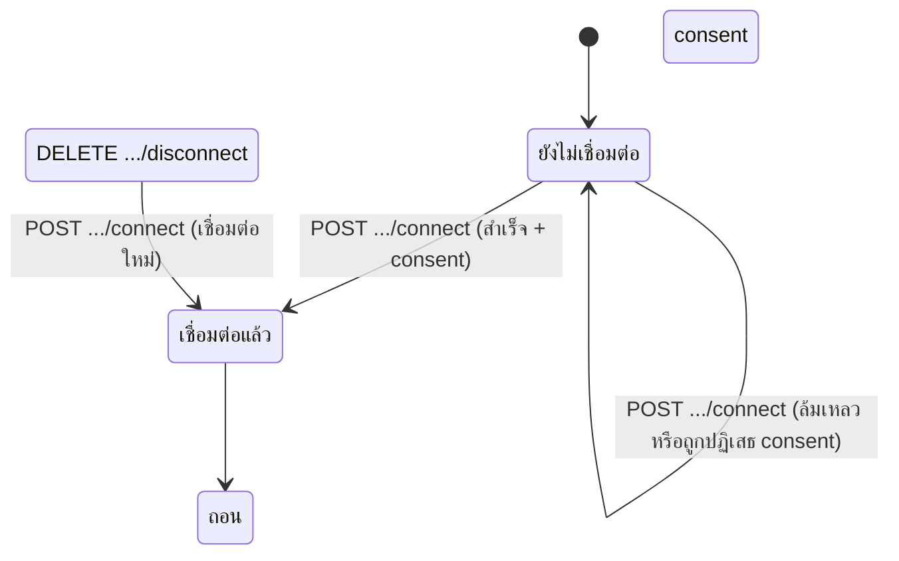
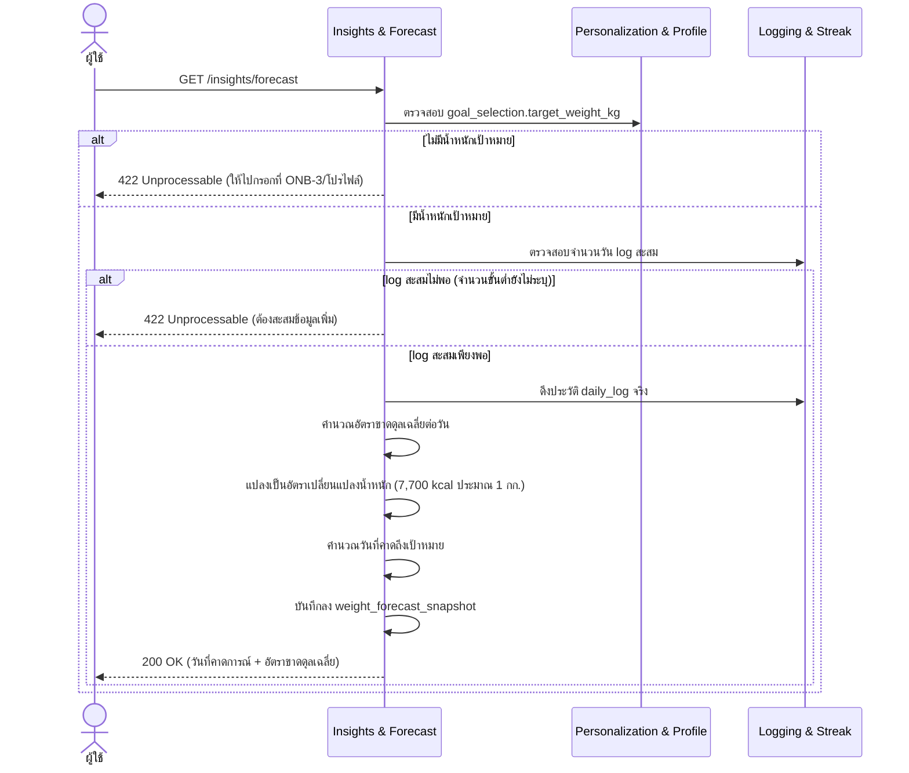
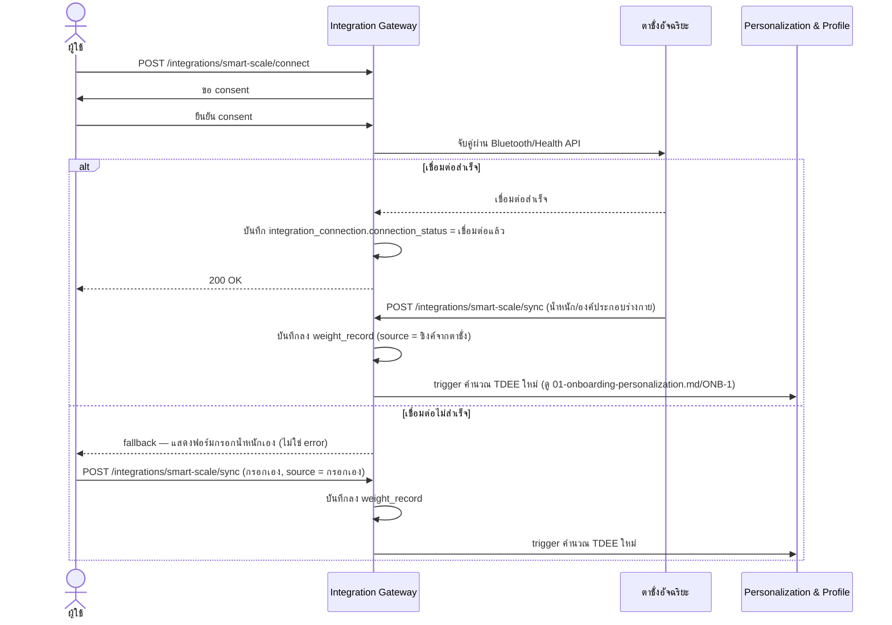
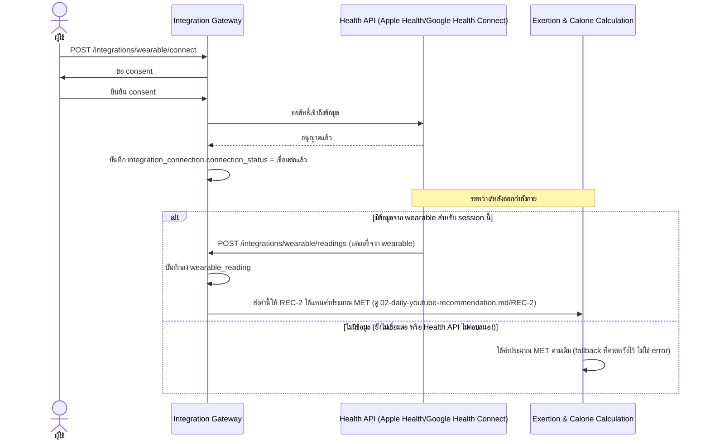

# Detailed Design — Smart Integrations (Conceptual)

- **ประเภทเอกสาร:** Detailed Design — Conceptual (ไม่ผูก technical stack)
- **สถานะเอกสาร:** Draft
- **วันที่สร้าง:** 2026-08-28
- **อัปเดตล่าสุด:** 2026-08-29 — sync ภาคผนวก Stack Mapping ให้ตรงกับ `tech-stack.md` ฉบับ Firebase ใหม่ และ
  แก้ label ของ State Diagram (Integration Connection) ให้ตรงกับ `enum` จริงใน `database-schema.md` §3.15
  (audit เนื้อหาหลัก sequence/state diagram/algorithm ของ INT-1/2/3 ส่วนอื่นแล้วไม่พบ drift)
- **สร้างโดย:** skill `detailed-design-builder`
- **อ้างอิงจาก:** [High Level Architecture](../high-level-architecture.md), [API Spec](../api-spec.md),
  [Database Schema](../database-schema.md), [Product Backlog](../../../01-requirements/backlog.md),
  [Requirement](../../../01-requirements/01-spec/20260823-04-smart-integrations.md)

## ขอบเขตและหลักการ

เอกสารนี้เจาะจงกว่า API Spec/Database Schema อีกหนึ่งระดับ — **ยังคง conceptual ไม่ผูก technical stack**
sequence diagram ใช้ participant เป็น Conceptual Component จาก HLA หรือ actor ทั่วไปเท่านั้น (รวมถึงชื่อ
ระบบภายนอกที่ requirement กำหนดไว้แล้ว เช่น YouTube, Health API — ไม่ถือเป็นการผูก stack) อัลกอริทึม
เขียนเป็นขั้นตอนภาษาธรรมชาติ/pseudocode เชิงแนวคิด ไม่ใช่โค้ดจริง

## State Diagram — Integration Connection

`integration_connection.connection_status` มี state transition ที่มีความหมายพอสำหรับทั้ง INT-2 และ
INT-3 (ใช้ enum เดียวกัน แค่ `integration_type` ต่างกัน):

## INT-1 — พยากรณ์วันถึงเป้าหมายน้ำหนัก (REQ-11)

### Sequence Diagram

### อัลกอริทึม — คำนวณวันพยากรณ์ถึงเป้าหมายน้ำหนัก

1. ตรวจสอบว่ามีน้ำหนักเป้าหมาย (`goal_selection.target_weight_kg`) หรือไม่ → ถ้าไม่มี คืน error (`422`)
2. ตรวจสอบว่ามีประวัติ `daily_log` สะสมเพียงพอหรือไม่ (จำนวนวันขั้นต่ำยังไม่ resolve เป็นทางการ — ดู
   "จุดที่ยังไม่ได้ระบุ") → ถ้าไม่พอ คืน error (`422`)
3. ดึงประวัติแคลอรี่ขาดดุล/เกินดุลจริงจาก `daily_log` (ไม่ใช่ค่าประมาณตอน onboarding) ในช่วงเวลาล่าสุด
4. คำนวณอัตราขาดดุลเฉลี่ยต่อวัน = ผลรวมส่วนต่าง (เป้าหมาย − แคลอรี่จริง) หารด้วยจำนวนวันที่มีข้อมูล
5. แปลงอัตราขาดดุลเฉลี่ยเป็นอัตราการเปลี่ยนแปลงน้ำหนักโดยประมาณ โดยใช้ค่าคงที่ 7,700 kcal ≈ 1 กก. ไขมัน
   (ตาม decision ที่ resolve แล้วใน ONB-3/REQ-02)
6. คำนวณวันที่คาดว่าจะถึงเป้าหมาย จากน้ำหนักปัจจุบัน (ล่าสุดจาก `weight_record`), น้ำหนักเป้าหมาย, และ
   อัตรานี้
7. บันทึกผลลัพธ์ลง `weight_forecast_snapshot` พร้อมแสดงผลให้ผู้ใช้

## INT-2 — ซิงค์ตาชั่งอัจฉริยะ (REQ-12)

### Sequence Diagram

ไม่มีอัลกอริทึมแยก — เป็น connect/fallback flow ตรงไปตรงมา ครอบคลุมอยู่ใน sequence diagram และ State
Diagram ด้านบนแล้ว

## INT-3 — ซิงค์ข้อมูล Wearable (REQ-13)

### Sequence Diagram

ไม่มีอัลกอริทึมแยก — เป็น connect/fallback flow ตรงไปตรงมา ใช้ State Diagram ร่วมกับ INT-2 ด้านบน

## จุดที่ยังไม่ได้ระบุ / ควรยืนยันเพิ่มเติม

1. **INT-1**: จำนวนวัน log ขั้นต่ำก่อนพยากรณ์ได้ยังไม่ระบุ
2. **INT-2**: ลำดับความสำคัญเมื่อชั่งน้ำหนักหลายครั้งในวันเดียวกัน (ค่าล่าสุด vs ค่าเฉลี่ย) ยังไม่ระบุ
3. **INT-3**: การ reconcile เมื่อค่าจาก wearable ต่างจากค่าประมาณ MET มากยังไม่ระบุ (ปัจจุบัน wearable
   ชนะเสมอเมื่อมีข้อมูล ไม่มีการเทียบความสมเหตุสมผล)

## ความสัมพันธ์กับเอกสารอื่น

- [High Level Architecture](../high-level-architecture.md) — component "Insights & Forecast" (3.6),
  "Integration Gateway" (3.7), Flow 5 Smart Integration & Insights Flow (4.5), External Integration
  Boundaries (6)
- [API Spec](../api-spec.md) — section 3.6 Insights & Forecast, 3.7 Integration Gateway
- [Database Schema](../database-schema.md) — ตาราง `weight_forecast_snapshot`, `weight_record`,
  `integration_connection`, `wearable_reading`
- [Product Backlog](../../../01-requirements/backlog.md), [Requirement](../../../01-requirements/01-spec/20260823-04-smart-integrations.md) —
  INT-1/2/3, REQ-11/12/13
- [User Journeys](../../01-prototypes/user-journeys.md) — ลำดับ step ของ INT-1/2/3

## ภาคผนวก: Stack Mapping

> **หัวข้อนี้เป็นข้อยกเว้นเดียวในไฟล์นี้ที่มีชื่อเทคโนโลยีจริง** แหล่งที่มาและสิทธิ์แก้ไขจริงอยู่ที่
> [tech-stack.md](../tech-stack.md) เสมอ — หัวข้อข้างต้นยังคง conceptual ตามกติกาเดิมทุกประการ ถ้าทีม
> เปลี่ยน stack ในอนาคต ให้รัน `tech-stack-builder` ก่อน แล้วภาคผนวกนี้จะถูก sync ตามในการรัน
> `detailed-design-builder` ครั้งถัดไป

> **อัปเดต 2026-08-29**: มิเรอร์ใหม่จาก Supabase/PostgreSQL เป็น Firebase ตามการเปลี่ยน stack ใน
> `tech-stack.md` §2/§5 — เนื้อหาหลักข้างต้น (sequence/state diagram/algorithm ของ INT-1/2/3)
> **ไม่เปลี่ยนแปลง** เพราะยัง conceptual ล้วน ไม่ผูกกับ backend จริง (การแก้ label ของ State Diagram
> ด้านบนจาก "ยกเลิกการเชื่อมต่อ" เป็น "ถอน consent แล้ว" เป็นการแก้ไขให้ตรงกับค่า `enum` จริงใน
> `database-schema.md` §3.15 ที่พบระหว่าง audit ครั้งนี้ — ไม่เกี่ยวกับการเปลี่ยน stack)

มิเรอร์จาก [tech-stack.md § 6.1](../tech-stack.md#61-hlas-conceptual-component--firebase-implementation)
(อัปเดต 2026-08-29) เฉพาะ Component ที่ปรากฏในไฟล์นี้:

| Conceptual Component | Concrete Implementation |
|---|---|
| Insights & Forecast | Firestore collection `weightForecastSnapshots` + Cloud Function `forecast` คำนวณจากประวัติ `dailyLogs`/`weightRecords` |
| Integration Gateway | Cloud Function `integrations` orchestrate การเชื่อมต่อ + native module ฝั่ง client (`react-native-health`, `react-native-health-connect`, `react-native-ble-plx`) — ไม่เปลี่ยนจากเดิม |

**Execution ของ algorithm**: ตาม [tech-stack.md § 4](../tech-stack.md#4-เหตุผลการเลือก-rationale)
(NFR-01/NFR-03 — client-side calculation) การคำนวณ **Forecast (INT-1)** เกิดขึ้นฝั่ง **React Native
client โดยตรง** เพื่อไม่มี network latency แล้วส่งผลลัพธ์ที่คำนวณแล้วไปบันทึกผ่าน **Firebase Cloud
Function `forecast`** (แทนที่ Supabase Edge Function `forecast` เดิม) เพื่อ validate เป็นเกราะป้องกัน
ชั้นที่สองฝั่ง server — ส่วน **INT-2/INT-3** (จับคู่/ซิงค์อุปกรณ์ภายนอก) ใช้ native module ฝั่ง client
ตามที่ตารางข้างบนระบุเหมือนเดิม (`react-native-health` สำหรับ Apple HealthKit, `react-native-health-connect`
สำหรับ Google Health Connect, `react-native-ble-plx` สำหรับ Bluetooth สมาร์ตสเกล) แล้วส่งข้อมูลที่ซิงค์ได้
ผ่าน **Firebase Cloud Function `integrations`** (แทนที่ Supabase Edge Function `integrations` เดิม)
