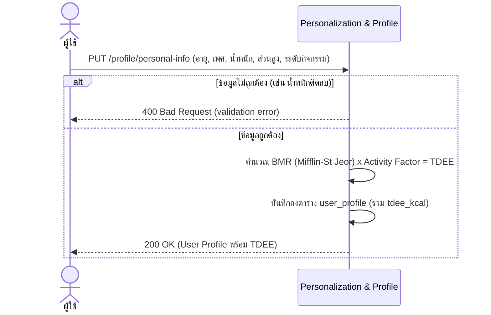
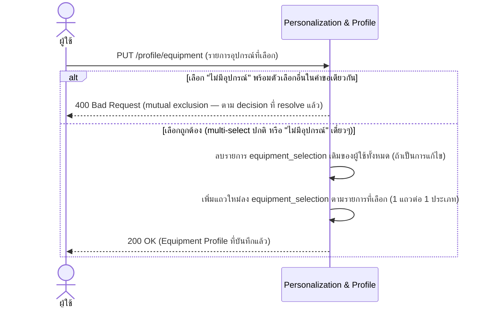
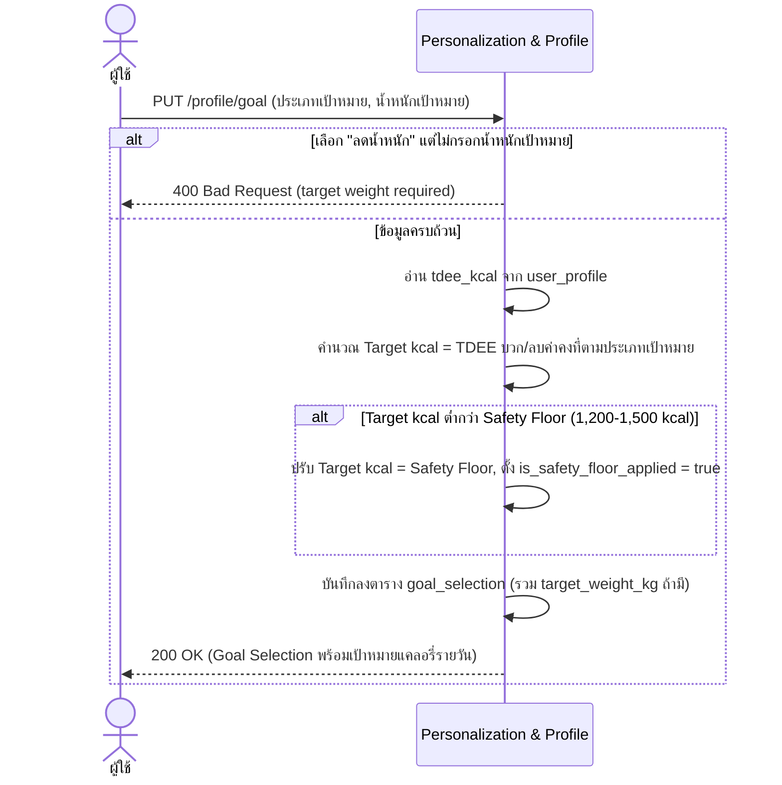

# Detailed Design — Onboarding & Personalization (Conceptual)

- **ประเภทเอกสาร:** Detailed Design — Conceptual (ไม่ผูก technical stack)
- **สถานะเอกสาร:** Draft
- **วันที่สร้าง:** 2026-08-28
- **สร้างโดย:** skill `detailed-design-builder`
- **อ้างอิงจาก:** [High Level Architecture](../high-level-architecture.md), [API Spec](../api-spec.md),
  [Database Schema](../database-schema.md), [Product Backlog](../../../01-requirements/backlog.md),
  [Requirement](../../../01-requirements/01-spec/20260823-01-onboarding-personalization.md)

## ขอบเขตและหลักการ

เอกสารนี้เจาะจงกว่า API Spec/Database Schema อีกหนึ่งระดับ — **ยังคง conceptual ไม่ผูก technical stack**
sequence diagram ใช้ participant เป็น Conceptual Component จาก HLA หรือ actor ทั่วไปเท่านั้น (ไม่มีชื่อ
framework/service เฉพาะเจาะจง) อัลกอริทึมเขียนเป็นขั้นตอนภาษาธรรมชาติ/pseudocode เชิงแนวคิด ไม่ใช่โค้ดจริง

## ONB-1 — กรอกข้อมูลส่วนตัวเพื่อคำนวณเป้าหมายแคลอรี่ (REQ-01)

### Sequence Diagram

### อัลกอริทึม — คำนวณ BMR/TDEE

1. รับ input: อายุ, เพศ, น้ำหนัก (kg), ส่วนสูง (cm), ระดับกิจกรรม
2. ตรวจสอบ validation — ถ้าค่าใดติดลบหรือเกินช่วงที่สมเหตุสมผล ให้คืน error (`400`) และหยุดกระบวนการ
3. คำนวณ BMR ตามเพศ (สูตร Mifflin-St Jeor ตาม REQ-01):
   - เพศชาย: `BMR = 10×น้ำหนัก + 6.25×ส่วนสูง − 5×อายุ + 5`
   - เพศหญิง: `BMR = 10×น้ำหนัก + 6.25×ส่วนสูง − 5×อายุ − 161`
4. คูณ BMR ด้วย Activity Factor ตามระดับกิจกรรมที่เลือก ได้ TDEE (ค่า Activity Factor จริงต่อระดับยังไม่
   resolve เป็นทางการใน `01-spec/` — ดู "จุดที่ยังไม่ได้ระบุ")
5. บันทึก TDEE ลง `user_profile.tdee_kcal`
6. ส่งคืนโปรไฟล์ที่อัปเดตแล้วให้ผู้ใช้ — ค่านี้เป็น input ตั้งต้นของ ONB-3, REC-2, และ INT-2

## ONB-2 — เลือกอุปกรณ์ที่มี (REQ-03)

### Sequence Diagram

ไม่มีอัลกอริทึมแยก — ตรรกะเป็นการตรวจ mutual-exclusion อย่างเดียว ครอบคลุมอยู่ใน sequence diagram แล้ว

## ONB-3 — ตั้งเป้าหมายหลัก (REQ-02)

### Sequence Diagram

### อัลกอริทึม — คำนวณเป้าหมายแคลอรี่รายวัน + Safety Floor

1. รับ input: ประเภทเป้าหมาย (ลดน้ำหนัก/กระชับสัดส่วน/เพิ่มความอึด), น้ำหนักเป้าหมาย (บังคับเมื่อเลือก
   "ลดน้ำหนัก" ตาม decision ที่ resolve แล้ว 2026-08-28)
2. ตรวจสอบ: ถ้าเลือก "ลดน้ำหนัก" แต่ไม่มีน้ำหนักเป้าหมาย → คืน error (`400`) และหยุดกระบวนการ
3. อ่าน TDEE ปัจจุบันจาก `user_profile.tdee_kcal`
4. คำนวณ Target kcal ตามประเภทเป้าหมาย (ค่าคงที่ตาม REQ-02):
   - ลดน้ำหนัก: `Target = TDEE − 500`
   - กระชับสัดส่วน: `Target = TDEE + 0` (maintenance)
   - เพิ่มความอึด: `Target = TDEE + 300`
5. ตรวจสอบ safety floor: ถ้า `Target < 1,200–1,500 kcal` (ตัวเลขที่แน่นอนในช่วงนี้ยังไม่ resolve เป็น
   ทางการ — ดู "จุดที่ยังไม่ได้ระบุ") → ปรับ `Target = Safety Floor` และตั้ง `is_safety_floor_applied = true`
6. บันทึกผลลัพธ์สุดท้ายลง `goal_selection` (`daily_calorie_target_kcal`, `target_weight_kg` ถ้ามี)
7. ส่งคืนผลลัพธ์ให้ผู้ใช้ — ค่านี้เป็น input ของ REC-1 (จับคู่วิดีโอ), PLN-3 (ประเมิน all-or-nothing), และ
   INT-1 (เป็นแหล่งที่มาของน้ำหนักเป้าหมาย)

## จุดที่ยังไม่ได้ระบุ / ควรยืนยันเพิ่มเติม

1. **ONB-1**: ค่า Activity Factor จริงต่อแต่ละระดับกิจกรรม (5 ระดับ) ยังไม่ resolve เป็นทางการใน
   `01-spec/` — algorithm ข้างต้นอ้างถึงแนวคิด "Activity Factor" แต่ไม่ได้ระบุตัวเลขจริง
2. **ONB-3**: ตัวเลขที่แน่นอนของ safety floor ภายในช่วง 1,200–1,500 kcal (ขึ้นกับปัจจัยใด — เพศ? เมื่อไหร่
   ใช้ค่าไหน?) ยังไม่ระบุ
3. **ONB-3**: กรณีผู้ใช้เลือก "กระชับสัดส่วน"/"เพิ่มความอึด" แล้วข้ามช่องน้ำหนักเป้าหมาย (ไม่บังคับ) — ช่อง
   ทางแจ้งเตือนให้กรอกภายหลังยังไม่ระบุ (ผูกกับ INT-1 ที่ต้องใช้ค่านี้)

## ความสัมพันธ์กับเอกสารอื่น

- [High Level Architecture](../high-level-architecture.md) — component "Personalization & Profile"
  (หัวข้อ 3.1), Flow 1 Onboarding Flow (หัวข้อ 4.1)
- [API Spec](../api-spec.md) — section 3.1 Personalization & Profile
- [Database Schema](../database-schema.md) — ตาราง `user_profile`, `goal_selection`,
  `equipment_selection`
- [Product Backlog](../../../01-requirements/backlog.md), [Requirement](../../../01-requirements/01-spec/20260823-01-onboarding-personalization.md) —
  ONB-1/ONB-2/ONB-3, REQ-01/REQ-02/REQ-03
- [User Journeys](../../01-prototypes/user-journeys.md) — ลำดับ step ของ ONB-1/ONB-2/ONB-3
