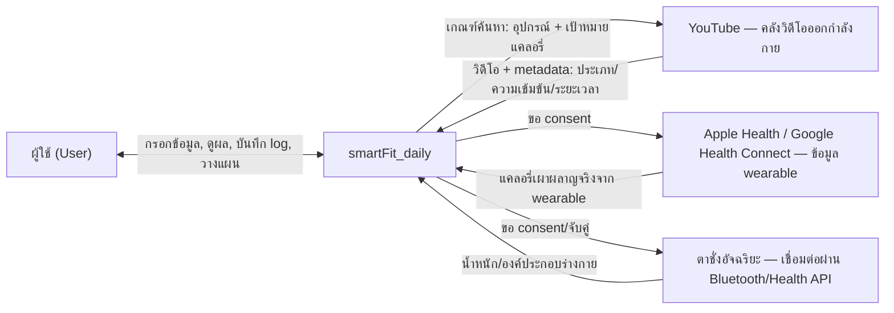
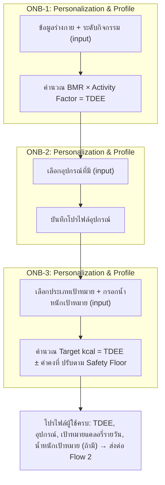
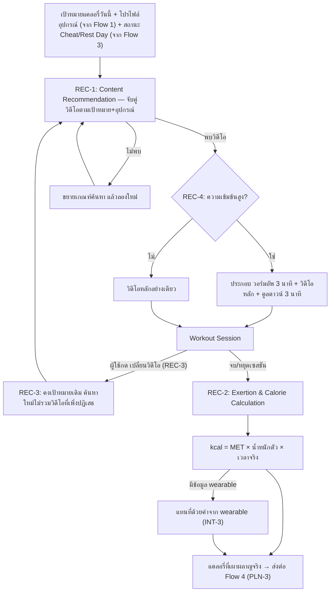
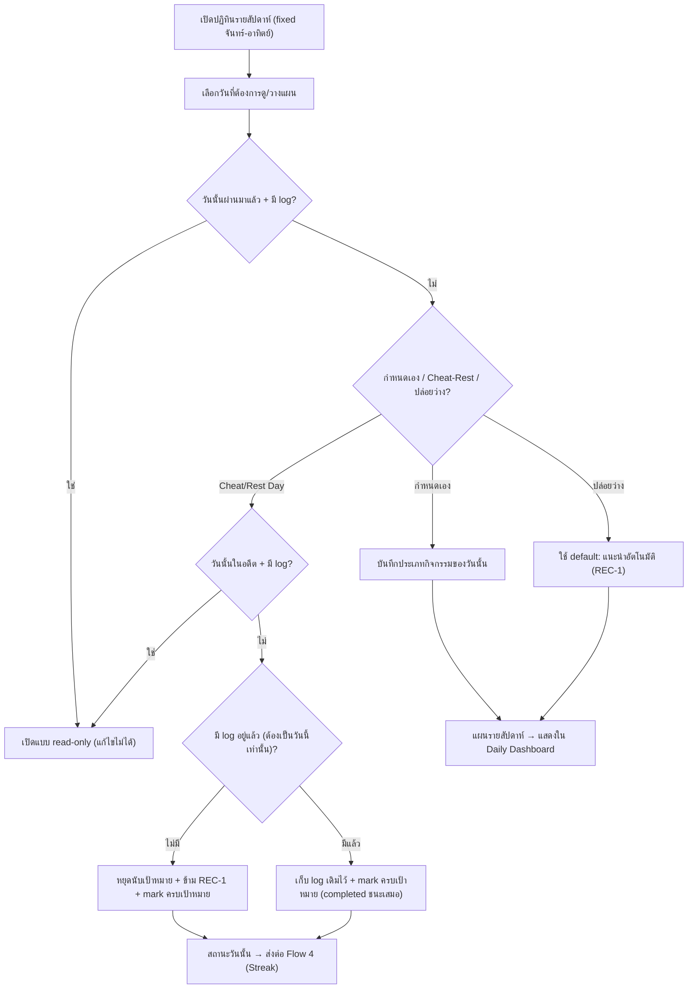
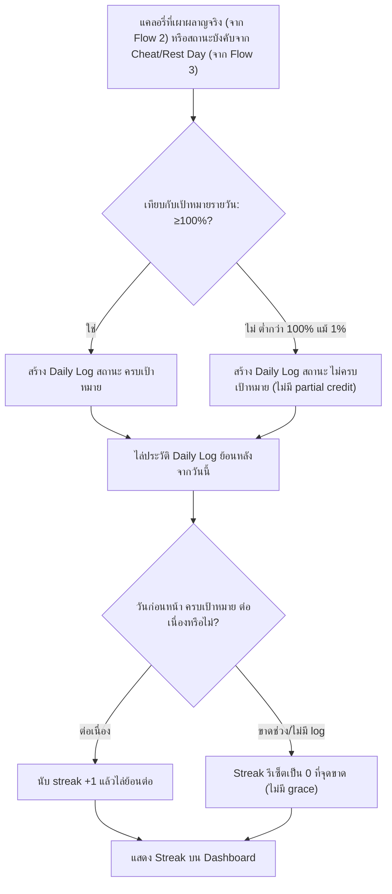
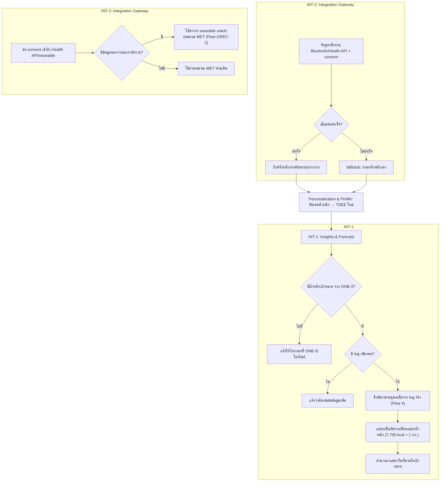

# High Level Architecture (Conceptual) — smartFit_daily

- **ประเภทเอกสาร:** High Level Architecture — Conceptual (ไม่ผูก technical stack)
- **สถานะเอกสาร:** Draft
- **วันที่สร้าง:** 2026-08-28
- **สร้างโดย:** skill `architecture-builder`
- **อ้างอิงจาก:** [Product Backlog](../../01-requirements/backlog.md),
  [Requirement ทั้ง 4 epic + NFR](../../01-requirements/01-spec/index.md),
  [User Journeys](../01-prototypes/user-journeys.md)

## 1. ขอบเขตและหลักการ (Scope & Principles)

เอกสารนี้ตอบคำถาม **"ระบบ smartFit_daily ประกอบด้วยอะไรบ้าง และข้อมูลไหลผ่านส่วนไหนบ้าง"** — ไม่ใช่
**"จะ implement ด้วยอะไร"** ทุก component, data flow, และ data entity ในเอกสารนี้เป็นแนวคิดเชิงหน้าที่
(functional/logical) ล้วน **ไม่ผูกกับ technical stack ใดๆ** — ไม่มีชื่อ framework, ฐานข้อมูล, cloud
provider, ภาษาโปรแกรม, หรือรูปแบบ API เฉพาะเจาะจงปรากฏอยู่ในเอกสารนี้

ข้อยกเว้นเดียวคือชื่อระบบภายนอกที่ requirement กำหนดไว้แล้วเป็นข้อเท็จจริงของธุรกิจ (ไม่ใช่ทางเลือกทาง
เทคนิคของทีม) ได้แก่ **YouTube** (REQ-04) และ **Apple Health/Google Health Connect** (REQ-13) — ระบบ
เหล่านี้ถูกอธิบายในฐานะ **external integration boundary** เท่านั้น (ดูหัวข้อ 6)

เอกสารนี้เป็น**พื้นฐาน**ที่ต้องเขียนเสร็จก่อนที่ `docs/02-design/02-technical/` จะเริ่มมีเอกสารเชิง
stack-specific (database schema, API design, tech choices) ในอนาคต — เมื่อทีมเลือก stack จริงแล้ว
เอกสารเหล่านั้นควร derive concept จากที่นี่ ไม่ใช่มาแทนที่เอกสารนี้

ขอบเขต (scope) ของเอกสารนี้ครอบคลุมทั้ง 13 Feature ID ในทั้ง 4 Epic ตาม
[backlog.md](../../01-requirements/backlog.md) ณ วันที่สร้าง รวมถึง NFR-01–11 จาก
[Non-Functional Requirements](../../01-requirements/01-spec/20260827-05-non-functional-requirements.md)
ในฐานะ cross-cutting concern (ดูหัวข้อ 7)

## 2. System Context

ผู้ใช้โต้ตอบกับ smartFit_daily เป็นระบบเดียว (กล่องเดียว จากมุมมองภายนอก) ซึ่งเชื่อมต่อกับระบบภายนอก 3
ระบบตามที่ requirement กำหนดไว้ — ไม่มีระบบภายนอกอื่นนอกเหนือจากนี้ในขอบเขตปัจจุบันของ backlog

ทิศทางการสื่อสารระดับสูงสุด: ผู้ใช้เป็นผู้ริเริ่มทุก interaction หลัก (กรอกข้อมูล, เริ่มออกกำลังกาย,
วางแผน, ดู insight) ระบบภายนอกทั้ง 3 เป็นแหล่งข้อมูลเสริม/ทางเลือก (YouTube จำเป็นสำหรับ core loop,
ส่วน Health API/wearable และตาชั่งอัจฉริยะเป็น Could-priority ตาม `backlog.md` — ระบบต้องทำงานได้แม้ไม่มี
2 อย่างหลังนี้ ตาม NFR-07)

## 3. Conceptual Components / Modules

แต่ละ component ตั้งชื่อตามหน้าที่ ไม่ใช่ตามเทคโนโลยี — ระบุ Feature ID/Epic ที่รับผิดชอบ และ component
อื่นที่คุยด้วยในระดับแนวคิด (ไม่ใช่ API endpoint จริง)

### 3.1 Personalization & Profile

- **รับผิดชอบ**: ONB-1, ONB-2, ONB-3 (Epic 1 ทั้งหมด)
- **หน้าที่**: รับข้อมูลร่างกาย/ประชากรศาสตร์ของผู้ใช้ คำนวณ TDEE คำนวณเป้าหมายแคลอรี่รายวันจากประเภท
  เป้าหมายที่เลือก (พร้อมน้ำหนักเป้าหมายเมื่อเกี่ยวข้อง — ดูหัวข้อ 8.1) และเก็บโปรไฟล์อุปกรณ์ที่ใช้เป็น
  filter ของการแนะนำวิดีโอ เป็น**ฐาน (baseline)** ที่แทบทุก component อื่นต้องอ่านค่าจากที่นี่
- **คุยกับ**: Content Recommendation (ส่งโปรไฟล์อุปกรณ์ + เป้าหมายแคลอรี่รายวัน), Exertion & Calorie
  Calculation (ส่งน้ำหนักตัว), Planner & Day-Status (ส่งเป้าหมายแคลอรี่รายวันสำหรับแสดงผล/ปรับ), Insights
  & Forecast (ส่งน้ำหนักเป้าหมาย + ทิศทางเป้าหมาย + ค่าคงที่ 7,700 kcal), Integration Gateway (รับน้ำหนัก
  ที่ซิงค์มาเพื่อคำนวณ TDEE ใหม่)

### 3.2 Content Recommendation

- **รับผิดชอบ**: REC-1, REC-3, REC-4
- **หน้าที่**: เลือก/สลับ/ประกอบวิดีโอออกกำลังกาย (รวมวอร์มอัพ-คูลดาวน์เมื่อความเข้มข้นสูง) ให้ตรงกับ
  เป้าหมายแคลอรี่ของวันนั้นและ filter ตามอุปกรณ์ที่มี
- **คุยกับ**: Personalization & Profile (อ่านโปรไฟล์อุปกรณ์ + เป้าหมายแคลอรี่รายวัน), Planner &
  Day-Status (อ่านว่าวันนี้เป็น Cheat/Rest Day หรือไม่ — ถ้าใช่ ข้ามการแนะนำ), Exertion & Calorie
  Calculation (ส่ง metadata ของวิดีโอที่เลือก: ประเภทกิจกรรม, ความเข้มข้น, ระยะเวลา)

### 3.3 Exertion & Calorie Calculation

- **รับผิดชอบ**: REC-2
- **หน้าที่**: คำนวณแคลอรี่ที่เผาผลาญจริงหลังจบ/หยุดเซสชันด้วยสูตร MET โดยมีจุดแทนที่ค่าด้วยข้อมูลจาก
  wearable เมื่อมี
- **คุยกับ**: Content Recommendation (อ่าน metadata วิดีโอ + เวลาที่ใช้จริง), Personalization & Profile
  (อ่านน้ำหนักตัว), Integration Gateway (รับค่าแทนที่จาก wearable), Logging & Streak (ส่งแคลอรี่ที่
  เผาผลาญจริง + ระยะเวลา)

### 3.4 Planner & Day-Status

- **รับผิดชอบ**: PLN-1, PLN-2
- **หน้าที่**: แสดงปฏิทินรายสัปดาห์แบบ fixed calendar week (จันทร์-อาทิตย์) ให้ผู้ใช้วางแผนกิจกรรมล่วงหน้า
  หรือทำเครื่องหมาย Cheat/Rest Day บังคับใช้กติกาว่าวันในอดีตที่มี log อยู่แล้วเป็น read-only (ทั้งการ
  ดูแผนและการตั้ง Cheat/Rest Day)
- **คุยกับ**: Content Recommendation (สั่งให้ข้ามการแนะนำวันที่เป็น Cheat/Rest), Logging & Streak (อ่านว่า
  วันนั้นมี log อยู่แล้วหรือไม่ เพื่อตัดสิน read-only/บังคับสถานะ "ครบเป้าหมาย"), Personalization & Profile
  (อ่านเป้าหมายแคลอรี่รายวันเพื่อแสดงผล)

### 3.5 Logging & Streak

- **รับผิดชอบ**: PLN-3, PLN-4
- **หน้าที่**: บังคับใช้กติกา all-or-nothing เข้มงวด (ไม่มี partial credit) เทียบแคลอรี่ที่เผาผลาญจริงกับ
  เป้าหมายรายวันเพื่อสร้าง log ประจำวัน และคำนวณ streak ต่อเนื่องโดยไล่ประวัติ log ย้อนหลังจากวันนี้
- **คุยกับ**: Exertion & Calorie Calculation (อ่านแคลอรี่ที่เผาผลาญจริง), Personalization & Profile (อ่าน
  เป้าหมายแคลอรี่รายวัน), Planner & Day-Status (อ่าน/รับสถานะ "ครบเป้าหมาย" บังคับจาก Cheat/Rest Day),
  Insights & Forecast (ส่งประวัติแคลอรี่ขาดดุล/เกินดุลจริง)

### 3.6 Insights & Forecast

- **รับผิดชอบ**: INT-1
- **หน้าที่**: พยากรณ์วันที่คาดว่าจะถึงน้ำหนักเป้าหมาย จากอัตราขาดดุล/เกินดุลแคลอรี่เฉลี่ยที่บันทึกจริง
  (ไม่ใช่ค่าประมาณตอน onboarding)
- **คุยกับ**: Logging & Streak (อ่านประวัติ log), Personalization & Profile (อ่านน้ำหนักเป้าหมาย +
  ทิศทางเป้าหมาย + ค่าคงที่ 7,700 kcal), Integration Gateway (อ่านน้ำหนักปัจจุบันล่าสุดที่ซิงค์มา)

### 3.7 Integration Gateway

- **รับผิดชอบ**: INT-2, INT-3
- **หน้าที่**: เป็นสะพานเชื่อมอุปกรณ์/แพลตฟอร์มภายนอกที่เป็นทางเลือก (ตาชั่งอัจฉริยะผ่าน Bluetooth,
  wearable ผ่าน Health API) เข้ากับโปรไฟล์และข้อมูลแคลอรี่ของแอป โดยต้องผ่าน consent gate เสมอ และมี
  fallback เป็นการกรอกเอง/ใช้ค่าประมาณ MET เมื่อเชื่อมต่อไม่ได้
- **คุยกับ**: Personalization & Profile (เขียนน้ำหนัก/องค์ประกอบร่างกายที่ซิงค์มา), Exertion & Calorie
  Calculation (เขียนค่าแทนที่จาก wearable), Insights & Forecast (ทางอ้อม ผ่านน้ำหนักที่ซิงค์)

> NFR-01–11 ไม่ใช่ component ของตัวเอง — เป็น cross-cutting concern ที่พาดผ่านทั้ง 7 component ข้างต้น
> (ดูหัวข้อ 7)

## 4. Data Flow ตาม User Journey

จัดกลุ่ม 13 feature เป็น 5 data flow ตามลำดับ step ที่ระบุไว้จริงใน
[user-journeys.md](../01-prototypes/user-journeys.md) — เลขอ้างอิง "Step N" ด้านล่างตรงกับลำดับ
"คำอธิบายตามลำดับ diagram" ของแต่ละ feature ในเอกสารนั้น

### 4.1 Flow 1 — Onboarding Flow (ONB-1 → ONB-2 → ONB-3)

- **ONB-1** (Step 1-7): ผู้ใช้กรอกอายุ/เพศ/น้ำหนัก/ส่วนสูง/ระดับกิจกรรม → validate (Step 2-3, วนกลับถ้า
  ไม่ผ่าน) → คำนวณ BMR ด้วยสูตร Mifflin-St Jeor (Step 4-5) → คูณ Activity Factor ได้ TDEE (Step 6) →
  บันทึกลงโปรไฟล์ (Step 7) → ส่งต่อ ONB-2
- **ONB-2** (Step 1-5): ผู้ใช้เลือกอุปกรณ์ที่มี (ไม่มี/ดัมเบล/ยิมครบชุด, เลือกได้มากกว่า 1) → บันทึกเป็น
  โปรไฟล์อุปกรณ์ (Step 3-5) → ใช้เป็น filter มาตรฐานของ REC-1 ทุกครั้ง
- **ONB-3** (Step 1-5): ผู้ใช้เลือกประเภทเป้าหมาย → ระบบแปลงเป็นค่าคงที่ (TDEE−500/TDEE+0/TDEE+300)
  พร้อมให้กรอกน้ำหนักเป้าหมาย (บังคับเมื่อเลือก "ลดน้ำหนัก") (Step 2) → ตรวจ safety floor 1,200–1,500
  kcal (Step 3) → ปรับถ้าต่ำกว่า floor (Step 4) → บันทึกเป้าหมายแคลอรี่รายวัน + น้ำหนักเป้าหมาย onboarding
  เสร็จสมบูรณ์ (Step 5)

ผลลัพธ์ของ Flow นี้ (TDEE, โปรไฟล์อุปกรณ์, เป้าหมายแคลอรี่รายวัน, น้ำหนักเป้าหมาย) เป็น **input ตั้งต้น**
ของ Flow 2, 3, 5 ทั้งหมด

### 4.2 Flow 2 — Daily Recommendation & Exercise Session Flow (REC-1 → REC-3 → REC-4 → REC-2)

- **REC-1** (Step 1-5): เปิด Daily Dashboard → ดึงเป้าหมายแคลอรี่วันนี้ (ปรับตาม Cheat/Rest Day ถ้ามี) →
  filter ด้วยอุปกรณ์ → จับคู่วิดีโอใกล้เคียงเป้าหมายที่สุด → ถ้าไม่พบ ขยายเกณฑ์ค้นหาแล้วลองใหม่
- **REC-3** (Step 1-4, ทางเลือก): ผู้ใช้กดเปลี่ยนวิดีโอ → คงค่าเป้าหมายเดิม → ค้นหาใหม่ไม่รวมวิดีโอที่เพิ่ง
  ถูกปฏิเสธ → แสดงวิดีโอใหม่หรือแจ้งถ้าหมด
- **REC-4** (Step 1-5): ตรวจความเข้มข้นของวิดีโอหลัก → ถ้าสูง ประกอบวอร์มอัพ 3 นาที + หลัก + คูลดาวน์ 3
  นาทีเป็นเซสชันเดียว → ถ้าไม่สูง ใช้วิดีโอหลักอย่างเดียว
- **REC-2** (Step 1-7): ผู้ใช้จบ/หยุดวิดีโอ → อ่านเวลาที่ใช้จริง + ประเภท/ความเข้มข้นของวิดีโอ (Step 1-3) →
  ค้นค่า MET จาก lookup table (Step 4) → คำนวณ kcal = MET × น้ำหนักตัว × เวลา (Step 5) → ถ้ามีข้อมูล
  wearable ให้แทนที่ค่าประมาณนี้ (Step 6, เชื่อมกับ INT-3) → ส่งผลลัพธ์สุดท้ายต่อให้ PLN-3 (Step 7)

### 4.3 Flow 3 — Weekly Planning & Day-Status Flow (PLN-1 → PLN-2)

- **PLN-1** (Step 1-7): เปิดปฏิทิน fixed calendar week → เลือกวัน → ตรวจว่าเป็นวันในอดีตที่มี log หรือไม่
  (Step 3) → ถ้าใช่ เปิด read-only (Step 4) → ถ้าไม่ใช่ ให้กำหนดกิจกรรมเอง/ตั้ง Cheat-Rest (ไป PLN-2)/
  ปล่อยว่าง (Step 5-6) → บันทึกแผนรายสัปดาห์ (Step 7)
- **PLN-2** (Step 1-8): เลือกวันตั้ง Cheat/Rest Day → ตรวจก่อนว่าเป็นวันในอดีต+มี log หรือไม่ (Step 2, ถ้า
  ใช่ปิดกั้นแบบ read-only ไม่มีข้อยกเว้น) → ถ้าเป็นวันนี้/อนาคต ตรวจว่ามี log อยู่แล้วหรือไม่ (Step 3) →
  ไม่มี: หยุดนับเป้าหมาย+ข้าม REC-1 (Step 4) แล้ว mark ครบเป้าหมาย (Step 5) → มีแล้ว (เฉพาะวันนี้): เก็บ
  log เดิมไว้ (Step 6) แล้ว mark ครบเป้าหมายเช่นกัน — "completed ชนะเสมอ" (Step 7) → ทุกกรณี (ยกเว้นถูก
  ปิดกั้น) streak ไม่ขาด (Step 8, เชื่อม Flow 4)

### 4.4 Flow 4 — Daily Logging & Streak Flow (PLN-3 → PLN-4)

- **PLN-3** (Step 1-6): เปรียบเทียบแคลอรี่ที่เผาผลาญจริงกับเป้าหมายวันนั้น (Step 1-2) → ใช้กติกา
  all-or-nothing เข้มงวด (≥100% เท่านั้นถือว่าครบ, ไม่มี partial credit แม้ 99%) (Step 3) → สร้าง Daily
  Log พร้อมนาทีที่ออกกำลังกาย + แคลอรี่สะสม + สถานะ (Step 4-5) → ส่งสถานะต่อให้ PLN-4 (Step 6)
- **PLN-4** (Step 1-6): ไล่ประวัติ Daily Log ย้อนหลังจากวันนี้ (Step 1-2) → วันที่ "ครบเป้าหมาย" (จาก
  PLN-3 หรือถูกบังคับจาก PLN-2) นับต่อเนื่อง (Step 3-4) → วันที่ "ไม่ครบเป้าหมาย" หรือไม่มี log เลยทำให้
  streak ขาดทันทีไม่มี grace (Step 5) → แสดงตัวเลข streak สุดท้ายบน Dashboard (Step 6)

### 4.5 Flow 5 — Smart Integration & Insights Flow (INT-2, INT-3 → INT-1)

- **INT-2** (Step 1-5): จับคู่ตาชั่งอัจฉริยะผ่าน Bluetooth/Health API พร้อม consent → เชื่อมต่อสำเร็จ:
  ซิงค์น้ำหนัก/องค์ประกอบร่างกายเข้าโปรไฟล์ทันที → เชื่อมต่อไม่สำเร็จ: fallback เป็นกรอกน้ำหนักเอง → ค่าที่
  ได้ป้อนกลับเข้า Personalization & Profile เพื่อคำนวณ TDEE ใหม่
- **INT-3** (Step 1-5): ขอ consent เข้าถึง Apple Health/Google Health Connect → ระหว่าง/หลังออกกำลังกาย
  ถ้ามีข้อมูลจาก wearable ให้ใช้แทนค่าประมาณ MET ใน Flow 2 (REC-2) → ถ้าไม่มี ใช้ค่าประมาณ MET ตามเดิม
  (ไม่ใช่ error — เป็น fallback ที่คาดหวังไว้)
- **INT-1** (Step 1-9): เปิดหน้า Progress/Insights → ตรวจว่ามีน้ำหนักเป้าหมายจาก ONB-3 หรือไม่ (Step 2,
  ดูหัวข้อ 8.1) → ไม่มี: แจ้งให้ไปกรอกก่อน (Step 3) → มี: ตรวจว่ามี log สะสมเพียงพอหรือไม่ (Step 4) →
  ไม่พอ: แจ้งให้สะสมข้อมูลเพิ่ม (Step 5) → พอ: ดึงอัตราขาดดุลเฉลี่ยจาก log จริงของ Flow 4 (Step 6) →
  แปลงเป็นอัตราเปลี่ยนแปลงน้ำหนักด้วยค่าคงที่ 7,700 kcal ≈ 1 กก. (Step 7) → คำนวณวันที่คาดถึงเป้าหมาย
  (Step 8) → แสดงผล (Step 9)

## 5. Conceptual Data Entities

รายการข้อมูลหลักที่ระบบต้องรู้จัก — **ไม่ใช่ database schema** (ไม่มี data type, primary/foreign key,
ชื่อตาราง) ความสัมพันธ์ระบุในระดับแนวคิดเท่านั้น

| Entity | เก็บอะไร | ความสัมพันธ์ |
|---|---|---|
| **User Profile** | อายุ, เพศ, น้ำหนัก, ส่วนสูง, ระดับกิจกรรม, TDEE | 1 มี 1 Equipment Profile, 1 มี 1 Goal Selection ปัจจุบัน, 1 มีได้หลาย Weight Record และหลาย Daily Log |
| **Equipment Profile** | ชุดอุปกรณ์ที่เลือก (ไม่มี/ดัมเบล/ยิมครบชุด, เลือกได้หลายอัน) | 1:1 กับ User Profile — เป็น filter ของ Video/Workout Content |
| **Goal Selection & Daily Calorie Target** | ประเภทเป้าหมายที่เลือก, เป้าหมายแคลอรี่รายวันหลังปรับ safety floor, น้ำหนักเป้าหมาย (บังคับเมื่อเลือก "ลดน้ำหนัก" ไม่บังคับสำหรับเป้าหมายอื่น) | 1:1(ปัจจุบัน) กับ User Profile — Weekly Plan, Daily Log, และ Insights & Forecast อ่านค่านี้ |
| **Video/Workout Content** | id/metadata ของวิดีโอ: ประเภทกิจกรรม, ความเข้มข้น, ระยะเวลา | ถูก filter ด้วย Equipment Profile — ถูกอ้างถึงโดย Workout Session ในฐานะวิดีโอหลัก (และวอร์มอัพ/คูลดาวน์ถ้ามี) |
| **Workout Session** | การประกอบ warmup(ถ้ามี)+หลัก+cooldown(ถ้ามี) ของ 1 ครั้งออกกำลังกาย, เวลาที่ใช้จริง, รายการวิดีโอที่ถูกปฏิเสธระหว่างสลับ (REC-3) | many-to-1 กับ Video/Workout Content (วิดีโอหลัก) — ให้ผลลัพธ์เป็น 1 Actual Calorie Burn |
| **Actual Calorie Burn** | ค่า kcal ที่คำนวณได้: ค่า MET ที่ใช้, input ของสูตร, หรือค่าที่ถูกแทนที่จาก wearable | 1:1 กับ Workout Session — เป็น input ของ Daily Log — อาจถูก override โดย Wearable Reading |
| **Weekly Plan / Calendar Entry** | รายการต่อวันที่ในสัปดาห์ fixed จันทร์-อาทิตย์: ประเภทกิจกรรมที่วางแผน, ค่า default "แนะนำอัตโนมัติ", หรือ flag Cheat/Rest, และ flag read-only เมื่อวันนั้นผ่านมาแล้ว+มี log | หลายรายการต่อ User Profile — 1 วันที่ผูก 1:1 กับ Day Status และ Daily Log ของวันเดียวกัน |
| **Day Status (Cheat/Rest Day marker)** | flag ว่าวันนั้นถูกตั้งเป็น Cheat/Rest และผลลัพธ์ override "completed ชนะเสมอ" | วันที่เดียวกับ Calendar Entry — อยู่ร่วมกับ (ไม่ลบทิ้ง) Daily Log ได้ — ป้อนเข้า Streak |
| **Daily Log** | นาทีที่ออกกำลังกาย, แคลอรี่สะสม, สถานะ "ครบเป้าหมาย"/"ไม่ครบเป้าหมาย" | มาจาก Actual Calorie Burn (ประเมิน all-or-nothing) หรือถูกบังคับจาก Day Status — หลายรายการต่อ User Profile — เป็น input ของ Streak และ Insights & Forecast |
| **Streak** | จำนวนวันต่อเนื่องปัจจุบัน | คำนวณจากการไล่ Daily Log (และ Day Status) ย้อนหลัง — ค่าปัจจุบัน 1 ค่าต่อ User Profile |
| **Weight Record** | น้ำหนัก/องค์ประกอบร่างกาย ณ เวลาหนึ่ง พร้อมแหล่งที่มา (กรอกเอง/ซิงค์จากตาชั่ง) | หลายรายการต่อ User Profile — ใช้คำนวณ TDEE ใหม่และเป็น "น้ำหนักปัจจุบัน" ของ Weight Goal/Forecast |
| **Weight Goal / Forecast** | น้ำหนักเป้าหมาย (จาก ONB-3), วันที่คาดว่าจะถึงเป้าหมาย | ใช้ค่าคงที่ 7,700 kcal จาก Goal Selection — อ่านประวัติ Daily Log และ Weight Record ล่าสุด |
| **Wearable Reading** | ข้อมูลแคลอรี่เผาผลาญ (และฐานข้อมูลอัตราการเต้นหัวใจ/กิจกรรม) จาก Health API ต่อ 1 เซสชัน | override Actual Calorie Burn เมื่อมี — มาจาก Integration Gateway |
| **Integration Consent/Connection State** | สถานะ consent/การเชื่อมต่อต่ออุปกรณ์ภายนอกแต่ละตัว (ตาชั่ง, wearable) | ควบคุมว่า Weight Record/Wearable Reading จะซิงค์ได้หรือไม่ (ตาม NFR-05) |

## 6. External Integration Boundaries

### 6.1 YouTube (REC-1, REC-2)

- **ข้อมูลที่ไหลผ่าน**: ออก — เกณฑ์ค้นหา/กรอง (ประเภทกิจกรรมที่อุปกรณ์รองรับ, ช่วงแคลอรี่เป้าหมาย) / เข้า
  — เนื้อหาวิดีโอและ metadata (id, ระยะเวลา, ประเภทกิจกรรม/ความเข้มข้น — ต้องเป็นข้อมูลที่มีโครงสร้างจริง
  ไม่ใช่การเดาจากชื่อวิดีโอ)
- **NFR ที่เกี่ยวข้อง**: NFR-01 (Daily Dashboard ที่แสดงวิดีโอนี้ต้องไม่มี latency ที่สังเกตได้), NFR-07
  (ถ้า YouTube ไม่ตอบสนอง core loop ONB→REC-1→PLN-3 ต้องยังทำงานได้)

### 6.2 Apple Health / Google Health Connect — Wearable (INT-3)

- **ข้อมูลที่ไหลผ่าน**: ออก — คำขอ consent/permission / เข้า — ข้อมูลแคลอรี่เผาผลาญที่มาจากอัตราการเต้น
  หัวใจ/กิจกรรมระหว่างเซสชัน ซึ่งแทนที่ค่าประมาณ MET เมื่อมี
- **NFR ที่เกี่ยวข้อง**: NFR-05 (ต้องขอ consent ชัดเจนทุกครั้ง ห้าม auto-connect), NFR-07 (ถ้าไม่พร้อมใช้
  งาน fallback กลับไปใช้ค่าประมาณ MET อย่างสงบ ไม่ใช่ error เพราะเป็น Could-priority), NFR-04 (เป็นข้อมูล
  สุขภาพส่วนบุคคล ต้องเข้ารหัสทั้งระหว่างส่งและจัดเก็บ)
- **แพลตฟอร์มที่รองรับ (ยืนยันจากผู้ใช้ 2026-08-28)**: boundary นี้ใช้ได้เฉพาะบน **mobile client (iOS/
  Android) เท่านั้น** — บน web client ให้แสดงว่า "ไม่รองรับ" อย่างสงบแทนที่จะพยายามเชื่อมต่อ ถือเป็นกรณีหนึ่ง
  ของ fallback ตาม NFR-07 (เนื่องจาก INT-3 เป็น Could-priority อยู่แล้ว การไม่มี boundary นี้บน web จึงไม่
  กระทบ core loop รายวัน)

### 6.3 ตาชั่งอัจฉริยะผ่าน Bluetooth (INT-2)

- **ข้อมูลที่ไหลผ่าน**: ออก — คำขอจับคู่ (Bluetooth) หรือเชื่อมต่อผ่าน Health API พร้อม consent / เข้า —
  ค่าน้ำหนัก/องค์ประกอบร่างกาย ซิงค์เข้าโปรไฟล์อัตโนมัติ
- **NFR ที่เกี่ยวข้อง**: NFR-05 (ต้อง consent ก่อนจับคู่ทุกครั้ง), NFR-07 (เชื่อมต่อไม่สำเร็จ → fallback
  เป็นกรอกน้ำหนักเอง), NFR-04 (น้ำหนัก/องค์ประกอบร่างกายเป็นข้อมูลสุขภาพ ต้องเข้ารหัส)
- **แพลตฟอร์มที่รองรับ (ยืนยันจากผู้ใช้ 2026-08-28)**: เช่นเดียวกับ 6.2 — boundary นี้ใช้ได้เฉพาะบน
  **mobile client (iOS/Android) เท่านั้น** บน web client ให้แสดงว่า "ไม่รองรับ" อย่างสงบ (fallback ตาม
  NFR-07 เดียวกัน) ผู้ใช้บน web ยังคงกรอกน้ำหนักเองได้ผ่านช่องทางปกติ (ไม่ใช่ผ่าน boundary นี้)

> NFR-06 (data deletion) และ NFR-08 (local persistence ก่อน sync) ไม่ผูกกับ boundary ใดโดยเฉพาะ แต่เป็น
> กติกากว้างที่ครอบคลุมข้อมูลที่ไหลผ่านทั้ง 3 boundary นี้ด้วยเช่นกัน

## 7. Cross-cutting Concerns (เชิงแนวคิด)

อ้างอิงจาก [Non-Functional Requirements](../../01-requirements/01-spec/20260827-05-non-functional-requirements.md)
ในระดับแนวคิด — ไม่ระบุวิธี implement:

- **Performance** (NFR-01, NFR-02, NFR-03): หน้าจอที่เข้าทุกวัน (Daily Dashboard) ต้องไม่รู้สึกหน่วง
  action ที่มีผลกับข้อมูล (บันทึก log, Cheat/Rest Day) ต้องแสดงผลทันทีแบบ optimistic ก่อนรอผลจริง และ
  การคำนวณหลัก (TDEE, เป้าหมายแคลอรี่, MET) ต้องไม่มี latency จากภายนอกเกี่ยวข้อง
- **Security/Privacy** (NFR-04, NFR-05, NFR-06): ข้อมูลสุขภาพส่วนบุคคลทุกจุด (โปรไฟล์, น้ำหนัก, ข้อมูล
  wearable) ต้องได้รับการปกป้องทั้งระหว่างส่งและจัดเก็บ การเชื่อมต่ออุปกรณ์ภายนอกต้องผ่าน consent ชัดเจน
  เสมอ และผู้ใช้ต้องขอลบข้อมูลของตัวเองได้
- **Reliability** (NFR-07, NFR-08): ระบบต้อง fallback อย่างสงบเมื่อระบบภายนอกไม่พร้อมใช้งาน โดย core loop
  รายวัน (Onboarding → Recommendation → Logging) ต้องไม่ผูกกับความพร้อมของ Smart Integrations (Epic 4,
  Could ทั้งหมด) และข้อมูล log/streak ต้องไม่สูญหายจาก network ที่ไม่เสถียร
- **Usability** (NFR-09, NFR-10): ทุกหน้าจอต้องผ่านเกณฑ์ accessibility ขั้นต่ำ (touch target, contrast,
  ไม่สื่อสถานะด้วยสีอย่างเดียว, รองรับการปรับขนาดตัวอักษรของระบบ) และใช้ภาษาไทยเป็นหลักเสมอ (ศัพท์เทคนิค
  ทับศัพท์ได้)
- **Legal/Regulatory Compliance** (NFR-11): ระบบต้องปฏิบัติตาม PDPA มาตรฐานทั่วไป ครอบคลุม consent
  record-keeping (เชื่อมกับ NFR-05), สิทธิ์เข้าถึง/แก้ไข/ลบข้อมูลของเจ้าของข้อมูล (เชื่อมกับ NFR-06), และ
  กระบวนการแจ้งเหตุข้อมูลรั่วไหล

## 8. จุดที่ยังไม่ได้ระบุ / ควรยืนยันเพิ่มเติม

จุดเหล่านี้มาจาก Open Questions ที่ยังไม่ resolve ใน `01-spec/`/`user-journeys.md` โดยตรง — เอกสารนี้
จงใจไม่ฟันธงแทน เพื่อไม่บิดเบือนขอบเขตความรับผิดชอบของ component ที่เกี่ยวข้อง:

1. **REC-1/REQ-04** (Content Recommendation): ยังไม่มีนิยาม tolerance ตัวเลขว่าวิดีโอต้องใกล้เคียงเป้าหมาย
   แคลอรี่แค่ไหนถึงถือว่า "จับคู่ได้" — กระทบว่า Content Recommendation ควรมี logic การขยายเกณฑ์ค้นหาแบบ
   ไหนโดยเฉพาะ
2. **REC-4/REQ-07** (Exertion & Calorie Calculation / Logging & Streak): ยังไม่ระบุว่าเวลา/แคลอรี่ของ
   วอร์มอัพ-คูลดาวน์นับรวมเข้ากับเป้าหมายรายวันหรือไม่ — กระทบขอบเขตของ "แคลอรี่ที่เผาผลาญจริง" ที่ส่งต่อ
   จาก Flow 2 ไปยัง Flow 4
3. **INT-1/REQ-11** (Insights & Forecast): ยังไม่ระบุจำนวนวัน log ขั้นต่ำก่อนเริ่มพยากรณ์ได้ — กระทบเงื่อนไข
   "มี log เพียงพอ" ใน Flow 5
4. **INT-2/INT-3/REQ-12, REQ-13** (Integration Gateway): ยังไม่ระบุลำดับความสำคัญเมื่อข้อมูลจากหลาย
   แหล่งขัดกัน (ชั่งน้ำหนักหลายครั้งต่อวัน, ค่าจาก wearable ต่างจากค่าประมาณ MET มาก) — กระทบว่า
   Integration Gateway ต้องมีหน้าที่ reconcile ข้อมูลหรือไม่
5. **ONB-3/REQ-02** (Personalization & Profile): กรณีผู้ใช้เลือก "กระชับสัดส่วน"/"เพิ่มความอึด" แล้วข้าม
   ช่องน้ำหนักเป้าหมาย (ไม่บังคับ) — ยังไม่ระบุว่าระบบควรเตือน/แนะนำให้กรอกภายหลังผ่านช่องทางไหน — กระทบ
   ว่า Personalization & Profile ควรมี mechanism แจ้งเตือนย้อนกลับหรือไม่ (เพิ่งถูกบันทึกเป็น open point
   เมื่อ 2026-08-28 จากการเตรียมเอกสารนี้)

## 9. ความสัมพันธ์กับเอกสารอื่น

- [Product Backlog](../../01-requirements/backlog.md) — แหล่งที่มาของ Feature ID/Epic/MoSCoW ที่ผูกกับ
  แต่ละ component ในหัวข้อ 3
- [Requirement 4 epic](../../01-requirements/01-spec/index.md) — แหล่งที่มาของกติกาธุรกิจ (REQ-xx) ที่
  แต่ละ component ต้องบังคับใช้ และ
  [Non-Functional Requirements](../../01-requirements/01-spec/20260827-05-non-functional-requirements.md)
  — แหล่งที่มาของ cross-cutting concern ในหัวข้อ 7
- [User Journeys](../01-prototypes/user-journeys.md) — แหล่งที่มาหลักของ Data Flow ในหัวข้อ 4 (ลำดับ
  step ทุกจุดอ้างอิงจากเอกสารนี้โดยตรง)
- [Prototype v1](../01-prototypes/v1/README.md) — ใช้อ้างอิงประกอบเพื่อยืนยันว่าแนวคิดของ data ในเอกสาร
  นี้สอดคล้องกับ UI state จริงที่ผู้ใช้เห็น (ไม่ใช่ source of truth หลัก)
- เอกสารนี้เป็นพื้นฐานก่อนเอกสาร stack-specific ใดๆ ที่จะตามมาในอนาคตใน `02-technical/` (database schema,
  API design, tech choices) — เมื่อทีมเลือก stack แล้ว เอกสารเหล่านั้นควร derive แนวคิดจากที่นี่ ไม่ใช่มา
  แทนที่เอกสารนี้ ไม่ใช่หน้าที่ของ `architecture-builder` ที่จะสร้างเอกสารเหล่านั้น

## 10. ภาคผนวก: Stack Mapping

> **หัวข้อนี้เป็นข้อยกเว้นเดียวในเอกสารนี้ที่มีชื่อเทคโนโลยีจริง** แหล่งที่มาและสิทธิ์แก้ไขจริงอยู่ที่
> [tech-stack.md](tech-stack.md) เสมอ — หัวข้อ 1-9 ข้างต้นยังคง conceptual ล้วนตามกติกาเดิมทุกประการ
> ถ้าทีมเปลี่ยน stack ในอนาคต ให้รัน `tech-stack-builder` ก่อน แล้วภาคผนวกนี้จะถูก sync ตามในการรัน
> `architecture-builder` ครั้งถัดไป

มิเรอร์จาก [tech-stack.md § 6.1](tech-stack.md#61-hlas-conceptual-component--supabase-implementation)
(2026-08-28):

| Conceptual Component (หัวข้อ 3) | Concrete Implementation |
|---|---|
| Personalization & Profile | ตาราง `user_profile`/`goal_selection`/`equipment_selection` + RLS policy ต่อผู้ใช้ + Edge Function `profile-update` (validate safety floor, equipment mutual exclusion) — คำนวณ TDEE/target kcal ที่ฝั่ง client ก่อนส่ง |
| Content Recommendation | Edge Function `recommendation` เรียก YouTube Data API v3 + ตรรกะ matching/widen-retry |
| Exertion & Calorie Calculation | คำนวณ MET ที่ client (React Native) ตาม NFR-01/03 → Edge Function `session-complete` validate + เขียน `actual_calorie_burn` |
| Planner & Day-Status | ตาราง `weekly_plan_entry`/`day_status` + Postgres view คำนวณ read-only flag + Edge Function `cheat-rest` (nested check ตาม Detailed Design) |
| Logging & Streak | ตาราง `daily_log`/`streak_snapshot` + Postgres function หรือ Edge Function สำหรับ recompute streak หลังทุกครั้งที่ log เปลี่ยน |
| Insights & Forecast | ตาราง `weight_forecast_snapshot` + Edge Function `forecast` คำนวณจากประวัติ `daily_log`/`weight_record` |
| Integration Gateway | Edge Function `integrations` orchestrate การเชื่อมต่อ + native module ฝั่ง client (`react-native-health`, `react-native-health-connect`, `react-native-ble-plx`) |

ดูรายละเอียดเหตุผลการเลือก stack และ mapping ที่เหลือ (logical type → PostgreSQL type, REST convention →
Supabase routing) ที่ [tech-stack.md](tech-stack.md)
