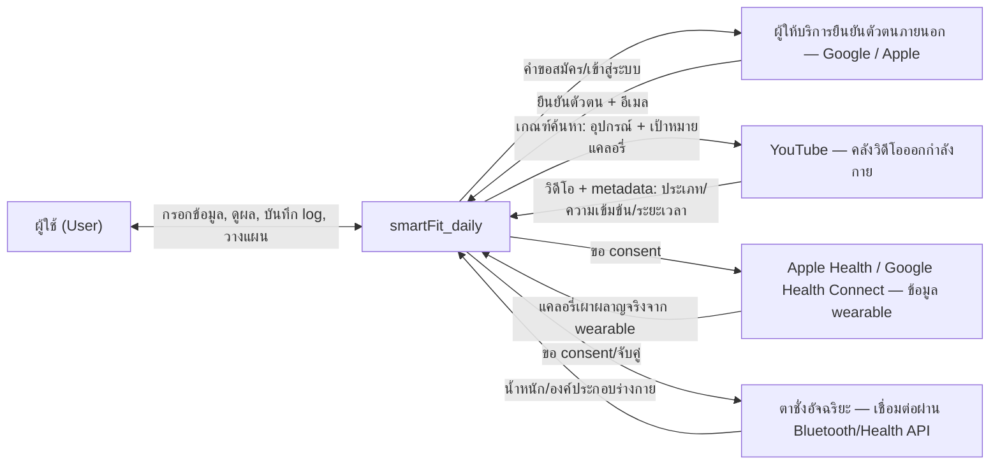
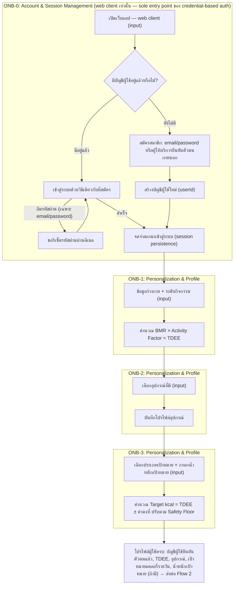
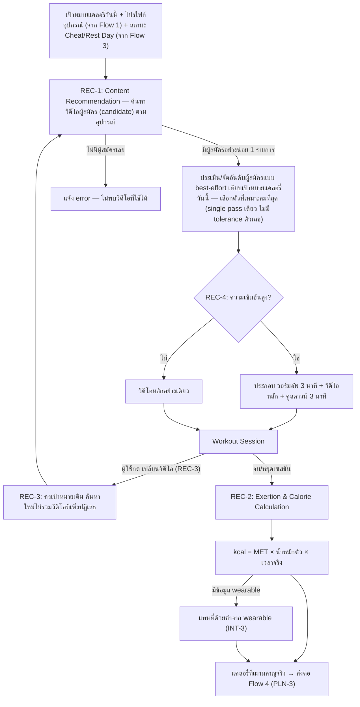
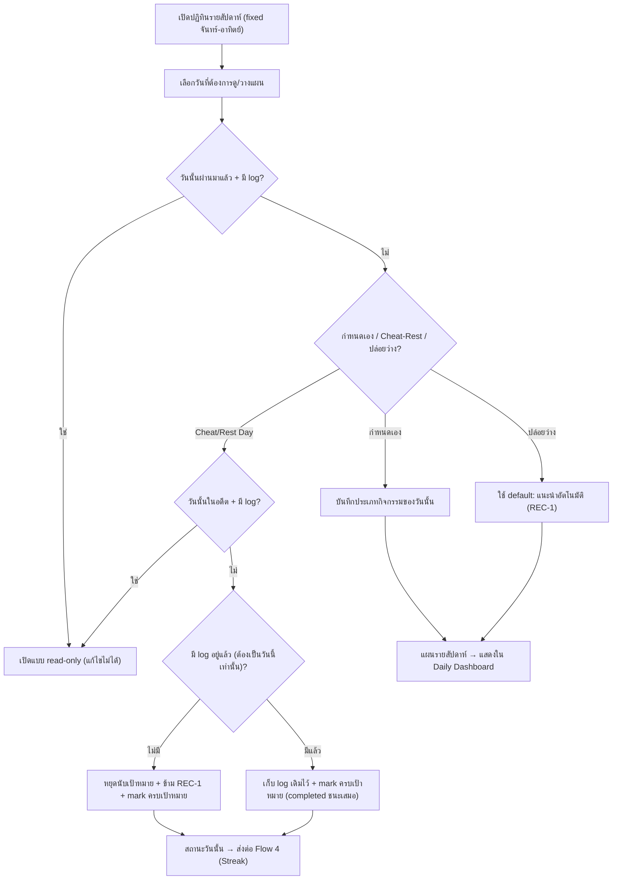
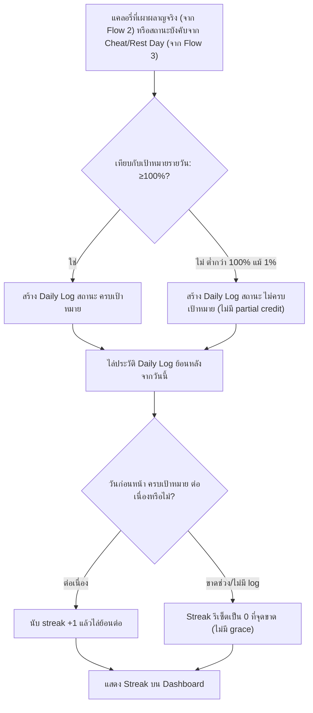
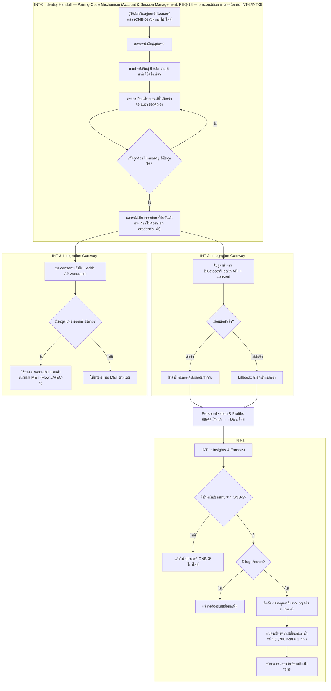

# High Level Architecture (Conceptual) — smartFit_daily

- **ประเภทเอกสาร:** High Level Architecture — Conceptual (ไม่ผูก technical stack)
- **สถานะเอกสาร:** Draft
- **วันที่สร้าง:** 2026-08-28
- **อัปเดตล่าสุด (status-text fix, Stack Mapping):** 2026-08-31 — แก้แถว **Content Recommendation** ใน
  หัวข้อ 10 (ภาคผนวก: Stack Mapping) ที่ยังระบุว่า `POST /api/workouts/sessions` "ยังเป็น TODO ในโค้ดจริง"
  ไม่เขียน embedded array field `sessionVideos: []` — แต่โค้ดจริง (`apps/web/server/routes/
  content-recommendation/index.ts`, commit `100bbd3`) implement แล้ว: เขียน 1 รายการ (main) ตามปกติ หรือ
  3 รายการ (warmup/main/cooldown) เมื่อ intensity เป็น `high` ตรงกับ REC-1/REC-4's algorithm ใน
  `detailed-design/02-daily-youtube-recommendation.md` อยู่แล้ว (ไม่มี algorithm drift, ไม่แตะหัวข้อ 1-9)
  — ดู log [2026-08-31](../../05-log/20260831-log.md)
- **อัปเดตก่อนหน้า (sync เลข Step กับ `user-journeys.md` ฉบับ 7-step):** 2026-08-31 — follow-up fix ต่อจาก
  รอบ single-pass ด้านล่างในวันเดียวกัน: `feature-journey-writer` แก้ `user-journeys.md` เสร็จแล้ว โดย
  เขียน REC-1 ใหม่จาก 5 step (มี widen-retry) เป็น **7 step** (เปิด dashboard → ดึงเป้าหมายที่เหลือ →
  ค้นหา YouTube ครั้งเดียว ≤15 candidate → กรอง unembeddable → error ถ้าไม่เหลือ candidate → จับคู่ด้วย AI
  รอบเดียว → success/error) และ REC-3 เป็น **5 step** อ้างอิงอัลกอริทึมเดียวกัน — รอบนี้แก้ §4.2 ให้เลิก
  อ้าง "REC-1 (Step 1-5)"/"REC-3 (Step 1-4)" ที่ค้างจากตอนที่ยังรอ `feature-journey-writer` แก้ ให้เป็น
  "REC-1 (Step 1-7)"/"REC-3 (Step 1-5)" พร้อม mapping รายขั้นให้ตรงกับ 7 step จริง และปิด follow-up note
  ใน §8 ข้อ 1 ที่เคยบอกว่ารอ re-check (ดู log [2026-08-31](../../05-log/20260831-log.md))
- **อัปเดตก่อนหน้า (แก้ conceptual body ให้ตรงกับ single-pass flow จริง):** 2026-08-31 — fresh audit
  รอบนี้พบว่ารอบก่อนหน้า (2026-08-31 เช้า, ดูรายการถัดไปด้านล่าง) แก้เฉพาะหัวข้อ 10 (ภาคผนวก: Stack
  Mapping) ของ Content Recommendation แล้วตัดสิน (ผิด) ว่าหัวข้อ 1-9 ไม่ต้องแก้ — แต่ §4.2 (Flow diagram)
  และ §8 ข้อ 1 ยังคงบรรยาย "ขยายเกณฑ์ค้นหา แล้วลองใหม่" (widen-retry) เป็นพฤติกรรมเชิงแนวคิดของ REC-1 อยู่
  ซึ่งขัดกับ design จริงที่ยืนยันแล้ว (single-pass: ค้นหาผู้สมัครหนึ่งครั้ง → ขั้นตอนประเมิน/จัดอันดับ
  แบบ AI-assisted เลือกตัวที่ดีที่สุดแบบ best-effort ในรอบเดียว ไม่มี tolerance ตัวเลข ไม่มี retry/widen —
  ไม่พบผู้สมัครเลยตั้งแต่ต้นเท่านั้นที่ถือเป็น error) รอบนี้แก้ทั้งสองจุด: (1) §4.2 diagram เปลี่ยนโหนด
  "ขยายเกณฑ์ค้นหา แล้วลองใหม่"/R1B ให้เป็น "ค้นหาผู้สมัคร" (R1A) → "ประเมิน/จัดอันดับแบบ best-effort" (R1B
  ใหม่) → กรณีไม่มีผู้สมัครเลยให้ error (R1ERR) พร้อมแก้ edge ที่ REC-3 วนกลับเข้า flow (R3 → R1A) และ
  ปรับคำอธิบาย REC-1 ท้าย diagram (2) §8 ข้อ 1 resolve open point เรื่อง tolerance/widen-retry logic ให้
  ระบุข้อเท็จจริงที่ยืนยันแล้วแทน — ไม่แตะ §10 (ถูกต้องอยู่แล้วจากรอบก่อน) ไม่แตะ `user-journeys.md`
  (feature-journey-writer แก้คู่ขนานอยู่แล้ว — ดู §8 ข้อ 1 สำหรับหมายเหตุ follow-up เรื่องเลข Step) (ดู log
  [2026-08-31](../../05-log/20260831-log.md))
- **อัปเดตก่อนหน้า (citation fix):** 2026-08-30 — `feature-list-journey` เพิ่งกำหนด Feature ID **INT-0**
  พร้อม business rule ใหม่ **REQ-18** อย่างเป็นทางการใน `backlog.md`/
  `01-spec/20260823-04-smart-integrations.md` ให้กับกลไก pairing-code/identity handoff ที่เอกสารนี้
  โมเดลไว้แล้วตั้งแต่รอบก่อนหน้าในฐานะ implicit precondition ของ REQ-12/REQ-13 — รอบนี้เป็น **citation-only
  fix ล้วนๆ ไม่ใช่การ re-model เนื้อหา**: แก้ทุกจุดที่เคยอ้าง "implicit precondition ของ REQ-12/REQ-13"
  หรือ "ยังไม่มี REQ number formal" ให้อ้าง **REQ-18 (Feature ID INT-0)** แทน ใน §3.1 (รับผิดชอบ/หน้าที่/
  คุยกับ), §3.8 (หน้าที่/คุยกับ), §4.5 (หัว flow, subgraph PAIR label, คำอธิบาย PAIR), §5 (แถว Pairing
  Credential), §7 (ย่อหน้า Security/Privacy), §8 (ข้อ 7 — ปรับสถานะจาก "ยังไม่ resolved เรื่อง REQ number"
  เป็น "resolved บางส่วน" เพราะยังเหลือประเด็น NFR-05 coverage ที่ยังไม่ resolved) และปรับจำนวน Feature ID
  ในหัวข้อ 1 จาก 15 เป็น 16 — ไม่แตะหัวข้อ 2, 6, 9, 10 เพราะไม่มีการอ้าง REQ-12/REQ-13 ผูกกับกลไกนี้อยู่ที่
  นั่น (ดู log [2026-08-30](../../05-log/20260830-log.md))
- **อัปเดตก่อนหน้า:** 2026-08-30 — Architecture Consistency Audit ตาม `feature-list-journey` ที่เพิ่งอัปเดต
  `backlog.md`/`user-journeys.md`/2 ไฟล์ `01-spec/*.md` (Onboarding, Smart Integrations) พบ 2 จุดล้าหลัง
  (ไม่ขัดแย้ง แค่เก่า) แก้ผ่าน flow ปกติทั้งคู่: (1) **ONB-0 เป็น web-only** — ปรับ §3.1 (หน้าที่/คุยกับ),
  §4.1 (diagram node + คำอธิบาย Step 1) ให้ระบุชัดว่าเว็บไคลเอนต์เป็นทางเข้าเดียวของ credential-based auth
  (เดิมเอกสารนี้ไม่ได้ระบุข้อจำกัดนี้เลย แม้จะมี component "Account & Session Management" อยู่แล้ว) (2)
  **กลไก pairing-code / identity handoff ใหม่** (precondition ของ INT-2/INT-3, implicit ต่อ REQ-12/13
  ไม่มี REQ number ของตัวเอง) — เพิ่ม component interaction ระหว่าง Account & Session Management ↔
  Integration Gateway (§3.1, §3.8), เพิ่ม subgraph PAIR นำหน้า INT-2/INT-3 ใน Flow 5 diagram (§4.5) พร้อม
  คำอธิบาย mapping กลับ Step 1-6 ของ user-journeys.md, เพิ่ม conceptual data entity **Pairing Credential**
  (§5), เพิ่มหมายเหตุ Security/Privacy (§7) และจุดที่ยังไม่ได้ระบุข้อ 7 (§8) — ไม่แตะหัวข้อ 10 (ภาคผนวก:
  Stack Mapping) รอบนี้ เพราะ `tech-stack.md` เองยังไม่ได้อัปเดตจาก Firebase Cloud Functions/React
  Native-Expo เดิมมาเป็น Express + web-first ตามโค้ดจริง (ต้องรอ `tech-stack-builder` เดินกระบวนการถามผู้ใช้
  ก่อนตาม CLAUDE.md — เป็น pre-existing drift ที่ `feature-list-journey` พบเช่นกัน) audit หัวข้ออื่นทั้งหมด
  (2, 6) แล้วไม่พบข้อขัดแย้งเพิ่มเติม (ดู log [2026-08-30](../../05-log/20260830-log.md))
- **อัปเดตก่อนหน้า:** 2026-08-29 (รอบใหม่) — sync แถว "Account & Session Management" ในหัวข้อ 10 (ภาคผนวก:
  Stack Mapping) ให้ตรงกับ `tech-stack.md` §6.1/§6.3.1 ฉบับสมบูรณ์ที่เพิ่งขยาย mapping ระดับ operation เสร็จ
  (เดิมทิ้ง ⚠️ placeholder ไว้ว่า "รอ `tech-stack-builder` ขยาย") — เป็น mechanical re-sync ล้วนๆ ตามกติกา
  Stack Mapping Appendix freshness ไม่ใช่การตัดสินใจเนื้อหาใหม่ ไม่กระทบหัวข้อ 1-9 (ดู log
  [2026-08-29](../../05-log/20260829-log.md))
- **อัปเดตก่อนหน้า:** 2026-08-29 — (1) sync หัวข้อ 10 (ภาคผนวก: Stack Mapping) ให้ตรงกับ `tech-stack.md` §6.1
  ฉบับ Firebase ใหม่ (2) เพิ่มการอ้างอิง NFR-12 (Reliability — Data Integrity) และ NFR-13 (Usability —
  Data Visualization) เข้าหัวข้อ 7 ตามที่เพิ่มใหม่ใน NFR doc (3) รอบ audit ล่าสุด — ตรวจ sync กับ
  `backlog.md` ฉบับที่เพิ่งเพิ่ม 2 แถวในตาราง NFR Traceability (NFR-12→REC-2/INT-3, NFR-13→INT-1) พบว่า
  หัวข้อ 1/7 ตรงอยู่แล้ว (ไม่มีอะไรต้องแก้เพิ่มจากส่วนนี้) แต่พบว่าหัวข้อ 10 เองล้าหลังไปอีกชั้น — sync ครั้ง
  ก่อนอ้างเวอร์ชัน `tech-stack.md` §6.1 แบบเบื้องต้น ทั้งที่ `tech-stack-builder` ปรับ §6.1 ให้ละเอียดระดับ
  per-table/collection ไปแล้วในรอบถัดมา (Stack Mapping Appendix freshness — แก้ได้เองไม่ต้องถามผู้ใช้) จึง
  เขียนหัวข้อ 10 ใหม่ให้ตรงกับ §6.1 ฉบับละเอียดปัจจุบัน — audit หัวข้ออื่นทั้งหมด (1-9) แล้วไม่พบ drift อื่น
  (4) **เพิ่ม Conceptual Component ใหม่ "Account & Session Management" (§3.1)** ครอบคลุม **ONB-0**
  (REQ-14–17 — สมัครสมาชิก/เข้าสู่ระบบ/ลืมรหัสผ่าน/ออกจากระบบ) ที่เพิ่งถูกเพิ่มเข้า `01-spec/`/`backlog.md`/
  `user-journeys.md` วันเดียวกันนี้ แต่ยังไม่มี component ใดครอบคลุมในเอกสารนี้เลย — renumber component เดิม
  §3.1–3.7 เป็น §3.2–3.8, ขยาย §2 (System Context) และเพิ่ม §6.4 (External Integration Boundary ใหม่:
  ผู้ให้บริการยืนยันตัวตนภายนอก Google/Apple ตามที่ REQ-14 กำหนดไว้เป็นข้อเท็จจริง), เพิ่ม subgraph ONB-0
  นำหน้า Flow 1 ใน §4.1, เพิ่ม entity **User Account** ใน §5, ปรับปรุง §7 (NFR-04/06/11 ที่เคยอ้าง "เมื่อมี
  ระบบบัญชีผู้ใช้จริง" เป็นเงื่อนไขอนาคต — ตอนนี้เป็นจริงแล้ว), เพิ่มจุดที่ยังไม่ได้ระบุใหม่ใน §8 (ขอบเขต
  NFR-05 ต่อผู้ให้บริการยืนยันตัวตน), และเพิ่มแถวใหม่ใน §10 (ภาคผนวก Stack Mapping — บันทึกว่า
  `tech-stack.md` §6.1 ยังไม่มี mapping ระดับ operation ของ component นี้ รอ `tech-stack-builder` ขยาย)
  (ดู [log 2026-08-29](../../05-log/20260829-log.md))
- **อัปเดตล่าสุด (รอบ Stack Mapping re-sync):** 2026-08-30 — **mechanical re-sync หัวข้อ 10 (ภาคผนวก:
  Stack Mapping) เท่านั้น** ตามที่ `tech-stack-builder` เพิ่งอัปเดต `tech-stack.md` ให้สะท้อนสถาปัตยกรรมจริง
  (Express.js บน Google Cloud Run แทน Firebase Cloud Functions/Firebase Hosting) — ตามกติกา CLAUDE.md
  "Drift between the appendix and `tech-stack.md` is auto-fixable without the ask-user protocol" จึงแก้
  โดยไม่ถามผู้ใช้: (1) เปลี่ยนทุกจุดที่เคยเขียน "Cloud Function `{ชื่อ}`" เป็น **Express route** จริงตามที่
  `tech-stack.md` §6.1/§6.3 ระบุ (2) เพิ่ม mapping ของ**กลไก pairing-code** (component interaction, data
  flow, และ conceptual data entity "Pairing Credential" ที่เอกสารนี้เองโมเดลไว้แล้วใน §3.1/§3.8/§4.5/§5
  ตั้งแต่รอบก่อนหน้า แต่ยังไม่เคยมี stack mapping) — top-level collection `pairingCodes/{code}`, TTL 5
  นาทีผ่าน field `expiresAt`, mint ผ่าน `POST /api/pairing/create-code` (ต้องยืนยันตัวตน), redeem ผ่าน
  `POST /api/pairing/redeem` (ข้อยกเว้นเดียว ไม่ต้องยืนยันตัวตน) ซึ่ง `delete()` document ทิ้งแทนการตั้ง
  `is_used` flag แล้ว mint Firebase custom token คืนให้ (3) แก้จำนวน operation ของ Account & Session
  Management จาก 8 เป็น **10** ให้ตรงกับ `tech-stack.md` §6.3.1 ฉบับล่าสุด (4) เปลี่ยน hosting reference
  เป็น **Google Cloud Run** — **ไม่แตะหัวข้อ 1-9**: บรรยาย pairing-code เชิงแนวคิดถูกต้องอยู่แล้วจากรอบก่อน
  ไม่มีอะไรต้องแก้ (ดู log [2026-08-30](../../05-log/20260830-log.md))
- **สร้างโดย:** skill `architecture-builder`
- **อ้างอิงจาก:** [Product Backlog](../../01-requirements/backlog.md),
  [Requirement ทั้ง 4 epic + NFR](../../01-requirements/01-spec/index.md),
  [User Journeys](../01-prototypes/user-journeys.md)

## 1. ขอบเขตและหลักการ (Scope & Principles)

เอกสารนี้ตอบคำถาม **"ระบบ smartFit_daily ประกอบด้วยอะไรบ้าง และข้อมูลไหลผ่านส่วนไหนบ้าง"** — ไม่ใช่
**"จะ implement ด้วยอะไร"** ทุก component, data flow, และ data entity ในเอกสารนี้เป็นแนวคิดเชิงหน้าที่
(functional/logical) ล้วน **ไม่ผูกกับ technical stack ใดๆ** — ไม่มีชื่อ framework, ฐานข้อมูล, cloud
provider, ภาษาโปรแกรม, หรือรูปแบบ API เฉพาะเจาะจงปรากฏอยู่ในเอกสารนี้

ข้อยกเว้นเดียวคือชื่อระบบภายนอกที่ requirement กำหนดไว้แล้วเป็นข้อเท็จจริงของธุรกิจ (ไม่ใช่ทางเลือกทาง
เทคนิคของทีม) ได้แก่ **YouTube** (REQ-04) และ **Apple Health/Google Health Connect** (REQ-13) — ระบบ
เหล่านี้ถูกอธิบายในฐานะ **external integration boundary** เท่านั้น (ดูหัวข้อ 6)

เอกสารนี้เป็น**พื้นฐาน**ที่ต้องเขียนเสร็จก่อนที่ `docs/02-design/02-technical/` จะเริ่มมีเอกสารเชิง
stack-specific (database schema, API design, tech choices) ในอนาคต — เมื่อทีมเลือก stack จริงแล้ว
เอกสารเหล่านั้นควร derive concept จากที่นี่ ไม่ใช่มาแทนที่เอกสารนี้

ขอบเขต (scope) ของเอกสารนี้ครอบคลุมทั้ง 16 Feature ID ในทั้ง 4 Epic ตาม
[backlog.md](../../01-requirements/backlog.md) (รวม **ONB-0** ที่เพิ่มเข้ามาเมื่อ 2026-08-29 — ดู §3.1 —
และ **INT-0**/REQ-18 ที่ได้รับ Feature ID/REQ formal ของตัวเองเมื่อ 2026-08-30 — ดู §3.1/§3.8/§4.5)
รวมถึง NFR-01–13 จาก
[Non-Functional Requirements](../../01-requirements/01-spec/20260827-05-non-functional-requirements.md)
ในฐานะ cross-cutting concern (ดูหัวข้อ 7)

## 2. System Context

ผู้ใช้โต้ตอบกับ smartFit_daily เป็นระบบเดียว (กล่องเดียว จากมุมมองภายนอก) ซึ่งเชื่อมต่อกับระบบภายนอก 4
ระบบตามที่ requirement กำหนดไว้ (เพิ่มผู้ให้บริการยืนยันตัวตนภายนอกเข้ามาเมื่อ 2026-08-29 ตาม REQ-14 —
ดู §6.4) — ไม่มีระบบภายนอกอื่นนอกเหนือจากนี้ในขอบเขตปัจจุบันของ backlog

ทิศทางการสื่อสารระดับสูงสุด: ผู้ใช้เป็นผู้ริเริ่มทุก interaction หลัก (สมัคร/เข้าสู่ระบบ, กรอกข้อมูล,
เริ่มออกกำลังกาย, วางแผน, ดู insight) ระบบภายนอกทั้ง 4 มีระดับความจำเป็นต่างกัน: ผู้ให้บริการยืนยันตัวตน
ภายนอก (Google/Apple) เป็น**ทางเลือกหนึ่งใน 3 วิธี**ของ ONB-0 (Must) — email/password เป็น fallback ที่ใช้
ได้เสมอโดยไม่ต้องพึ่งระบบภายนอกเลย จึงไม่ผูก core loop เข้ากับความพร้อมของผู้ให้บริการเหล่านี้โดยตรง, YouTube
จำเป็นสำหรับ core loop รายวัน, ส่วน Health API/wearable และตาชั่งอัจฉริยะเป็น Could-priority ตาม
`backlog.md` — ระบบต้องทำงานได้แม้ไม่มี 2 อย่างหลังนี้ ตาม NFR-07

## 3. Conceptual Components / Modules

แต่ละ component ตั้งชื่อตามหน้าที่ ไม่ใช่ตามเทคโนโลยี — ระบุ Feature ID/Epic ที่รับผิดชอบ และ component
อื่นที่คุยด้วยในระดับแนวคิด (ไม่ใช่ API endpoint จริง)

### 3.1 Account & Session Management

- **รับผิดชอบ**: ONB-0 (REQ-14–17 — เพิ่มเข้า backlog 2026-08-29); และกลไกส่งต่อความเป็นตัวตน (identity
  handoff) ซึ่งเป็น precondition ทางเทคนิคของ INT-2/INT-3 ตาม **REQ-18 (Feature ID INT-0)** — formalize
  เป็น Feature ID/REQ ของตัวเองแล้วเมื่อ 2026-08-30 (เดิมเคย map เป็น implicit precondition ของ
  REQ-12/REQ-13 เท่านั้น ก่อนมี REQ ของตัวเอง — ดูหัวข้อ 8 ข้อ 7 สำหรับสถานะปัจจุบัน)
- **หน้าที่**: จัดการวงจรชีวิตทั้งหมดของบัญชีผู้ใช้ — สร้างบัญชีใหม่ผ่านหลายวิธี (สมัครด้วยอีเมล/รหัสผ่าน
  หรือผ่านผู้ให้บริการยืนยันตัวตนภายนอก — ดูหัวข้อ 6.4), ยืนยันตัวตนเพื่อเข้าสู่ระบบด้วยวิธีเดียวกับที่สมัคร
  ไว้, คงสถานะเข้าสู่ระบบไว้ข้ามการเปิดแอปแต่ละครั้ง (session persistence) จนกว่าจะออกจากระบบเองหรือ
  session หมดอายุ, จัดการคำขอรีเซ็ตข้อมูลยืนยันตัวตนสำหรับบัญชีที่ใช้อีเมล/รหัสผ่านเท่านั้น (ใช้ไม่ได้กับ
  บัญชีที่ผูกกับผู้ให้บริการภายนอก), และล้างสถานะเข้าสู่ระบบทันทีเมื่อผู้ใช้ออกจากระบบ เป็น**เกตเวย์แรกสุด
  ของทั้งระบบ** — ต้องสร้างบัญชีผู้ใช้จริงก่อนเสมอ ก่อนที่ Personalization & Profile หรือ component อื่นใด
  จะเริ่มอ่าน/เขียนข้อมูลที่ผูกกับผู้ใช้คนนั้นได้ **เว็บไคลเอนต์ (web client) เป็นทางเข้าเดียว (sole entry
  point) สำหรับการยืนยันตัวตนด้วย credential ทุกวิธี (สมัคร/เข้าสู่ระบบ/ลืมรหัสผ่าน/ออกจากระบบ)** —
  ไคลเอนต์อื่นใดในระบบไม่มีหน้าจอสำหรับสิ่งเหล่านี้ของตัวเองเลย ต้องอาศัยตัวตนที่ยืนยันแล้วจากเว็บไคลเอนต์
  เสมอ (อัปเดต 2026-08-30) นอกจากนี้ยังทำหน้าที่ mint **รหัสจับคู่อุปกรณ์ชั่วคราวแบบใช้ครั้งเดียว**
  (short-lived, single-use pairing credential) ให้กับ session ที่ยืนยันตัวตนแล้วเมื่อร้องขอ และรับการแลก
  รหัสนั้นคืนเป็น session ที่ยืนยันตัวตนแล้วสำหรับไคลเอนต์ใหม่ที่ยังไม่เคยยืนยันตัวตนมาก่อน โดยไม่ต้องกรอก
  credential ซ้ำ — เป็นกลไกเดียวที่ทำให้ไคลเอนต์ที่ไม่มีหน้าจอ auth ของตัวเอง (ดู Integration Gateway,
  §3.8) เริ่มทำงานในนามผู้ใช้คนเดิมได้ (identity handoff ตาม **REQ-18**/**INT-0**, อัปเดต 2026-08-30)
- **คุยกับ**: Personalization & Profile (ส่งต่อบัญชีผู้ใช้ที่ยืนยันตัวตนสำเร็จแล้ว เพื่อเริ่มกรอกข้อมูล
  ส่วนตัวครั้งแรก หรือพาเข้าสู่ Daily Dashboard ต่อถ้าเคยผ่าน onboarding มาแล้ว), Integration Gateway
  (ออกรหัสจับคู่อุปกรณ์ชั่วคราวให้ session ที่ยืนยันตัวตนแล้วร้องขอ แล้วรับการแลกรหัสนั้นคืนเป็น session
  ใหม่ที่ยืนยันตัวตนแล้ว ก่อนที่ Integration Gateway จะเริ่มกระบวนการจับคู่อุปกรณ์จริงของ INT-2/INT-3 ได้ —
  precondition ทางเทคนิคตาม **REQ-18/INT-0**, อัปเดต 2026-08-30) — และเป็น**precondition โดยอ้อมของทุก component ที่เหลือ
  ทั้งหมด** เพราะทุก component อื่นอ่าน/เขียนข้อมูลที่ผูกกับผู้ใช้คนหนึ่งเสมอ ซึ่งต้องผ่านที่นี่ก่อนจึงจะมี
  ตัวตนให้ผูกข้อมูลด้วย

### 3.2 Personalization & Profile

- **รับผิดชอบ**: ONB-1, ONB-2, ONB-3 (Epic 1 ที่เหลือ)
- **หน้าที่**: รับข้อมูลร่างกาย/ประชากรศาสตร์ของผู้ใช้ คำนวณ TDEE คำนวณเป้าหมายแคลอรี่รายวันจากประเภท
  เป้าหมายที่เลือก (พร้อมน้ำหนักเป้าหมายเมื่อเกี่ยวข้อง — ดูหัวข้อ 8.1) และเก็บโปรไฟล์อุปกรณ์ที่ใช้เป็น
  filter ของการแนะนำวิดีโอ เป็น**ฐาน (baseline)** ที่แทบทุก component อื่นต้องอ่านค่าจากที่นี่
- **คุยกับ**: Account & Session Management (รับบัญชีผู้ใช้ที่ยืนยันตัวตนแล้วเป็นจุดเริ่มต้น), Content
  Recommendation (ส่งโปรไฟล์อุปกรณ์ + เป้าหมายแคลอรี่รายวัน), Exertion & Calorie Calculation (ส่งน้ำหนักตัว),
  Planner & Day-Status (ส่งเป้าหมายแคลอรี่รายวันสำหรับแสดงผล/ปรับ), Insights & Forecast (ส่งน้ำหนักเป้าหมาย
  + ทิศทางเป้าหมาย + ค่าคงที่ 7,700 kcal), Integration Gateway (รับน้ำหนักที่ซิงค์มาเพื่อคำนวณ TDEE ใหม่)

### 3.3 Content Recommendation

- **รับผิดชอบ**: REC-1, REC-3, REC-4
- **หน้าที่**: เลือก/สลับ/ประกอบวิดีโอออกกำลังกาย (รวมวอร์มอัพ-คูลดาวน์เมื่อความเข้มข้นสูง) ให้ตรงกับ
  เป้าหมายแคลอรี่ของวันนั้นและ filter ตามอุปกรณ์ที่มี
- **คุยกับ**: Personalization & Profile (อ่านโปรไฟล์อุปกรณ์ + เป้าหมายแคลอรี่รายวัน), Planner &
  Day-Status (อ่านว่าวันนี้เป็น Cheat/Rest Day หรือไม่ — ถ้าใช่ ข้ามการแนะนำ), Exertion & Calorie
  Calculation (ส่ง metadata ของวิดีโอที่เลือก: ประเภทกิจกรรม, ความเข้มข้น, ระยะเวลา)

### 3.4 Exertion & Calorie Calculation

- **รับผิดชอบ**: REC-2
- **หน้าที่**: คำนวณแคลอรี่ที่เผาผลาญจริงหลังจบ/หยุดเซสชันด้วยสูตร MET โดยมีจุดแทนที่ค่าด้วยข้อมูลจาก
  wearable เมื่อมี
- **คุยกับ**: Content Recommendation (อ่าน metadata วิดีโอ + เวลาที่ใช้จริง), Personalization & Profile
  (อ่านน้ำหนักตัว), Integration Gateway (รับค่าแทนที่จาก wearable), Logging & Streak (ส่งแคลอรี่ที่
  เผาผลาญจริง + ระยะเวลา)

### 3.5 Planner & Day-Status

- **รับผิดชอบ**: PLN-1, PLN-2
- **หน้าที่**: แสดงปฏิทินรายสัปดาห์แบบ fixed calendar week (จันทร์-อาทิตย์) ให้ผู้ใช้วางแผนกิจกรรมล่วงหน้า
  หรือทำเครื่องหมาย Cheat/Rest Day บังคับใช้กติกาว่าวันในอดีตที่มี log อยู่แล้วเป็น read-only (ทั้งการ
  ดูแผนและการตั้ง Cheat/Rest Day)
- **คุยกับ**: Content Recommendation (สั่งให้ข้ามการแนะนำวันที่เป็น Cheat/Rest), Logging & Streak (อ่านว่า
  วันนั้นมี log อยู่แล้วหรือไม่ เพื่อตัดสิน read-only/บังคับสถานะ "ครบเป้าหมาย"), Personalization & Profile
  (อ่านเป้าหมายแคลอรี่รายวันเพื่อแสดงผล)

### 3.6 Logging & Streak

- **รับผิดชอบ**: PLN-3, PLN-4
- **หน้าที่**: บังคับใช้กติกา all-or-nothing เข้มงวด (ไม่มี partial credit) เทียบแคลอรี่ที่เผาผลาญจริงกับ
  เป้าหมายรายวันเพื่อสร้าง log ประจำวัน และคำนวณ streak ต่อเนื่องโดยไล่ประวัติ log ย้อนหลังจากวันนี้
- **คุยกับ**: Exertion & Calorie Calculation (อ่านแคลอรี่ที่เผาผลาญจริง), Personalization & Profile (อ่าน
  เป้าหมายแคลอรี่รายวัน), Planner & Day-Status (อ่าน/รับสถานะ "ครบเป้าหมาย" บังคับจาก Cheat/Rest Day),
  Insights & Forecast (ส่งประวัติแคลอรี่ขาดดุล/เกินดุลจริง)

### 3.7 Insights & Forecast

- **รับผิดชอบ**: INT-1
- **หน้าที่**: พยากรณ์วันที่คาดว่าจะถึงน้ำหนักเป้าหมาย จากอัตราขาดดุล/เกินดุลแคลอรี่เฉลี่ยที่บันทึกจริง
  (ไม่ใช่ค่าประมาณตอน onboarding)
- **คุยกับ**: Logging & Streak (อ่านประวัติ log), Personalization & Profile (อ่านน้ำหนักเป้าหมาย +
  ทิศทางเป้าหมาย + ค่าคงที่ 7,700 kcal), Integration Gateway (อ่านน้ำหนักปัจจุบันล่าสุดที่ซิงค์มา)

### 3.8 Integration Gateway

- **รับผิดชอบ**: INT-2, INT-3
- **หน้าที่**: เป็นสะพานเชื่อมอุปกรณ์/แพลตฟอร์มภายนอกที่เป็นทางเลือก (ตาชั่งอัจฉริยะผ่าน Bluetooth,
  wearable ผ่าน Health API) เข้ากับโปรไฟล์และข้อมูลแคลอรี่ของแอป โดยต้องผ่าน consent gate เสมอ และมี
  fallback เป็นการกรอกเอง/ใช้ค่าประมาณ MET เมื่อเชื่อมต่อไม่ได้ **ก่อนเริ่มกระบวนการจับคู่อุปกรณ์จริงของ
  INT-2/INT-3 ได้ ต้องผ่าน identity handoff จาก Account & Session Management ก่อนเสมอ ตาม REQ-18
  (Feature ID INT-0)** (ดู §3.1, §4.5) — เนื่องจากไคลเอนต์ที่ทำหน้าที่นี้ไม่มีหน้าจอ auth ของตัวเอง จึงต้อง
  รับตัวตนที่ยืนยันแล้วมาจากที่นั่นผ่านรหัสจับคู่อุปกรณ์ชั่วคราวแทน (อัปเดต 2026-08-30)
- **คุยกับ**: Account & Session Management (รับรหัสจับคู่อุปกรณ์ชั่วคราวที่ผู้ใช้กรอกบนไคลเอนต์ที่ไม่มี
  หน้าจอ auth ของตัวเอง แลกเป็น session ที่ยืนยันตัวตนแล้ว ก่อนเริ่มกระบวนการจับคู่อุปกรณ์จริง — precondition
  ทางเทคนิคตาม **REQ-18 (Feature ID INT-0)**, อัปเดต 2026-08-30), Personalization & Profile (เขียนน้ำหนัก/
  องค์ประกอบร่างกายที่ซิงค์มา), Exertion & Calorie Calculation (เขียนค่าแทนที่จาก wearable), Insights &
  Forecast (ทางอ้อม ผ่านน้ำหนักที่ซิงค์)

> NFR-01–13 ไม่ใช่ component ของตัวเอง — เป็น cross-cutting concern ที่พาดผ่านทั้ง 8 component ข้างต้น
> (ดูหัวข้อ 7)

## 4. Data Flow ตาม User Journey

จัดกลุ่ม 14 feature เป็น 5 data flow ตามลำดับ step ที่ระบุไว้จริงใน
[user-journeys.md](../01-prototypes/user-journeys.md) — เลขอ้างอิง "Step N" ด้านล่างตรงกับลำดับ
"คำอธิบายตามลำดับ diagram" ของแต่ละ feature ในเอกสารนั้น

### 4.1 Flow 1 — Authentication & Onboarding Flow (ONB-0 → ONB-1 → ONB-2 → ONB-3)

- **ONB-0** (Step 1-11): ผู้ใช้เปิด**เว็บแอป (web client)** — ONB-0 เป็น **web-only**: หน้าจอสมัคร/
  เข้าสู่ระบบ/ลืมรหัสผ่าน/ออกจากระบบทั้งหมดมีอยู่เฉพาะที่เว็บไคลเอนต์เท่านั้น ไคลเอนต์อื่น (companion app
  ของ INT-2/INT-3) ไม่มีหน้าจอเหล่านี้เลย (อัปเดต 2026-08-30) ระบบตรวจสอบว่ามีบัญชีผู้ใช้อยู่แล้วหรือไม่ (Step 1) →
  **กรณียังไม่มีบัญชี**: เลือกวิธีสมัครสมาชิก 1 ใน 3 วิธี — email/password, Google OAuth, หรือ Sign in
  with Apple (Step 2) → สร้างบัญชีผู้ใช้ใหม่ (`userId`) ก่อนเข้าสู่ ONB-1 เสมอ (Step 3-4) →
  **กรณีมีบัญชีอยู่แล้ว**: เลือกวิธีเข้าสู่ระบบด้วยวิธีเดียวกับที่สมัครไว้ (Step 5) → ตรวจสอบว่าเข้าสู่ระบบ
  สำเร็จหรือไม่ (Step 6) → สำเร็จ: จดจำสถานะเข้าสู่ระบบไว้ (session persistence) (Step 7) → เข้าแอปต่อ
  (Daily Dashboard ถ้าผ่าน onboarding แล้ว หรือกลับไปทำ ONB-1 ต่อถ้ายังไม่เคยผ่าน) (Step 8) →
  **กรณีลืมรหัสผ่าน** (เฉพาะบัญชี email/password): ขอรีเซ็ตรหัสผ่านผ่านอีเมลที่ลงทะเบียนไว้ แล้ววนกลับไป
  เข้าสู่ระบบใหม่ (Step 9) → ผู้ใช้ออกจากระบบได้ทุกเมื่อจากหน้าโปรไฟล์ (Step 10) → ล้าง session ทันที แล้ว
  กลับไปจุดเริ่มต้น (Step 11, ไม่ได้วาดเป็นลูปแยกในไดอะแกรมข้างต้นเพื่อไม่ให้ปนกับ flow หลักที่นำไปสู่
  onboarding)
- **ONB-1** (Step 1-7): ผู้ใช้กรอกอายุ/เพศ/น้ำหนัก/ส่วนสูง/ระดับกิจกรรม → validate (Step 2-3, วนกลับถ้า
  ไม่ผ่าน) → คำนวณ BMR ด้วยสูตร Mifflin-St Jeor (Step 4-5) → คูณ Activity Factor ได้ TDEE (Step 6) →
  บันทึกลงโปรไฟล์ (Step 7) → ส่งต่อ ONB-2 (Precondition: มีบัญชีผู้ใช้จริงแล้วจาก ONB-0 เสมอ)
- **ONB-2** (Step 1-5): ผู้ใช้เลือกอุปกรณ์ที่มี (ไม่มี/ดัมเบล/ยิมครบชุด, เลือกได้มากกว่า 1) → บันทึกเป็น
  โปรไฟล์อุปกรณ์ (Step 3-5) → ใช้เป็น filter มาตรฐานของ REC-1 ทุกครั้ง
- **ONB-3** (Step 1-5): ผู้ใช้เลือกประเภทเป้าหมาย → ระบบแปลงเป็นค่าคงที่ (TDEE−500/TDEE+0/TDEE+300)
  พร้อมให้กรอกน้ำหนักเป้าหมาย (บังคับเมื่อเลือก "ลดน้ำหนัก") (Step 2) → ตรวจ safety floor 1,200–1,500
  kcal (Step 3) → ปรับถ้าต่ำกว่า floor (Step 4) → บันทึกเป้าหมายแคลอรี่รายวัน + น้ำหนักเป้าหมาย onboarding
  เสร็จสมบูรณ์ (Step 5)

ผลลัพธ์ของ Flow นี้ (บัญชีผู้ใช้ที่ยืนยันตัวตนแล้ว, TDEE, โปรไฟล์อุปกรณ์, เป้าหมายแคลอรี่รายวัน,
น้ำหนักเป้าหมาย) เป็น **input ตั้งต้น** ของ Flow 2, 3, 5 ทั้งหมด

### 4.2 Flow 2 — Daily Recommendation & Exercise Session Flow (REC-1 → REC-3 → REC-4 → REC-2)

- **REC-1** (Step 1-7 ใน `user-journeys.md`): เปิด Daily Dashboard (Step 1) → ดึงเป้าหมายแคลอรี่วันนี้ที่
  เหลือ (ปรับตาม Cheat/Rest Day ถ้ามี) (Step 2) → ค้นหาวิดีโอจาก YouTube ครั้งเดียว สูงสุด 15 candidate
  filter ด้วยอุปกรณ์ (Step 3) → กรอง candidate ที่ฝัง embed ไม่ได้ออก (Step 4) → ถ้าไม่มี candidate เหลือ
  เลยให้แจ้ง error ทันที ไม่มีการค้นหาซ้ำ (Step 5) → ถ้ามีอย่างน้อย 1 รายการ ส่งเข้าขั้นตอนจับคู่/ประเมินด้วย
  AI ครั้งเดียว (single pass, best-effort, ไม่มี tolerance ตัวเลข) เพื่อเลือกวิดีโอที่เหมาะสมที่สุด (Step 6)
  → จับคู่ไม่สำเร็จแจ้ง error, จับคู่สำเร็จแสดงวิดีโอแนะนำ (Step 7) — ไม่มีการขยายเกณฑ์ค้นหาแล้ววนลองใหม่
  (widen-retry) ที่ขั้นตอนใดเลย
- **REC-3** (Step 1-5, ทางเลือก): ผู้ใช้กดเปลี่ยนวิดีโอ (Step 1) → คงค่าเป้าหมายเดิม ไม่ดึงใหม่ (Step 2) →
  ค้นหาวิดีโอใหม่จาก YouTube ครั้งเดียวไม่รวมวิดีโอปัจจุบัน+ที่เคยถูกปฏิเสธ (Step 3) → กรอง candidate +
  จับคู่ด้วย AI ครั้งเดียวด้วยอัลกอริทึมเดียวกับ REC-1 (Step 4) → แสดงวิดีโอใหม่หรือแจ้ง error ถ้าไม่พบ ไม่มี
  การขยายเกณฑ์หรือค้นหาซ้ำ (Step 5)
- **REC-4** (Step 1-5): ตรวจความเข้มข้นของวิดีโอหลัก → ถ้าสูง ประกอบวอร์มอัพ 3 นาที + หลัก + คูลดาวน์ 3
  นาทีเป็นเซสชันเดียว → ถ้าไม่สูง ใช้วิดีโอหลักอย่างเดียว
- **REC-2** (Step 1-7): ผู้ใช้จบ/หยุดวิดีโอ → อ่านเวลาที่ใช้จริง + ประเภท/ความเข้มข้นของวิดีโอ (Step 1-3) →
  ค้นค่า MET จาก lookup table (Step 4) → คำนวณ kcal = MET × น้ำหนักตัว × เวลา (Step 5) → ถ้ามีข้อมูล
  wearable ให้แทนที่ค่าประมาณนี้ (Step 6, เชื่อมกับ INT-3) → ส่งผลลัพธ์สุดท้ายต่อให้ PLN-3 (Step 7)

### 4.3 Flow 3 — Weekly Planning & Day-Status Flow (PLN-1 → PLN-2)

- **PLN-1** (Step 1-7): เปิดปฏิทิน fixed calendar week → เลือกวัน → ตรวจว่าเป็นวันในอดีตที่มี log หรือไม่
  (Step 3) → ถ้าใช่ เปิด read-only (Step 4) → ถ้าไม่ใช่ ให้กำหนดกิจกรรมเอง/ตั้ง Cheat-Rest (ไป PLN-2)/
  ปล่อยว่าง (Step 5-6) → บันทึกแผนรายสัปดาห์ (Step 7)
- **PLN-2** (Step 1-8): เลือกวันตั้ง Cheat/Rest Day → ตรวจก่อนว่าเป็นวันในอดีต+มี log หรือไม่ (Step 2, ถ้า
  ใช่ปิดกั้นแบบ read-only ไม่มีข้อยกเว้น) → ถ้าเป็นวันนี้/อนาคต ตรวจว่ามี log อยู่แล้วหรือไม่ (Step 3) →
  ไม่มี: หยุดนับเป้าหมาย+ข้าม REC-1 (Step 4) แล้ว mark ครบเป้าหมาย (Step 5) → มีแล้ว (เฉพาะวันนี้): เก็บ
  log เดิมไว้ (Step 6) แล้ว mark ครบเป้าหมายเช่นกัน — "completed ชนะเสมอ" (Step 7) → ทุกกรณี (ยกเว้นถูก
  ปิดกั้น) streak ไม่ขาด (Step 8, เชื่อม Flow 4)

### 4.4 Flow 4 — Daily Logging & Streak Flow (PLN-3 → PLN-4)

- **PLN-3** (Step 1-6): เปรียบเทียบแคลอรี่ที่เผาผลาญจริงกับเป้าหมายวันนั้น (Step 1-2) → ใช้กติกา
  all-or-nothing เข้มงวด (≥100% เท่านั้นถือว่าครบ, ไม่มี partial credit แม้ 99%) (Step 3) → สร้าง Daily
  Log พร้อมนาทีที่ออกกำลังกาย + แคลอรี่สะสม + สถานะ (Step 4-5) → ส่งสถานะต่อให้ PLN-4 (Step 6)
- **PLN-4** (Step 1-6): ไล่ประวัติ Daily Log ย้อนหลังจากวันนี้ (Step 1-2) → วันที่ "ครบเป้าหมาย" (จาก
  PLN-3 หรือถูกบังคับจาก PLN-2) นับต่อเนื่อง (Step 3-4) → วันที่ "ไม่ครบเป้าหมาย" หรือไม่มี log เลยทำให้
  streak ขาดทันทีไม่มี grace (Step 5) → แสดงตัวเลข streak สุดท้ายบน Dashboard (Step 6)

### 4.5 Flow 5 — Smart Integration & Insights Flow (INT-0 → INT-2, INT-3 → INT-1)

- **PAIR — INT-0: Identity Handoff (REQ-18; Step 1-6 ของทั้ง INT-2 และ INT-3 ใน user-journeys.md,
  formalize เป็น Feature ID/REQ ของตัวเอง 2026-08-30)**:
  ผู้ใช้ที่ล็อกอินอยู่แล้วบนเว็บไคลเอนต์ (ONB-0/Account & Session Management) เปิดหน้าโปรไฟล์ (Step 1) →
  กดขอรหัสจับคู่อุปกรณ์ (Step 2) → Account & Session Management mint รหัสจับคู่ 6 หลัก อายุการใช้งาน 5
  นาที แสดงบนหน้าเว็บ (Step 3) → ผู้ใช้เปิดไคลเอนต์ที่ไม่มีหน้าจอ auth ของตัวเอง (companion app ของ
  INT-2/INT-3) กรอกรหัสนั้น (Step 4) → ตรวจสอบว่ารหัสถูกต้อง ยังไม่หมดอายุ และยังไม่ถูกใช้หรือไม่ ถ้าไม่ผ่าน
  วนกลับไปกรอกใหม่ (Step 5) → ถ้าผ่าน Account & Session Management แลกรหัสเป็น session ที่ยืนยันตัวตนแล้ว
  ผูกกับบัญชีเดิม โดยไม่ต้องกรอก credential ซ้ำ (Step 6) — เป็น precondition ทางเทคนิคของ INT-2/INT-3 ทั้งคู่
  ตาม **REQ-18 (Feature ID INT-0)** (เดิมก่อน 2026-08-30 เคย map เป็น implicit precondition ของ
  REQ-12/REQ-13 เท่านั้น ก่อนมี REQ ของตัวเอง — ดูหัวข้อ 8 ข้อ 7) จากนั้นจึงเข้าสู่กระบวนการจับคู่อุปกรณ์จริง
  ของ INT-2 หรือ INT-3 ตามที่ผู้ใช้เลือก
- **INT-2** (Step 1-5): จับคู่ตาชั่งอัจฉริยะผ่าน Bluetooth/Health API พร้อม consent → เชื่อมต่อสำเร็จ:
  ซิงค์น้ำหนัก/องค์ประกอบร่างกายเข้าโปรไฟล์ทันที → เชื่อมต่อไม่สำเร็จ: fallback เป็นกรอกน้ำหนักเอง → ค่าที่
  ได้ป้อนกลับเข้า Personalization & Profile เพื่อคำนวณ TDEE ใหม่
- **INT-3** (Step 1-5): ขอ consent เข้าถึง Apple Health/Google Health Connect → ระหว่าง/หลังออกกำลังกาย
  ถ้ามีข้อมูลจาก wearable ให้ใช้แทนค่าประมาณ MET ใน Flow 2 (REC-2) → ถ้าไม่มี ใช้ค่าประมาณ MET ตามเดิม
  (ไม่ใช่ error — เป็น fallback ที่คาดหวังไว้)
- **INT-1** (Step 1-9): เปิดหน้า Progress/Insights → ตรวจว่ามีน้ำหนักเป้าหมายจาก ONB-3 หรือไม่ (Step 2,
  ดูหัวข้อ 8.1) → ไม่มี: แจ้งให้ไปกรอกก่อน (Step 3) → มี: ตรวจว่ามี log สะสมเพียงพอหรือไม่ (Step 4) →
  ไม่พอ: แจ้งให้สะสมข้อมูลเพิ่ม (Step 5) → พอ: ดึงอัตราขาดดุลเฉลี่ยจาก log จริงของ Flow 4 (Step 6) →
  แปลงเป็นอัตราเปลี่ยนแปลงน้ำหนักด้วยค่าคงที่ 7,700 kcal ≈ 1 กก. (Step 7) → คำนวณวันที่คาดถึงเป้าหมาย
  (Step 8) → แสดงผล (Step 9)

## 5. Conceptual Data Entities

รายการข้อมูลหลักที่ระบบต้องรู้จัก — **ไม่ใช่ database schema** (ไม่มี data type, primary/foreign key,
ชื่อตาราง) ความสัมพันธ์ระบุในระดับแนวคิดเท่านั้น

| Entity | เก็บอะไร | ความสัมพันธ์ |
|---|---|---|
| **User Account** | วิธีที่ใช้สร้างบัญชี (email/password หรือผู้ให้บริการยืนยันตัวตนภายนอก), ข้อมูลอ้างอิงยืนยันตัวตน (ไม่ใช่รหัสผ่านจริง — สำหรับบัญชี email/password เป็นข้อมูลอ้างอิงที่ใช้ตรวจสอบเท่านั้น กรณีผูกกับผู้ให้บริการภายนอกเป็นข้อมูลอ้างอิงไปยังผู้ให้บริการนั้น), สถานะเข้าสู่ระบบปัจจุบัน (session) | 1 User Account มี 1 User Profile เสมอ — เป็นบัญชีที่ต้องถูกสร้าง/ยืนยันตัวตนสำเร็จก่อนเป็นอันดับแรกสุด และเป็น "เจ้าของ" โดยอ้อมของทุก entity อื่นที่เหลือในตารางนี้ (ทุก entity ผูกกับผู้ใช้คนหนึ่งเสมอ) |
| **User Profile** | อายุ, เพศ, น้ำหนัก, ส่วนสูง, ระดับกิจกรรม, TDEE | อยู่ภายใต้ User Account เดียว (สร้างหลังยืนยันตัวตนสำเร็จเสมอ) — 1 มี 1 Equipment Profile, 1 มี 1 Goal Selection ปัจจุบัน, 1 มีได้หลาย Weight Record และหลาย Daily Log |
| **Equipment Profile** | ชุดอุปกรณ์ที่เลือก (ไม่มี/ดัมเบล/ยิมครบชุด, เลือกได้หลายอัน) | 1:1 กับ User Profile — เป็น filter ของ Video/Workout Content |
| **Goal Selection & Daily Calorie Target** | ประเภทเป้าหมายที่เลือก, เป้าหมายแคลอรี่รายวันหลังปรับ safety floor, น้ำหนักเป้าหมาย (บังคับเมื่อเลือก "ลดน้ำหนัก" ไม่บังคับสำหรับเป้าหมายอื่น) | 1:1(ปัจจุบัน) กับ User Profile — Weekly Plan, Daily Log, และ Insights & Forecast อ่านค่านี้ |
| **Video/Workout Content** | id/metadata ของวิดีโอ: ประเภทกิจกรรม, ความเข้มข้น, ระยะเวลา | ถูก filter ด้วย Equipment Profile — ถูกอ้างถึงโดย Workout Session ในฐานะวิดีโอหลัก (และวอร์มอัพ/คูลดาวน์ถ้ามี) |
| **Workout Session** | การประกอบ warmup(ถ้ามี)+หลัก+cooldown(ถ้ามี) ของ 1 ครั้งออกกำลังกาย, เวลาที่ใช้จริง, รายการวิดีโอที่ถูกปฏิเสธระหว่างสลับ (REC-3) | many-to-1 กับ Video/Workout Content (วิดีโอหลัก) — ให้ผลลัพธ์เป็น 1 Actual Calorie Burn |
| **Actual Calorie Burn** | ค่า kcal ที่คำนวณได้: ค่า MET ที่ใช้, input ของสูตร, หรือค่าที่ถูกแทนที่จาก wearable | 1:1 กับ Workout Session — เป็น input ของ Daily Log — อาจถูก override โดย Wearable Reading |
| **Weekly Plan / Calendar Entry** | รายการต่อวันที่ในสัปดาห์ fixed จันทร์-อาทิตย์: ประเภทกิจกรรมที่วางแผน, ค่า default "แนะนำอัตโนมัติ", หรือ flag Cheat/Rest, และ flag read-only เมื่อวันนั้นผ่านมาแล้ว+มี log | หลายรายการต่อ User Profile — 1 วันที่ผูก 1:1 กับ Day Status และ Daily Log ของวันเดียวกัน |
| **Day Status (Cheat/Rest Day marker)** | flag ว่าวันนั้นถูกตั้งเป็น Cheat/Rest และผลลัพธ์ override "completed ชนะเสมอ" | วันที่เดียวกับ Calendar Entry — อยู่ร่วมกับ (ไม่ลบทิ้ง) Daily Log ได้ — ป้อนเข้า Streak |
| **Daily Log** | นาทีที่ออกกำลังกาย, แคลอรี่สะสม, สถานะ "ครบเป้าหมาย"/"ไม่ครบเป้าหมาย" | มาจาก Actual Calorie Burn (ประเมิน all-or-nothing) หรือถูกบังคับจาก Day Status — หลายรายการต่อ User Profile — เป็น input ของ Streak และ Insights & Forecast |
| **Streak** | จำนวนวันต่อเนื่องปัจจุบัน | คำนวณจากการไล่ Daily Log (และ Day Status) ย้อนหลัง — ค่าปัจจุบัน 1 ค่าต่อ User Profile |
| **Weight Record** | น้ำหนัก/องค์ประกอบร่างกาย ณ เวลาหนึ่ง พร้อมแหล่งที่มา (กรอกเอง/ซิงค์จากตาชั่ง) | หลายรายการต่อ User Profile — ใช้คำนวณ TDEE ใหม่และเป็น "น้ำหนักปัจจุบัน" ของ Weight Goal/Forecast |
| **Weight Goal / Forecast** | น้ำหนักเป้าหมาย (จาก ONB-3), วันที่คาดว่าจะถึงเป้าหมาย | ใช้ค่าคงที่ 7,700 kcal จาก Goal Selection — อ่านประวัติ Daily Log และ Weight Record ล่าสุด |
| **Wearable Reading** | ข้อมูลแคลอรี่เผาผลาญ (และฐานข้อมูลอัตราการเต้นหัวใจ/กิจกรรม) จาก Health API ต่อ 1 เซสชัน | override Actual Calorie Burn เมื่อมี — มาจาก Integration Gateway |
| **Integration Consent/Connection State** | สถานะ consent/การเชื่อมต่อต่ออุปกรณ์ภายนอกแต่ละตัว (ตาชั่ง, wearable) | ควบคุมว่า Weight Record/Wearable Reading จะซิงค์ได้หรือไม่ (ตาม NFR-05) |
| **Pairing Credential** (รหัสจับคู่อุปกรณ์ — REQ-18/INT-0, ใหม่ 2026-08-30) | รหัสจับคู่อุปกรณ์ชั่วคราว, เวลาหมดอายุ (5 นาทีนับจากออกรหัส), สถานะใช้แล้ว/ยังไม่ใช้, การอ้างอิงกลับไปยัง User Account เจ้าของรหัส | ออกโดย Account & Session Management ผูกกับ User Account ที่ร้องขอ 1 รายการต่อการร้องขอ 1 ครั้ง (ใช้ครั้งเดียวแล้ว invalidate/หมดอายุอัตโนมัติ ไม่ persist ระยะยาว) — เป็น precondition ทางเทคนิคตาม REQ-18 (Feature ID INT-0) ก่อน Integration Gateway จะเริ่มกระบวนการของ INT-2/INT-3 ได้ (ดู §4.5) |

## 6. External Integration Boundaries

### 6.1 YouTube (REC-1, REC-2)

- **ข้อมูลที่ไหลผ่าน**: ออก — เกณฑ์ค้นหา/กรอง (ประเภทกิจกรรมที่อุปกรณ์รองรับ, ช่วงแคลอรี่เป้าหมาย) / เข้า
  — เนื้อหาวิดีโอและ metadata (id, ระยะเวลา, ประเภทกิจกรรม/ความเข้มข้น — ต้องเป็นข้อมูลที่มีโครงสร้างจริง
  ไม่ใช่การเดาจากชื่อวิดีโอ)
- **NFR ที่เกี่ยวข้อง**: NFR-01 (Daily Dashboard ที่แสดงวิดีโอนี้ต้องไม่มี latency ที่สังเกตได้), NFR-07
  (ถ้า YouTube ไม่ตอบสนอง core loop ONB→REC-1→PLN-3 ต้องยังทำงานได้)

### 6.2 Apple Health / Google Health Connect — Wearable (INT-3)

- **ข้อมูลที่ไหลผ่าน**: ออก — คำขอ consent/permission / เข้า — ข้อมูลแคลอรี่เผาผลาญที่มาจากอัตราการเต้น
  หัวใจ/กิจกรรมระหว่างเซสชัน ซึ่งแทนที่ค่าประมาณ MET เมื่อมี
- **NFR ที่เกี่ยวข้อง**: NFR-05 (ต้องขอ consent ชัดเจนทุกครั้ง ห้าม auto-connect), NFR-07 (ถ้าไม่พร้อมใช้
  งาน fallback กลับไปใช้ค่าประมาณ MET อย่างสงบ ไม่ใช่ error เพราะเป็น Could-priority), NFR-04 (เป็นข้อมูล
  สุขภาพส่วนบุคคล ต้องเข้ารหัสทั้งระหว่างส่งและจัดเก็บ)
- **แพลตฟอร์มที่รองรับ (ยืนยันจากผู้ใช้ 2026-08-28)**: boundary นี้ใช้ได้เฉพาะบน **mobile client (iOS/
  Android) เท่านั้น** — บน web client ให้แสดงว่า "ไม่รองรับ" อย่างสงบแทนที่จะพยายามเชื่อมต่อ ถือเป็นกรณีหนึ่ง
  ของ fallback ตาม NFR-07 (เนื่องจาก INT-3 เป็น Could-priority อยู่แล้ว การไม่มี boundary นี้บน web จึงไม่
  กระทบ core loop รายวัน)

### 6.3 ตาชั่งอัจฉริยะผ่าน Bluetooth (INT-2)

- **ข้อมูลที่ไหลผ่าน**: ออก — คำขอจับคู่ (Bluetooth) หรือเชื่อมต่อผ่าน Health API พร้อม consent / เข้า —
  ค่าน้ำหนัก/องค์ประกอบร่างกาย ซิงค์เข้าโปรไฟล์อัตโนมัติ
- **NFR ที่เกี่ยวข้อง**: NFR-05 (ต้อง consent ก่อนจับคู่ทุกครั้ง), NFR-07 (เชื่อมต่อไม่สำเร็จ → fallback
  เป็นกรอกน้ำหนักเอง), NFR-04 (น้ำหนัก/องค์ประกอบร่างกายเป็นข้อมูลสุขภาพ ต้องเข้ารหัส)
- **แพลตฟอร์มที่รองรับ (ยืนยันจากผู้ใช้ 2026-08-28)**: เช่นเดียวกับ 6.2 — boundary นี้ใช้ได้เฉพาะบน
  **mobile client (iOS/Android) เท่านั้น** บน web client ให้แสดงว่า "ไม่รองรับ" อย่างสงบ (fallback ตาม
  NFR-07 เดียวกัน) ผู้ใช้บน web ยังคงกรอกน้ำหนักเองได้ผ่านช่องทางปกติ (ไม่ใช่ผ่าน boundary นี้)

### 6.4 ผู้ให้บริการยืนยันตัวตนภายนอก — Google / Apple (ONB-0)

- **ข้อมูลที่ไหลผ่าน**: ออก — คำขอสมัคร/เข้าสู่ระบบ (redirect ไปยังผู้ให้บริการ) / เข้า — ผลการยืนยันตัวตน
  พร้อมอีเมลที่ยืนยันแล้ว ซึ่งระบบใช้สร้าง/จับคู่บัญชีผู้ใช้ (`userId`)
- **NFR ที่เกี่ยวข้อง**: NFR-04 (ข้อมูลบัญชี/ผลการยืนยันตัวตนต้องส่งผ่านการเชื่อมต่อที่เข้ารหัสเช่นเดียวกับ
  ข้อมูลสุขภาพอื่น), NFR-11 (การเก็บข้อมูลบัญชีผู้ใช้จริงเข้าเงื่อนไข PDPA — consent record-keeping และ
  สิทธิ์เจ้าของข้อมูล)
- **ความแตกต่างจาก boundary อื่นใน 6.1–6.3**: boundary นี้**ไม่มี fallback แบบ "เชื่อมต่อไม่ได้แล้วข้าม
  ไปเลย"** เหมือน NFR-07 ของ INT-2/INT-3 — ผู้ใช้ที่เลือกสมัคร/เข้าสู่ระบบผ่านผู้ให้บริการภายนอกแล้วไม่สำเร็จ
  จะต้องลองใหม่หรือเปลี่ยนไปใช้อีกวิธี (เช่น email/password) แทน เนื่องจาก ONB-0 เป็น Must-priority ที่ทุก
  feature อื่นต้องพึ่งพา ไม่ใช่ Could-priority แบบ Epic 4 — **NFR-05 ปัจจุบันเขียนไว้เจาะจงเฉพาะการเชื่อมต่อ
  INT-2/INT-3 เท่านั้น ยังไม่ได้ระบุว่าครอบคลุม consent ของการยืนยันตัวตนผ่านผู้ให้บริการภายนอกนี้ด้วยหรือไม่
  — ดูหัวข้อ 8 ข้อ 6**

> NFR-06 (data deletion) และ NFR-08 (local persistence ก่อน sync) ไม่ผูกกับ boundary ใดโดยเฉพาะ แต่เป็น
> กติกากว้างที่ครอบคลุมข้อมูลที่ไหลผ่านทั้ง 4 boundary นี้ด้วยเช่นกัน (รวม 6.4 ที่เพิ่มใหม่)

## 7. Cross-cutting Concerns (เชิงแนวคิด)

อ้างอิงจาก [Non-Functional Requirements](../../01-requirements/01-spec/20260827-05-non-functional-requirements.md)
ในระดับแนวคิด — ไม่ระบุวิธี implement:

- **Performance** (NFR-01, NFR-02, NFR-03): หน้าจอที่เข้าทุกวัน (Daily Dashboard) ต้องไม่รู้สึกหน่วง
  action ที่มีผลกับข้อมูล (บันทึก log, Cheat/Rest Day) ต้องแสดงผลทันทีแบบ optimistic ก่อนรอผลจริง และ
  การคำนวณหลัก (TDEE, เป้าหมายแคลอรี่, MET) ต้องไม่มี latency จากภายนอกเกี่ยวข้อง
- **Security/Privacy** (NFR-04, NFR-05, NFR-06): ข้อมูลสุขภาพส่วนบุคคลทุกจุด (โปรไฟล์, น้ำหนัก, ข้อมูล
  wearable) ต้องได้รับการปกป้องทั้งระหว่างส่งและจัดเก็บ การเชื่อมต่ออุปกรณ์ภายนอกต้องผ่าน consent ชัดเจน
  เสมอ และผู้ใช้ต้องขอลบข้อมูลของตัวเองได้ — ตั้งแต่มี **Account & Session Management** (ONB-0) เงื่อนไข
  "เมื่อมีระบบบัญชีผู้ใช้จริง" ที่ NFR-04/NFR-06 เคยอ้างไว้เป็นสมมติฐานล่วงหน้าเป็นจริงแล้ว ไม่ใช่เงื่อนไข
  ในอนาคตอีกต่อไป — component นี้คือเจ้าของการบังคับใช้ NFR-06 จริง (จุดที่ผู้ใช้ขอเข้าถึง/ลบข้อมูลบัญชีของ
  ตนเอง) และข้อมูลยืนยันตัวตน/credential ที่ไหลผ่าน component นี้ต้องเข้ารหัสระหว่างส่งเช่นเดียวกับข้อมูล
  สุขภาพอื่นตามเจตนารมณ์ของ NFR-04 แม้เนื้อหา NFR-04 ปัจจุบันจะระบุเจาะจงเฉพาะ "ข้อมูลสุขภาพส่วนบุคคล" ยังไม่
  ได้เขียนรวม credential ไว้ตรงๆ (ดู [หมายเหตุ 3 ของ backlog.md NFR Traceability](../../01-requirements/backlog.md#non-functional-requirements-nfr-traceability))
  — เนื้อหา NFR-04/06/11 ยังต้องถูก audit เพิ่มเติมว่าครบถ้วนสำหรับระบบบัญชีผู้ใช้จริงหรือไม่ เป็นงานของ
  `test-suite-builder` ไม่ใช่การตัดสินใจของเอกสารนี้ นอกจากนี้ **รหัสจับคู่อุปกรณ์ (Pairing Credential —
  REQ-18, Feature ID INT-0, ใหม่ 2026-08-30)** ที่ Account & Session Management ออกให้เพื่อทำ identity
  handoff ไปยัง Integration Gateway ต้องเป็นแบบชั่วคราว (short-lived) และใช้ได้ครั้งเดียว (single-use)
  ตามเจตนารมณ์เดียวกับการปกป้อง credential ทั่วไป แม้ NFR-05 ปัจจุบันจะเขียนไว้เจาะจงเฉพาะ consent ของการ
  เชื่อมต่อ INT-2/INT-3 เอง ยังไม่ได้ระบุตรงๆ ว่าครอบคลุมความปลอดภัยของกลไก pairing-code (REQ-18) นี้ด้วย
  หรือไม่ (ดูหัวข้อ 8 ข้อ 7)
- **Reliability** (NFR-07, NFR-08, NFR-12): ระบบต้อง fallback อย่างสงบเมื่อระบบภายนอกไม่พร้อมใช้งาน โดย
  core loop รายวัน (Onboarding → Recommendation → Logging) ต้องไม่ผูกกับความพร้อมของ Smart Integrations
  (Epic 4, Could ทั้งหมด) และข้อมูล log/streak ต้องไม่สูญหายจาก network ที่ไม่เสถียร นอกจากนี้ การเขียนข้อมูล
  ฝั่ง server ที่อ้างอิงถึง entity อื่นด้วย id ที่ส่งมาจาก client (เช่น การปิดจบเซสชันใน **Exertion & Calorie
  Calculation** สำหรับ REC-2, การบันทึกค่าที่ซิงค์มาใน **Integration Gateway** สำหรับ INT-3) ต้องตรวจสอบว่า
  entity ปลายทางนั้นมีอยู่จริงก่อนเขียนเสมอ (referential existence validation) เพื่อป้องกัน
  orphaned/dangling reference — เป็นข้อกำหนดที่สำคัญขึ้นเมื่อแหล่งเก็บข้อมูลที่เลือกใช้ไม่ได้บังคับ
  ความสัมพันธ์ระหว่างข้อมูลระดับโครงสร้างเสมอไป (ต่างจากระบบฐานข้อมูลเชิงสัมพันธ์ทั่วไปที่มักมีกลไกนี้ในตัว)
- **Usability** (NFR-09, NFR-10, NFR-13): ทุกหน้าจอต้องผ่านเกณฑ์ accessibility ขั้นต่ำ (touch target,
  contrast, ไม่สื่อสถานะด้วยสีอย่างเดียว, รองรับการปรับขนาดตัวอักษรของระบบ) และใช้ภาษาไทยเป็นหลักเสมอ
  (ศัพท์เทคนิคทับศัพท์ได้) นอกจากนี้ ผลลัพธ์เชิง data visualization ที่ผลิตโดย **Insights & Forecast**
  (INT-1) — กราฟ/ภาพแนวโน้มน้ำหนักและแคลอรี่ — ต้องใช้ชุดสีที่เป็นกลางและสอดคล้องกับ design system เดียวกัน
  ทั่วทั้งแอป ห้ามใช้โทนสีเชิงตัดสินคุณค่าแบบ traffic-light (เช่น แดง/เขียว) กับข้อมูลร่างกาย เพราะความ
  ผันผวนของตัวเลขร่างกายเป็นเรื่องปกติ ไม่ควรถูกสื่อว่าเป็นความล้มเหลวหรือความสำเร็จ
- **Legal/Regulatory Compliance** (NFR-11): ระบบต้องปฏิบัติตาม PDPA มาตรฐานทั่วไป ครอบคลุม consent
  record-keeping (เชื่อมกับ NFR-05), สิทธิ์เข้าถึง/แก้ไข/ลบข้อมูลของเจ้าของข้อมูล (เชื่อมกับ NFR-06), และ
  กระบวนการแจ้งเหตุข้อมูลรั่วไหล — เช่นเดียวกับ NFR-04/NFR-06 ข้างต้น เงื่อนไข "เมื่อมีระบบบัญชีผู้ใช้/
  backend จริง" ที่ NFR-11 อ้างไว้เป็นจริงแล้วตั้งแต่มี **Account & Session Management** (ONB-0) — บัญชี
  ผู้ใช้และวิธีการยืนยันตัวตนที่ component นี้สร้าง/เก็บไว้ (email/รหัสผ่านอ้างอิง/การผูกกับผู้ให้บริการ
  ยืนยันตัวตนภายนอก) เป็นข้อมูลส่วนบุคคลตามเกณฑ์เดียวกับที่ NFR-11 อยู่แล้ว ตาม
  [หมายเหตุ 3 ของ backlog.md](../../01-requirements/backlog.md#non-functional-requirements-nfr-traceability)
  ที่ผูก ONB-0 เข้า NFR-11 traceability แล้ว

## 8. จุดที่ยังไม่ได้ระบุ / ควรยืนยันเพิ่มเติม

จุดเหล่านี้มาจาก Open Questions ที่ยังไม่ resolve ใน `01-spec/`/`user-journeys.md` โดยตรง — เอกสารนี้
จงใจไม่ฟันธงแทน เพื่อไม่บิดเบือนขอบเขตความรับผิดชอบของ component ที่เกี่ยวข้อง:

1. ~~**REC-1/REQ-04** (Content Recommendation): ยังไม่มีนิยาม tolerance ตัวเลข...~~ — **resolved
   2026-08-31 (fresh audit)**: ยืนยันแล้วว่าไม่มี tolerance ตัวเลขให้นิยาม และไม่มี logic ขยายเกณฑ์ค้นหา
   แล้วลองใหม่ (widen-retry) อยู่จริง — การจับคู่เป็น**single-pass เดียว**: ค้นหาวิดีโอผู้สมัครหนึ่งครั้ง
   แล้วให้ขั้นตอนประเมิน/จัดอันดับแบบ AI-assisted ทำหน้าที่เลือกตัวที่เหมาะสมที่สุดแบบ best-effort ในรอบ
   เดียว (ดู §4.2 ที่แก้ไขแล้ว) กรณีเดียวที่ถือเป็นความล้มเหลวคือไม่มีผู้สมัครเลยตั้งแต่ต้น ซึ่งให้แจ้ง error
   ไม่ใช่ขยายเกณฑ์แล้ววนใหม่ — สอดคล้องกับ `detailed-design/02-daily-youtube-recommendation.md` และ
   `tech-stack.md` §6.1 ที่ reconcile ไปแล้วก่อนหน้านี้ในรอบเดียวกัน (§10 ของเอกสารนี้ระบุรายละเอียด
   implementation จริงไว้แล้วเช่นกัน) `feature-journey-writer` แก้ REC-1/REC-3 ใน `user-journeys.md`
   เสร็จแล้ว (REC-1 เป็น Step 1-7, REC-3 เป็น Step 1-5) — §4.2 ด้านบนอัปเดตเลข Step ให้ตรงกับเวอร์ชันนี้
   แล้วเช่นกัน (2026-08-31)
2. **REC-4/REQ-07** (Exertion & Calorie Calculation / Logging & Streak): ยังไม่ระบุว่าเวลา/แคลอรี่ของ
   วอร์มอัพ-คูลดาวน์นับรวมเข้ากับเป้าหมายรายวันหรือไม่ — กระทบขอบเขตของ "แคลอรี่ที่เผาผลาญจริง" ที่ส่งต่อ
   จาก Flow 2 ไปยัง Flow 4
3. **INT-1/REQ-11** (Insights & Forecast): ยังไม่ระบุจำนวนวัน log ขั้นต่ำก่อนเริ่มพยากรณ์ได้ — กระทบเงื่อนไข
   "มี log เพียงพอ" ใน Flow 5
4. **INT-2/INT-3/REQ-12, REQ-13** (Integration Gateway): ยังไม่ระบุลำดับความสำคัญเมื่อข้อมูลจากหลาย
   แหล่งขัดกัน (ชั่งน้ำหนักหลายครั้งต่อวัน, ค่าจาก wearable ต่างจากค่าประมาณ MET มาก) — กระทบว่า
   Integration Gateway ต้องมีหน้าที่ reconcile ข้อมูลหรือไม่
5. **ONB-3/REQ-02** (Personalization & Profile): กรณีผู้ใช้เลือก "กระชับสัดส่วน"/"เพิ่มความอึด" แล้วข้าม
   ช่องน้ำหนักเป้าหมาย (ไม่บังคับ) — ยังไม่ระบุว่าระบบควรเตือน/แนะนำให้กรอกภายหลังผ่านช่องทางไหน — กระทบ
   ว่า Personalization & Profile ควรมี mechanism แจ้งเตือนย้อนกลับหรือไม่ (เพิ่งถูกบันทึกเป็น open point
   เมื่อ 2026-08-28 จากการเตรียมเอกสารนี้)
6. **ONB-0/NFR-05** (Account & Session Management): NFR-05 ปัจจุบันเขียนไว้เจาะจงเฉพาะการเชื่อมต่อ Health
   API/wearable (INT-3) และตาชั่งอัจฉริยะผ่าน Bluetooth (INT-2) ยังไม่ได้ระบุว่าครอบคลุม consent ของการ
   สมัคร/เข้าสู่ระบบผ่านผู้ให้บริการยืนยันตัวตนภายนอก (Google/Apple — ดูหัวข้อ 6.4) ด้วยหรือไม่ — กระทบว่า
   Account & Session Management ต้องมีกระบวนการ consent record-keeping แยกต่างหากสำหรับ OAuth/Sign in
   with Apple หรือไม่ (เอกสารนี้จงใจไม่ฟันธงแทน เป็นเรื่องที่ควรยืนยันกับ `test-suite-builder`/เจ้าของ NFR
   doc ต่อ)
7. **INT-0 — กลไก pairing-code / identity handoff** (Account & Session Management ↔ Integration
   Gateway): **แก้ไข 2026-08-30 — resolved บางส่วน**: กลไกนี้ได้รับ REQ number formal ของตัวเอง
   (**REQ-18**) พร้อม Feature ID ของตัวเอง (**INT-0**) แล้ว ยืนยันจากผู้ใช้งานเมื่อ 2026-08-30 ตามที่
   `feature-list-journey` บันทึกไว้ใน
   [Smart Integrations spec § ข้อสมมติฐาน/การตัดสินใจที่ยืนยันแล้ว](../../01-requirements/01-spec/20260823-04-smart-integrations.md#ข้อสมมติฐานการตัดสินใจที่ยืนยันแล้ว)
   และ [backlog.md § INT-0](../../01-requirements/backlog.md#int-0--ยืนยันตัวตนก่อนจับคู่อุปกรณ์ผ่านรหัสจับคู่-pairing-code)
   (เดิมก่อนหน้านี้ map เป็น implicit precondition ของ REQ-12/REQ-13 เท่านั้น ไม่มี REQ ของตัวเอง — ดู
   [user-journeys.md § Open Questions ข้อ 7](../01-prototypes/user-journeys.md#open-questions) ที่ยัง
   เหลือเฉพาะประเด็น rate limiting ของ INT-0 ต่อไป ไม่ใช่ประเด็นเรื่อง REQ number อีกแล้ว) — เอกสารนี้เพียง
   ปรับ citation ของ component interaction (§3.1, §3.8), data flow (§4.5), และ conceptual data entity
   (§5, Pairing Credential) ที่โมเดลกลไกนี้ไว้แล้วให้ตรงกับ REQ-18/INT-0 เท่านั้น (citation fix ล้วนๆ ไม่ใช่
   การ re-model เนื้อหา) — **ส่วนที่ยังไม่ resolved**: ยังไม่มีความปลอดภัย/NFR ที่ระบุครอบคลุมกลไกนี้โดยตรง
   (ดูหัวข้อ 7 ข้อ Security/Privacy ด้านบน) — เป็นเรื่องที่ควรยืนยันกับ `test-suite-builder`/เจ้าของ NFR doc
   ต่อเช่นเดียวกับข้อ 6

## 9. ความสัมพันธ์กับเอกสารอื่น

- [Product Backlog](../../01-requirements/backlog.md) — แหล่งที่มาของ Feature ID/Epic/MoSCoW ที่ผูกกับ
  แต่ละ component ในหัวข้อ 3
- [Requirement 4 epic](../../01-requirements/01-spec/index.md) — แหล่งที่มาของกติกาธุรกิจ (REQ-xx) ที่
  แต่ละ component ต้องบังคับใช้ และ
  [Non-Functional Requirements](../../01-requirements/01-spec/20260827-05-non-functional-requirements.md)
  — แหล่งที่มาของ cross-cutting concern ในหัวข้อ 7
- [User Journeys](../01-prototypes/user-journeys.md) — แหล่งที่มาหลักของ Data Flow ในหัวข้อ 4 (ลำดับ
  step ทุกจุดอ้างอิงจากเอกสารนี้โดยตรง)
- [Prototype v1](../01-prototypes/v1/README.md) — ใช้อ้างอิงประกอบเพื่อยืนยันว่าแนวคิดของ data ในเอกสาร
  นี้สอดคล้องกับ UI state จริงที่ผู้ใช้เห็น (ไม่ใช่ source of truth หลัก)
- เอกสารนี้เป็นพื้นฐานก่อนเอกสาร stack-specific ใดๆ ที่จะตามมาในอนาคตใน `02-technical/` (database schema,
  API design, tech choices) — เมื่อทีมเลือก stack แล้ว เอกสารเหล่านั้นควร derive แนวคิดจากที่นี่ ไม่ใช่มา
  แทนที่เอกสารนี้ ไม่ใช่หน้าที่ของ `architecture-builder` ที่จะสร้างเอกสารเหล่านั้น

## 10. ภาคผนวก: Stack Mapping

> **หัวข้อนี้เป็นข้อยกเว้นเดียวในเอกสารนี้ที่มีชื่อเทคโนโลยีจริง** แหล่งที่มาและสิทธิ์แก้ไขจริงอยู่ที่
> [tech-stack.md](tech-stack.md) เสมอ — หัวข้อ 1-9 ข้างต้นยังคง conceptual ล้วนตามกติกาเดิมทุกประการ
> ถ้าทีมเปลี่ยน stack ในอนาคต ให้รัน `tech-stack-builder` ก่อน แล้วภาคผนวกนี้จะถูก sync ตามในการรัน
> `architecture-builder` ครั้งถัดไป

> **อัปเดต 2026-08-30 (Backend/API compute layer เปลี่ยนจาก Firebase Cloud Functions → Express.js บน
> Google Cloud Run)**: ทุกจุดด้านล่างที่เคยเขียนว่า "Cloud Function `{ชื่อ}`" เปลี่ยนเป็น **Express route
> handler** จริง (`apps/web/server/routes/{component-slug}/index.ts`, mount ผ่าน `apps/web/server/index.ts`
> ด้วย prefix `/api`) — Database (Cloud Firestore) **ไม่เปลี่ยนแปลง** เพราะยังเข้าถึงผ่าน Firebase Admin
> SDK ตัวเดียวกัน เพียงแค่เรียกจาก Express process ที่รันบน **Google Cloud Run** แทน Cloud Functions
> runtime — เพิ่ม mapping ใหม่สำหรับ**กลไก pairing-code identity handoff** (§3.1/§3.8/§4.5/§5 ของเอกสารนี้)
> ในแถว Account & Session Management และแก้จำนวน operation ของ component นั้นจาก 8 เป็น **10** ให้ตรงกับ
> [tech-stack.md §6.3.1](tech-stack.md#631-account--session-management-onb-0--identity-handoff--ข้อยกเว้นของกติกาข้างต้น)
> ฉบับล่าสุด — เป็น mechanical re-sync ล้วนๆ ตามกติกา Stack Mapping Appendix freshness ไม่ใช่การตัดสินใจ
> เนื้อหาใหม่

> **อัปเดต 2026-08-31 (re-sync แถว Content Recommendation)**: แก้แถว Content Recommendation ด้านล่างให้
> ตรงกับ [tech-stack.md §6.1](tech-stack.md#61-hlas-conceptual-component--expressjs--cloud-firestore-implementation)
> ฉบับล่าสุดที่ `tech-stack-writer` เพิ่ง reconcile — ลบข้อความเรื่อง "ตรรกะ matching/widen-retry" ที่ไม่มีอยู่
> จริงในโค้ด (เป็น single-pass ล้วน ไม่มี tolerance ตัวเลข/widen-retry loop) และเพิ่ม mapping ของ
> **Google Gemini** (`@google/genai`, model `gemini-3.6-flash`) เป็นขั้นตอน ranking ต่อจาก YouTube Data
> API v3 search พร้อม cache field `users/{userId}.todaysRecommendation` ที่ map กับ `database-schema.md`
> §3.18/§3.19 (`today_recommendation_snapshot`/`today_recommendation_rejected_video`) — เป็น mechanical
> re-sync ล้วนๆ ตามกติกา Stack Mapping Appendix freshness ไม่ใช่การตัดสินใจเนื้อหาใหม่ หัวข้อ 1-9 (conceptual
> body) ไม่ต้องแก้ เพราะ REC-1 ถูกบรรยายเชิงแนวคิดไว้แล้วในหัวข้อ 3.3/4 โดยไม่อ้างอิงรายละเอียด widen-retry
> ระดับ implementation นี้อยู่แล้ว

มิเรอร์จาก [tech-stack.md § 6.1](tech-stack.md#61-hlas-conceptual-component--expressjs--cloud-firestore-implementation)
(sync ล่าสุด 2026-08-30 — ฉบับ Express.js/Cloud Run ที่ `tech-stack-builder` เพิ่ง reconcile จาก Firebase
Cloud Functions/Firebase Hosting เดิม ตามการ re-architecture จริงของโค้ดที่เกิดขึ้นตั้งแต่ 2026-08-29 — ดู
[tech-stack.md](tech-stack.md) §2 สำหรับ mini Discovery Questionnaire ที่ยืนยัน Google Cloud Run เป็น
hosting และ §5 สำหรับตารางเปรียบเทียบ Cloud Run/Render/Fly.io/VM แบบเต็ม — Database/Authentication
(Cloud Firestore/Firebase Authentication) ไม่เปลี่ยนจากรอบก่อนหน้า):

> เกณฑ์ embed vs. subcollection ที่ใช้ด้านล่าง (mirror จาก `database-schema.md` §8.2): ข้อมูล **bounded**
> (ขอบเขตจำกัดชัดเจน, 1:1/multi-select เล็กกับผู้ใช้หรือ 1 เซสชัน, ไม่มี pattern query อิสระ) → **embed**
> ในเอกสารแม่; ข้อมูล **unbounded** (สะสมทุกวัน/ทุกเซสชัน) หรือต้อง query/pagination อิสระ →
> **subcollection แยก**

| Conceptual Component (หัวข้อ 3) | Concrete Implementation |
|---|---|
| Account & Session Management | **Firebase Authentication จัดการ credential/session ทั้งหมดเอง — ไม่มี Firestore collection แยกสำหรับ credential** เพราะ `user_account` (thin identity anchor ตาม `database-schema.md` §3.1) map ตรงกับ Firebase Auth's `UserRecord` เองครบทุก field: `id` = Firebase Auth UID — ค่าเดียวกับที่ `users/{userId}` ของ Personalization & Profile (แถวถัดไป) ใช้เป็น document ID อยู่แล้ว — ไม่เปลี่ยนจากรอบก่อน สิ่งที่เปลี่ยน (2026-08-30) คือ compute layer: **ระดับ operation** (10 operation ของ `api-spec.md` §3.1 — เพิ่มจาก 8 เดิม): 7 ตัวยังเป็น **client SDK call ตรง** (สมัคร/เข้าสู่ระบบด้วย email-password, Google, Apple, ออกจากระบบ — ไม่มี route), `POST /auth/forgot-password` เป็น **Express route** `POST /api/auth/forgot-password` (แทนที่ Cloud Function เดิม, ไม่มี `authenticate` middleware เพราะยังไม่มี session ตอนเรียก) enforce เงื่อนไข `422` (บัญชี Google/Apple ไม่มีรหัสผ่านให้รีเซ็ต) เหมือนเดิม — **เพิ่มใหม่ 2026-08-30: กลไก pairing-code identity handoff** (§3.1/§3.8/§4.5/§5) ไม่ persist ใต้ `users/{userId}` แบบ entity อื่น แต่ใช้ **top-level collection `pairingCodes/{code}`** (document ID = รหัส 6 หลักเอง) เก็บ `uid`/`createdAt`/`expiresAt` (TTL 5 นาที) — mint ผ่าน **Express route** `POST /api/pairing/create-code` (ต้องยืนยันตัวตนก่อน) เรียกจากหน้า Profile ของเว็บไคลเอนต์; redeem ผ่าน **Express route** `POST /api/pairing/redeem` (ข้อยกเว้นเดียว ไม่ต้องยืนยันตัวตน) อ่าน document แล้วตรวจ `expiresAt`, สำเร็จแล้ว **`delete()` document ทิ้งทันทีแทนการตั้ง `is_used` flag** (single-use ผ่านการลบ) แล้วเรียก **`auth.createCustomToken(uid)`** คืน custom token ให้ `apps/mobile` เข้าสู่ระบบต่อด้วย `signInWithCustomToken` — รายละเอียดเต็มดู [tech-stack.md §6.1](tech-stack.md#61-hlas-conceptual-component--expressjs--cloud-firestore-implementation) และ [§6.3.1](tech-stack.md#631-account--session-management-onb-0--identity-handoff--ข้อยกเว้นของกติกาข้างต้น) |
| Personalization & Profile | Top-level collection `users`, document ID = Firebase Auth UID (`users/{userId}`) — field `age`/`sex`/`weightKg`/`heightCm`/`activityLevel`/`tdeeKcal` อยู่ในตัว document โดยตรง; embedded map field `goalSelection` และ embedded array field `equipmentTypes: string[]` อยู่ในเอกสารเดียวกัน (bounded) + Firestore Security Rule จำกัดสิทธิ์ต่อผู้ใช้ + **Express route** `GET /api/profile`, `PUT /api/profile/personal-info`, `PUT /api/profile/equipment`, `PUT /api/profile/goal` (แทนที่ Cloud Function `profileUpdate` เดิม) enforce equipment mutual exclusion และ safety floor — คำนวณ TDEE/target kcal ที่ฝั่ง client (React+Vite) ก่อนส่งเหมือนเดิม |
| Content Recommendation | **Express route** `GET /api/workouts/today/recommendation`, `POST /api/workouts/today/recommendation/swap`, `POST /api/workouts/sessions` (แทนที่ Cloud Function `recommendation` เดิม — `apps/web/server/routes/content-recommendation/index.ts`) — implement จริงแล้วเต็มรูปแบบ เป็น 2 ขั้นตอนต่อกัน: (1) **YouTube Data API v3** `search.list`+`videos.list` (`apps/web/server/services/youtube.ts`) ค้นหาผู้สมัครสูงสุด 15 รายการตามคำค้นที่ derive จากอุปกรณ์ของผู้ใช้ กรองวิดีโอที่ embed ไม่ได้ทิ้ง (2) **Google Gemini** (`@google/genai`, model `gemini-3.6-flash`, `apps/web/server/services/videoRecommender.ts`) เลือกวิดีโอที่ตรงเป้าหมายแคลอรี่คงเหลือ/อุปกรณ์ที่สุด 1 รายการ พร้อมประเมิน `activityType`/`intensity`/`estimatedKcal`/`includesWarmupCooldown` แบบ best-effort เป็น **single-pass ล้วน** (ไม่มี tolerance ตัวเลข/widen-retry loop) — ผลลัพธ์ cache เป็น embedded map field **`users/{userId}.todaysRecommendation`** (`computedFor`/`video`/`rejectedVideoIds: string[]`) mapping กับ `database-schema.md` §3.18/§3.19 (`today_recommendation_snapshot`/`today_recommendation_rejected_video`) — recompute เฉพาะเมื่อ `computedFor` ไม่ตรงกับวันนี้ หรือถูกเรียกจาก `POST .../swap` (REC-3, ส่ง `rejectedVideoIds` สะสม + วิดีโอปัจจุบันเข้า exclude list ก่อนค้นหาใหม่) — `POST /api/workouts/sessions` แยกต่างหาก สร้าง document `users/{userId}/workoutSessions/{sessionId}` เมื่อผู้ใช้กดเริ่มเซสชันจริง; **แก้ 2026-08-31: implement แล้วเต็มรูปแบบ** — เขียน embedded array field `sessionVideos: []` ลงใน document นี้จริง 1 รายการ (main) ตามปกติ หรือ 3 รายการ (warmup/main/cooldown) เมื่อ intensity เป็น `high` ตรงกับ REC-1/REC-4's algorithm ใน `detailed-design/02-daily-youtube-recommendation.md` |
| Exertion & Calorie Calculation | คำนวณ MET ที่ client (React+Vite) ตาม NFR-01/03 → **Express route** `POST /api/workouts/sessions/:sessionId/complete` (แทนที่ Cloud Function `sessionComplete` เดิม) validate แล้วเขียน embedded map field `actualCalorieBurn` ลงใน document `workoutSessions/{sessionId}` เดียวกัน; ค่าจาก wearable (INT-3) เขียนผ่าน **Express route** `POST /api/integrations/wearable/readings` เป็น embedded map field `wearableReading` ในเอกสารเดียวกัน — referential existence validation (**NFR-12**, Firestore ไม่มี FK) ทำผ่าน helper กลาง `assertDocExists()` (`apps/web/server/assertDocExists.ts`) แทนที่ให้แต่ละ Cloud Function `get()` เองแยกกันแบบเดิม |
| Planner & Day-Status | Subcollection `users/{userId}/weeklyPlanEntries/{date}` และ `users/{userId}/dayStatus/{date}` (document ID = ISO date — unbounded) — **Express route** `GET /api/planner/week`, `PUT /api/planner/days/:date`, `POST /api/planner/days/:date/cheat-rest`, `DELETE /api/planner/days/:date/cheat-rest` (แทนที่ Cloud Function เดิม) อ่าน `dailyLogs/{date}` ก่อนเสมอเพื่อคำนวณ read-only flag/enforce กติกา "วันนี้เท่านั้น" |
| Logging & Streak | Subcollection `users/{userId}/dailyLogs/{date}` (unbounded, ISO date) + embedded map field `streakSnapshot` ภายใน `users/{userId}` — **Express route** `GET /api/logs`, `GET /api/logs/:date`, `GET /api/streak`; all-or-nothing enforce ที่ route ที่เขียน `dailyLogs/{date}` เหมือนเดิม — **เปลี่ยนสำคัญ (2026-08-30)**: เดิม Cloud Functions มี Firestore `onWrite` trigger recompute `streakSnapshot` อัตโนมัติ แต่ Express ไม่มี event-driven infrastructure แบบนั้นให้ใช้ฟรี จึงเปลี่ยนเป็นฟังก์ชัน `recomputeStreak(userId)` ที่ทุก route ซึ่งเขียน `dailyLogs`/`dayStatus` ต้องเรียกเองโดยตรงหลังเขียนเสร็จ (explicit call แทน implicit trigger) |
| Insights & Forecast | Subcollection `users/{userId}/weightRecords/{recordId}` (unbounded) + embedded map field `weightForecastSnapshot` ภายใน `users/{userId}` — **Express route** `GET /api/insights/forecast` (แทนที่ Cloud Function `forecast` เดิม) คำนวณจากประวัติ `dailyLogs`/`weightRecords` แล้วเขียนทับ `weightForecastSnapshot` |
| Integration Gateway | Embedded map field `integrationConnections: { smartScale: {...}, wearable: {...} }` ภายใน `users/{userId}` (bounded) — **Express route** `POST /api/integrations/smart-scale/connect`, `DELETE /api/integrations/smart-scale`, `POST /api/integrations/smart-scale/sync`, `POST /api/integrations/wearable/connect`, `DELETE /api/integrations/wearable`, `POST /api/integrations/wearable/readings` (แทนที่ Cloud Function `integrations` เดิม) orchestrate การเชื่อมต่อ + native module ฝั่ง `apps/mobile` เท่านั้น (`react-native-health`, `react-native-health-connect`, `react-native-ble-plx`) — รับ identity handoff จากกลไก pairing-code (แถว Account & Session Management ด้านบน) ก่อนเริ่มกระบวนการจับคู่จริงตามหัวข้อ 3.8/4.5 |

⚠️ **Referential existence validation เป็นกติกา cross-cutting** ไม่ได้ผูกกับ component เดียว (ดูหัวข้อ 7 —
Reliability/NFR-12) — ทุก **Express route** ที่รับ id อ้างอิงจาก client ต้องยืนยันว่า document ปลายทางมีอยู่
จริงและเป็นของผู้ใช้คนเดียวกันก่อนเขียนเสมอ ผ่าน helper กลาง `assertDocExists()`/`NotFoundError`
(`apps/web/server/assertDocExists.ts`)

ดูรายละเอียดเหตุผลการเลือก stack (รวมเหตุผลการเลือก **Google Cloud Run** เป็น hosting แทน Firebase
Hosting/Render/Fly.io/VM ผ่าน mini Discovery Questionnaire), ประวัติการตัดสินใจ 2026-08-29/2026-08-30,
mapping ที่เหลือ (logical type → Firestore field type ที่ §6.2 — ไม่เปลี่ยนแปลง, REST convention →
**Express.js routing** ที่ §6.3, mapping ระดับ operation ทั้ง 10 ตัวของ Account & Session Management ที่
§6.3.1), และรายละเอียด per-table เต็มรูปแบบ (สอดคล้องกับ [`database-schema.md` §8.2/§8.3](database-schema.md))
ที่ [tech-stack.md](tech-stack.md)
