# smartFit_daily — User Journeys

เอกสารนี้อธิบาย User Journey ของแต่ละ feature ใน [feature-list.md](./feature-list.md)
โดยยึดตาม logic เบื้องหลังจาก
[Requirement Spec](../requirements/product-backlog.md#requirement-spec-รายละเอียดเงื่อนไขข้อกำหนดการทำงาน)
(ไม่ใช่แค่หน้าจอ UI) ตามวิธีการใน skill `feature-list-journey`

สารบัญ: [Epic 1: Onboarding](#epic-1-onboarding--personalization) ·
[Epic 2: Daily Recommendation](#epic-2-daily-youtube-recommendation) ·
[Epic 3: Planner](#epic-3-planner--logging) ·
[Epic 4: Smart Integrations](#epic-4-smart-integrations) ·
[Open Questions](#open-questions)

---

## Epic 1: Onboarding & Personalization

### ONB-1 — กรอกข้อมูลส่วนตัวเพื่อคำนวณเป้าหมายแคลอรี่ (REQ-01)

- **Actor/Persona**: ผู้ใช้ใหม่ (First-time user) ที่เพิ่งติดตั้งแอป
- **Goal**: เพื่อให้ระบบคำนวณเป้าหมายแคลอรี่รายวันให้ตนเอง
- **Trigger**: เปิดแอปครั้งแรกและเข้าสู่ขั้นตอน onboarding
- **Preconditions**: ยังไม่เคยตั้งค่าโปรไฟล์ร่างกายมาก่อน
- **Steps**:
  1. ผู้ใช้กรอกอายุ เพศ น้ำหนัก ส่วนสูง และเลือกระดับกิจกรรม (activity level)
  2. ระบบตรวจสอบความถูกต้องของค่าที่กรอก (เช่น ค่าติดลบ/เกินช่วงที่สมเหตุสมผล) และแจ้ง error หากไม่ผ่าน
  3. เมื่อข้อมูลครบและถูกต้อง ระบบคำนวณ BMR (Basal Metabolic Rate) จากสูตร เช่น Mifflin-St Jeor
  4. ระบบคูณ BMR ด้วยค่าสัมประสิทธิ์ระดับกิจกรรมเพื่อได้ TDEE (Total Daily Energy Expenditure)
  5. ระบบบันทึก BMR/TDEE ลงในโปรไฟล์ผู้ใช้เพื่อใช้เป็นฐานของเป้าหมายแคลอรี่รายวัน
- **Success State**: ผู้ใช้มีค่า TDEE ที่คำนวณแล้วในโปรไฟล์ ใช้เป็น baseline สำหรับ ONB-3 และ REC-1 (REQ-01)
- **Alt/Edge Cases**:
  - กรอกข้อมูลไม่ครบ/ไม่ถูกต้อง → ระบบไม่ให้ไปขั้นตอนถัดไปจนกว่าจะแก้ไข
  - ผู้ใช้แก้ไขน้ำหนัก/ส่วนสูงภายหลัง (เช่นจาก ONB profile settings หรือ INT-2) → ต้องคำนวณ BMR/TDEE ใหม่

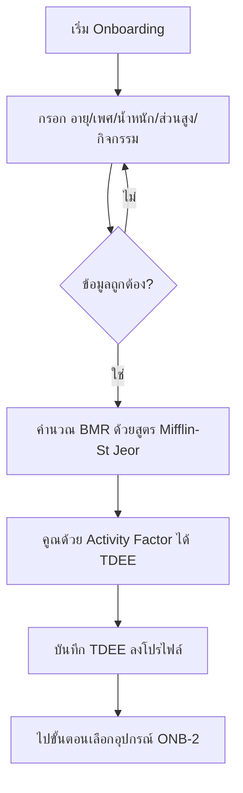

---

### ONB-2 — เลือกอุปกรณ์ที่มี (REQ-03)

- **Actor/Persona**: ผู้ใช้ใหม่ (ระหว่าง onboarding) หรือผู้ใช้ประจำที่แก้ไขโปรไฟล์
- **Goal**: เพื่อให้ระบบแนะนำท่า/วิดีโอที่ทำได้จริงตามอุปกรณ์ที่มี
- **Trigger**: มาถึงขั้นตอนเลือกอุปกรณ์ใน onboarding หรือเข้าไปแก้ไขในหน้า Settings
- **Preconditions**: ผ่าน ONB-1 แล้ว (มี TDEE ในโปรไฟล์)
- **Steps**:
  1. ระบบแสดงตัวเลือกอุปกรณ์: ไม่มีอุปกรณ์ / ดัมเบล / ยิมครบชุด
  2. ผู้ใช้เลือกอุปกรณ์ที่มี (เลือกได้มากกว่า 1 ถ้าจำเป็น)
  3. ระบบบันทึกโปรไฟล์อุปกรณ์ของผู้ใช้
  4. โปรไฟล์อุปกรณ์นี้ถูกใช้เป็น filter ในเอนจิ้นแนะนำวิดีโอ (REC-1) ทุกครั้งที่ค้นหาวิดีโอ
- **Success State**: โปรไฟล์อุปกรณ์ถูกบันทึก และวิดีโอที่แนะนำในอนาคตทั้งหมดถูกกรองด้วยอุปกรณ์นี้ (REQ-03)
- **Alt/Edge Cases**:
  - เลือก "ไม่มีอุปกรณ์" → ระบบกรองเฉพาะวิดีโอ bodyweight เท่านั้น
  - ผู้ใช้เปลี่ยนอุปกรณ์ภายหลัง (เช่น ซื้อดัมเบลเพิ่ม) → filter ในการแนะนำวิดีโอครั้งถัดไปอัปเดตทันที

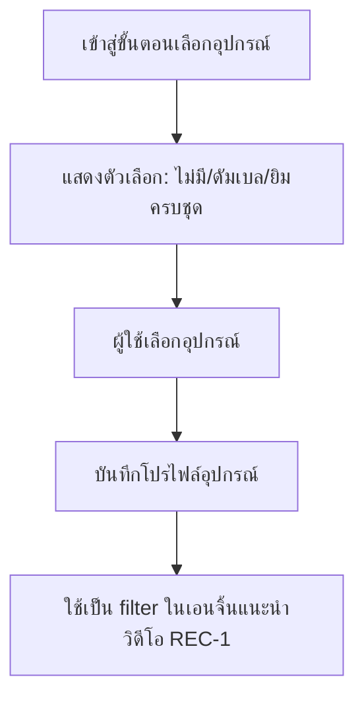

---

### ONB-3 — ตั้งเป้าหมายหลัก (REQ-02)

- **Actor/Persona**: ผู้ใช้ใหม่ (ระหว่าง onboarding)
- **Goal**: เพื่อกำหนดทิศทางแผนการออกกำลังกายและแคลอรี่ให้ตรงกับเป้าหมาย
- **Trigger**: มาถึงขั้นตอนสุดท้ายของ onboarding หลังมี TDEE (ONB-1) แล้ว
- **Preconditions**: ผ่าน ONB-1 (มี TDEE)
- **Steps**:
  1. ผู้ใช้เลือกเป้าหมายหลัก: ลดน้ำหนัก / กระชับสัดส่วน / เพิ่มความอึด
  2. ระบบแปลงเป้าหมายที่เลือกเป็นค่าส่วนต่างแคลอรี่ต่อวัน (deficit สำหรับลดน้ำหนัก, ปรับสมดุลสำหรับกระชับสัดส่วน, maintenance/surplus เชิงความอึดสำหรับเพิ่มความอึด)
  3. ระบบคำนวณเป้าหมายแคลอรี่รายวันสุดท้าย = TDEE ± ค่าส่วนต่างนี้
  4. บันทึกเป้าหมายแคลอรี่รายวันลงโปรไฟล์ พร้อม onboarding เสร็จสมบูรณ์
- **Success State**: ผู้ใช้มีเป้าหมายแคลอรี่รายวันที่ชัดเจน พร้อมเข้าสู่หน้า Daily Recommendation (REQ-02)
- **Alt/Edge Cases**:
  - ผู้ใช้เปลี่ยนเป้าหมายหลักภายหลัง (เช่น จากลดน้ำหนักเป็นเพิ่มความอึด) → คำนวณเป้าหมายแคลอรี่รายวันใหม่ทันที
  - ค่า deficit/surplus ที่คำนวณได้ทำให้เป้าหมายแคลอรี่ต่ำกว่าเกณฑ์ปลอดภัย → ต้องมีการป้องกัน (ดู Open Questions)

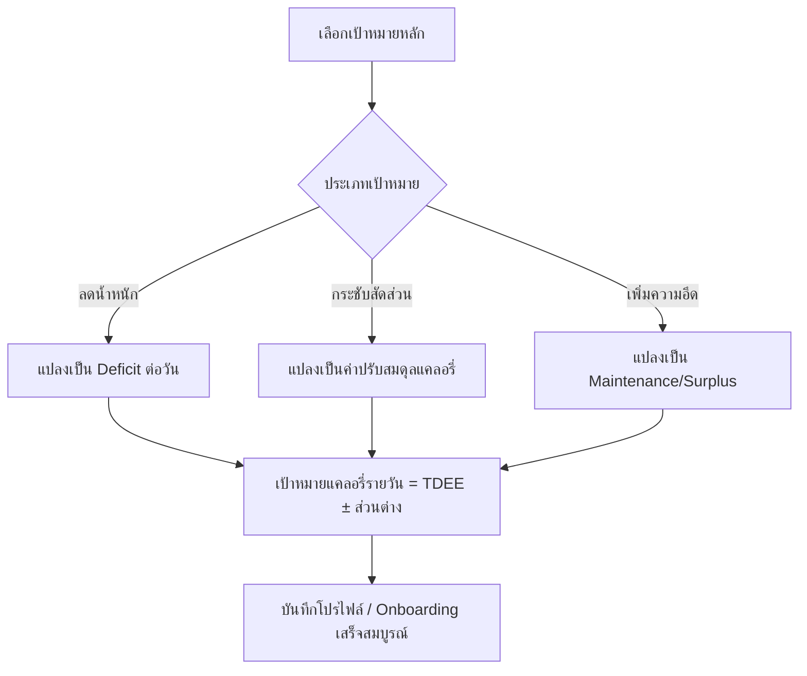

---

## Epic 2: Daily YouTube Recommendation

### REC-1 — แนะนำวิดีโอตรงเป้าแคลอรี่รายวัน (REQ-04)

- **Actor/Persona**: ผู้ใช้ประจำที่ผ่าน onboarding แล้ว
- **Goal**: เห็นวิดีโอออกกำลังกายที่ตรงกับแคลอรี่เป้าหมายของวันนี้ ไม่ต้องเลือกเอง
- **Trigger**: เปิดหน้าหลักประจำวัน (Daily Dashboard)
- **Preconditions**: มีเป้าหมายแคลอรี่รายวัน (ONB-3) และโปรไฟล์อุปกรณ์ (ONB-2)
- **Steps**:
  1. ระบบดึงเป้าหมายแคลอรี่ของวันนี้จากโปรไฟล์ (ปรับตาม Cheat/Rest Day ถ้ามี ดู PLN-2)
  2. ระบบค้นหาวิดีโอจากคลังโดย filter ด้วยอุปกรณ์ที่มี (ONB-2) และประเภท (คาร์ดิโอ/เวทเทรนนิ่ง/HIIT)
  3. ระบบจับคู่วิดีโอที่คาดว่าจะเผาผลาญแคลอรี่ใกล้เคียงเป้าหมายที่สุด
  4. แสดงวิดีโอที่แนะนำพร้อมประเภทและระยะเวลาโดยประมาณ
- **Success State**: ผู้ใช้เห็นวิดีโอที่แนะนำ 1 รายการ (หรือมากกว่า) ที่ตรงกับเป้าหมายแคลอรี่ของวัน (REQ-04)
- **Alt/Edge Cases**:
  - ไม่มีวิดีโอในคลังที่ตรงกับอุปกรณ์ + แคลอรี่เป้าหมายพอดี → ระบบขยายเกณฑ์การค้นหา (ผ่อนช่วงแคลอรี่)
  - วันนี้ถูกตั้งเป็น Cheat Day/Rest Day → ไม่ต้องแนะนำวิดีโอ (ข้ามไป PLN-2)

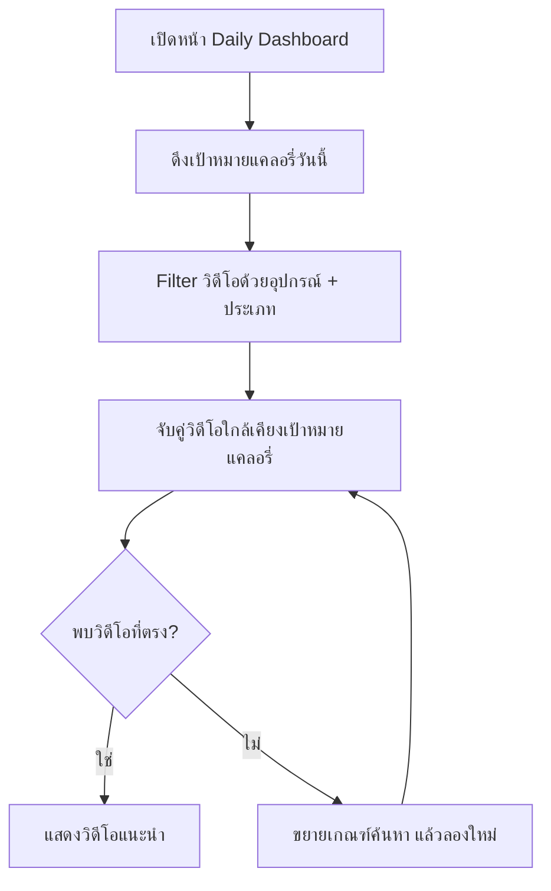

---

### REC-2 — คำนวณแคลอรี่เผาผลาญจริง (REQ-05)

- **Actor/Persona**: ผู้ใช้ประจำที่กำลัง/เพิ่งออกกำลังกายตามวิดีโอที่แนะนำ
- **Goal**: ให้ตัวเลขแคลอรี่ที่เผาผลาญสะท้อนความจริง ไม่ใช่แค่ชื่อวิดีโอ
- **Trigger**: ผู้ใช้เริ่ม/จบวิดีโอออกกำลังกายจาก REC-1
- **Preconditions**: มีวิดีโอที่กำลังเล่นอยู่ พร้อม metadata (ระยะเวลา, ประเภทกิจกรรม, ระดับความเข้มข้น) และน้ำหนักตัวผู้ใช้ในโปรไฟล์
- **Steps**:
  1. ระบบอ่านระยะเวลาที่ออกกำลังกายจริง (ทั้งหมดหรือบางส่วนที่ทำจริง)
  2. ระบบอ่านประเภทกิจกรรมและระดับความเข้มข้นของวิดีโอ
  3. ระบบคำนวณแคลอรี่เผาผลาญจริงโดยใช้ปัจจัยทั้ง 4: ระยะเวลา × ประเภทกิจกรรม × ความเข้มข้น × น้ำหนักตัว
  4. หากมีข้อมูลจาก wearable (INT-3) ให้ใช้ค่านั้นแทนค่าประมาณนี้
  5. บันทึกค่าแคลอรี่ที่คำนวณได้เพื่อใช้เทียบกับเป้าหมายรายวันและบันทึก log (PLN-3)
- **Success State**: มีค่าแคลอรี่เผาผลาญจริงต่อเซสชัน ที่คำนวณจากปัจจัยจริงไม่ใช่ชื่อวิดีโอ (REQ-05)
- **Alt/Edge Cases**:
  - ผู้ใช้ทำวิดีโอไม่ครบ (หยุดกลางคัน) → คำนวณตามระยะเวลาที่ทำจริงเท่านั้น
  - มีข้อมูล wearable ระหว่างออกกำลังกาย → ให้ความสำคัญกับค่าจาก wearable มากกว่าค่าประมาณ (ดู INT-3)

```mermaid
flowchart TD
    A[จบ/หยุดวิดีโอออกกำลังกาย] --> B[อ่านระยะเวลาที่ทำจริง]
    B --> C[อ่านประเภทกิจกรรม + ความเข้มข้น]
    C --> D[คำนวณแคลอรี่ = f(ระยะเวลา, ประเภท, ความเข้มข้น, น้ำหนักตัว)]
    D --> E{มีข้อมูล Wearable?}
    E -- มี --> F[ใช้ค่าจาก Wearable แทน INT-3]
    E -- ไม่มี --> G[ใช้ค่าประมาณจากระบบ]
    F --> H[บันทึกแคลอรี่เผาผลาญของเซสชัน]
    G --> H
```

---

### REC-3 — เปลี่ยนวิดีโอโดยคงเป้าแคลอรี่เดิม (REQ-06)

- **Actor/Persona**: ผู้ใช้ประจำที่ไม่ถูกใจวิดีโอที่แนะนำ
- **Goal**: อยากได้ตัวเลือกวิดีโออื่นแต่ยังคงเป้าแคลอรี่ของวันเดิม
- **Trigger**: ผู้ใช้กดปุ่ม "เปลี่ยนวิดีโอ" / "ลองวิดีโออื่น" บนหน้า REC-1
- **Preconditions**: มีวิดีโอที่แนะนำอยู่แล้วจาก REC-1
- **Steps**:
  1. ผู้ใช้กดปุ่มเปลี่ยนวิดีโอ
  2. ระบบเก็บค่าแคลอรี่เป้าหมายของวันนั้นไว้ไม่เปลี่ยนแปลง
  3. ระบบค้นหาวิดีโอใหม่ (ใช้ filter อุปกรณ์ + แคลอรี่เป้าหมายเดิมจาก REC-1) โดยไม่รวมวิดีโอที่เพิ่งถูกปฏิเสธ
  4. แสดงวิดีโอใหม่แทนที่วิดีโอเดิม
- **Success State**: ผู้ใช้ได้วิดีโอใหม่ ในขณะที่แคลอรี่เป้าหมายของวันไม่เปลี่ยน (REQ-06)
- **Alt/Edge Cases**:
  - กดเปลี่ยนวิดีโอซ้ำจนไม่เหลือตัวเลือกที่ตรงเงื่อนไข → ระบบแจ้งว่าไม่มีวิดีโออื่นที่ตรงเป้าหมายแล้ว หรือขยายเกณฑ์การค้นหา

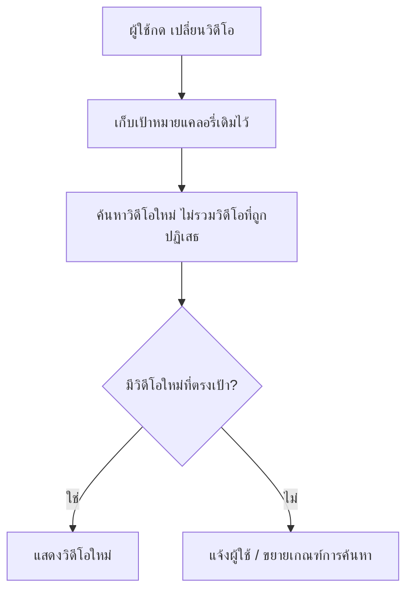

---

### REC-4 — วอร์มอัพ–คูลดาวน์อัตโนมัติ (REQ-07)

- **Actor/Persona**: ผู้ใช้ประจำที่ได้รับวิดีโอความเข้มข้นสูง (เช่น HIIT)
- **Goal**: ป้องกันการบาดเจ็บและออกกำลังกายอย่างปลอดภัยโดยไม่ต้องหาวอร์มอัพเอง
- **Trigger**: ระบบเลือกวิดีโอหลักที่มีระดับความเข้มข้น "สูง" ให้ผู้ใช้ (จาก REC-1 หรือ REC-3)
- **Preconditions**: มีวิดีโอหลักที่ระบุ metadata ความเข้มข้นแล้ว
- **Steps**:
  1. ระบบตรวจสอบระดับความเข้มข้นของวิดีโอหลักที่จะแนะนำ
  2. หากเป็นความเข้มข้นสูง ระบบแทรกวิดีโอวอร์มอัพ 3 นาทีไว้ก่อนวิดีโอหลักอัตโนมัติ
  3. ระบบแทรกวิดีโอคูลดาวน์ 3 นาทีไว้หลังวิดีโอหลักอัตโนมัติ
  4. แสดงชุดวิดีโอ (วอร์มอัพ → วิดีโอหลัก → คูลดาวน์) เป็นเซสชันเดียว
- **Success State**: เซสชันความเข้มข้นสูงทุกครั้งมีวอร์มอัพ/คูลดาวน์แนบมาให้อัตโนมัติ (REQ-07)
- **Alt/Edge Cases**:
  - วิดีโอหลักความเข้มข้นต่ำ/ปานกลาง → ไม่ต้องแทรกวอร์มอัพ/คูลดาวน์
  - ผู้ใช้ข้ามวอร์มอัพ/คูลดาวน์เอง → ระบบยังคงนับเฉพาะเวลา/แคลอรี่ของส่วนที่ทำจริง (ดู REC-2)

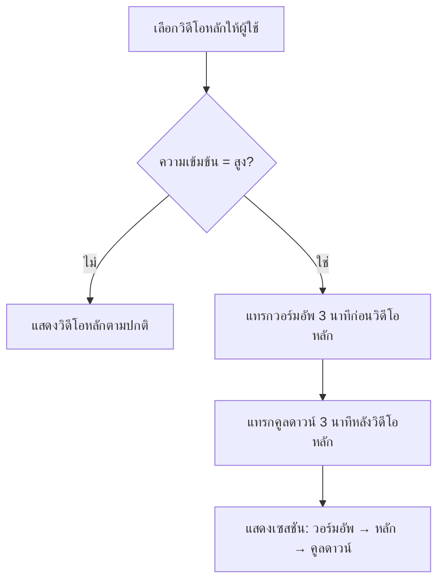

---

## Epic 3: Planner & Logging

### PLN-1 — ปฏิทินวางแผนรายสัปดาห์ (REQ-08)

- **Actor/Persona**: ผู้ใช้ประจำที่ต้องการวางแผนล่วงหน้า
- **Goal**: วางแผนออกกำลังกายล่วงหน้าเป็นสัปดาห์ ไม่ต้องตัดสินใจรายวัน
- **Trigger**: ผู้ใช้เปิดแท็บ Planner/ปฏิทิน
- **Preconditions**: ผ่าน onboarding แล้ว (มีเป้าหมายแคลอรี่รายวัน)
- **Steps**:
  1. ระบบแสดงปฏิทินแบบรายสัปดาห์ (7 วันข้างหน้า)
  2. ผู้ใช้เลือกวัน แล้วกำหนดประเภทกิจกรรม หรือปล่อยให้ระบบแนะนำอัตโนมัติ (จาก REC-1) ในวันนั้น
  3. ผู้ใช้สามารถกำหนด Cheat Day/Rest Day ล่วงหน้าในปฏิทิน (เชื่อมกับ PLN-2)
  4. ระบบบันทึกแผนรายสัปดาห์ไว้ ใช้แสดงผลใน Daily Dashboard ของแต่ละวัน
- **Success State**: ผู้ใช้มีแผนออกกำลังกายล่วงหน้าครบสัปดาห์ที่ดูได้จากปฏิทิน (REQ-08)
- **Alt/Edge Cases**:
  - ผู้ใช้ไม่กำหนดแผนล่วงหน้าในบางวัน → วันนั้นใช้ค่า default คือให้ระบบแนะนำอัตโนมัติตาม REC-1
  - ผู้ใช้แก้ไขแผนของวันที่ผ่านไปแล้ว → ควรเป็น read-only เนื่องจากมี log แล้ว (ดู Open Questions)

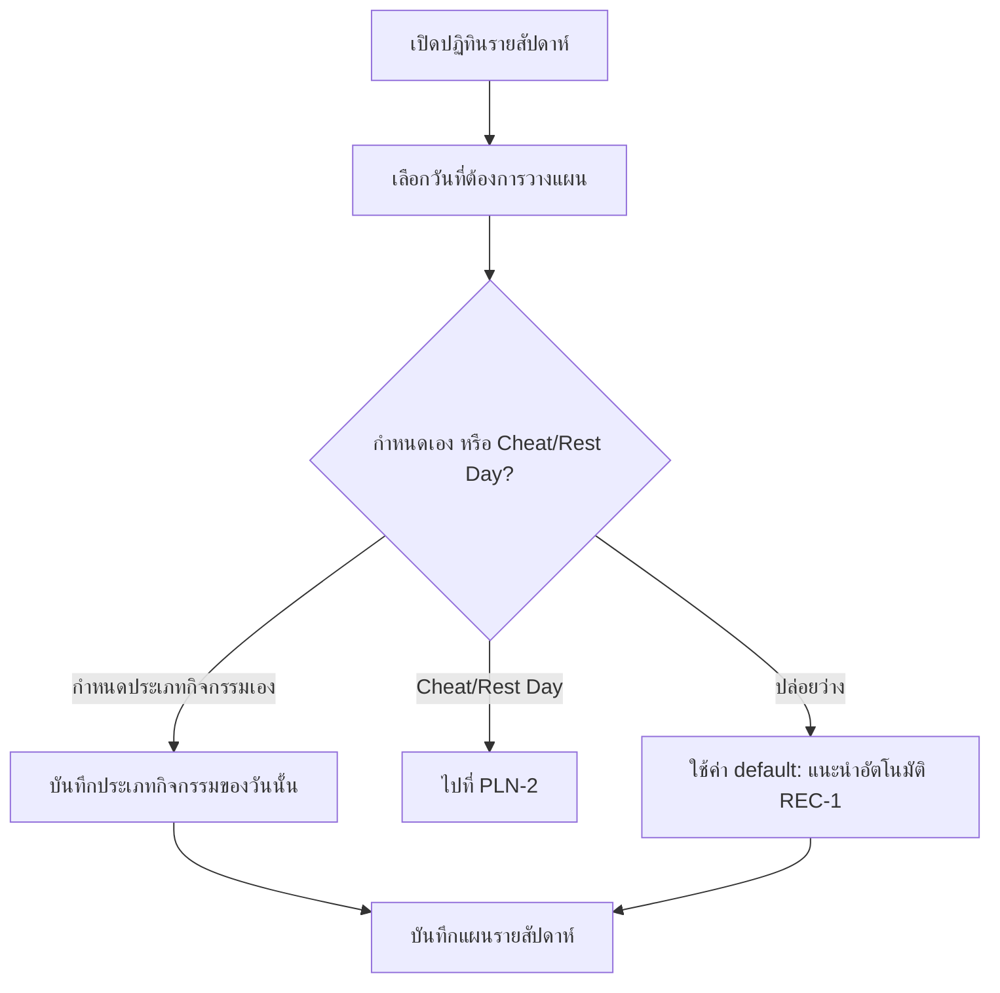

---

### PLN-2 — โหมด Cheat Day / Rest Day (REQ-09)

- **Actor/Persona**: ผู้ใช้ประจำที่ต้องการพักหรือของ่อนวันโดยไม่เสียสถิติ
- **Goal**: หยุดพัก/ผ่อนคลายได้ 1 วัน โดยไม่ทำให้ streak หรือสถิติเสียหาย
- **Trigger**: ผู้ใช้ตั้งค่า Cheat Day หรือ Rest Day ผ่านปฏิทิน (PLN-1) หรือในหน้า Daily Dashboard ของวันนั้น
- **Preconditions**: มีเป้าหมายแคลอรี่รายวันที่กำลังทำงานอยู่สำหรับวันนั้น
- **Steps**:
  1. ผู้ใช้เลือกทำเครื่องหมายวันนี้ (หรือวันในอนาคต) เป็น Cheat Day หรือ Rest Day
  2. ระบบหยุดการนับ/ประเมินเป้าหมายแคลอรี่ของวันนั้น (ไม่ต้องออกกำลังกายให้ครบเป้า)
  3. ระบบไม่แนะนำวิดีโอสำหรับวันนั้น (ข้าม REC-1)
  4. ระบบทำเครื่องหมายวันนั้นในฐานข้อมูล log ว่าเป็น "excluded" ไม่ใช่ "missed" เพื่อไม่ให้ตัด streak (เชื่อมกับ PLN-4)
- **Success State**: วันนั้นถูกยกเว้นจากเป้าหมายแคลอรี่ และ streak ยังคงต่อเนื่องในวันถัดไปที่ออกกำลังกายจริง (REQ-09)
- **Alt/Edge Cases**:
  - ผู้ใช้ทำเครื่องหมาย Cheat/Rest Day หลังจากออกกำลังกายและมี log ของวันนั้นแล้ว → เกิดความขัดแย้งของข้อมูล (ดู Open Questions)
  - ผู้ใช้ยกเลิกการตั้ง Cheat/Rest Day ก่อนสิ้นวัน → วันนั้นกลับไปนับเป้าหมายแคลอรี่ตามปกติ

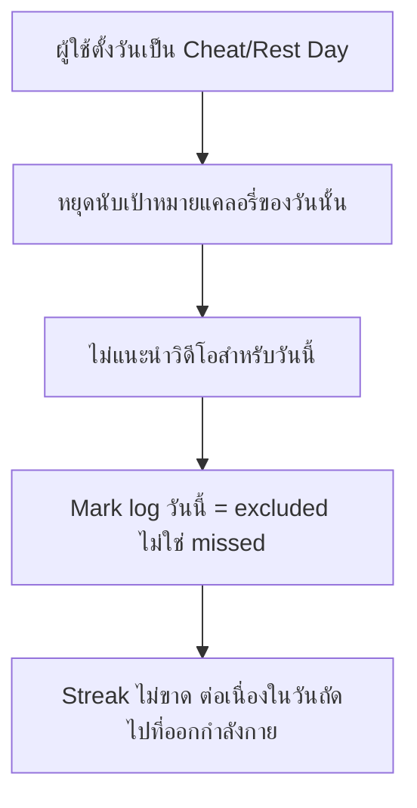

---

### PLN-3 — บันทึกผลรายวันเมื่อครบเป้าหมาย (REQ-10)

- **Actor/Persona**: ผู้ใช้ประจำที่เพิ่งออกกำลังกายเสร็จ
- **Goal**: มีบันทึกผลการออกกำลังกายของตัวเองไว้ดูย้อนหลัง
- **Trigger**: ผู้ใช้ทำวิดีโอออกกำลังกายจนครบเป้าหมายแคลอรี่/เวลาของวันนั้น
- **Preconditions**: มีค่าแคลอรี่เผาผลาญจริงจาก REC-2 และเป้าหมายแคลอรี่ของวันจาก ONB-3/REC-1
- **Steps**:
  1. ระบบเปรียบเทียบแคลอรี่ที่เผาผลาญจริง (REC-2) กับเป้าหมายแคลอรี่ของวันนั้น
  2. เมื่อถึงหรือเกินเป้าหมาย ระบบสร้าง log entry ของวันนั้น ประกอบด้วย: นาทีที่ออกกำลังกายจริง, แคลอรี่ที่เผาผลาญสะสม, วันที่, สถานะ "ครบเป้าหมาย"
  3. ระบบอัปเดตแคลอรี่สะสม (cumulative) และสถิติรวมของผู้ใช้
  4. ระบบส่งต่อสถานะ "ครบเป้าหมาย" ของวันนี้ให้ PLN-4 ใช้คำนวณ streak
- **Success State**: มี log รายวันที่บันทึกนาทีออกกำลังกายและแคลอรี่สะสมเมื่อครบเป้าหมาย (REQ-10)
- **Alt/Edge Cases**:
  - ออกกำลังกายแล้วแต่ยังไม่ถึงเป้าหมาย → บันทึกเป็น log สถานะ "ไม่ครบเป้าหมาย" (ไม่ทำให้ streak นับต่อ ดู Open Questions)
  - วันนั้นเป็น Cheat Day/Rest Day → ข้ามขั้นตอนนี้ทั้งหมด (ดู PLN-2)

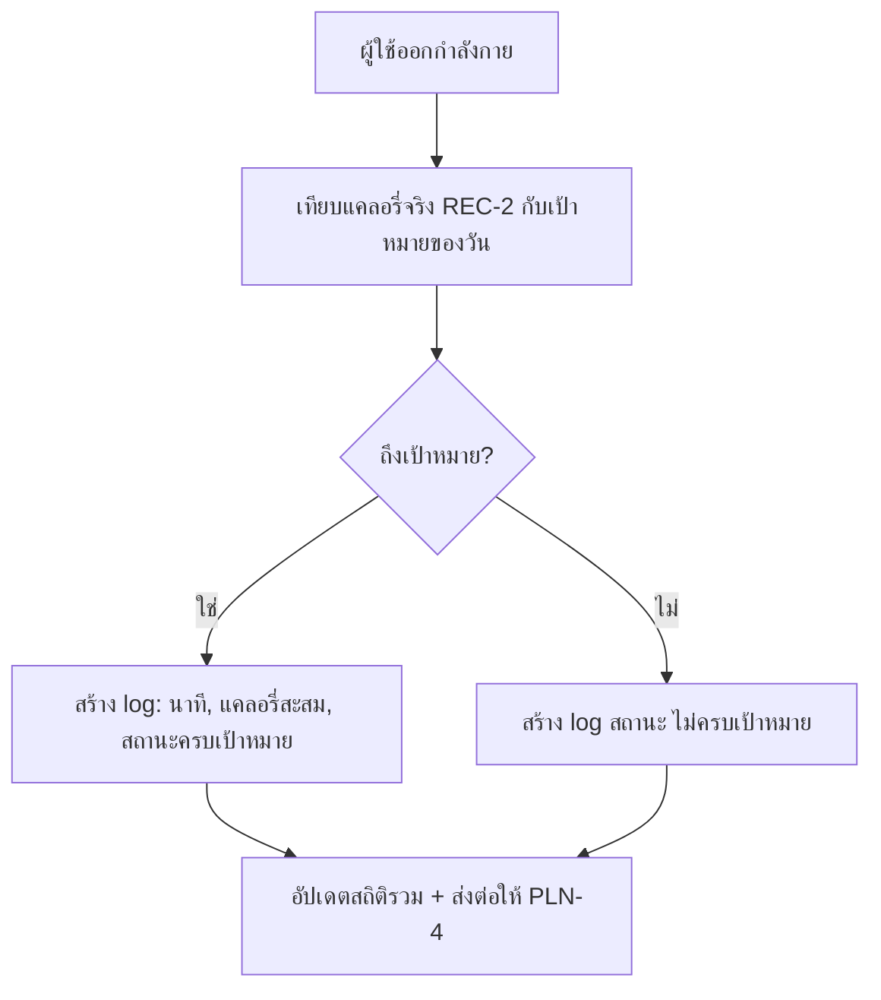

---

### PLN-4 — ติดตาม Streak ต่อเนื่อง (REQ-09, REQ-10)

- **Actor/Persona**: ผู้ใช้ประจำที่ต้องการแรงจูงใจให้ออกกำลังกายต่อเนื่อง
- **Goal**: เห็น streak การออกกำลังกายต่อเนื่องของตัวเอง เพื่อกระตุ้นให้ทำต่อ
- **Trigger**: เปิดหน้า Dashboard/Stats หรือหลังบันทึก log รายวันสำเร็จ (PLN-3)
- **Preconditions**: มีประวัติ log อย่างน้อย 1 วัน
- **Steps**:
  1. ระบบไล่ log ย้อนหลังจากวันปัจจุบัน
  2. สำหรับแต่ละวัน ตรวจสอบว่า: log สถานะ "ครบเป้าหมาย" (PLN-3) หรือถูก mark เป็น "excluded" จาก Cheat/Rest Day (PLN-2) → นับว่า streak ยังต่อเนื่อง
  3. หากพบวันที่ไม่มี log และไม่ใช่ Cheat/Rest Day → streak หยุดนับที่วันนั้น
  4. ระบบคำนวณจำนวนวันติดต่อกัน และแสดงผลเป็นตัวเลข streak บน Dashboard
- **Success State**: ผู้ใช้เห็นจำนวนวัน streak ปัจจุบันที่ถูกต้องตามกฎ REQ-09 (ไม่ตัด streak เพราะ Cheat/Rest Day) และ REQ-10 (นับจาก log จริง)
- **Alt/Edge Cases**:
  - ผู้ใช้ขาด log ไป 1 วันโดยไม่ได้ตั้ง Cheat/Rest Day → streak รีเซ็ตเป็น 0
  - log สถานะ "ไม่ครบเป้าหมาย" (จาก PLN-3) → ถือเป็นวันที่ทำให้ streak ขาดหรือไม่ ยังไม่ระบุชัดเจน (ดู Open Questions)

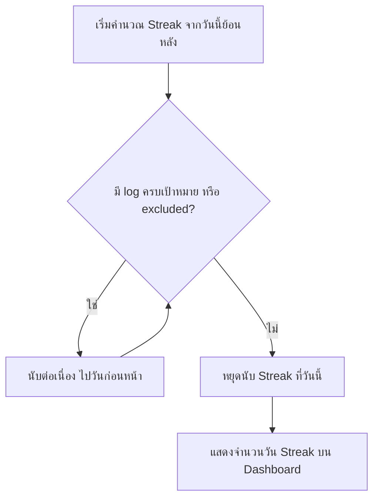

---

## Epic 4: Smart Integrations

### INT-1 — พยากรณ์วันถึงเป้าหมายน้ำหนัก (REQ-11)

- **Actor/Persona**: ผู้ใช้ประจำที่ใช้แอปมาระยะหนึ่งแล้วและมี log สะสม
- **Goal**: อยากรู้ว่าจะถึงน้ำหนักเป้าหมายเมื่อไหร่ เพื่อประเมินความคืบหน้า
- **Trigger**: ผู้ใช้เปิดหน้า Progress/Insights
- **Preconditions**: มีเป้าหมายน้ำหนัก (จาก ONB-3) และมีประวัติ log แคลอรี่จริงสะสมพอสมควร (PLN-3)
- **Steps**:
  1. ระบบดึงประวัติแคลอรี่ขาดดุล/เกินดุลจริงที่บันทึกไว้ (จาก log จริง ไม่ใช่ค่าประมาณตอน onboarding)
  2. ระบบคำนวณอัตราขาดดุลแคลอรี่เฉลี่ยต่อวันจากช่วงเวลาล่าสุด
  3. ระบบแปลงอัตราขาดดุลเฉลี่ยเป็นอัตราการเปลี่ยนแปลงน้ำหนักโดยประมาณ
  4. ระบบคำนวณวันที่คาดว่าจะถึงน้ำหนักเป้าหมายจากน้ำหนักปัจจุบันและอัตรานี้
  5. แสดงวันที่คาดการณ์บนหน้า Progress
- **Success State**: ผู้ใช้เห็นวันที่คาดว่าจะถึงเป้าหมายน้ำหนัก คำนวณจากอัตราขาดดุลแคลอรี่เฉลี่ยที่บันทึกจริง (REQ-11)
- **Alt/Edge Cases**:
  - มีประวัติ log ไม่เพียงพอ (เช่น เพิ่งเริ่มใช้แอป) → ระบบแจ้งว่ายังพยากรณ์ไม่ได้ ต้องสะสมข้อมูลเพิ่ม
  - อัตราขาดดุลเฉลี่ยเป็น 0 หรือสวนทางเป้าหมาย → แสดงข้อความแจ้งเตือนแทนวันที่คาดการณ์

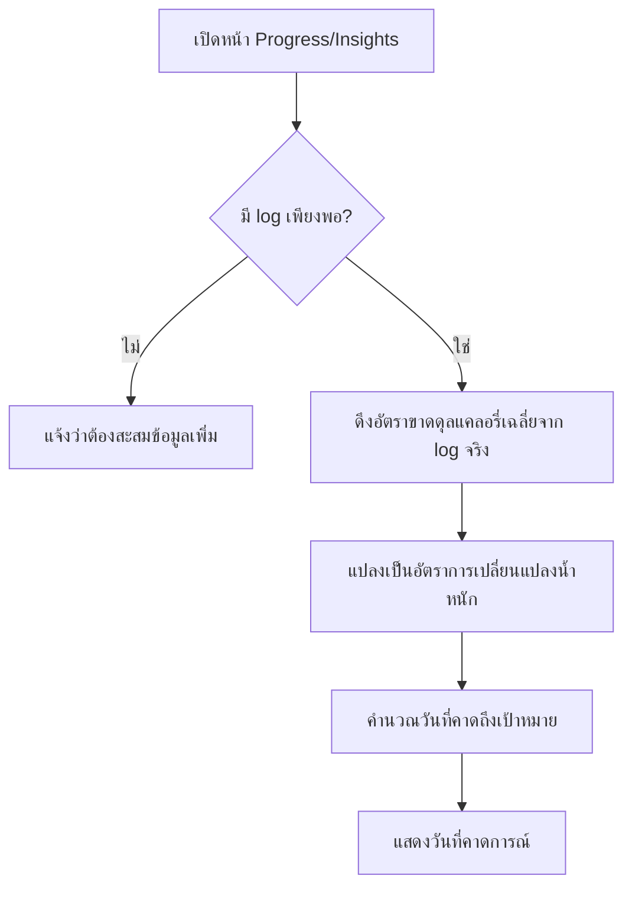

---

### INT-2 — ซิงค์ตาชั่งอัจฉริยะ (REQ-12)

- **Actor/Persona**: ผู้ใช้ประจำที่มีตาชั่งอัจฉริยะ (smart scale)
- **Goal**: ไม่ต้องกรอกน้ำหนักเอง อยากให้ระบบอัปเดตอัตโนมัติและแม่นยำ
- **Trigger**: ผู้ใช้เชื่อมต่อ/จับคู่ตาชั่งอัจฉริยะกับแอป แล้วขึ้นชั่งน้ำหนัก
- **Preconditions**: มีตาชั่งอัจฉริยะที่รองรับ Bluetooth หรือ Health API
- **Steps**:
  1. ผู้ใช้จับคู่อุปกรณ์ตาชั่งกับแอปผ่าน Bluetooth หรือเชื่อมผ่าน Health API
  2. เมื่อผู้ใช้ชั่งน้ำหนัก ตาชั่งส่งค่าน้ำหนัก/องค์ประกอบร่างกายมาที่แอป
  3. ระบบซิงค์ค่าน้ำหนักล่าสุดเข้าโปรไฟล์ผู้ใช้ทันทีโดยไม่ต้องกรอกเอง
  4. ค่าน้ำหนักใหม่ถูกใช้คำนวณ TDEE ใหม่ (ONB-1), แคลอรี่เผาผลาญ (REC-2), และพยากรณ์เป้าหมาย (INT-1)
- **Success State**: น้ำหนัก/องค์ประกอบร่างกายอัปเดตอัตโนมัติในโปรไฟล์ทุกครั้งที่ชั่ง โดยไม่ต้องกรอกมือ (REQ-12)
- **Alt/Edge Cases**:
  - การเชื่อมต่อ Bluetooth/Health API ขาดหาย → ตกกลับไปให้ผู้ใช้กรอกน้ำหนักเอง
  - มีค่าน้ำหนักหลายค่าในวันเดียว (ชั่งหลายรอบ) → ใช้ค่าล่าสุด หรือค่าเฉลี่ยของวันนั้น (ยังไม่ระบุชัดเจน ดู Open Questions)

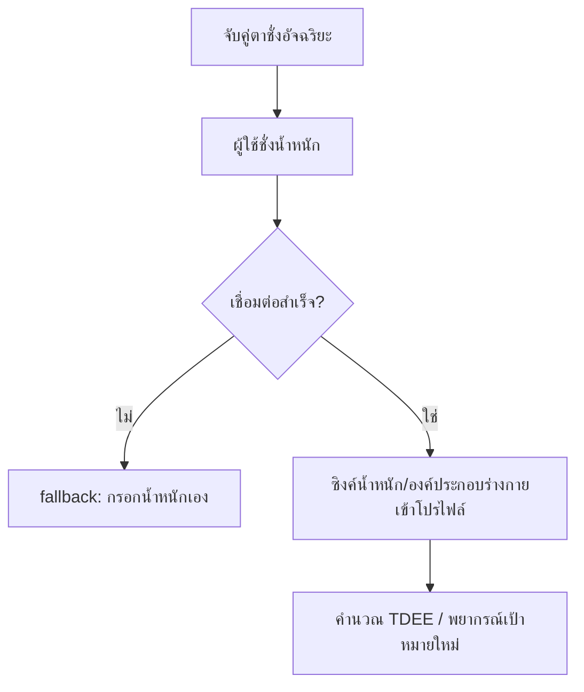

---

### INT-3 — ซิงค์ข้อมูล Wearable (REQ-13)

- **Actor/Persona**: ผู้ใช้ประจำที่มี Apple Watch/Fitbit/Garmin
- **Goal**: ให้ค่าแคลอรี่ที่เผาผลาญแม่นยำขึ้นกว่าค่าประมาณจากวิดีโอ
- **Trigger**: ผู้ใช้เชื่อมต่อ wearable ผ่าน Apple Health หรือ Google Health Connect แล้วออกกำลังกาย
- **Preconditions**: มี wearable ที่รองรับและเชื่อมต่อกับ Apple Health/Google Health Connect แล้ว
- **Steps**:
  1. ผู้ใช้อนุญาตแอปให้เข้าถึงข้อมูลจาก Apple Health/Google Health Connect
  2. ระหว่าง/หลังออกกำลังกาย wearable บันทึกแคลอรี่ที่เผาผลาญจริงจากอัตราการเต้นหัวใจและกิจกรรม
  3. แอปดึงค่าแคลอรี่จริงจาก Health API มาแทนที่ค่าประมาณที่คำนวณจากวิดีโอ (REC-2)
  4. ค่าจาก wearable ถูกใช้ในการบันทึก log (PLN-3) และคำนวณอื่น ๆ ที่เกี่ยวข้อง (INT-1)
- **Success State**: แคลอรี่ที่บันทึกในระบบมาจาก wearable แทนค่าประมาณจากวิดีโอ เมื่อมีข้อมูลพร้อม (REQ-13)
- **Alt/Edge Cases**:
  - Wearable ไม่ได้เชื่อมต่อ หรือข้อมูลมาช้า/ไม่ครบ → ใช้ค่าประมาณจากวิดีโอ (REC-2) แทนชั่วคราว
  - ค่าจาก wearable กับค่าประมาณจากวิดีโอต่างกันมาก → ยังไม่ระบุวิธีจัดการความขัดแย้ง (ดู Open Questions)

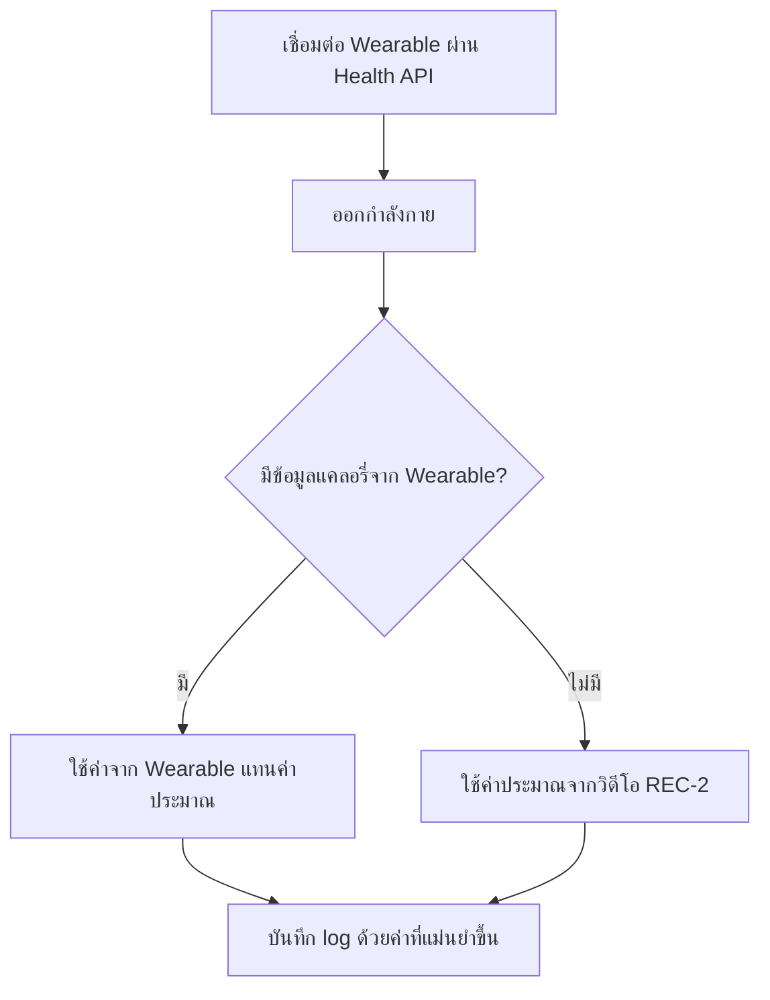

---

## Open Questions

ทุกข้อ REQ-01 ถึง REQ-13 มี feature รองรับครบแล้ว (ดู
[REQ Traceability Matrix](./feature-list.md#req-traceability-matrix))
ดังนั้นหัวข้อนี้ไม่ใช่ REQ ที่ขาดหาย แต่เป็นรายละเอียดเชิง implementation
ที่ต้นฉบับ backlog/spec ยังไม่ได้ระบุชัดเจน จึงไม่ได้เดาไว้ใน Steps ข้างต้น
และควรให้ทีม product ตัดสินใจเพิ่มเติม:

1. **ONB-3 (REQ-02)**: ไม่ได้ระบุตัวเลข deficit/surplus ที่แน่นอนต่อเป้าหมายแต่ละแบบ
   (เช่น ลดน้ำหนักควรลด kcal เท่าไรต่อวัน) และไม่มีเกณฑ์ป้องกันเป้าหมายแคลอรี่ต่ำเกินไป
2. **REC-1 (REQ-04)**: ไม่ได้ระบุ tolerance ว่าวิดีโอต้องใกล้เคียงเป้าหมายแคลอรี่แค่ไหนถึงเรียกว่า "ตรงกัน"
   และไม่ได้ระบุว่ารองรับการแนะนำวิดีโอหลายคลิปรวมกันให้ถึงเป้าหมายหรือไม่
3. **REC-2 (REQ-05)**: ไม่ได้ระบุสูตร/ค่าคงที่ที่แน่นอนสำหรับคำนวณแคลอรี่ (เช่น ตาราง MET ที่ใช้อ้างอิง)
4. **REC-4 (REQ-07)**: ไม่ได้ระบุว่าเวลา/แคลอรี่ของวอร์มอัพ-คูลดาวน์นับรวมในเป้าหมายรายวันหรือไม่
5. **PLN-1 (REQ-08)**: ไม่ได้ระบุว่าผู้ใช้แก้ไขแผนของวันที่ผ่านไปแล้ว (มี log แล้ว) ได้หรือไม่
6. **PLN-2 (REQ-09)**: ไม่ได้ระบุวิธีจัดการเมื่อผู้ใช้ตั้ง Cheat/Rest Day หลังจากมี log ของวันนั้นอยู่แล้ว
7. **PLN-3/PLN-4 (REQ-10)**: ไม่ได้ระบุว่า log สถานะ "ไม่ครบเป้าหมาย" ทำให้ streak ขาดทันที
   หรือมีเกณฑ์ผ่อนปรนบางส่วน
8. **INT-1 (REQ-11)**: ไม่ได้ระบุค่าคงที่แปลงแคลอรี่ขาดดุลเป็นน้ำหนักที่ลดลง (เช่น 7,700 kcal ต่อ 1 กก.)
   และไม่ได้ระบุจำนวนวัน log ขั้นต่ำก่อนเริ่มพยากรณ์ได้
9. **INT-2/INT-3 (REQ-12, REQ-13)**: ไม่ได้ระบุลำดับความสำคัญเมื่อมีข้อมูลชนกัน
   (เช่น ชั่งน้ำหนักหลายครั้งต่อวัน หรือค่าจาก wearable ต่างจากค่าประมาณจากวิดีโอมาก)

---

อ้างอิงต้นฉบับ: [docs/requirements/product-backlog.md](../requirements/product-backlog.md)
ดู Feature List สรุปตาราง: [docs/features/feature-list.md](./feature-list.md)
