# smartFit_daily — User Journeys

เอกสารนี้อธิบาย User Journey ของแต่ละ feature ใน [feature-list.md](./feature-list.md)
โดยยึดตาม logic เบื้องหลังจาก
[Requirement Spec](../requirements/product-backlog.md#requirement-spec-รายละเอียดเงื่อนไขข้อกำหนดการทำงาน)
และ
[Decisions ที่ resolve แล้ว](../requirements/product-backlog.md#decisions-resolved-ambiguities--2026-08-23)
(ไม่ใช่แค่หน้าจอ UI) ตามวิธีการใน skill `feature-list-journey`

ทุก feature เรียงเนื้อหาตามลำดับเดียวกันเสมอ: **Mermaid diagram ก่อน** → คำอธิบายเรียงตามลำดับ diagram
พร้อม REQ mapping ต่อขั้นตอน → Actor/Persona, Goal, Trigger, Preconditions, Success State, Alt/Edge Cases

สารบัญ: [Epic 1: Onboarding](#epic-1-onboarding--personalization) ·
[Epic 2: Daily Recommendation](#epic-2-daily-youtube-recommendation) ·
[Epic 3: Planner](#epic-3-planner--logging) ·
[Epic 4: Smart Integrations](#epic-4-smart-integrations) ·
[Open Questions](#open-questions)

---

## Epic 1: Onboarding & Personalization

### ONB-1 — กรอกข้อมูลส่วนตัวเพื่อคำนวณเป้าหมายแคลอรี่ (REQ-01)

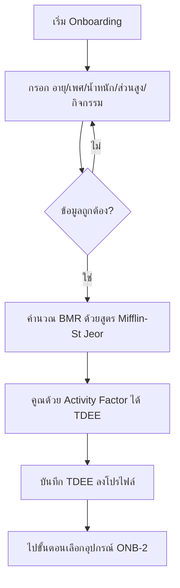

**คำอธิบายตามลำดับ diagram:**

1. ผู้ใช้เริ่มขั้นตอน onboarding (REQ-01)
2. ผู้ใช้กรอกอายุ เพศ น้ำหนัก ส่วนสูง และเลือกระดับกิจกรรม (activity level) (REQ-01)
3. ระบบตรวจสอบความถูกต้องของค่าที่กรอก (เช่น ค่าติดลบ/เกินช่วงที่สมเหตุสมผล) — ถ้าไม่ผ่าน วนกลับไปให้แก้ไข (REQ-01)
4. เมื่อข้อมูลครบและถูกต้อง ระบบคำนวณ BMR (Basal Metabolic Rate) ด้วยสูตร Mifflin-St Jeor (REQ-01)
5. ระบบคูณ BMR ด้วยค่าสัมประสิทธิ์ระดับกิจกรรมเพื่อได้ TDEE (Total Daily Energy Expenditure) (REQ-01)
6. ระบบบันทึก TDEE ลงในโปรไฟล์ผู้ใช้ (REQ-01)
7. ไปต่อยังขั้นตอนเลือกอุปกรณ์ (ONB-2)

- **Actor/Persona**: ผู้ใช้ใหม่ (First-time user) ที่เพิ่งติดตั้งแอป
- **Goal**: เพื่อให้ระบบคำนวณเป้าหมายแคลอรี่รายวันให้ตนเอง
- **Trigger**: เปิดแอปครั้งแรกและเข้าสู่ขั้นตอน onboarding
- **Preconditions**: ยังไม่เคยตั้งค่าโปรไฟล์ร่างกายมาก่อน
- **Success State**: ผู้ใช้มีค่า TDEE ที่คำนวณแล้วในโปรไฟล์ ใช้เป็น baseline สำหรับ ONB-3 และ REC-1 (REQ-01)
- **Alt/Edge Cases**:
  - กรอกข้อมูลไม่ครบ/ไม่ถูกต้อง → ระบบไม่ให้ไปขั้นตอนถัดไปจนกว่าจะแก้ไข
  - ผู้ใช้แก้ไขน้ำหนัก/ส่วนสูงภายหลัง (เช่นจาก ONB profile settings หรือ INT-2) → ต้องคำนวณ BMR/TDEE ใหม่

---

### ONB-2 — เลือกอุปกรณ์ที่มี (REQ-03)

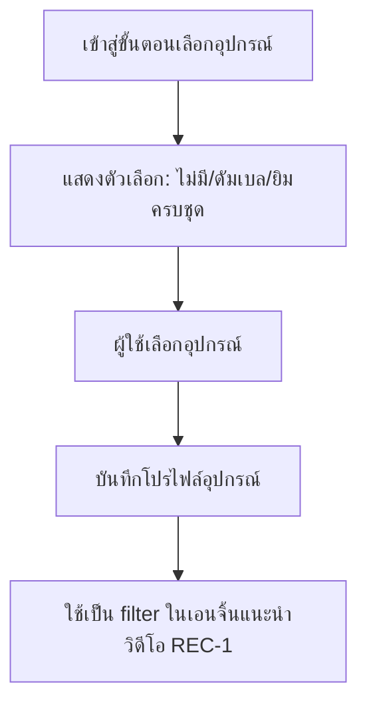

**คำอธิบายตามลำดับ diagram:**

1. ผู้ใช้มาถึงขั้นตอนเลือกอุปกรณ์ใน onboarding หรือหน้า Settings (REQ-03)
2. ระบบแสดงตัวเลือกอุปกรณ์: ไม่มีอุปกรณ์ / ดัมเบล / ยิมครบชุด (REQ-03)
3. ผู้ใช้เลือกอุปกรณ์ที่มี (เลือกได้มากกว่า 1 ถ้าจำเป็น) (REQ-03)
4. ระบบบันทึกโปรไฟล์อุปกรณ์ของผู้ใช้ (REQ-03)
5. โปรไฟล์อุปกรณ์นี้ถูกใช้เป็น filter ในเอนจิ้นแนะนำวิดีโอ (REC-1) ทุกครั้งที่ค้นหาวิดีโอ (REQ-03)

- **Actor/Persona**: ผู้ใช้ใหม่ (ระหว่าง onboarding) หรือผู้ใช้ประจำที่แก้ไขโปรไฟล์
- **Goal**: เพื่อให้ระบบแนะนำท่า/วิดีโอที่ทำได้จริงตามอุปกรณ์ที่มี
- **Trigger**: มาถึงขั้นตอนเลือกอุปกรณ์ใน onboarding หรือเข้าไปแก้ไขในหน้า Settings
- **Preconditions**: ผ่าน ONB-1 แล้ว (มี TDEE ในโปรไฟล์)
- **Success State**: โปรไฟล์อุปกรณ์ถูกบันทึก และวิดีโอที่แนะนำในอนาคตทั้งหมดถูกกรองด้วยอุปกรณ์นี้ (REQ-03)
- **Alt/Edge Cases**:
  - เลือก "ไม่มีอุปกรณ์" → ระบบกรองเฉพาะวิดีโอ bodyweight เท่านั้น
  - ผู้ใช้เปลี่ยนอุปกรณ์ภายหลัง (เช่น ซื้อดัมเบลเพิ่ม) → filter ในการแนะนำวิดีโอครั้งถัดไปอัปเดตทันที

---

### ONB-3 — ตั้งเป้าหมายหลัก (REQ-02)

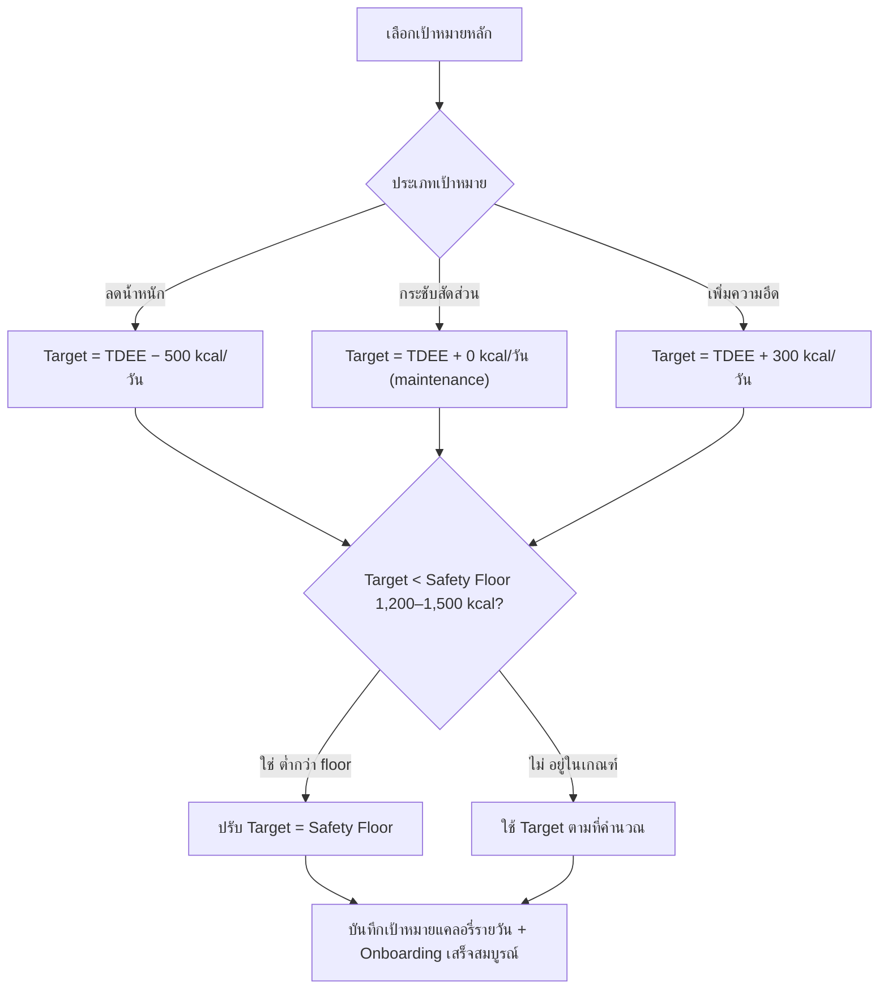

**คำอธิบายตามลำดับ diagram:**

1. ผู้ใช้เลือกเป้าหมายหลัก: ลดน้ำหนัก / กระชับสัดส่วน / เพิ่มความอึด (REQ-02)
2. ระบบแปลงเป้าหมายเป็นค่าคงที่ตายตัวตาม decision ที่ resolve แล้ว:
   - ลดน้ำหนัก → Target = TDEE − 500 kcal/วัน (REQ-02)
   - กระชับสัดส่วน → Target = TDEE + 0 kcal/วัน (maintenance) (REQ-02)
   - เพิ่มความอึด → Target = TDEE + 300 kcal/วัน (REQ-02)
3. ระบบตรวจสอบว่า Target ที่ได้ต่ำกว่า safety floor (1,200–1,500 kcal/วัน) หรือไม่ (REQ-02)
4. ถ้าต่ำกว่า floor → ปรับ Target ให้เท่ากับ safety floor แทน (REQ-02); ถ้าไม่ต่ำกว่า floor → ใช้ Target ตามที่คำนวณได้ (REQ-02)
5. ระบบบันทึกเป้าหมายแคลอรี่รายวันสุดท้ายลงโปรไฟล์ พร้อม onboarding เสร็จสมบูรณ์ (REQ-02)

- **Actor/Persona**: ผู้ใช้ใหม่ (ระหว่าง onboarding)
- **Goal**: เพื่อกำหนดทิศทางแผนการออกกำลังกายและแคลอรี่ให้ตรงกับเป้าหมาย
- **Trigger**: มาถึงขั้นตอนสุดท้ายของ onboarding หลังมี TDEE (ONB-1) แล้ว
- **Preconditions**: ผ่าน ONB-1 (มี TDEE)
- **Success State**: ผู้ใช้มีเป้าหมายแคลอรี่รายวันที่ชัดเจน (TDEE ± ค่าคงที่ต่อเป้าหมาย และไม่ต่ำกว่า
  safety floor) พร้อมเข้าสู่หน้า Daily Recommendation (REQ-02) ค่าคงที่ 7,700 kcal ≈ 1 กก. ไขมัน
  ที่ผูกกับเป้าหมายนี้ถูกใช้ร่วมกับ INT-1 ในการพยากรณ์วันถึงเป้าหมายน้ำหนักด้วย
- **Alt/Edge Cases**:
  - ผู้ใช้เปลี่ยนเป้าหมายหลักภายหลัง (เช่น จากลดน้ำหนักเป็นเพิ่มความอึด) → คำนวณเป้าหมายแคลอรี่รายวันใหม่ทันทีด้วยสูตรคงที่เดิม
  - TDEE ของผู้ใช้ต่ำมาก (เช่น น้ำหนักตัวน้อย + กิจกรรมต่ำ) จนแม้แต่ TDEE + 300 ยังต่ำกว่า floor →
    ระบบปรับขึ้นเป็น safety floor เสมอ ไม่ปล่อยให้ต่ำกว่าเกณฑ์

---

## Epic 2: Daily YouTube Recommendation

### REC-1 — แนะนำวิดีโอตรงเป้าแคลอรี่รายวัน (REQ-04)

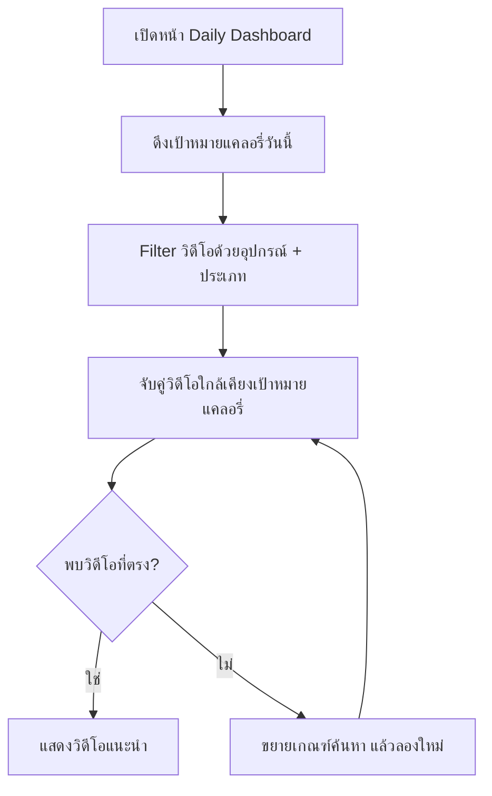

**คำอธิบายตามลำดับ diagram:**

1. ผู้ใช้เปิดหน้าหลักประจำวัน (Daily Dashboard) (REQ-04)
2. ระบบดึงเป้าหมายแคลอรี่ของวันนี้จากโปรไฟล์ (ปรับตาม Cheat/Rest Day ถ้ามี ดู PLN-2) (REQ-04)
3. ระบบค้นหาวิดีโอจากคลังโดย filter ด้วยอุปกรณ์ที่มี (ONB-2) และประเภท (คาร์ดิโอ/เวทเทรนนิ่ง/HIIT) (REQ-04)
4. ระบบจับคู่วิดีโอที่คาดว่าจะเผาผลาญแคลอรี่ใกล้เคียงเป้าหมายที่สุด (REQ-04)
5. ถ้าพบวิดีโอที่ตรง → แสดงวิดีโอที่แนะนำ; ถ้าไม่พบ → ระบบขยายเกณฑ์การค้นหา (ผ่อนช่วงแคลอรี่) แล้ววนกลับไปจับคู่ใหม่ (REQ-04)

- **Actor/Persona**: ผู้ใช้ประจำที่ผ่าน onboarding แล้ว
- **Goal**: เห็นวิดีโอออกกำลังกายที่ตรงกับแคลอรี่เป้าหมายของวันนี้ ไม่ต้องเลือกเอง
- **Trigger**: เปิดหน้าหลักประจำวัน (Daily Dashboard)
- **Preconditions**: มีเป้าหมายแคลอรี่รายวัน (ONB-3) และโปรไฟล์อุปกรณ์ (ONB-2)
- **Success State**: ผู้ใช้เห็นวิดีโอที่แนะนำ 1 รายการ (หรือมากกว่า) ที่ตรงกับเป้าหมายแคลอรี่ของวัน (REQ-04)
- **Alt/Edge Cases**:
  - ไม่มีวิดีโอในคลังที่ตรงกับอุปกรณ์ + แคลอรี่เป้าหมายพอดี → ระบบขยายเกณฑ์การค้นหา (ผ่อนช่วงแคลอรี่)
  - วันนี้ถูกตั้งเป็น Cheat Day/Rest Day → ไม่ต้องแนะนำวิดีโอ (ข้ามไป PLN-2)
  - เกณฑ์ tolerance ที่แน่นอนว่า "ใกล้เคียง" แค่ไหนถึงเรียกว่าตรงเป้า ยังไม่ระบุ (ดู Open Questions)

---

### REC-2 — คำนวณแคลอรี่เผาผลาญจริง (REQ-05)

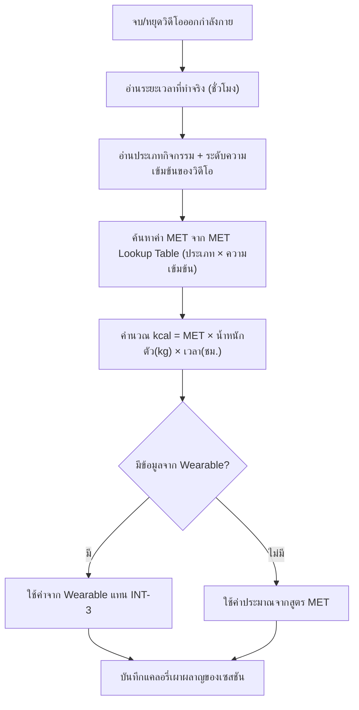

**คำอธิบายตามลำดับ diagram:**

1. ผู้ใช้จบ/หยุดวิดีโอออกกำลังกายจาก REC-1 (REQ-05)
2. ระบบอ่านระยะเวลาที่ออกกำลังกายจริงเป็นชั่วโมง (ทั้งหมดหรือบางส่วนที่ทำจริง) (REQ-05)
3. ระบบอ่านประเภทกิจกรรมและระดับความเข้มข้นของวิดีโอ (REQ-05)
4. ระบบค้นหาค่า MET จาก MET lookup table ตามคู่ (ประเภทกิจกรรม × ระดับความเข้มข้น) — เช่น
   คาร์ดิโอ/เวทเทรนนิ่ง/HIIT คูณกับต่ำ/กลาง/สูง (REQ-05)
5. ระบบคำนวณแคลอรี่เผาผลาญจริงด้วยสูตรมาตรฐาน **kcal = MET × น้ำหนักตัว(kg) × เวลา(ชม.)** (REQ-05)
6. ถ้ามีข้อมูลจาก wearable (INT-3) → ใช้ค่านั้นแทนค่าประมาณจากสูตร MET; ถ้าไม่มี → ใช้ค่าประมาณจากสูตร MET นี้ (REQ-05)
7. ระบบบันทึกค่าแคลอรี่ที่คำนวณได้เพื่อใช้เทียบกับเป้าหมายรายวันและบันทึก log (PLN-3) (REQ-05)

- **Actor/Persona**: ผู้ใช้ประจำที่กำลัง/เพิ่งออกกำลังกายตามวิดีโอที่แนะนำ
- **Goal**: ให้ตัวเลขแคลอรี่ที่เผาผลาญสะท้อนความจริง ไม่ใช่แค่ชื่อวิดีโอ
- **Trigger**: ผู้ใช้เริ่ม/จบวิดีโอออกกำลังกายจาก REC-1
- **Preconditions**: มีวิดีโอที่กำลังเล่นอยู่ พร้อม metadata (ระยะเวลา, ประเภทกิจกรรม, ระดับความเข้มข้น) และน้ำหนักตัวผู้ใช้ในโปรไฟล์
- **Success State**: มีค่าแคลอรี่เผาผลาญจริงต่อเซสชัน คำนวณจากสูตร MET (MET × น้ำหนักตัว × เวลา) ไม่ใช่ชื่อวิดีโอ (REQ-05)
- **Alt/Edge Cases**:
  - ผู้ใช้ทำวิดีโอไม่ครบ (หยุดกลางคัน) → คำนวณตามระยะเวลาที่ทำจริงเท่านั้น (เวลาในสูตร MET ใช้เวลาจริง ไม่ใช่เวลาเต็มของวิดีโอ)
  - มีข้อมูล wearable ระหว่างออกกำลังกาย → ให้ความสำคัญกับค่าจาก wearable มากกว่าค่าประมาณจากสูตร MET (ดู INT-3)

---

### REC-3 — เปลี่ยนวิดีโอโดยคงเป้าแคลอรี่เดิม (REQ-06)

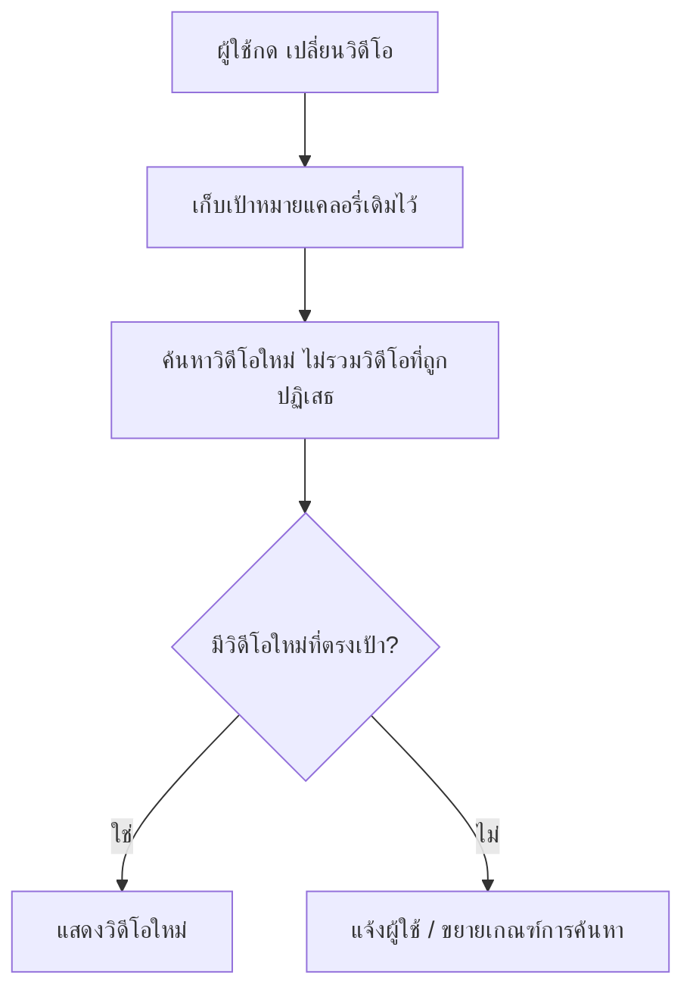

**คำอธิบายตามลำดับ diagram:**

1. ผู้ใช้กดปุ่มเปลี่ยนวิดีโอ/"ลองวิดีโออื่น" บนหน้า REC-1 (REQ-06)
2. ระบบเก็บค่าแคลอรี่เป้าหมายของวันนั้นไว้ไม่เปลี่ยนแปลง (REQ-06)
3. ระบบค้นหาวิดีโอใหม่ (ใช้ filter อุปกรณ์ + แคลอรี่เป้าหมายเดิมจาก REC-1) โดยไม่รวมวิดีโอที่เพิ่งถูกปฏิเสธ (REQ-06)
4. ถ้ามีวิดีโอใหม่ที่ตรงเป้า → แสดงวิดีโอใหม่แทนที่วิดีโอเดิม; ถ้าไม่มี → แจ้งผู้ใช้ หรือขยายเกณฑ์การค้นหา (REQ-06)

- **Actor/Persona**: ผู้ใช้ประจำที่ไม่ถูกใจวิดีโอที่แนะนำ
- **Goal**: อยากได้ตัวเลือกวิดีโออื่นแต่ยังคงเป้าแคลอรี่ของวันเดิม
- **Trigger**: ผู้ใช้กดปุ่ม "เปลี่ยนวิดีโอ" / "ลองวิดีโออื่น" บนหน้า REC-1
- **Preconditions**: มีวิดีโอที่แนะนำอยู่แล้วจาก REC-1
- **Success State**: ผู้ใช้ได้วิดีโอใหม่ ในขณะที่แคลอรี่เป้าหมายของวันไม่เปลี่ยน (REQ-06)
- **Alt/Edge Cases**:
  - กดเปลี่ยนวิดีโอซ้ำจนไม่เหลือตัวเลือกที่ตรงเงื่อนไข → ระบบแจ้งว่าไม่มีวิดีโออื่นที่ตรงเป้าหมายแล้ว หรือขยายเกณฑ์การค้นหา

---

### REC-4 — วอร์มอัพ–คูลดาวน์อัตโนมัติ (REQ-07)

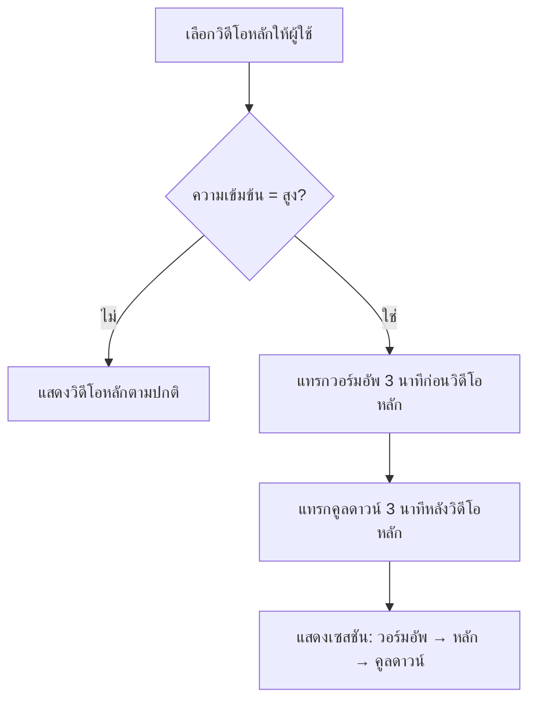

**คำอธิบายตามลำดับ diagram:**

1. ระบบเลือกวิดีโอหลักให้ผู้ใช้ (จาก REC-1 หรือ REC-3) (REQ-07)
2. ระบบตรวจสอบระดับความเข้มข้นของวิดีโอหลักที่จะแนะนำ (REQ-07)
3. ถ้าความเข้มข้นไม่สูง → แสดงวิดีโอหลักตามปกติ; ถ้าความเข้มข้นสูง → แทรกวิดีโอวอร์มอัพ 3 นาทีไว้ก่อนวิดีโอหลักอัตโนมัติ (REQ-07)
4. ระบบแทรกวิดีโอคูลดาวน์ 3 นาทีไว้หลังวิดีโอหลักอัตโนมัติ (REQ-07)
5. แสดงชุดวิดีโอ (วอร์มอัพ → วิดีโอหลัก → คูลดาวน์) เป็นเซสชันเดียว (REQ-07)

- **Actor/Persona**: ผู้ใช้ประจำที่ได้รับวิดีโอความเข้มข้นสูง (เช่น HIIT)
- **Goal**: ป้องกันการบาดเจ็บและออกกำลังกายอย่างปลอดภัยโดยไม่ต้องหาวอร์มอัพเอง
- **Trigger**: ระบบเลือกวิดีโอหลักที่มีระดับความเข้มข้น "สูง" ให้ผู้ใช้ (จาก REC-1 หรือ REC-3)
- **Preconditions**: มีวิดีโอหลักที่ระบุ metadata ความเข้มข้นแล้ว
- **Success State**: เซสชันความเข้มข้นสูงทุกครั้งมีวอร์มอัพ/คูลดาวน์แนบมาให้อัตโนมัติ (REQ-07)
- **Alt/Edge Cases**:
  - วิดีโอหลักความเข้มข้นต่ำ/ปานกลาง → ไม่ต้องแทรกวอร์มอัพ/คูลดาวน์
  - ผู้ใช้ข้ามวอร์มอัพ/คูลดาวน์เอง → ระบบยังคงนับเฉพาะเวลา/แคลอรี่ของส่วนที่ทำจริง (ดู REC-2)
  - เวลา/แคลอรี่ของวอร์มอัพ-คูลดาวน์นับรวมในเป้าหมายรายวันหรือไม่ ยังไม่ระบุ (ดู Open Questions)

---

## Epic 3: Planner & Logging

### PLN-1 — ปฏิทินวางแผนรายสัปดาห์ (REQ-08)

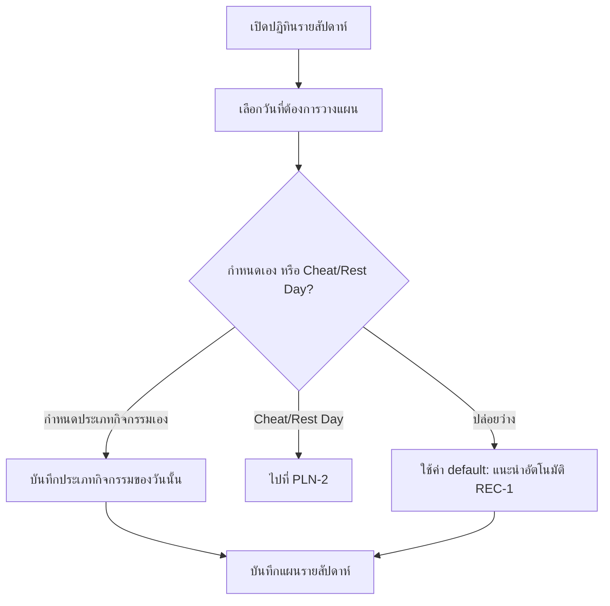

**คำอธิบายตามลำดับ diagram:**

1. ผู้ใช้เปิดแท็บ Planner/ปฏิทิน ระบบแสดงปฏิทินแบบรายสัปดาห์ (7 วันข้างหน้า) (REQ-08)
2. ผู้ใช้เลือกวันที่ต้องการวางแผน (REQ-08)
3. ผู้ใช้เลือกว่าจะกำหนดประเภทกิจกรรมเอง, ตั้งเป็น Cheat Day/Rest Day (ไปต่อที่ PLN-2), หรือปล่อยว่าง (REQ-08)
4. ถ้ากำหนดเอง → บันทึกประเภทกิจกรรมของวันนั้น; ถ้าปล่อยว่าง → ใช้ค่า default คือให้ระบบแนะนำอัตโนมัติตาม REC-1 (REQ-08)
5. ระบบบันทึกแผนรายสัปดาห์ไว้ ใช้แสดงผลใน Daily Dashboard ของแต่ละวัน (REQ-08)

- **Actor/Persona**: ผู้ใช้ประจำที่ต้องการวางแผนล่วงหน้า
- **Goal**: วางแผนออกกำลังกายล่วงหน้าเป็นสัปดาห์ ไม่ต้องตัดสินใจรายวัน
- **Trigger**: ผู้ใช้เปิดแท็บ Planner/ปฏิทิน
- **Preconditions**: ผ่าน onboarding แล้ว (มีเป้าหมายแคลอรี่รายวัน)
- **Success State**: ผู้ใช้มีแผนออกกำลังกายล่วงหน้าครบสัปดาห์ที่ดูได้จากปฏิทิน (REQ-08)
- **Alt/Edge Cases**:
  - ผู้ใช้ไม่กำหนดแผนล่วงหน้าในบางวัน → วันนั้นใช้ค่า default คือให้ระบบแนะนำอัตโนมัติตาม REC-1
  - ผู้ใช้แก้ไขแผนของวันที่ผ่านไปแล้ว (มี log แล้ว) ได้หรือไม่ ยังไม่ระบุชัดเจน (ดู Open Questions)

---

### PLN-2 — โหมด Cheat Day / Rest Day (REQ-09)

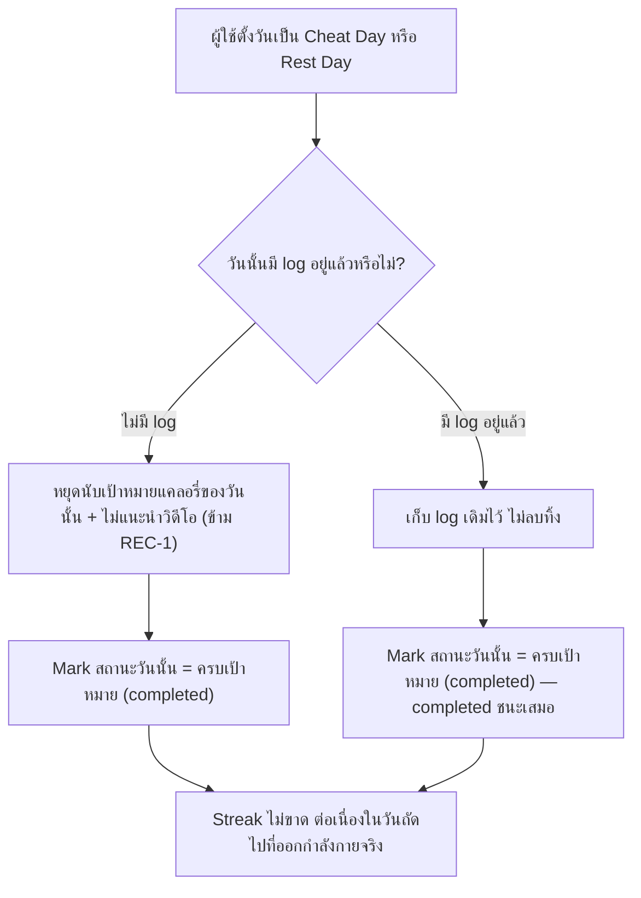

**คำอธิบายตามลำดับ diagram:**

1. ผู้ใช้เลือกทำเครื่องหมายวันนี้ (หรือวันในอนาคต) เป็น Cheat Day หรือ Rest Day ผ่านปฏิทิน (PLN-1) หรือหน้า Daily Dashboard (REQ-09)
2. ระบบตรวจสอบว่าวันนั้นมี log อยู่แล้วหรือไม่ ตาม decision ที่ resolve แล้ว (REQ-09)
3. **กรณียังไม่มี log**: ระบบหยุดนับเป้าหมายแคลอรี่ของวันนั้น และไม่แนะนำวิดีโอสำหรับวันนั้น (ข้าม REC-1) (REQ-09)
4. **กรณียังไม่มี log** (ต่อ): ระบบ mark สถานะวันนั้นเป็น "ครบเป้าหมาย" (completed) (REQ-09)
5. **กรณีมี log อยู่แล้วก่อนตั้ง Cheat/Rest Day**: ระบบเก็บ log เดิมไว้ทั้งหมด ไม่ลบทิ้ง (REQ-09)
6. **กรณีมี log อยู่แล้ว** (ต่อ): สถานะวันนั้นยังคง mark เป็น "ครบเป้าหมาย" (completed) — กติกา
   "completed ชนะเสมอ" หมายความว่า Cheat/Rest Day ไม่ไปเปลี่ยนสถานะ log ที่มีอยู่ก่อนให้แย่ลง (REQ-09)
7. ไม่ว่าจะเป็นกรณีใด ผลลัพธ์คือ streak ไม่ขาด และต่อเนื่องในวันถัดไปที่ออกกำลังกายจริง (เชื่อมกับ PLN-4) (REQ-09)

- **Actor/Persona**: ผู้ใช้ประจำที่ต้องการพักหรือของ่อนวันโดยไม่เสียสถิติ
- **Goal**: หยุดพัก/ผ่อนคลายได้ 1 วัน โดยไม่ทำให้ streak หรือสถิติเสียหาย
- **Trigger**: ผู้ใช้ตั้งค่า Cheat Day หรือ Rest Day ผ่านปฏิทิน (PLN-1) หรือในหน้า Daily Dashboard ของวันนั้น
- **Preconditions**: มีเป้าหมายแคลอรี่รายวันที่กำลังทำงานอยู่สำหรับวันนั้น
- **Success State**: วันนั้นถูก mark เป็น "ครบเป้าหมาย" (completed) เสมอ — ไม่ว่าจะมี log อยู่ก่อนหรือไม่ —
  และ streak ยังคงต่อเนื่องในวันถัดไปที่ออกกำลังกายจริง (REQ-09)
- **Alt/Edge Cases**:
  - ผู้ใช้ทำเครื่องหมาย Cheat/Rest Day **หลังจาก**ออกกำลังกายและมี log ของวันนั้นแล้ว → ตาม decision ที่
    resolve แล้ว: **เก็บ log เดิมไว้ ไม่ลบทิ้ง และวันนั้นยังคงถือว่า "ครบเป้าหมาย" (completed)** ไม่ว่า log
    เดิมจะเป็นสถานะครบเป้าหมายหรือไม่ครบเป้าหมายก็ตาม — Cheat/Rest Day มีผลเปลี่ยนสถานะเฉพาะวันที่ยังไม่มี
    log เท่านั้น
  - ผู้ใช้ยกเลิกการตั้ง Cheat/Rest Day ก่อนสิ้นวัน → วันนั้นกลับไปนับเป้าหมายแคลอรี่ตามปกติ (ประเมินใหม่ตาม PLN-3)

---

### PLN-3 — บันทึกผลรายวันเมื่อครบเป้าหมาย (REQ-10)

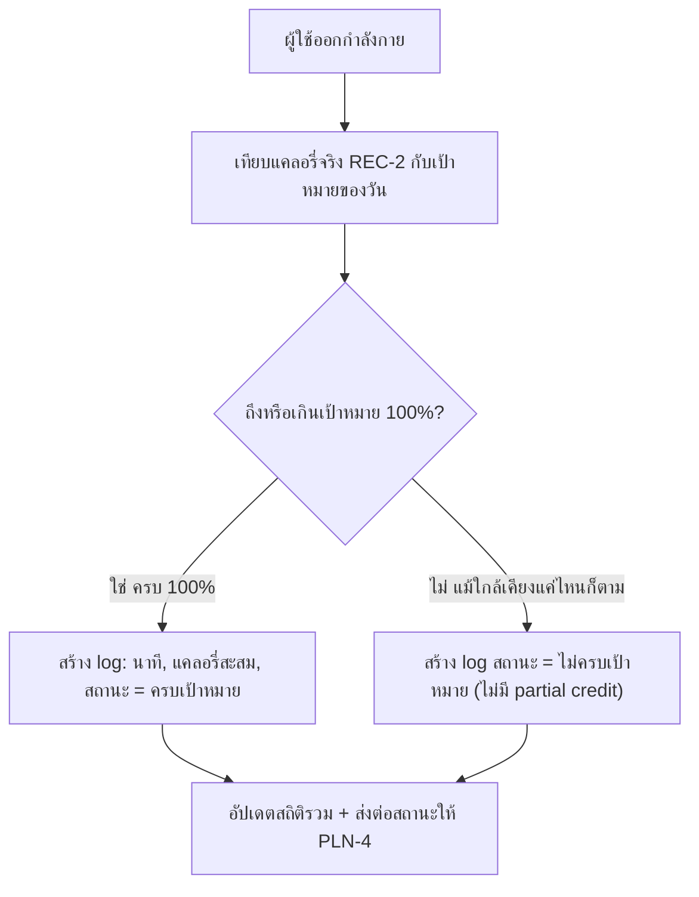

**คำอธิบายตามลำดับ diagram:**

1. ผู้ใช้ทำวิดีโอออกกำลังกายจนจบหรือหยุด (REQ-10)
2. ระบบเปรียบเทียบแคลอรี่ที่เผาผลาญจริง (REC-2) กับเป้าหมายแคลอรี่ของวันนั้น (จาก ONB-3/REC-1) (REQ-10)
3. ระบบตัดสินด้วยกติกา **all-or-nothing เข้มงวด** ตาม decision ที่ resolve แล้ว: ถึงหรือเกินเป้าหมาย
   100% เท่านั้นจึงถือว่า "ครบเป้าหมาย" (REQ-10)
4. **กรณีถึง 100%**: สร้าง log entry ประกอบด้วยนาทีที่ออกกำลังกายจริง, แคลอรี่ที่เผาผลาญสะสม, วันที่,
   สถานะ "ครบเป้าหมาย" (REQ-10)
5. **กรณีไม่ถึง 100%** (แม้จะใกล้เคียงเพียงเล็กน้อย): สร้าง log สถานะ "ไม่ครบเป้าหมาย" โดยไม่มี partial
   credit ใด ๆ (REQ-10)
6. ไม่ว่าผลจะเป็นสถานะใด ระบบอัปเดตสถิติรวมของผู้ใช้ และส่งต่อสถานะของวันนี้ให้ PLN-4 ใช้คำนวณ streak (REQ-10)

- **Actor/Persona**: ผู้ใช้ประจำที่เพิ่งออกกำลังกายเสร็จ
- **Goal**: มีบันทึกผลการออกกำลังกายของตัวเองไว้ดูย้อนหลัง
- **Trigger**: ผู้ใช้ทำวิดีโอออกกำลังกายจนครบ (หรือไม่ครบ) เป้าหมายแคลอรี่/เวลาของวันนั้น
- **Preconditions**: มีค่าแคลอรี่เผาผลาญจริงจาก REC-2 และเป้าหมายแคลอรี่ของวันจาก ONB-3/REC-1
- **Success State**: มี log รายวันที่บันทึกนาทีออกกำลังกายและแคลอรี่สะสม พร้อมสถานะ "ครบเป้าหมาย" เฉพาะเมื่อ
  ถึงหรือเกินเป้าหมาย 100% เท่านั้น (REQ-10)
- **Alt/Edge Cases**:
  - ออกกำลังกายแล้วแต่ยังไม่ถึงเป้าหมาย (เช่น ทำได้ 95%) → บันทึกเป็น log สถานะ "ไม่ครบเป้าหมาย" ตาม
    กติกา all-or-nothing เข้มงวด — ไม่มี partial credit หรือเกณฑ์ผ่อนปรนใด ๆ ในเวอร์ชันนี้
  - วันนั้นเป็น Cheat Day/Rest Day → ข้ามขั้นตอนนี้ทั้งหมด สถานะถูกกำหนดโดย PLN-2 แทน

---

### PLN-4 — ติดตาม Streak ต่อเนื่อง (REQ-09, REQ-10)

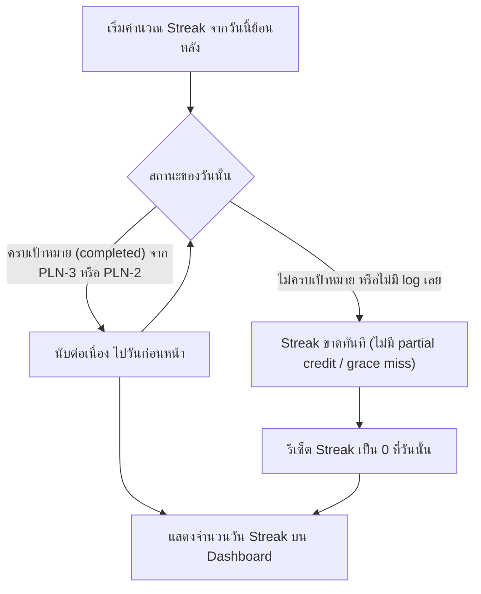

**คำอธิบายตามลำดับ diagram:**

1. ระบบเริ่มไล่ log ย้อนหลังจากวันปัจจุบันเพื่อคำนวณ streak (REQ-10)
2. สำหรับแต่ละวัน ระบบตรวจสอบสถานะของวันนั้น (REQ-09, REQ-10)
3. ถ้าสถานะเป็น "ครบเป้าหมาย" (completed) — ไม่ว่าจะมาจาก log จริงที่ครบ 100% ใน PLN-3 หรือจาก
   Cheat/Rest Day ใน PLN-2 — ให้นับว่า streak ยังต่อเนื่อง แล้วไปตรวจวันก่อนหน้าต่อ (REQ-09)
4. ถ้าสถานะเป็น "ไม่ครบเป้าหมาย" (จาก PLN-3) หรือไม่มี log เลย ระบบใช้กติกา **all-or-nothing เข้มงวด**
   ตาม decision ที่ resolve แล้ว: **ถือว่า streak ขาดทันที เหมือนไม่มี log เลย ไม่มี partial credit หรือ
   grace miss ใด ๆ** (REQ-10)
5. เมื่อพบวันที่ทำให้ขาด ระบบรีเซ็ต streak เป็น 0 ที่วันนั้น (REQ-10)
6. ระบบคำนวณจำนวนวันติดต่อกัน และแสดงผลเป็นตัวเลข streak บน Dashboard (REQ-09, REQ-10)

- **Actor/Persona**: ผู้ใช้ประจำที่ต้องการแรงจูงใจให้ออกกำลังกายต่อเนื่อง
- **Goal**: เห็น streak การออกกำลังกายต่อเนื่องของตัวเอง เพื่อกระตุ้นให้ทำต่อ
- **Trigger**: เปิดหน้า Dashboard/Stats หรือหลังบันทึก log รายวันสำเร็จ (PLN-3) หรือหลังตั้ง Cheat/Rest Day (PLN-2)
- **Preconditions**: มีประวัติ log อย่างน้อย 1 วัน
- **Success State**: ผู้ใช้เห็นจำนวนวัน streak ปัจจุบันที่ถูกต้องตามกฎ all-or-nothing เข้มงวด — นับต่อเนื่อง
  เฉพาะวันที่ "ครบเป้าหมาย" จริง (PLN-3) หรือ Cheat/Rest Day (PLN-2) เท่านั้น (REQ-09, REQ-10)
- **Alt/Edge Cases**:
  - ผู้ใช้ขาด log ไป 1 วันโดยไม่ได้ตั้ง Cheat/Rest Day → streak รีเซ็ตเป็น 0 ทันที
  - log สถานะ "ไม่ครบเป้าหมาย" จาก PLN-3 (เช่น ทำได้ 90-99%) → **ทำให้ streak ขาดทันทีเหมือนไม่มี log
    เลย** ตาม decision ที่ resolve แล้ว ไม่มีเกณฑ์ผ่อนปรนบางส่วนในเวอร์ชันนี้

---

## Epic 4: Smart Integrations

### INT-1 — พยากรณ์วันถึงเป้าหมายน้ำหนัก (REQ-11)

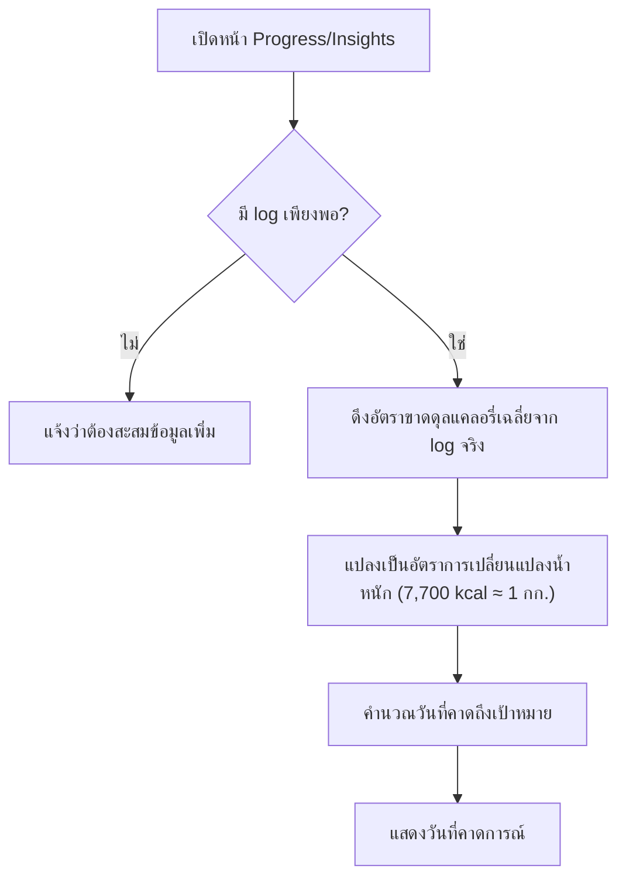

**คำอธิบายตามลำดับ diagram:**

1. ผู้ใช้เปิดหน้า Progress/Insights (REQ-11)
2. ระบบตรวจสอบว่ามีประวัติ log แคลอรี่จริงสะสมเพียงพอหรือไม่ (REQ-11)
3. ถ้าไม่เพียงพอ → แจ้งผู้ใช้ว่ายังพยากรณ์ไม่ได้ ต้องสะสมข้อมูลเพิ่ม (REQ-11)
4. ถ้าเพียงพอ → ระบบดึงประวัติแคลอรี่ขาดดุล/เกินดุลจริงที่บันทึกไว้จาก log จริง (PLN-3) ไม่ใช่ค่าประมาณตอน
   onboarding แล้วคำนวณอัตราขาดดุลแคลอรี่เฉลี่ยต่อวันจากช่วงเวลาล่าสุด (REQ-11)
5. ระบบแปลงอัตราขาดดุลเฉลี่ยเป็นอัตราการเปลี่ยนแปลงน้ำหนักโดยประมาณ โดยใช้ค่าคงที่ **7,700 kcal ≈ 1 กก.
   ไขมัน** ตาม decision ของ ONB-3/REQ-02 ที่ resolve แล้ว (REQ-11)
6. ระบบคำนวณวันที่คาดว่าจะถึงน้ำหนักเป้าหมายจากน้ำหนักปัจจุบันและอัตรานี้ (REQ-11)
7. แสดงวันที่คาดการณ์บนหน้า Progress (REQ-11)

- **Actor/Persona**: ผู้ใช้ประจำที่ใช้แอปมาระยะหนึ่งแล้วและมี log สะสม
- **Goal**: อยากรู้ว่าจะถึงน้ำหนักเป้าหมายเมื่อไหร่ เพื่อประเมินความคืบหน้า
- **Trigger**: ผู้ใช้เปิดหน้า Progress/Insights
- **Preconditions**: มีเป้าหมายน้ำหนัก (จาก ONB-3) และมีประวัติ log แคลอรี่จริงสะสมพอสมควร (PLN-3)
- **Success State**: ผู้ใช้เห็นวันที่คาดว่าจะถึงเป้าหมายน้ำหนัก คำนวณจากอัตราขาดดุลแคลอรี่เฉลี่ยที่บันทึกจริง
  โดยใช้ค่าคงที่ 7,700 kcal ≈ 1 กก. (REQ-11)
- **Alt/Edge Cases**:
  - มีประวัติ log ไม่เพียงพอ (เช่น เพิ่งเริ่มใช้แอป) → ระบบแจ้งว่ายังพยากรณ์ไม่ได้ ต้องสะสมข้อมูลเพิ่ม —
    จำนวนวัน log ขั้นต่ำที่ชัดเจนก่อนเริ่มพยากรณ์ได้ยังไม่ระบุ (ดู Open Questions)
  - อัตราขาดดุลเฉลี่ยเป็น 0 หรือสวนทางเป้าหมาย → แสดงข้อความแจ้งเตือนแทนวันที่คาดการณ์

---

### INT-2 — ซิงค์ตาชั่งอัจฉริยะ (REQ-12)

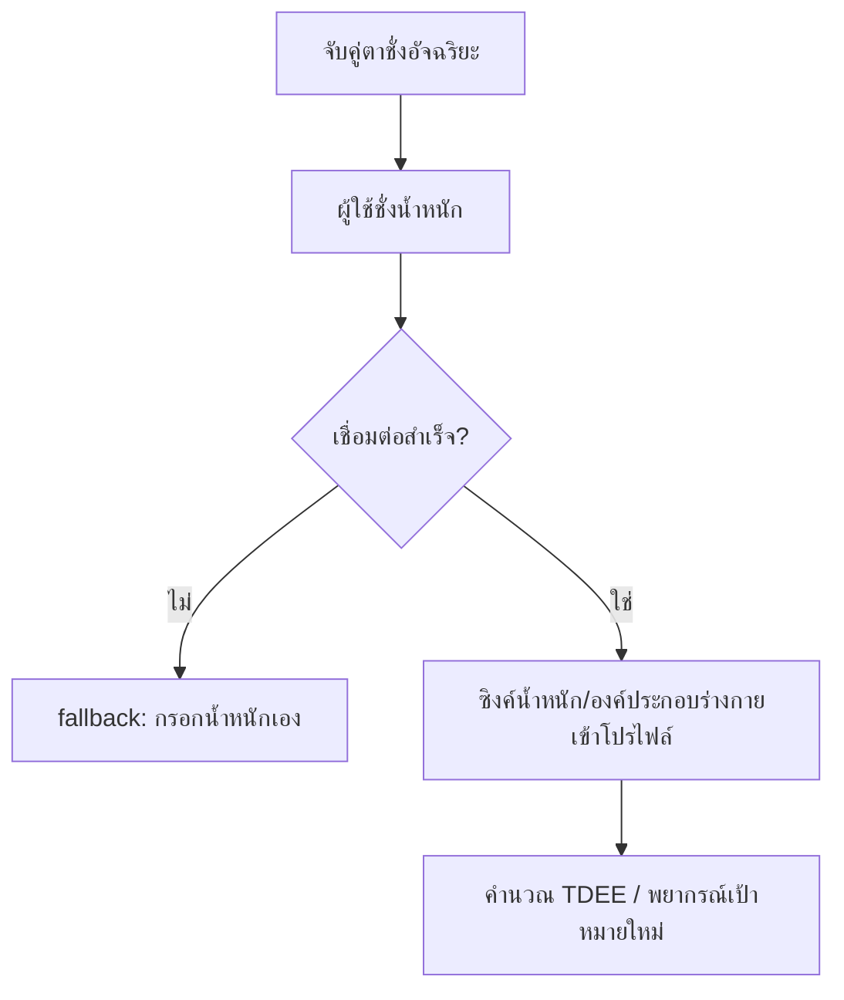

**คำอธิบายตามลำดับ diagram:**

1. ผู้ใช้จับคู่อุปกรณ์ตาชั่งกับแอปผ่าน Bluetooth หรือเชื่อมผ่าน Health API (REQ-12)
2. ผู้ใช้ชั่งน้ำหนัก ตาชั่งส่งค่าน้ำหนัก/องค์ประกอบร่างกายมาที่แอป (REQ-12)
3. ถ้าการเชื่อมต่อไม่สำเร็จ → fallback ให้ผู้ใช้กรอกน้ำหนักเอง (REQ-12)
4. ถ้าเชื่อมต่อสำเร็จ → ระบบซิงค์ค่าน้ำหนักล่าสุดเข้าโปรไฟล์ผู้ใช้ทันทีโดยไม่ต้องกรอกเอง (REQ-12)
5. ค่าน้ำหนักใหม่ถูกใช้คำนวณ TDEE ใหม่ (ONB-1), แคลอรี่เผาผลาญ (REC-2), และพยากรณ์เป้าหมาย (INT-1) (REQ-12)

- **Actor/Persona**: ผู้ใช้ประจำที่มีตาชั่งอัจฉริยะ (smart scale)
- **Goal**: ไม่ต้องกรอกน้ำหนักเอง อยากให้ระบบอัปเดตอัตโนมัติและแม่นยำ
- **Trigger**: ผู้ใช้เชื่อมต่อ/จับคู่ตาชั่งอัจฉริยะกับแอป แล้วขึ้นชั่งน้ำหนัก
- **Preconditions**: มีตาชั่งอัจฉริยะที่รองรับ Bluetooth หรือ Health API
- **Success State**: น้ำหนัก/องค์ประกอบร่างกายอัปเดตอัตโนมัติในโปรไฟล์ทุกครั้งที่ชั่ง โดยไม่ต้องกรอกมือ (REQ-12)
- **Alt/Edge Cases**:
  - การเชื่อมต่อ Bluetooth/Health API ขาดหาย → ตกกลับไปให้ผู้ใช้กรอกน้ำหนักเอง
  - มีค่าน้ำหนักหลายค่าในวันเดียว (ชั่งหลายรอบ) → ใช้ค่าล่าสุด หรือค่าเฉลี่ยของวันนั้น ยังไม่ระบุชัดเจน (ดู Open Questions)

---

### INT-3 — ซิงค์ข้อมูล Wearable (REQ-13)

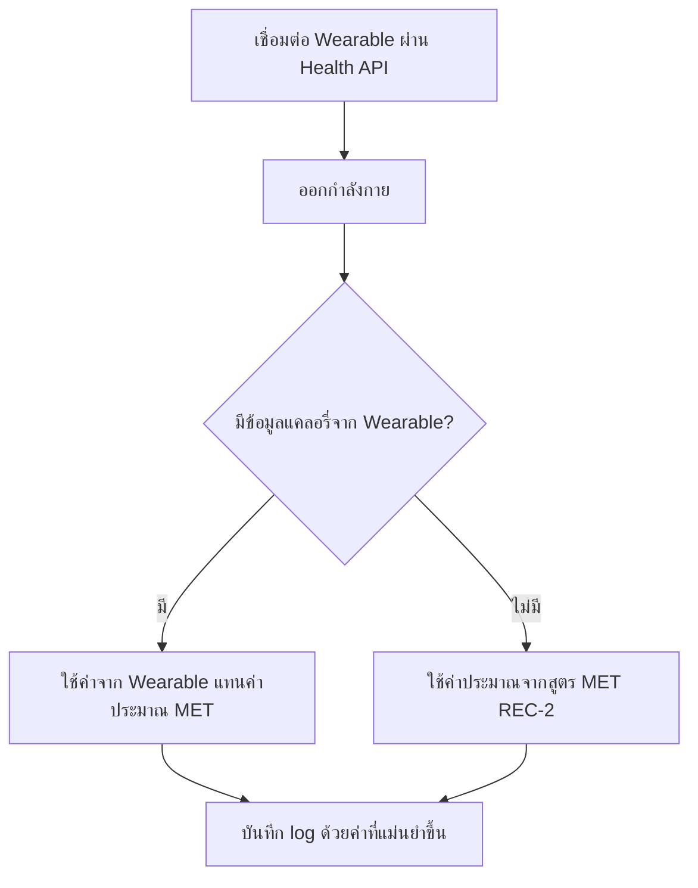

**คำอธิบายตามลำดับ diagram:**

1. ผู้ใช้อนุญาตแอปให้เข้าถึงข้อมูลจาก Apple Health/Google Health Connect เพื่อเชื่อมต่อ wearable (REQ-13)
2. ผู้ใช้ออกกำลังกาย ระหว่าง/หลังนั้น wearable บันทึกแคลอรี่ที่เผาผลาญจริงจากอัตราการเต้นหัวใจและกิจกรรม (REQ-13)
3. ถ้ามีข้อมูลแคลอรี่จาก wearable → แอปดึงค่านั้นมาแทนที่ค่าประมาณจากสูตร MET ที่คำนวณจาก REC-2 (REQ-13)
4. ถ้าไม่มีข้อมูลจาก wearable → ใช้ค่าประมาณจากสูตร MET ของ REC-2 แทนชั่วคราว (REQ-13)
5. ค่าที่ได้ (จาก wearable หรือค่าประมาณ) ถูกใช้ในการบันทึก log (PLN-3) และคำนวณอื่น ๆ ที่เกี่ยวข้อง เช่น
   การพยากรณ์ (INT-1) (REQ-13)

- **Actor/Persona**: ผู้ใช้ประจำที่มี Apple Watch/Fitbit/Garmin
- **Goal**: ให้ค่าแคลอรี่ที่เผาผลาญแม่นยำขึ้นกว่าค่าประมาณจากสูตร MET
- **Trigger**: ผู้ใช้เชื่อมต่อ wearable ผ่าน Apple Health หรือ Google Health Connect แล้วออกกำลังกาย
- **Preconditions**: มี wearable ที่รองรับและเชื่อมต่อกับ Apple Health/Google Health Connect แล้ว
- **Success State**: แคลอรี่ที่บันทึกในระบบมาจาก wearable แทนค่าประมาณจากสูตร MET เมื่อมีข้อมูลพร้อม (REQ-13)
- **Alt/Edge Cases**:
  - Wearable ไม่ได้เชื่อมต่อ หรือข้อมูลมาช้า/ไม่ครบ → ใช้ค่าประมาณจากสูตร MET (REC-2) แทนชั่วคราว
  - ค่าจาก wearable กับค่าประมาณจากสูตร MET ต่างกันมาก → ยังไม่ระบุวิธีจัดการความขัดแย้ง (ดู Open Questions)

---

## Open Questions

ทุกข้อ REQ-01 ถึง REQ-13 มี feature รองรับครบแล้ว (ดู
[REQ Traceability Matrix](./feature-list.md#req-traceability-matrix)) 4 จุดที่เคยเป็นความไม่ชัดเจนซึ่ง
กระทบโครงสร้าง journey ของ feature ระดับ Must/Should อย่างมีนัยสำคัญ (ONB-3/REQ-02, REC-2/REQ-05,
PLN-2/REQ-09, PLN-3-PLN-4/REQ-10) ได้ถูกนำไปถามผู้ใช้งานและ **resolve แล้ว** ตามส่วน
["Decisions" ใน product-backlog.md](../requirements/product-backlog.md#decisions-resolved-ambiguities--2026-08-23)
— ถูก bake เข้า Steps/diagram ด้านบนแล้ว ไม่ใช่ Open Question อีกต่อไป

รายการที่เหลือด้านล่างเป็นรายละเอียดเชิง implementation ปลีกย่อยที่ **ไม่กระทบโครงสร้าง journey ของ
feature ระดับ Must/Should อย่างมีนัยสำคัญ** (ตามเกณฑ์ใน SKILL.md) จึงยังคงบันทึกไว้เป็น Open Questions
รอทีม product ตัดสินใจเพิ่มเติม แทนที่จะเดาไว้ใน Steps ข้างต้น:

1. **REC-1 (REQ-04)**: ไม่ได้ระบุ tolerance ว่าวิดีโอต้องใกล้เคียงเป้าหมายแคลอรี่แค่ไหนถึงเรียกว่า "ตรงกัน"
   และไม่ได้ระบุว่ารองรับการแนะนำวิดีโอหลายคลิปรวมกันให้ถึงเป้าหมายหรือไม่
2. **REC-4 (REQ-07)**: ไม่ได้ระบุว่าเวลา/แคลอรี่ของวอร์มอัพ-คูลดาวน์นับรวมในเป้าหมายรายวันหรือไม่
3. **PLN-1 (REQ-08)**: ไม่ได้ระบุว่าผู้ใช้แก้ไขแผนของวันที่ผ่านไปแล้ว (มี log แล้ว) ได้หรือไม่
   (ควรเป็น read-only หรือแก้ไขได้)
4. **INT-1 (REQ-11)**: ไม่ได้ระบุจำนวนวัน log ขั้นต่ำก่อนเริ่มพยากรณ์ได้ (ค่าคงที่ 7,700 kcal ≈ 1 กก.
   ได้ resolve แล้วใน decision ของ ONB-3/REQ-02)
5. **INT-2/INT-3 (REQ-12, REQ-13)**: ไม่ได้ระบุลำดับความสำคัญเมื่อมีข้อมูลชนกัน (เช่น ชั่งน้ำหนักหลายครั้ง
   ต่อวันจากตาชั่งอัจฉริยะ ควรใช้ค่าล่าสุดหรือค่าเฉลี่ย หรือค่าจาก wearable ต่างจากค่าประมาณจากสูตร MET
   มากควรจัดการอย่างไร)

---

อ้างอิงต้นฉบับ: [docs/requirements/product-backlog.md](../requirements/product-backlog.md)
(รวม [Decisions ที่ resolve แล้ว](../requirements/product-backlog.md#decisions-resolved-ambiguities--2026-08-23))
ดู Feature List สรุปตาราง: [docs/features/feature-list.md](./feature-list.md)
